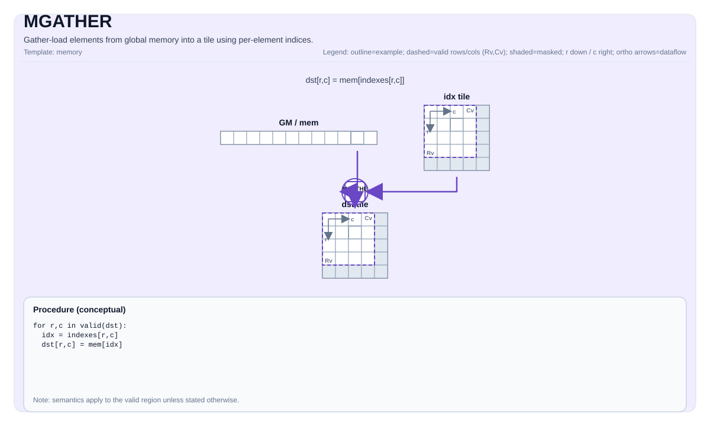

# MGATHER

<!-- md-trans-meta sourceCommit=unknown translatedAt=2026-08-21T08:30:04.292Z pushedAt=2026-08-22T08:13:27.804Z -->

## Instruction Diagram



## Introduction

`MGATHER` reads data from a GM `GlobalTensor` into a UB destination tile through a UB index tile. The operation mode is explicitly selected through the `Coalesce` template parameter:

- **`Coalesce::Row`** (default) — gathers an entire row from `table[idx[r], :]` into `dst[r, :]`. The index tile is in 1-D form (`[1, R]` row-major; `[R, 1]` column-major is also supported on Ascend 950PR/Ascend 950DT). `R = 1` is allowed.
- **`Coalesce::Elem`** — gathers elements from the 1D `table` into `dst[R, C]` through `idx[R, C]`. The index tile must have the same valid shape as the destination. The degenerate `(1, 1)` case is allowed.

Out-of-bounds handling is selected through the `GatherOOB` template parameter. `MGATHER` has no atomic or conflict policy: each destination slot has a unique source index, so no conflict occurs.

The destination can also be an **L1/cube `TileType::Mat` tile (NZ layout)** (indexes are provided in GM tensor form). This GM → L1 path (supporting `Coalesce::Row` and `Coalesce::Elem`, applicable to Atlas A2/A3 training products/Atlas A2/A3 inference products and Ascend 950PR/Ascend 950DT) is described in the [GM → L1 Gather (TileType::Mat Destination)](#gm-l1-gather) section below.

Summary of dispatch by destination:

- **CPU simulator** — A pure C++ reference implementation. It traverses `validRow * validCol` and reads `table[idx[i, j]]` (Elem semantics). The CPU simulator has no separate row coalesce path.
- **VEC-CORE for Atlas A2/A3 training products/Atlas A2/A3 inference products** — Scalar pipe-driven single-thread/MTE2 traversal. In row mode, each row issues one wide `copy_gm_to_ubuf_align_b*` DMA through `tablePtr + safeIdx * tableRowStride`; in Elem mode, a scalar GM→UB copy is performed per element. Tile pairing is supported between ND-GM and ND-UB and between NZ-GM and NZ-UB.
- **Ascend 950PR/Ascend 950DT SIMT** — performs SIMT launch through `cce::async_invoke` with `dim3{32, 32}` (1024 threads). The row mode uses warp-parallel channels for reading; the Elem mode maps each channel to one element. The row kernel treats the GM table as packed ND (row stride = `validCols`); `MGatherCheck` enforces `GlobalTable::staticShape[4] == TileDst::ValidCol` at compile time. Ascend 950PR/Ascend 950DT do not support the NZ block stride layout. The degenerate Elem `(1, 1)` case bypasses the SIMT launch and runs `MGatherScalarImpl` on the AIV vector core.

## Mathematical Semantics

### Row Coalesce (`Coalesce::Row`)

Destination `dst[R, C]`, index `idx[1, R]` (also `idx[R, 1]` on Ascend 950PR/Ascend 950DT), and table `table[TableRows, C]`:

$$ \mathrm{dst}_{r, j} = \mathrm{table}_{\mathrm{idx}_{r},\; j} \quad\text{for } 0 \le r < R,\; 0 \le j < C $$

### Element Coalesce (`Coalesce::Elem`)

Destination `dst[R, C]`, index `idx[R, C]` (with the same valid shape as `dst`), and a 1D table of length `TableSize`:

$$ \mathrm{dst}_{r, c} = \mathrm{table}[\mathrm{idx}_{r, c}] \quad\text{for } 0 \le r < R,\; 0 \le c < C $$

### Out-of-Bounds Behavior

```cpp
enum class GatherOOB : uint8_t {
    Undefined = 0,  // No bounds check; the caller guarantees that the index is valid.
    Clamp     = 1,  // Clamp the index to capacity - 1.
    Wrap      = 2,  // Index modulo capacity.
    Zero      = 3   // OOB returns zero; in-bounds indexes load normally.
};
```

## Assembly Syntax

Synchronous form:

```text
%dst = mgather %mem, %idx : !pto.memref<...>, !pto.tile<...> -> !pto.tile<...>
```

### AS Level 1 (SSA)

```text
%dst = pto.mgather %mem, %idx : (!pto.partition_tensor_view<MxNxdtype>, pto.tile<...>)
-> !pto.tile<loc, dtype, rows, cols, blayout, slayout, fractal, pad>
```

### AS Level 2 (DPS)

```text
pto.mgather ins(%mem, %idx : !pto.partition_tensor_view<MxNxdtype>, !pto.tile_buf<...>) outs(%dst : !pto.tile_buf<...>)
```

## C++ Built-in APIs

Declared in `include/pto/common/pto_instr.hpp`:
> The public include header is `<pto/pto-inst.hpp>`, and the internal declaration is located in `pto/common/pto_instr.hpp`.

### CPU Reference Form

```cpp
template <typename TileDst, typename GlobalData, typename TileInd, typename... WaitEvents>
PTO_INST RecordEvent MGATHER(TileDst &dst, GlobalData &src, TileInd &indexes, WaitEvents &... events);
```

### Atlas A2/A3 Training Product and Atlas A2/A3 Inference Product Forms

```cpp
template <Coalesce  CMode = Coalesce::Row,
          GatherOOB Oob   = GatherOOB::Undefined,
          typename TileDst, typename GlobalTable, typename TileIdx,
          typename... WaitEvents>
PTO_INST RecordEvent MGATHER(TileDst& dst, GlobalTable& table, TileIdx& idx,
                             WaitEvents&... events);
```

### Ascend 950PR/Ascend 950DT Form

```cpp
template <Coalesce  CMode = Coalesce::Row,
          GatherOOB Mode  = GatherOOB::Undefined,
          typename TileDst, typename GlobalData, typename TileInd,
          typename... WaitEvents>
PTO_INST RecordEvent MGATHER(TileDst& dst, GlobalData& table, TileInd& idx,
                             WaitEvents&... events);
```

### Parameters (NPU Form)

- `dst` — UB destination tile (`TileType::Vec`); shape `[R, C]`.
- `table` — source GM `GlobalTensor`. `GlobalTensor::DType` must be `__gm__ T`, matching the destination element type.
- `idx` — UB index tile (`TileType::Vec`).
- `CMode` — `Coalesce` value (`Row` or `Elem`). As the first template parameter, the operation mode is always explicitly specified at the call site.
- `Oob`/`Mode` — `GatherOOB` value, used for out-of-bounds handling.

### Enum

```cpp
enum class Coalesce : uint8_t {
    Row  = 0,  // dst[r, :] = table[idx[r], :]   (1-D index of length R)
    Elem = 1   // dst[i, j] = table[idx[i, j]]   (idx shape == dst shape)
};

enum class GatherOOB : uint8_t {
    Undefined = 0,
    Clamp     = 1,
    Wrap      = 2,
    Zero      = 3
};
```

## Constraints

### Tile Constraints (CPU)

**Supported data types:**

- The `dst`/`src` element type must be one of the following: `int8_t`, `uint8_t`, `int16_t`, `uint16_t`, `int32_t`, `uint32_t`, `half`, `bfloat16_t`, `float`.
- On the AI Core destination (when the CPU simulator is compiled with `__CCE_AICORE__`), `float8_e4m3_t` and `float8_e5m2_t` are also supported.
- The `indexes` element type must be `int32_t` or `uint32_t`.

**Tile and memory types:**

- `dst` must be a vector tile (`TileType::Vec`).
- `indexes` must be a vector tile (`TileType::Vec`).
- `dst` and `indexes` must use the row-major layout (`BLayout::RowMajor + SLayout::NoneBox`).
- `src` must be a `GlobalTensor` located in GM.
- `src` must use `Layout::ND`.

**Shape constraints:**

- `dst.Rows == indexes.Rows`.
- The shape of `indexes` must be `[1, N]` (row-wise gather) or `[N, M]` (element-wise gather).
- The row width of `dst` must satisfy 32-byte alignment, that is, `dst.Cols * sizeof(T)` must be a multiple of 32.
- The static shape of `src` must satisfy `Shape<1, 1, 1, TableRows, RowWidth>`.

### Tile Constraints (Atlas A2/A3 Training Products/Atlas A2/A3 Inference Products)

**Supported data types:**

- The element type of `dst`/`src` must be one of the following: `int8_t`, `uint8_t`, `int16_t`, `uint16_t`, `int32_t`, `uint32_t`, `half`, and `bfloat16_t`. `float8_e4m3_t`, `float8_e5m2_t`, and `hifloat8_t` are not supported on Atlas A2/A3 training products/Atlas A2/A3 inference products.
- The element type of `indexes` must be `int32_t` or `uint32_t`.

**Tile and memory types:**

- `dst` must be a vector tile (`TileDst::Loc == TileType::Vec`).
- `indexes` must be a vector tile (`TileIdx::Loc == TileType::Vec`).
- The index tile is **always** `BLayout::RowMajor + SLayout::NoneBox` (ND), regardless of the table layout.
- `src` must be a `GlobalTensor` located in GM; `GlobalTable::DType == __gm__ T`.
- The bulk + sub layout of the destination tile must exactly match the table layout:
    - `GlobalTable::layout == Layout::ND` ⇒ `TileDst` is `BLayout::RowMajor + SLayout::NoneBox`.
    - `GlobalTable::layout == Layout::NZ` ⇒ `TileDst` is `BLayout::ColMajor + SLayout::RowMajor + SFractalSize == TileConfig::fractalABSize` (= 512Byte).

**Shape constraints:**

- The padded `TileDst::Cols * sizeof(T)` must be 32-byte aligned in both layouts. `ValidRow`/`ValidCol` are not subject to this rule.
- For `Coalesce::Row`: `TileIdx::ValidRow == 1` and `TileIdx::ValidCol == TileDst::ValidRow`.
- For `Coalesce::Elem`: `TileIdx::ValidRow == TileDst::ValidRow` and `TileIdx::ValidCol == TileDst::ValidCol`.
- Both modes require `TileDst::ValidRow >= 1` and `TileDst::ValidCol >= 1`.
- The NZ table additionally requires `GlobalTable::staticShape[3] == FRACTAL_NZ_ROW` (= 16), `GlobalTable::staticShape[4] == C0_SIZE_BYTE / sizeof(T)` (= 32 bytes/element width), `TileDst::Cols % (C0_SIZE_BYTE / sizeof(T)) == 0`, and `TileDst::Rows % FRACTAL_NZ_ROW == 0`.

### Tile Constraints (Ascend 950PR/Ascend 950DT)

**Supported data types:**

- The element type of `dst`/`src` must be one of the following: `int8_t`, `uint8_t`, `int16_t`, `uint16_t`, `int32_t`, `uint32_t`, `half`, `bfloat16_t`, and `float`. In `__CCE_AICORE__` builds, `hifloat8_t`, `float8_e4m3_t`, and `float8_e5m2_t` are also included.
- The element type of `indexes` must be `int32_t` or `uint32_t`.

**Tile and memory types:**

- `dst` must be a vector tile (`TileDst::Loc == TileType::Vec`).
- `indexes` must be a vector tile (`TileIdx::Loc == TileType::Vec`).
- The SIMT kernel is unaware of the layout of UB tiles: every UB read/write is achieved through `tile_offset_2d<TileX>(r, c)`, so `TileDst` can be `BLayout::RowMajor` or `BLayout::ColMajor` (with `SLayout::NoneBox`).
- `src` must be a `GlobalTensor` located in GM; `GlobalTable::DType == __gm__ T`.
- **GM table layout: `Layout::ND` only.** The Ascend 950PR/Ascend 950DT SIMT kernel addresses GM as a flat row-major buffer, with the row stride hardcoded to `validCols`; `MGatherCheck` enforces `GlobalTable::staticShape[4] == TileDst::ValidCol`, so the table cannot have any inter-row padding.

**Shape constraints:**

- The padded `TileDst::Cols * sizeof(T)` (RowMajor) or `TileDst::Rows * sizeof(T)` (ColMajor) must be 32-byte aligned.
- For `Coalesce::Row`: the valid shape of the index tile is `[1, R]` (`BLayout::RowMajor`) **or** `[R, 1]` (`BLayout::ColMajor`).
- For `Coalesce::Elem`: `TileIdx::ValidRow == TileDst::ValidRow` and `TileIdx::ValidCol == TileDst::ValidCol`. The `BLayout` of `TileIdx` is independent of `TileDst`.
- Both modes require `TileDst::ValidRow >= 1` and `TileDst::ValidCol >= 1`. In Elem mode, the degenerate `(1, 1)` shape bypasses SIMT launch.

### Dynamic Runtime Shapes (Atlas A2/A3 Training Products/Atlas A2/A3 Inference Products and Ascend 950PR/Ascend 950DT)

`MGATHER` accepts both compile-time and runtime dynamic shapes:

- `Tile<…, RowMask, ColMask>` with `RowMask == -1` and/or `ColMask == -1` stores the runtime valid range in the tile object; the implementation reads it through `dst.GetValidRow()`/`dst.GetValidCol()`.
- In `Shape<S0, S1, S2, S3, S4>`/`Stride<…>`, one or more `-1` entries are constructed with runtime dimensions; the implementation reads them through `table.GetShape(GlobalTensorDim::DIM_*)`.

The static assertions in `MGatherCheck` are gated by `if constexpr (DIM > 0)` and take effect only for compile-time known dimensions.

Example:

```cpp
constexpr auto kPadCols = 16;
using DstTileT    = Tile<TileType::Vec, float,    1, kPadCols, BLayout::RowMajor, -1, -1>;
using IdxTileT    = Tile<TileType::Vec, int32_t,  1, kPadCols, BLayout::RowMajor, -1, -1>;
using TableShape  = Shape<1, 1, 1, -1, -1>;
using TableStride = Stride<1, 1, 1, -1, -1>;

int64_t validCols = 9, d3 = 3, d4 = 10, srcStride3 = 10;
TableShape  tableShape(d3, d4);
TableStride tableStride(srcStride3, (int64_t)1);
GlobalTensor<float, TableShape, TableStride> tableGM(srcGm, tableShape, tableStride);

DstTileT dstTile(1, validCols);
IdxTileT idxTile(1, validCols);
TASSIGN(dstTile, dstUbOffsetBytes);
TASSIGN(idxTile, idxUbOffsetBytes);

MGATHER<Coalesce::Elem, GatherOOB::Undefined>(dstTile, tableGM, idxTile);
```

## Mode Matching

On Atlas A2/A3 training products/Atlas A2/A3 inference products and Ascend 950PR/Ascend 950DT, the mode is **explicit** and is not automatically detected. The static assertions in `MGatherCheck` validate the provided tile shapes based on the selected `Coalesce` value:

```text
A2/A3:
  Coalesce::Row  : Idx.ValidRow == 1 && Idx.ValidCol == Dst.ValidRow
  Coalesce::Elem : Idx.ValidRow == Dst.ValidRow && Idx.ValidCol == Dst.ValidCol

A5:
  Coalesce::Row  : (Idx.ValidRow == 1 && Idx.ValidCol == Dst.ValidRow) ||
                   (Idx.ValidRow == Dst.ValidRow && Idx.ValidCol == 1)
  Coalesce::Elem : (Idx.ValidRow == Dst.ValidRow) && (Idx.ValidCol == Dst.ValidCol)
```

## Layout Support

| Tile/Tensor | CPU | Atlas A2/A3 Training Products/Atlas A2/A3 Inference Products | Ascend 950PR/Ascend 950DT |
|---------------|-----|-------|----|
| `TileDst` (UB) —ND | `BLayout::RowMajor + SLayout::NoneBox` only | `BLayout::RowMajor + SLayout::NoneBox` | `BLayout::RowMajor` or `ColMajor`, `SLayout::NoneBox` |
| `TileDst` (UB) —NZ | Not supported | `BLayout::ColMajor + SLayout::RowMajor + SFractalSize == 512` | **Not supported** |
| `TileIdx` (UB) —Row | Row-major (Cols must be equal to 1) | `[1, R]` `BLayout::RowMajor + SLayout::NoneBox` | `[1, R]` `RowMajor` **or** `[R, 1]` `ColMajor` |
| `TileIdx` (UB) —Elem | `BLayout::RowMajor + SLayout::NoneBox` | `[R, C]` `BLayout::RowMajor + SLayout::NoneBox` | Any `BLayout`, independent of `TileDst` |
| `GlobalTable` (GM) —ND | `Layout::ND` only | `Layout::ND` (linear contiguous addressing) | `Layout::ND` only; The row mode hardcodes `tableRowStride = validCols`. |
| `GlobalTable` (GM) —NZ | Not supported | `Layout::NZ`; 5-D `Shape<B, BCols, BRows, 16, C0>` | **Not supported** |

### NZ Layout (Atlas A2/A3 Training Products/Atlas A2/A3 Inference Products)

When `GlobalTable::layout == Layout::NZ` and `TileDst` is a matching `BLayout::ColMajor + SLayout::RowMajor + SFractalSize = 512` tile, `MGATHER` (Atlas A2/A3 training products/Atlas A2/A3 inference products) runs a dedicated NZ path (`MGatherRowNzImpl`, `MGatherElemNzImpl`).

- **Constants.** `kC0 = C0_SIZE_BYTE / sizeof(T)`; `kFRow = FRACTAL_NZ_ROW = 16`. Each fractal block is `kFRow × kC0` elements (= 512 bytes).
- **Logical shape.** Logical rows = `gShape2 * kFRow`. Logical columns = `gShape0 * gShape1 * kC0`. OOB in row mode is limited/modulo by the number of logical rows; in Elem mode, it is limited/modulo by the total number of elements.
- **Row mode.** For each logical row `r`, the kernel will map `idx[r]` to `(srcBlockRow, srcRowInBlock)` and `r` to `(dstBlockRow, dstRowInBlock)`, and then issue **one multi-burst MTE2 transfer** for each outer batch. When `Oob == GatherOOB::Zero`, the kernel will prefill the entire tile with `T(0)` before the DMA loop and skip the DMA for OOB rows.
- **Elem mode.** For each `(r, c)`, the kernel will map `idx` to `(logicalRow, logicalCol) = (idx / nLogicalCols, idx % nLogicalCols)`, and then convert it to an NZ physical offset through `MGatherNZGmOffset`. The traversal order is **block column → row → column within block**, ensuring that consecutive writes always target consecutive 32-byte UB blocks.

## Pipe/Synchronization Model

### Atlas A2/A3 Training Products/Atlas A2/A3 Inference Products — Explicit Pipe Handshake

The caller **does not need to insert any additional barriers**. It only needs to use the standard `set_flag(PIPE_MTE2, PIPE_V)`/`wait_flag(PIPE_MTE2, PIPE_V)` pair following `TLOAD` before `MGATHER` to bring the index tile to a clean state on the vector pipe.

| Stage | Pipe Transition | Protected Content |
|-------|-----------------|----------------|
| Pre-amble (Row ND + Row NZ) | `V→S`, `MTE3→S` flag chain | Makes the index tile visible to scalar reads, and flushes any pending MTE3 writes that may overlap with UB before the scalar loop starts. |
| Pre-amble (Elem ND + Elem NZ) | `V→S`, `MTE3→S`, `MTE2→S` flag chain | Same as row, with the additional `MTE2→S` flag flushing any in-flight MTE2 burst before the scalar loop reads `idxPtr`. |
| Row post-amble (ND + NZ) | `S→MTE2`, `MTE2→V`, `MTE2→MTE3`, `S→V`, `S→MTE3` flag chain | Ensures the scalar→MTE2 race is resolved, then drains the MTE2 DMA before downstream consumers touch the destination tile. |
| Elem post-amble (ND + NZ) | `S→V`, `S→MTE2`, `S→MTE3` flag chain | Makes scalar UB writes visible to V, MTE2, and MTE3. |

### Ascend 950PR/Ascend 950DT — SIMT Launch and V↔S Handshake

The Ascend 950PR/Ascend 950DT implementation hides almost the entire pipe model behind `cce::async_invoke`. The only explicit kernel-side handshake is in the scalar fallback path (`MGatherScalarImpl`, used for Elem `(1, 1)`).

| Stage | Pipe Transition | Protected Content |
|-------|-----------------|----------------|
| Leading (scalar fallback) | `set_flag(PIPE_V, PIPE_S)`/`wait_flag(PIPE_V, PIPE_S)` | Makes the index tile visible to the scalar pipe before the single-element gather. |
| Post (scalar fallback) | `set_flag(PIPE_S, PIPE_V)`/`wait_flag(PIPE_S, PIPE_V)` | Releases the scalar UB writes to downstream vector operations. |

## UB Memory Budget

### Atlas A2/A3 Training Products/Atlas A2/A3 Inference Products

The AIV vector core has the standard CANN 192 KB UB layout. `MGATHER` does not allocate any UB scratch from within the kernel — the only UB consumers are the caller-allocated destination tile and index tile.

### Ascend 950PR/Ascend 950DT

The Ascend 950PR/Ascend 950DT SIMT kernel runs on the AIV vector core. All user tiles must fit into the AIV's 256 KB UB, plus two fixed runtime reservations: an 8 KB reserved region and the data cache (at least 32 KB). Therefore, the maximum available size is:

```text
max dynUBufSize = 256 KB - 8 KB - 32 KB - static_memory
                = 216 KB - static_memory
```

When using `TASSIGN` to manually place tiles, the compiler detects `static_memory ≈ 0` and can use the full **216 KB** as `dynUBufSize`. When the working set exceeds 128 KB under the default budget, declare it explicitly through `kernel_name<<<numBlocks, dynUBufSize, stream>>>(args...)`.

## Examples

### Automatic

```cpp
#include <pto/pto-inst.hpp>

using namespace pto;

void example_auto() {
  using DstT = Tile<TileType::Vec, float, 16, 16>;
  using IdxT = Tile<TileType::Vec, int32_t, 16, 16>;
  DstT dst;
  IdxT idx;
  // src is a GlobalTensor in GM.
  MGATHER(dst, src, idx);
}
```

### Manual

```cpp
#include <pto/pto-inst.hpp>

using namespace pto;

void example_manual() {
  using DstT = Tile<TileType::Vec, float, 16, 16>;
  using IdxT = Tile<TileType::Vec, int32_t, 16, 16>;
  DstT dst;
  IdxT idx;
  // src is a GlobalTensor in GM.
  TASSIGN(dst, 0x1000);
  TASSIGN(idx, 0x2000);
  MGATHER(dst, src, idx);
}
```

### Row Coalesce — Embedding Lookup (Atlas A2/A3 Training Products/Atlas A2/A3 Inference Products or Ascend 950PR/Ascend 950DT)

```cpp
#include <pto/pto-inst.hpp>

using namespace pto;

template <typename T, int R, int C, int TableRows>
AICORE void example_embedding_lookup(__gm__ T* tablePtr, __gm__ int32_t* idxPtr, __gm__ T* outPtr)
{
    using DstTile     = Tile<TileType::Vec, T,       R, C, BLayout::RowMajor, R, C>;
    using IdxTile     = Tile<TileType::Vec, int32_t, 1, R, BLayout::RowMajor, 1, R>;
    using TableShape  = Shape<1, 1, 1, TableRows, C>;
    using TableStride = Stride<1, 1, 1, C, 1>;
    using TableTensor = GlobalTensor<T, TableShape, TableStride>;
    using IdxShape    = Shape<1, 1, 1, 1, R>;
    using IdxStride   = Stride<1, 1, 1, R, 1>;
    using IdxTensor   = GlobalTensor<int32_t, IdxShape, IdxStride>;

    TableTensor tableGM(tablePtr);
    IdxTensor   idxGM(idxPtr);
    DstTile dst; TASSIGN(dst, 0x0000);
    IdxTile idx; TASSIGN(idx, 0x1000);

    TLOAD(idx, idxGM);
    set_flag(PIPE_MTE2, PIPE_V, EVENT_ID0);
    wait_flag(PIPE_MTE2, PIPE_V, EVENT_ID0);
    MGATHER<Coalesce::Row, GatherOOB::Clamp>(dst, tableGM, idx);
}
```

### Element Coalesce — 2-D Random Access

```cpp
AICORE void example_elem_2d(__gm__ float* tablePtr, __gm__ int32_t* idxPtr)
{
    constexpr int R = 8, C = 32, TableSize = 256;

    using DstTile     = Tile<TileType::Vec, float,   R, C, BLayout::RowMajor, R, C>;
    using IdxTile     = Tile<TileType::Vec, int32_t, R, C, BLayout::RowMajor, R, C>;
    using TableShape  = Shape<1, 1, 1, 1, TableSize>;
    using TableStride = Stride<1, 1, 1, TableSize, 1>;
    using TableTensor = GlobalTensor<float, TableShape, TableStride>;

    TableTensor tableGM(tablePtr);
    DstTile dst; TASSIGN(dst, 0x0000);
    IdxTile idx; TASSIGN(idx, 0x0800);

    MGATHER<Coalesce::Elem, GatherOOB::Wrap>(dst, tableGM, idx);
}
```

### Row Coalesce — `[R, 1]` ColMajor Index (Ascend 950PR/Ascend 950DT Only)

```cpp
AICORE void example_row_colidx(__gm__ half* tablePtr, __gm__ int32_t* idxPtr)
{
    constexpr int R = 8, C = 64, TableRows = 64;

    using DstTile     = Tile<TileType::Vec, half,    R, C, BLayout::RowMajor, R, C>;
    using IdxTile     = Tile<TileType::Vec, int32_t, R, 1, BLayout::ColMajor, R, 1>;
    using TableShape  = Shape<1, 1, 1, TableRows, C>;
    using TableStride = Stride<1, 1, 1, C, 1>;
    using TableTensor = GlobalTensor<half, TableShape, TableStride>;
    using IdxShape    = Shape<1, 1, 1, R, 1>;
    using IdxStride   = Stride<1, 1, 1, 1, 1>;
    using IdxTensor   = GlobalTensor<int32_t, IdxShape, IdxStride, Layout::DN>;

    TableTensor tableGM(tablePtr);
    IdxTensor   idxGM(idxPtr);
    DstTile dst; TASSIGN(dst, 0x0000);
    IdxTile idx; TASSIGN(idx, 0x1000);

    TLOAD(idx, idxGM);
    set_flag(PIPE_MTE2, PIPE_V, EVENT_ID0);
    wait_flag(PIPE_MTE2, PIPE_V, EVENT_ID0);
    MGATHER<Coalesce::Row, GatherOOB::Undefined>(dst, tableGM, idx);
}
```

### Element Coalesce — `(1, 1)` Degenerate Case

```cpp
AICORE void example_scalar(__gm__ float* tablePtr, __gm__ int32_t* idxPtr)
{
    constexpr int TableSize = 32;

    using DstTile     = Tile<TileType::Vec, float,   1, 8, BLayout::RowMajor, 1, 1>;
    using IdxTile     = Tile<TileType::Vec, int32_t, 1, 8, BLayout::RowMajor, 1, 1>;
    using TableShape  = Shape<1, 1, 1, 1, TableSize>;
    using TableStride = Stride<1, 1, 1, TableSize, 1>;
    using TableTensor = GlobalTensor<float, TableShape, TableStride>;

    TableTensor tableGM(tablePtr);
    DstTile dst; TASSIGN(dst, 0x0000);
    IdxTile idx; TASSIGN(idx, 0x0080);

    MGATHER<Coalesce::Elem>(dst, tableGM, idx);
}
```

## ASM Examples

### Automatic Mode

```text
# Automatic mode: the compiler/runtime is responsible for resource placement and scheduling.
%dst = pto.mgather %mem, %idx : (!pto.partition_tensor_view<MxNxdtype>, pto.tile<...>)
```

### Manual Mode

```text
# Manual mode: first explicitly bind the resources, then issue the instruction.
# Optional (when the instruction contains tile operands):
# pto.tassign %arg0, @tile(0x1000)
# pto.tassign %arg1, @tile(0x2000)
%dst = pto.mgather %mem, %idx : (!pto.partition_tensor_view<MxNxdtype>, pto.tile<...>)
```

### PTO Assembly Form

```text
%dst = mgather %mem, %idx : !pto.memref<...>, !pto.tile<...> -> !pto.tile<...>
# AS Level 2 (DPS)
pto.mgather ins(%mem, %idx : !pto.partition_tensor_view<MxNxdtype>, !pto.tile_buf<...>) outs(%dst : !pto.tile_buf<...>)
```

## GM → L1 Gather (TileType::Mat Destination) <a id="gm-l1-gather"></a>

In addition to the GM → UB gather described above, `MGATHER` also supports directly gathering index-selected data into an **L1/cube `TileType::Mat` tile (NZ fractal layout)**. When `TileDst::Loc == TileType::Mat`, the GM → L1 path is automatically selected.

### Index Source — GM

The GM → L1 variant provides the indexes as a GM `GlobalTensor` (`int32_t`/`uint32_t`). The row mode reuses the three-parameter form; the Elem mode requires a fourth parameter `scratch` (GM workspace):

```cpp
// Row — three-parameter form
template <Coalesce CMode = Coalesce::Row, GatherOOB Oob = GatherOOB::Undefined,
          typename MatTileDst, typename GlobalTable, typename GlobalIdx>
PTO_INST RecordEvent MGATHER(MatTileDst& dst, GlobalTable& table, GlobalIdx& idx);

// Elem — four-parameter form (with GM scratch)
template <Coalesce CMode = Coalesce::Elem, GatherOOB Oob = GatherOOB::Undefined,
          typename MatTileDst, typename GlobalTable, typename GlobalIdx, typename GlobalScratch>
PTO_INST RecordEvent MGATHER(MatTileDst& dst, GlobalTable& table, GlobalIdx& idx,
                             GlobalScratch& scratch);
```

### Constraints (`MGatherCheckGm2L1`, Atlas A2/A3 Training Products/Atlas A2/A3 Inference Products and Ascend 950PR/Ascend 950DT)

- **Dtypes.** Atlas A2/A3 training products/Atlas A2/A3 inference products: `int8/uint8/int16/uint16/int32/uint32/half/bfloat16/float`. Ascend 950PR/Ascend 950DT additionally supports `hifloat8/float8_e4m3/float8_e5m2`. The row mode further requires `sizeof(T) <= 4`.
- **Index.** `idx` must be a GM `GlobalTensor` of type `int32_t` or `uint32_t`.
- **Table.** `GlobalTable::DType == __gm__ T`, `GlobalTable::layout == Layout::ND`.
- **Scratch (Elem only).** `GlobalScratch::DType == __gm__ T`.
- **Destination.** `TileDst::Loc == TileType::Mat`, NZ form (`!isRowMajor && SFractal == SLayout::RowMajor && SFractalSize == 512`), `TileDst::Cols % (C0_SIZE_BYTE / sizeof(T)) == 0`, `TileDst::Rows % FRACTAL_NZ_ROW (16) == 0`.

### Example — Row Gather to L1 NZ Tile

```cpp
template <typename T, int R, int C, int TableRows>
AICORE void example_gm2l1_row(__gm__ T* tablePtr, __gm__ int32_t* idxPtr)
{
    using TableShape  = Shape<1, 1, 1, TableRows, C>;
    using TableStride = Stride<1, 1, 1, C, 1>;
    using IdxShape    = Shape<1, 1, 1, 1, R>;
    using IdxStride   = Stride<1, 1, 1, R, 1>;
    GlobalTensor<T, TableShape, TableStride, Layout::ND> tableGM(tablePtr);
    GlobalTensor<int32_t, IdxShape, IdxStride, Layout::ND> idxGM(idxPtr);

    using DstTile = Tile<TileType::Mat, T, R, C, BLayout::ColMajor, R, C, SLayout::RowMajor, 512>;
    DstTile dst; TASSIGN(dst, 0x0);

    MGATHER<Coalesce::Row, GatherOOB::Clamp>(dst, tableGM, idxGM);   // GM (ND) -> L1 (NZ)
}
```

### Example — Elem Gather to L1 NZ Tile (with GM Scratch)

```cpp
template <typename T, int R, int C, int TableSize>
AICORE void example_gm2l1_elem(__gm__ T* tablePtr, __gm__ int32_t* idxPtr, __gm__ T* scratchPtr)
{
    using TableShape   = Shape<1, 1, 1, 1, TableSize>;
    using TableStride  = Stride<1, 1, 1, TableSize, 1>;
    using IdxShape     = Shape<1, 1, 1, R, C>;
    using IdxStride    = Stride<1, 1, 1, C, 1>;
    using ScratchShape = Shape<1, 1, 1, 1, R * C>;
    using ScratchStride= Stride<1, 1, 1, R * C, 1>;
    GlobalTensor<T, TableShape, TableStride, Layout::ND> tableGM(tablePtr);
    GlobalTensor<int32_t, IdxShape, IdxStride, Layout::ND> idxGM(idxPtr);
    GlobalTensor<T, ScratchShape, ScratchStride, Layout::ND> scratchGM(scratchPtr);

    using DstTile = Tile<TileType::Mat, T, R, C, BLayout::ColMajor, R, C, SLayout::RowMajor, 512>;
    DstTile dst; TASSIGN(dst, 0x0);

    MGATHER<Coalesce::Elem, GatherOOB::Zero>(dst, tableGM, idxGM, scratchGM);
}
```

### Ascend 950PR/Ascend 950DT Only — SIMT Executor for Elem GM → L1 (`GatherExec::Simt`)

On Ascend 950PR/Ascend 950DT, the Elem GM → L1 path has two executors, selected through the third template parameter `GatherExec`:

```cpp
enum class GatherExec : uint8_t { Scalar = 0, Simt = 1 };
```

- **`GatherExec::Scalar`** (default for the four-parameter form) — the cube core traverses the indexes through scalar loads.
- **`GatherExec::Simt`** — the **AIV vector core** parallelizes the gather through a SIMT kernel.

```cpp
template <Coalesce CMode, GatherOOB Oob, GatherExec Exec, typename MatTileDst,
          typename GlobalTable, typename GlobalIdx, typename GlobalScratch>
PTO_INST RecordEvent MGATHER(MatTileDst& dst, GlobalTable& table, GlobalIdx& idx,
                             GlobalScratch& scratch);
```

```cpp
template <typename T, int R, int C, int TableSize>
AICORE void example_gm2l1_elem_simt(__gm__ T* tablePtr, __gm__ int32_t* idxPtr, __gm__ T* scratchPtr)
{
    using TableShape   = Shape<1, 1, 1, 1, TableSize>;
    using TableStride  = Stride<1, 1, 1, TableSize, 1>;
    using IdxShape     = Shape<1, 1, 1, R, C>;
    using IdxStride    = Stride<1, 1, 1, C, 1>;
    using ScratchShape = Shape<1, 1, 1, 1, R * C>;
    using ScratchStride= Stride<1, 1, 1, R * C, 1>;
    GlobalTensor<T, TableShape, TableStride, Layout::ND> tableGM(tablePtr);
    GlobalTensor<int32_t, IdxShape, IdxStride, Layout::ND> idxGM(idxPtr);
    GlobalTensor<T, ScratchShape, ScratchStride, Layout::ND> scratchGM(scratchPtr);

    using DstTile = Tile<TileType::Mat, T, R, C, BLayout::ColMajor, R, C, SLayout::RowMajor, 512>;
    DstTile dst; TASSIGN(dst, 0x0);

    MGATHER<Coalesce::Elem, GatherOOB::Zero, GatherExec::Simt>(dst, tableGM, idxGM, scratchGM);
}
```

## Performance Considerations

### Atlas A2/A3 Training Products/Atlas A2/A3 Inference Products

1. **Row vs. Elem.** Row coalesce achieves the best gathering bandwidth. Elem coalesce issues one scalar GM read + UB write per active channel.
2. **Sequential scalar loop (Elem).** Atlas A2/A3 training products/Atlas A2/A3 inference products traverse `validRow * validCol` channels sequentially in a single thread.
3. **DMA cost (Row).** ND: one `copy_gm_to_ubuf_align_b*` call per row. NZ: one call per (logical row, batch) pair.
4. **OOB cost.** `Undefined`: free; `Clamp`/`Wrap`: add one arithmetic remap per channel; `Zero`: write `T(0)` inline (Elem) or pre-zero the tile and skip the DMA (Row) of OOB rows.

### Ascend 950PR/Ascend 950DT

1. **Shape-adaptive launch.** The SIMT grid size is determined by the resolved `validRows`/`validCols`.
2. **OOB policy cost.** `Undefined`: zero overhead. `Clamp`/`Wrap`: one arithmetic remap per channel. `Zero`: one comparison and select per channel.
3. **No thread branching for mode/OOB.** All decisions are `if constexpr`.
4. **Row vs. Elem bandwidth.** Row coalesce achieves the best gathering bandwidth; Elem coalesce performs one scalar GM load per channel.

## Related Instructions

- [`TLOAD`](TLOAD.md): contiguous block transfer from GM to tile.
- [`MSCATTER`](MSCATTER.md): indexed scatter from tile to GM (the inverse operation).
- [`TGATHER`](TGATHER.md): index-based intra-tile gather (UB-to-UB on the same vec-core).
