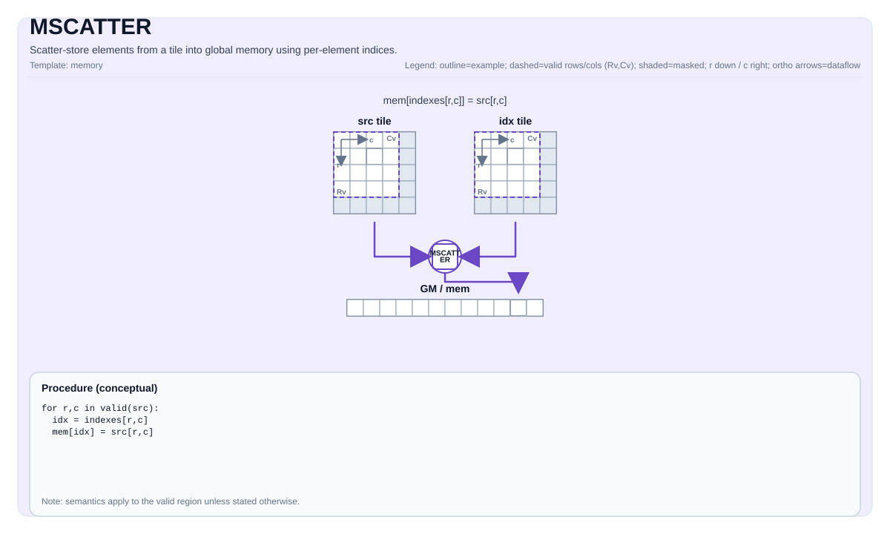

# MSCATTER

<!-- md-trans-meta sourceCommit=unknown translatedAt=2026-08-26T03:20:21.385Z pushedAt=2026-08-29T09:05:18.412Z -->

## Instruction Diagram



## Introduction

`MSCATTER` writes data from a UB source tile into a GM `GlobalTensor` through a UB index tile. The operation mode is explicitly selected by the `Coalesce` template parameter:

- **`Coalesce::Row`** (default) — scatters an entire row `src[r, :]` into `table[idx[r], :]`. The index tile is in 1-D form (`[1, R]` row-major; `[R, 1]` column-major is also supported on Ascend 950PR/Ascend 950DT). `R = 1` is allowed.
- **`Coalesce::Elem`** — scatters element-wise from `src[R, C]` (or `src[1, N]`) into the flattened `table` through `idx[R, C]`. The index tile must have the same effective shape as the source. The degenerate `(1, 1)` case is allowed.

The write behavior is controlled by orthogonal template policies:

- `ScatterAtomicOp` — `None` (normal store), `Add`, `Max`, `Min`. Atomic data type support varies by target (see the table below).
- `ScatterOOB` — `Undefined`, `Skip`, `Clamp`, `Wrap`. There is no `Zero` option (the operation writes into an existing table; an out-of-bounds index has no real destination slot into which a zero value can be written).
- `ScatterConflict` (**Ascend 950PR/Ascend 950DT only**) — `Last` (deterministic largest index wins, effective only when `Atomic == None`) or `Default` (warp scheduler dependent). Atlas A2/A3 training products/Atlas A2/A3 inference products have no `ScatterConflict` parameter because the kernel executes strictly sequentially and collisions are resolved by "last write wins".

Summary of dispatch by destination:

- **CPU simulator** — a pure C++ reference implementation. It traverses `validRow * validCol` in row-major iteration order and writes `table[idx[i, j]] = src[i, j]` (Elem semantics). When multiple sources map to the same destination, the last writer in row-major iteration order wins.
- **VEC-CORE for Atlas A2/A3 training products/Atlas A2/A3 inference products** — Scalar pipe-driven single-thread/MTE3 traversal. In row mode, each row issues one wide `copy_ubuf_to_gm_align_b*` DMA through `tablePtr + safeIdx * tableRowStride`; in Elem mode, a scalar UB→GM store is performed per element. Tile pairing is supported between ND-GM and ND-UB and between NZ-GM and NZ-UB. With `ScatterAtomicOp::None`, the behavior is always "last write wins".
- **Ascend 950PR/Ascend 950DT SIMT** — Launches SIMT via `cce::async_invoke` with `dim3{32, 32}` (1024 threads). The row mode writes through warp-parallel lanes; the Elem mode maps each lane to one element. The row kernel treats the GM table as packed ND (row stride = `validCols`); `MScatterCheck` enforces `GlobalTable::staticShape[4] == TileSrc::ValidCol` at compile time. `Conflict::Last` is implemented as a slot-centric reverse scan (`last_owner_find_*`), producing a deterministic, race-free result. Ascend 950PR/Ascend 950DT do not support the NZ block stride layout. The degenerate Elem `(1, 1)` case bypasses the SIMT launch.

## Mathematical Semantics

### Row Coalesce (`Coalesce::Row`)

Source `src[R, C]`, index `idx[1, R]` (also `idx[R, 1]` on Ascend 950PR/Ascend 950DT), and table `table[TableRows, C]`. For each row `r`:

$$ \mathrm{table}_{\mathrm{idx}_{r},\; j} \;\leftarrow\; \mathrm{atom}\!\left(\mathrm{table}_{\mathrm{idx}_{r},\; j},\; \mathrm{src}_{r, j}\right) \quad\text{for } 0 \le j < C $$

Here `atom` is the identity replacement for `ScatterAtomicOp::None`, and the corresponding atomic accumulation otherwise.

### Element Coalesce (`Coalesce::Elem`)

Source `src[R, C]`, index `idx[R, C]` (with the same valid shape as `src`), and a 1D table of length `TableSize`:

$$ \mathrm{table}[\mathrm{idx}_{r, c}] \;\leftarrow\; \mathrm{atom}\!\left(\mathrm{table}[\mathrm{idx}_{r, c}],\; \mathrm{src}_{r, c}\right) $$

### Atomic Accumulation

When `ScatterAtomicOp::Add`/`Max`/`Min` is selected:

$$ \mathrm{table}[\cdot] \mathrel{\oplus}= \mathrm{src}_{\cdot},\quad \oplus \in \{+,\; \max,\; \min\} $$

### Conflict Resolution

- **Atlas A2/A3 training products/Atlas A2/A3 inference products.** The kernel executes strictly sequentially in increasing `(r)` (Row) or `(r, c)` (Elem) order. With `ScatterAtomicOp::None`, **the subsequent write always wins** ("last write wins").
- **Ascend 950PR/Ascend 950DT.** With `ScatterAtomicOp::None`:
    - **`Conflict::Last`** — the value at the source position with the **maximum flat index** targeting the given destination slot is stored. Implemented as a slot-centric reverse scan, structurally race-free.
    - **`Conflict::Default`** — the surviving writer depends on the warp scheduler. For collision-free index sets, the result is identical to `Last`.
- **CPU simulator.** In row-major iteration order, the last writer wins (matching `Conflict::Last`).

Atomic modes ignore `ScatterConflict`, because GM atomic R-M-W serializes colliding writes on its own.

### Out-of-Bounds Behavior

```cpp
enum class ScatterOOB : uint8_t {
    Undefined = 0,  // Do not check bounds; the caller guarantees the index is valid.
    Skip      = 1,  // Discard the write (keeps the original table value).
    Clamp     = 2,  // Clamp the index to capacity - 1.
    Wrap      = 3   // Index modulo capacity.
};
```

- `Undefined`: The caller guarantees `idx < capacity`; no remap is applied.
- `Skip`: Out-of-bounds rows/elements are simply not written. The original table value at that GM address is preserved.
- `Clamp`: `idx = min(idx, capacity - 1)`.
- `Wrap`: `idx = idx % capacity`.

There is no `Zero` option — an OOB index never identifies a real destination slot, so `Skip` is the natural "no-op on OOB" policy.

## Assembly Syntax

Synchronous form:

```text
mscatter %src, %idx, %mem : !pto.tile<...>, !pto.tile<...>, !pto.memref<...>
```

### AS Level 1 (SSA)

```text
pto.mscatter %src, %idx, %mem : (!pto.tile<...>, !pto.tile<...>, !pto.partition_tensor_view<MxNxdtype>) -> ()
```

### AS Level 2 (DPS)

```text
pto.mscatter ins(%src, %idx : !pto.tile_buf<...>, !pto.tile_buf<...>) outs(%mem : !pto.partition_tensor_view<MxNxdtype>)
```

## C++ Built-in APIs

Declared in `include/pto/common/pto_instr.hpp`:
> The public include header is `<pto/pto-inst.hpp>`, and the internal declaration is located in `pto/common/pto_instr.hpp`.

### CPU Reference Form

```cpp
template <typename GlobalData, typename TileSrc, typename TileInd, typename... WaitEvents>
PTO_INST RecordEvent MSCATTER(GlobalData &dst, TileSrc &src, TileInd &indexes, WaitEvents &... events);
```

### Atlas A2/A3 Training Product/Atlas A2/A3 Inference Product Forms

```cpp
template <Coalesce        CMode  = Coalesce::Row,
          ScatterAtomicOp AtomOp = ScatterAtomicOp::None,
          ScatterOOB      Oob    = ScatterOOB::Undefined,
          typename GlobalTable, typename TileSrc, typename TileIdx,
          typename... WaitEvents>
PTO_INST RecordEvent MSCATTER(GlobalTable& table, TileSrc& src, TileIdx& idx,
                              WaitEvents&... events);
```

Atlas A2/A3 training products/Atlas A2/A3 inference products do not have the `ScatterConflict` template parameter (the kernel always executes sequentially, and collisions are deterministic "last write wins").

### Ascend 950PR/Ascend 950DT Form

```cpp
template <Coalesce         Mode     = Coalesce::Row,
          ScatterAtomicOp  Atomic   = ScatterAtomicOp::None,
          ScatterOOB       Oob      = ScatterOOB::Undefined,
          ScatterConflict  Conflict = ScatterConflict::Last,
          typename GlobalTable, typename TileSrc, typename TileIdx,
          typename... WaitEvents>
PTO_INST RecordEvent MSCATTER(GlobalTable& table, TileSrc& src, TileIdx& idx,
                              WaitEvents&... events);
```

### Parameters (NPU Form)

- `table` — destination GM `GlobalTensor`. `GlobalTensor::DType` must be `__gm__ T`, matching the source element type.
- `src` — UB source tile (`TileType::Vec`); shape `[R, C]`.
- `idx` — UB index tile (`TileType::Vec`).
- `CMode`/`Mode` — `Coalesce` value (`Row` or `Elem`).
- `AtomOp`/`Atomic` — `ScatterAtomicOp` value. Atlas A2/A3 training products/Atlas A2/A3 inference products do not support `Max`/`Min`.
- `Oob` — `ScatterOOB` value.
- `Conflict` (**Ascend 950PR/Ascend 950DT only**) — `ScatterConflict` value. Takes effect only when `Atomic == None`.

### Enum

```cpp
enum class Coalesce : uint8_t {
    Row  = 0,  // table[idx[r], :] = src[r, :]
    Elem = 1   // table[idx[i, j]] = src[i, j]
};

enum class ScatterAtomicOp : uint8_t {
    None = 0,  // Normal store.
    Add  = 1,  // Atomic addition.
    Max  = 2,  // Atomic maximum (A5 only).
    Min  = 3   // Atomic minimum (A5 only).
};

enum class ScatterOOB : uint8_t {
    Undefined = 0,
    Skip      = 1,
    Clamp     = 2,
    Wrap      = 3
};

enum class ScatterConflict : uint8_t {  // A5 only.
    Last    = 0,  // Deterministic: the largest source index wins.
    Default = 1   // Warp scheduler dependency.
};
```

### Atomic Type Support

| Atomic | CPU (ABI Contract/Simulator Behavior) | Atlas A2/A3 Training Products/Atlas A2/A3 Inference Products | Ascend 950PR/Ascend 950DT |
|--------|----------------------------|-------|----|
| `None` | All dtypes | All dtypes | All dtypes |
| `Add`  | ABI contract: `int32_t`, `uint32_t`, `float`, `half` | `int8_t`, `int16_t`, `int32_t`, `half`, `bfloat16_t`, `float` (signed integers only — no `uint*`) | `int32_t`, `uint32_t`, `float`, `half`, `bfloat16_t` |
| `Max`  | ABI contract: `int32_t` or `float` | Not supported (rejected at compile time by `MScatterCheck`) | `int32_t`, `uint32_t`, `float` |
| `Min`  | ABI contract: `int32_t` or `float` | Not supported (rejected at compile time by `MScatterCheck`) | `int32_t`, `uint32_t`, `float` |

## Constraints

### Tile Constraints (CPU)

**Supported data types:**

- The `src`/`dst` element type must be one of the following: `int8_t`, `uint8_t`, `int16_t`, `uint16_t`, `int32_t`, `uint32_t`, `half`, `bfloat16_t`, `float`.
- On the AI Core destination (when the CPU simulator is compiled with `__CCE_AICORE__`), `float8_e4m3_t` and `float8_e5m2_t` are also supported.
- The `indexes` element type must be `int32_t` or `uint32_t`.

**Tile and memory types:**

- `src` must be a vector tile (`TileType::Vec`).
- `indexes` must be a vector tile (`TileType::Vec`).
- `src` and `indexes` must use the row-major layout (`BLayout::RowMajor + SLayout::NoneBox`).
- `dst` must be a `GlobalTensor` located in GM.
- `dst` must use `Layout::ND`.

**Shape constraints:**

- `src.Rows == indexes.Rows`.
- `indexes` has shape `[N, 1]` (by row) or `[N, M]` (by element).
- The `src` row width must be 32-byte aligned.
- The static shape of `dst` satisfies `Shape<1, 1, 1, TableRows, RowWidth>`.

### Tile Constraints (Atlas A2/A3 Training Products/Atlas A2/A3 Inference Products)

**Supported data types:**

- `src`/`dst` element types: `int8_t`, `uint8_t`, `int16_t`, `uint16_t`, `int32_t`, `uint32_t`, `half`, `bfloat16_t`, `float`. `float8_e4m3_t`, `float8_e5m2_t`, and `hifloat8_t` are not supported.
- The `indexes` element type must be `int32_t` or `uint32_t`.

**Tile and memory types:**

- `src` must be a vector tile (`TileSrc::Loc == TileType::Vec`).
- `indexes` must be a vector tile (`TileIdx::Loc == TileType::Vec`).
- The index tile is **always** `BLayout::RowMajor + SLayout::NoneBox` (ND).
- `dst` must be a `GlobalTensor` in GM; `GlobalTable::DType == __gm__ T`.
- The source tile layout must be exactly paired with the table layout:
    - `GlobalTable::layout == Layout::ND` ⇒ `TileSrc` is `BLayout::RowMajor + SLayout::NoneBox`.
    - `GlobalTable::layout == Layout::NZ` ⇒ `TileSrc` is `BLayout::ColMajor + SLayout::RowMajor + SFractalSize == 512`.

**Atomic operation constraints:**

- `ScatterAtomicOp::None` supports all the above dtypes.
- `ScatterAtomicOp::Add` requires `int8_t`, `int16_t`, `int32_t`, `half`, `bfloat16_t`, or `float`. Atlas A2/A3 training products/Atlas A2/A3 inference products do not support unsigned integer atomic addition.
- `ScatterAtomicOp::Max` and `Min` are **not supported on Atlas A2/A3 training products/Atlas A2/A3 inference products**.

**Shape constraints:**

- The padded `TileSrc::Cols * sizeof(T)` must be 32-byte aligned.
- `Coalesce::Row`: `TileIdx::ValidRow == 1` and `TileIdx::ValidCol == TileSrc::ValidRow`.
- `Coalesce::Elem`: `TileIdx::ValidRow == TileSrc::ValidRow` and `TileIdx::ValidCol == TileSrc::ValidCol`.
- Additional NZ table requirements: `staticShape[3] == 16`, `staticShape[4] == 32/sizeof(T)`, `Cols % kC0 == 0`, and `Rows % 16 == 0`.

### Tile Constraints (Ascend 950PR/Ascend 950DT)

**Supported data types:**

- Element types of `src`/`dst`: `int8_t`, `uint8_t`, `int16_t`, `uint16_t`, `int32_t`, `uint32_t`, `half`, `bfloat16_t`, and `float`. In `__CCE_AICORE__` builds, `hifloat8_t`, `float8_e4m3_t`, and `float8_e5m2_t` are also included.
- The `indexes` element type must be `int32_t` or `uint32_t`.

**Tile and memory types:**

- `src` must be a vector tile (`TileSrc::Loc == TileType::Vec`).
- `indexes` must be a vector tile (`TileIdx::Loc == TileType::Vec`).
- The SIMT kernel is layout-agnostic with respect to UB tiles: every read/write goes through `tile_offset_2d<TileX>(r, c)`.
- **GM table layout: `Layout::ND` only.** The Ascend 950PR/Ascend 950DT SIMT kernel addresses GM as a flat row-major buffer, with the row stride hardcoded to `validCols`; `MScatterCheck` enforces `GlobalTable::staticShape[4] == TileSrc::ValidCol`.

**Atomic operation constraints:**

- `ScatterAtomicOp::None` supports all dtypes.
- `ScatterAtomicOp::Add` requires `int32_t`, `uint32_t`, `float`, `half`, or `bfloat16_t`.
- `ScatterAtomicOp::Max`/`Min` requires `int32_t`, `uint32_t`, or `float`.

**Shape constraints:**

- The padded `TileSrc::Cols * sizeof(T)` (RowMajor) or `TileSrc::Rows * sizeof(T)` (ColMajor) must be 32-byte aligned.
- `Coalesce::Row`: the index tile valid shape is `[1, R]` (`RowMajor`) **or** `[R, 1]` (`ColMajor`).
- `Coalesce::Elem`: `TileIdx::ValidRow == TileSrc::ValidRow` and `TileIdx::ValidCol == TileSrc::ValidCol`.

### Dynamic Runtime Shapes (Atlas A2/A3 Training Products/Atlas A2/A3 Inference Products and Ascend 950PR/Ascend 950DT)

`MSCATTER` accepts both compile-time and runtime dynamic shapes:

- In `Tile<…, RowMask, ColMask>`, `RowMask == -1` and/or `ColMask == -1` store the runtime valid range in the tile.
- The `-1` entries in `Shape<S0, S1, S2, S3, S4>` / `Stride<…>` are constructed with runtime dimensions.

The static assertions in `MScatterCheck` are gated by `if constexpr (DIM > 0)`.

Example:

```cpp
constexpr auto kPadCols = 16;
using SrcTileT    = Tile<TileType::Vec, float,   1, kPadCols, BLayout::RowMajor, -1, -1>;
using IdxTileT    = Tile<TileType::Vec, int32_t, 1, kPadCols, BLayout::RowMajor, -1, -1>;
using TableShape  = Shape<1, 1, 1, -1, -1>;
using TableStride = Stride<1, 1, 1, -1, -1>;

int64_t validCols = 9, tableR = 3, tableC = 10;
TableShape  tableShape(tableR, tableC);
TableStride tableStride(tableC, (int64_t)1);
GlobalTensor<float, TableShape, TableStride> tableGM(dstGm, tableShape, tableStride);

SrcTileT srcTile(1, validCols);
IdxTileT idxTile(1, validCols);
TASSIGN(srcTile, srcUbOffsetBytes);
TASSIGN(idxTile, idxUbOffsetBytes);

MSCATTER<Coalesce::Elem, ScatterAtomicOp::None, ScatterOOB::Skip>(tableGM, srcTile, idxTile);
```

## Mode Matching

The mode is **explicit** on Atlas A2/A3 training products/Atlas A2/A3 inference products and Ascend 950PR/Ascend 950DT, and is not auto-detected. `MScatterCheck` validates the tile shape against the selected `Coalesce` value:

```text
A2/A3:
  Coalesce::Row  : Idx.ValidRow == 1 && Idx.ValidCol == Src.ValidRow
  Coalesce::Elem : Idx.ValidRow == Src.ValidRow && Idx.ValidCol == Src.ValidCol

A5:
  Coalesce::Row  : (Idx.ValidRow == 1 && Idx.ValidCol == Src.ValidRow) ||
                   (Idx.ValidRow == Src.ValidRow && Idx.ValidCol == 1)
  Coalesce::Elem : (Idx.ValidRow == Src.ValidRow) && (Idx.ValidCol == Src.ValidCol)
```

## Layout Support

| Tile/Tensor | CPU | Atlas A2/A3 Training Products/Atlas A2/A3 Inference Products | Ascend 950PR/Ascend 950DT |
|---------------|-----|-------|----|
| `TileSrc` (UB) —ND | `BLayout::RowMajor + SLayout::NoneBox` only | `BLayout::RowMajor + SLayout::NoneBox` | `BLayout::RowMajor` or `ColMajor`, `SLayout::NoneBox` |
| `TileSrc` (UB) —NZ | Not supported | `BLayout::ColMajor + SLayout::RowMajor + SFractalSize == 512` | **Not supported** |
| `TileIdx` (UB) —Row | row-major (Cols must equal 1) | `[1, R]` `BLayout::RowMajor + SLayout::NoneBox` | `[1, R]` `RowMajor` **or** `[R, 1]` `ColMajor` |
| `TileIdx` (UB) —Elem | `BLayout::RowMajor + SLayout::NoneBox` | `[R, C]` `BLayout::RowMajor + SLayout::NoneBox` | Any `BLayout`, independent of `TileSrc` |
| `GlobalTable` (GM) —ND | `Layout::ND` only | `Layout::ND` (linear contiguous addressing) | `Layout::ND` only |
| `GlobalTable` (GM) —NZ | Not supported | `Layout::NZ`; 5-D `Shape<B, BCols, BRows, 16, C0>` | **Not supported** |

### NZ Layout (Atlas A2/A3 Training Products/Atlas A2/A3 Inference Products)

> **The NZ path exists only on Atlas A2/A3 training products/Atlas A2/A3 inference products.** Ascend 950PR/Ascend 950DT SIMT kernels address GM as a flat ND buffer without NZ block stride translation.

When `GlobalTable::layout == Layout::NZ` and `TileSrc` is a matching NZ tile, `MSCATTER` (Atlas A2/A3 training products/Atlas A2/A3 inference products) runs a dedicated NZ path.

- **Constants.** `kC0 = 32 / sizeof(T)`; `kFRow = 16`. Each fractal block is `16 × kC0` elements (= 512 bytes).
- **Row mode.** For each logical source row, the kernel maps the index and row to the NZ block address, issuing one multi-burst MTE3 transfer per batch.
- **Elem mode.** The kernel maps `idx` to `(logicalRow, logicalCol)` and converts it to an NZ physical offset via `MScatterNZGmOffset`. The traversal order is **block column → row → intra-block column**.

## Pipe/Synchronization Model

### Atlas A2/A3 Training Products/Atlas A2/A3 Inference Products — Explicit Pipe Handshake

The caller **does not need to insert any extra barriers**, and only needs to use the standard `TLOAD` post-abmle flag pair before `MSCATTER`. The kernel never uses `pipe_barrier(PIPE_ALL)`.

| Stage | Pipe Transition | Protected Content |
|-------|-----------------|----------------|
| Pre-amble (Row) | `V→S`, `MTE2→S`; if `Atomic == Add`, `MScatterAtomicAddSet<T>()`; finally `S→MTE3` | Makes the source and index tiles visible to scalar reads; for atomic addition, switches the MTE3 unit to atomic mode before issuing the DMA. |
| Pre-amble (Elem) | `V→S`, `MTE3→S`, `MTE2→S` flag chain | Protects the element-level UB→GM stores before the scalar loop. |
| Row post-amble | `MTE3→V`, `MTE3→MTE2` flag chain | Drains the MTE3 DMA before downstream consumers touch GM. |
| Elem post-amble | `S→V`, `S→MTE2`, `S→MTE3` flag chain | Makes the scalar GM writes visible to downstream operations. |

### Ascend 950PR/Ascend 950DT — SIMT Launch and V↔S Handshake

The Ascend 950PR/Ascend 950DT implementation hides almost the entire pipe model behind `cce::async_invoke`. The only explicit handshake is in the scalar fallback path (`MScatterScalarImpl`, used for Elem `(1, 1)`).

## UB Memory Budget

### Atlas A2/A3 Training Products/Atlas A2/A3 Inference Products

The AIV vector core has 192KB UB. `MSCATTER` does not allocate any UB scratch from within the kernel — it only consumes the caller-allocated source tile and index tile.

### Ascend 950PR/Ascend 950DT

The Ascend 950PR/Ascend 950DT SIMT kernel runs on the AIV. Maximum available size:

```text
max dynUBufSize = 256 KB - 8 KB - 32 KB - static_memory
                = 216 KB - static_memory
```

The default safe working set is ≤ 128 KB. When exceeded, it must be explicitly declared via `kernel_name<<<numBlocks, dynUBufSize, stream>>>(args...)`.

## Examples

### Automatic

```cpp
#include <pto/pto-inst.hpp>

using namespace pto;

void example_auto() {
  using SrcT = Tile<TileType::Vec, float, 16, 16>;
  using IdxT = Tile<TileType::Vec, int32_t, 16, 16>;
  SrcT src;
  IdxT idx;
  // dst is a GlobalTensor in GM.
  MSCATTER(dst, src, idx);
}
```

### Manual

```cpp
#include <pto/pto-inst.hpp>

using namespace pto;

void example_manual() {
  using SrcT = Tile<TileType::Vec, float, 16, 16>;
  using IdxT = Tile<TileType::Vec, int32_t, 16, 16>;
  SrcT src;
  IdxT idx;
  TASSIGN(src, 0x1000);
  TASSIGN(idx, 0x2000);
  MSCATTER(dst, src, idx);
}
```

### Row Coalesce — Embedding Scatter (Atlas A2/A3 Training Products/Atlas A2/A3 Inference Products or Ascend 950PR/Ascend 950DT)

```cpp
#include <pto/pto-inst.hpp>

using namespace pto;

template <typename T, int R, int C, int TableRows>
AICORE void example_embedding_scatter(__gm__ T* tablePtr, __gm__ T* srcPtr, __gm__ int32_t* idxPtr)
{
    using SrcTile     = Tile<TileType::Vec, T,       R, C, BLayout::RowMajor, R, C>;
    using IdxTile     = Tile<TileType::Vec, int32_t, 1, R, BLayout::RowMajor, 1, R>;
    using TableShape  = Shape<1, 1, 1, TableRows, C>;
    using TableStride = Stride<1, 1, 1, C, 1>;
    using TableTensor = GlobalTensor<T, TableShape, TableStride>;

    TableTensor tableGM(tablePtr);
    SrcTile src; TASSIGN(src, 0x0000);
    IdxTile idx; TASSIGN(idx, 0x1000);

    MSCATTER<Coalesce::Row, ScatterAtomicOp::None, ScatterOOB::Clamp>(tableGM, src, idx);
}
```

### Row Coalesce — Atomic Addition Aggregation

```cpp
template <typename T, int R, int C, int TableRows>
AICORE void example_row_atomic_add(__gm__ T* tablePtr, __gm__ T* srcPtr, __gm__ int32_t* idxPtr)
{
    using SrcTile     = Tile<TileType::Vec, T,       R, C, BLayout::RowMajor, R, C>;
    using IdxTile     = Tile<TileType::Vec, int32_t, 1, R, BLayout::RowMajor, 1, R>;
    using TableShape  = Shape<1, 1, 1, TableRows, C>;
    using TableStride = Stride<1, 1, 1, C, 1>;
    using TableTensor = GlobalTensor<T, TableShape, TableStride>;

    TableTensor tableGM(tablePtr);
    SrcTile src; TASSIGN(src, 0x0000);
    IdxTile idx; TASSIGN(idx, 0x1000);

    MSCATTER<Coalesce::Row, ScatterAtomicOp::Add, ScatterOOB::Wrap>(tableGM, src, idx);
}
```

### Element Coalesce — Sparse Update

```cpp
AICORE void example_elem_sparse(__gm__ float* tablePtr, __gm__ float* srcPtr, __gm__ int32_t* idxPtr)
{
    constexpr int R = 8, C = 32, TableSize = 256;

    using SrcTile     = Tile<TileType::Vec, float,   R, C, BLayout::RowMajor, R, C>;
    using IdxTile     = Tile<TileType::Vec, int32_t, R, C, BLayout::RowMajor, R, C>;
    using TableShape  = Shape<1, 1, 1, 1, TableSize>;
    using TableStride = Stride<1, 1, 1, TableSize, 1>;
    using TableTensor = GlobalTensor<float, TableShape, TableStride>;

    TableTensor tableGM(tablePtr);
    SrcTile src; TASSIGN(src, 0x0000);
    IdxTile idx; TASSIGN(idx, 0x0800);

    MSCATTER<Coalesce::Elem, ScatterAtomicOp::None, ScatterOOB::Skip>(tableGM, src, idx);
}
```

### Deterministic Last-Write-Wins (Ascend 950PR/Ascend 950DT Only)

```cpp
AICORE void example_last_deterministic(__gm__ half* tablePtr)
{
    constexpr int R = 8, C = 64, TableRows = 65536;

    using SrcTile     = Tile<TileType::Vec, half,    R, C, BLayout::RowMajor, R, C>;
    using IdxTile     = Tile<TileType::Vec, int32_t, R, 1, BLayout::ColMajor, R, 1>;
    using TableShape  = Shape<1, 1, 1, TableRows, C>;
    using TableStride = Stride<1, 1, 1, C, 1>;
    using TableTensor = GlobalTensor<half, TableShape, TableStride>;

    TableTensor tableGM(tablePtr);
    SrcTile src; TASSIGN(src, 0x0000);
    IdxTile idx; TASSIGN(idx, 0x1000);

    MSCATTER<Coalesce::Row, ScatterAtomicOp::None, ScatterOOB::Clamp, ScatterConflict::Last>(
        tableGM, src, idx);
}
```

### Element Coalesce — `(1, 1)` Degenerate Case

```cpp
AICORE void example_scalar(__gm__ float* tablePtr, __gm__ float* srcPtr, __gm__ int32_t* idxPtr)
{
    constexpr int TableSize = 32;

    using SrcTile     = Tile<TileType::Vec, float,   1, 8, BLayout::RowMajor, 1, 1>;
    using IdxTile     = Tile<TileType::Vec, int32_t, 1, 8, BLayout::RowMajor, 1, 1>;
    using TableShape  = Shape<1, 1, 1, 1, TableSize>;
    using TableStride = Stride<1, 1, 1, TableSize, 1>;
    using TableTensor = GlobalTensor<float, TableShape, TableStride>;

    TableTensor tableGM(tablePtr);
    SrcTile src; TASSIGN(src, 0x0000);
    IdxTile idx; TASSIGN(idx, 0x0080);

    MSCATTER<Coalesce::Elem>(tableGM, src, idx);
}
```

## ASM Examples

### Automatic Mode

```text
# Automatic mode: the compiler/runtime is responsible for resource placement and scheduling.
pto.mscatter %src, %idx, %mem : (!pto.tile<...>, !pto.tile<...>, !pto.partition_tensor_view<MxNxdtype>) -> ()
```

### Manual Mode

```text
# Manual mode: explicitly bind resources first, then issue the instruction.
# pto.tassign %arg0, @tile(0x1000)
# pto.tassign %arg1, @tile(0x2000)
pto.mscatter %src, %idx, %mem : (!pto.tile<...>, !pto.tile<...>, !pto.partition_tensor_view<MxNxdtype>) -> ()
```

### PTO Assembly Form

```text
mscatter %src, %idx, %mem : !pto.tile<...>, !pto.tile<...>, !pto.memref<...>
# AS Level 2 (DPS)
pto.mscatter ins(%src, %idx : !pto.tile_buf<...>, !pto.tile_buf<...>) outs(%mem : !pto.partition_tensor_view<MxNxdtype>)
```

## Performance Considerations

### Atlas A2/A3 Training Products/Atlas A2/A3 Inference Products

1. **Row vs. Elem.** Row coalesce achieves the best aggregate bandwidth. Elem coalesce issues one scalar UB read + GM write per channel.
2. **Atomic addition cost (Row).** One `set_atomic_add()`/`set_atomic_none()` pair is called each time; the MTE3 atomic addition unit handles the accumulation of each burst.
3. **OOB cost.** `Undefined` is free; `Skip` adds one branch per row/element; `Clamp`/`Wrap` adds one arithmetic remap.

### Ascend 950PR/Ascend 950DT

1. **Shape-adaptive launch.** The SIMT grid size is determined by the resolved valid range.
2. **Conflict policy cost.** `Last`: per-lane in-register reverse scan with early termination. `Default`: zero overhead. Atomic mode: serialized by the GM atomic R-M-W itself.
3. **Row vs. Elem bandwidth.** Row coalesce achieves the best GM write bandwidth; Elem coalesce performs one scalar GM store per channel.

## Related Instructions

- [`TSTORE`](TSTORE.md): Contiguous block transfer tile → GM.
- [`MGATHER`](MGATHER.md): Indexed gather GM → tile (inverse operation).
- [`TSCATTER`](TSCATTER.md): Index-based intra-tile scatter.
