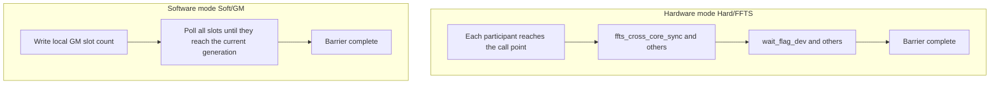

# SYNCALL

<!-- md-trans-meta sourceCommit=unknown translatedAt=2026-08-26T03:21:48.964Z pushedAt=2026-08-29T09:05:18.411Z -->

## Instruction Diagram

> The repository currently does not provide `SYNCALL.svg` (unlike most vector operators). `SYNCALL` is a **cross-core control-plane** primitive and does not describe element-wise data transformation on a single tile. Semantically, it can be understood as "all selected participants converge at the same point before proceeding."

The following diagram distinguishes the hardware (FFTS) and software (GM polling) paths (conceptual diagram, not a normative binding):



## Introduction

`SYNCALL` is a cross-core synchronization barrier that supports the Atlas A2/A3 training products/Atlas A2/A3 inference products and Ascend 950PR/Ascend 950DT NPU backends. The core type mode is selected through the template parameter `SyncCoreType`:

- **AIV-only** (default): `SYNCALL()` synchronizes all AIV cores.
- **AIC-only**: `SYNCALL<SyncCoreType::AICOnly>()` synchronizes all AIC cores (Atlas A2/A3 training products/Atlas A2/A3 inference products support hardware and software modes; Ascend 950PR/Ascend 950DT support only hardware mode).
- **MIX (AIC+AIV)**: `SYNCALL<SyncCoreType::Mix>()` synchronizes mixed AIC and AIV cores.

Use `SyncAllMode` (explicitly given in the overload with workspace) to select **hardware mode (FFTS)** or **software mode (GM polling)**. The overload without workspace corresponds to the hardware path.

## Mathematical Semantics

Element-wise arithmetic semantics do not apply. `SYNCALL` expresses a **barrier arrival** relationship:

- At a given dynamic program point, all cores belonging to the participant set defined by the current `SyncCoreType` must have executed past that `SYNCALL` call before any participant may pass that point and continue executing subsequent code.
- Hardware mode: the cross-core visible order is guaranteed by primitives such as the FFTS flag and the device-side `wait_flag_dev`.
- Software mode: the monotonic counter of each participant's exclusive slot in GM, together with coherence primitives such as `dcci`/`dsb`, determines in polling that "all participants have reached the current generation".

This semantics does **not** provide additional guarantees on the contents of GM or other buffers after the barrier; cross-core data visibility must be maintained by the caller. See "Cross-Core GM Communication Notes".

## C++ Built-in APIs

Declared in `include/pto/common/pto_instr.hpp`. The software mode API uses type-safe `GlobalTensor` and `Tile` parameters (constrained via SFINAE):
> The public include header is `<pto/pto-inst.hpp>`, and the internal declaration is located in `pto/common/pto_instr.hpp`.

```cpp
// Hardware mode (common to all CoreType).
template <SyncCoreType CoreType = SyncCoreType::AIVOnly>
PTO_INST void SYNCALL();

// Software mode — AIV-only (GlobalTensor + Vec Tile).
template <SyncAllMode Mode, SyncCoreType CoreType = SyncCoreType::AIVOnly,
          typename GlobalData, typename TileData,
          std::enable_if_t<is_global_data_v<GlobalData> &&
                           is_tile_data_v<TileData> && TileData::Loc == TileType::Vec, int> = 0>
PTO_INST void SYNCALL(GlobalData &gmWorkspace, TileData &ubWorkspace, int32_t usedCores = 0);

// Software mode — AIC-only (GlobalTensor + Mat Tile).
template <SyncAllMode Mode, SyncCoreType CoreType = SyncCoreType::AICOnly,
          typename GlobalData, typename TileData,
          std::enable_if_t<is_global_data_v<GlobalData> &&
                           is_tile_data_v<TileData> && TileData::Loc == TileType::Mat, int> = 0>
PTO_INST void SYNCALL(GlobalData &gmWorkspace, TileData &l1Workspace, int32_t usedCores = 0);

// Software mode — MIX (GlobalTensor + Vec Tile + Mat Tile).
template <SyncAllMode Mode, SyncCoreType CoreType = SyncCoreType::Mix,
          typename GlobalData, typename UbTileData, typename L1TileData,
          std::enable_if_t<is_global_data_v<GlobalData> &&
                           is_tile_data_v<UbTileData> && UbTileData::Loc == TileType::Vec &&
                           is_tile_data_v<L1TileData> && L1TileData::Loc == TileType::Mat, int> = 0>
PTO_INST void SYNCALL(GlobalData &gmWorkspace, UbTileData &ubWorkspace, L1TileData &l1Workspace,
                       int32_t usedCores = 0);
```

## Parameters

- `gmWorkspace`: `GlobalTensor<int32_t, pto::Shape<>, pto::Stride<>>` (when Ascend C and `using namespace pto` coexist, it is recommended to write the full `pto::` to avoid name conflicts with the `Stride` enum in the compiler built-in headers). The GM workspace used in software mode must be initialized to 0 before the call. Each participating core occupies 8 `int32_t` values (synchronization counters isolated by cache line).
- `ubWorkspace`: `Tile<TileType::Vec, int32_t, 1, SYNCALL_SOFT_SLOT_INT32>` (the template parameter is fixed to `SYNCALL_SOFT_SLOT_INT32 = 8`, that is, one cache line slot per core). For the UB scratch used in AIV-only and MIX software modes, the runtime backing memory capacity must be at least `usedCores * 8 * sizeof(int32_t)` (the implementation accesses it through a raw pointer and does not validate the template capacity; in the example, it is declared with the compile-time maximum number of participating cores × `SYNCALL_SOFT_SLOT_INT32` to ensure sufficient backing memory).
- `l1Workspace`: `Tile<TileType::Mat, int32_t, 1, SYNCALL_SOFT_SLOT_INT32>`. The L1 (cbuf) scratch used in AIC-only and MIX software modes is used by `create_cbuf_matrix` to fill the synchronization value and then move it to GM via DMA.
- `usedCores`: Number of cores participating in the software barrier. When it is 0, it is automatically inferred — AIV-only/AIC-only uses `get_block_num()`, and MIX uses `SYNCALL_GET_MIX_PARTICIPANT_COUNT()` (that is, `AIC blocks × (1 + AIV ratio)`).

## Kernel Meta Macros

The following scenarios require **manually writing** `.ascend.meta` in the ELF for correct runtime scheduling: **Hard AIV-only**, **Soft AIC-only**, and **register-ELF MIX** (such as 1:1 hard). For `dav-c220` automatic splitting scenarios, the meta is generated by Bisheng; see the end of this section. The macros are defined in `include/pto/common/kernel_meta.hpp`:

> `kernelName` must be **exactly identical** to the `__global__` entry symbol (written to section `.ascend.meta.<kernelName>`).

```cpp
// AIV-side kernel (ktype=MIX_AIV_MAIN, AIC:AIV ratio fixed at 0:1)
PTO_SYNCALL_AIV_KERNEL_META(kernelName);

// AIC-only kernel (ktype=AIC_ONLY, ratio fixed at 1:0)
PTO_SYNCALL_AIC_KERNEL_META(kernelName);

// AIC-side MIX kernel (ktype=MIX_AIC_MAIN, specifies the AIC:AIV ratio)
PTO_SYNCALL_MIX_AIC_KERNEL_META(kernelName, aicRatio, aivRatio);
```

**Usage Examples**

Hard AIV-only (single kernel, chevron startup):

```cpp
PTO_SYNCALL_AIV_KERNEL_META(MyKernel_mix_aiv);
extern "C" __global__ AICORE void MyKernel_mix_aiv(...) { SYNCALL(); }
```

Soft AIC-only (single kernel, chevron startup):

```cpp
PTO_SYNCALL_AIC_KERNEL_META(MyKernel);
extern "C" __global__ AICORE void MyKernel(...) { SYNCALL<SyncAllMode::Soft, SyncCoreType::AICOnly>(...); }
```

Register-ELF general pairing (AIC side specifies the ratio + AIV side). Note: The MIX 1:2 of the current `syncall` ST has switched to `dav-c220` automatic splitting and no longer requires manually writing meta. The following example only demonstrates the macro pairing for the register-ELF path:

```cpp
PTO_SYNCALL_MIX_AIC_KERNEL_META(MyKernel_mix_aic, 1, 2);
PTO_SYNCALL_AIV_KERNEL_META(MyKernel_mix_aiv);
```

register-ELF MIX 1:1 hard (**use `PTO_SYNCALL_MIX_AIC_KERNEL_META(..., 1, 1)` on both the AIC and AIV sides**, and **do not** use `PTO_SYNCALL_AIV_KERNEL_META` on the AIV side):

```cpp
PTO_SYNCALL_MIX_AIC_KERNEL_META(MyKernel_mix_aic, 1, 1);
PTO_SYNCALL_MIX_AIC_KERNEL_META(MyKernel_mix_aiv, 1, 1);
```

**Common scenarios that do not require manually writing meta** (for a complete comparison, see the scenario quick reference table in *Compilation and Scheduling Guide* below):

- AIV-only Soft (`dav-c220-vec`)
- MIX 1:2 Hard/Soft, Hard AIC-only (Atlas A2/A3 training products/Atlas A2/A3 inference products, `dav-c220` automatic splitting)
- MIX 1:1 Soft (dual-stream chevron)

> **dav-c220 automatic splitting**: When compiling with `--cce-aicore-arch=dav-c220`, Bisheng automatically generates the AIC/AIV sub-kernels and the corresponding `.ascend.meta`, with a physical ratio of **1:2** (each AIC block is paired with 2 AIV subblocks). In this case, there is **no need** to manually write `PTO_SYNCALL_MIX_AIC_KERNEL_META`, and you **cannot** change the ratio to 1:1 through meta (see *MIX 1:1* below).

## Compilation and Scheduling Guide (Atlas A2/A3 Training Products/Atlas A2/A3 Inference Products)

This section uses the ST test cases in [`tests/npu/a2a3/src/st/testcase/syncall/`](../../tests/npu/a2a3/src/st/testcase/syncall/) as the reference to describe the **compile arch**, **meta**, and **host startup** methods to use for different `SyncCoreType`/mode/AIC:AIV ratios. The host side determines the launch grid at runtime through [`syncall_core_config.hpp`](../../tests/npu/a2a3/src/st/testcase/syncall/syncall_core_config.hpp) (910B1: 24 AIC + 48 AIV; 910B4: 20 AIC + 40 AIV), and the same kernel binary can be reused across chips.

### Scenario Quick Reference

| Scenario | Sync Mode | Participant Count | Compile `--cce-aicore-arch` | Kernel Meta | Host Startup | Reference Source File |
|------|---------|----------|--------------------------|-------------|-----------|-----------|
| AIV-only | Hard | `aiv` | `dav-c220-vec` | `PTO_SYNCALL_AIV_KERNEL_META` | chevron `<<<aiv>>>` | `syncall_kernel.cpp` |
| AIV-only | Soft | `aiv` | `dav-c220-vec` | None | chevron `<<<aiv>>>` | `syncall_soft_kernel.cpp` |
| AIC-only | Hard | `aic` | **`dav-c220`** (MIX automatic splitting, AIV empty stub) | Auto-generated by Bisheng | chevron `<<<aic>>>` | `syncall_aic_hard_kernel.cpp` |
| AIC-only | Soft | `aic` | `dav-c220-cube` | `PTO_SYNCALL_AIC_KERNEL_META` | chevron `<<<aic>>>` | `syncall_aic_kernel.cpp` |
| MIX 1:2 | Hard / Soft | `aic×3` | **`dav-c220`** | Auto-generated by Bisheng | chevron `<<<aic>>>` (hard/soft share the same `.so`) | `syncall_mix_1_2_kernel.cpp` |
| MIX 1:1 | Soft | `aic×2` | cube + vec compile separately into `.o` | None | **Dual-stream** chevron: AIC `<<<aic>>>` + AIV `<<<aiv>>>` | `syncall_mix_1_1_soft_kernel.cpp` |
| MIX 1:1 | Hard | `aic×2` | cube + vec compile separately into `.o` | **`PTO_SYNCALL_MIX_AIC_KERNEL_META(..., 1, 1)`** | **register ELF** + `rtKernelLaunchWithHandleV2` | `syncall_mix_1_1_kernel.cpp` |

Hard and soft kernels **must not share the same `.so`** (in scenarios such as AIV-only/AIC-only, soft pollutes the hard FFTS configuration and causes a hang); for MIX 1:2, hard and soft both go through dav-c220 automatic splitting, so they can be placed in the same `.so` of the same source file.

### Path Descriptions

#### 1. Chevron Single-Arch Compilation (AIV-Only/AIC-Only Soft)

- Compile: a single source file + the corresponding arch (`dav-c220-vec` or `dav-c220-cube`), producing an independent `.so`.
- Startup: `kernel<<<blockDim, nullptr, stream>>>(..., totalBlocks)`, where `blockDim` and `totalBlocks` are passed in by the host at runtime (from `syncall_cfg::GetCoreConfig()` in ST).
- Hard AIV-only requires declaring `PTO_SYNCALL_AIV_KERNEL_META` on the kernel.

#### 2. Chevron MIX Automatic Splitting (MIX 1:2, Hard AIC-Only)

- Compile: `--cce-aicore-arch=dav-c220`; CMake uses `pto_syncall_chevron_kernel(<target> <source>)`.
- Startup: a single chevron `<<<aic>>>`; the runtime starts all MIX participants at a physical 1:2 ratio.
- Kernel parameters: `aicBlocks` and `totalParticipants` are passed in as scalars from the host (both the AIC and AIV sides read the same parameters) to support different cube counts such as 910B1/910B4.
- **Hard AIC-only special case**: pure `dav-c220-cube` cannot establish the FFTS context required for AIC-only hard synchronization. It must be compiled with `dav-c220` MIX: the AIC executes `SYNCALL<AICOnly>()`, and the AIV is an empty stub; `totalBlocks` is passed in from the host.

#### 3. Dual-Arch Dual-Stream (MIX 1:1 Soft)

- Reason: On the ccec/bisheng path, `GetTaskRatio()` is always **2**, and `dav-c220` automatic splitting is physically fixed at **1:2**, so a true 1:1 ratio cannot be obtained.
- Compile: Compile the same source file separately into one `.o` with `dav-c220-cube` (`-DSYNCALL_MIX_BUILD_AIC`) and one `.o` with `dav-c220-vec` (`-DSYNCALL_MIX_BUILD_AIV`), then link them into a single `.so`; CMake uses `pto_syncall_mix11_soft_kernel`.
- Startup: AIC and AIV chevron `<<<aic>>>` and `<<<aiv>>>` on two separate `aclrtStream`s respectively; `aicBlocks`/`totalParticipants` are passed in by the host at runtime.

#### 4. Register ELF (MIX 1:1 Hard)

- Reason: Hard MIX synchronization requires a single MIX FFTS context; chevron automatic splitting cannot achieve true 1:1 under ccec.
- Compile: Compile a `.o` with `PTO_SYNCALL_MIX_AIC_KERNEL_META(name, 1, 1)` for each of cube/vec, then generate a register-specific `.o` with `-DSYNCALL_MIX_REGISTER_BUILD`, and synthesize the registration ELF via `make_mix_register_elf.py`; CMake uses `pto_syncall_mix_kernel`.
- Startup: `rtRegisterAllKernel` + `rtKernelLaunchWithHandleV2(handle, tilingKey, aicBlocks, ...)`; the device side uses `get_block_num()` to derive the number of participants (the register path passes only the three parameters `ffts/out/flags`).

## Mode Support Matrix

### Atlas A2/A3 Training Products/Atlas A2/A3 Inference Products

| Core Type | Hardware Mode | Software Mode |
|--------|---------|---------|
| AIV-only | Supported | Supported |
| AIC-only | Supported | Supported |
| MIX | Supported | Supported |

### Ascend 950PR/Ascend 950DT

| Core Type | Hardware Mode | Software Mode |
|--------|---------|---------|
| AIV-only | Supported | Supported |
| AIC-only | Supported | Not supported |
| MIX | Not supported | Supported |

## Constraints

- Software mode GM write paths on each platform:
  - Atlas A2/A3 training products/Atlas A2/A3 inference products (AIC-only and the AIC side of MIX): the AIC writes the GM slot through `copy_cbuf_to_gm` (L1→GM DMA); the AIV side of MIX writes through the UB workspace.
  - Ascend 950PR/Ascend 950DT MIX: the Ascend 950PR/Ascend 950DT AIC (`dav-c310-cube`) does not support `copy_cbuf_to_gm`; instead, it delegates the UB→GM write to AIV subblock 0 of the same block through the `intra_block` signal.
- Reasons for the Ascend 950PR/Ascend 950DT platform limitations (corresponding to the mode support matrix):
  - AIC-only software is unavailable: the Ascend 950PR/Ascend 950DT AIC lacks independent GM-write DMA paths such as `copy_cbuf_to_gm`, so GM polling cannot be implemented.
  - Hardware MIX is unavailable: `rtGetC2cCtrlAddr` returns `RT_ERROR_FEATURE_NOT_SUPPORT` (207000) on Ascend 950PR/Ascend 950DT (`CHIP_DAVID`), so the FFTS base address cannot be obtained.
  - AIC-only hardware: implemented through `ffts_cross_core_sync` + `wait_flag_dev`, without requiring `set_ffts_base_addr`.
- Software mode requires all participating cores to enter the same group of barriers in the same order (based on a monotonic algebraic count; inconsistent entry counts/order will cause mismatch or deadlock).
- `SYNCALL` does not participate in PTO's automatic event dependency orchestration: it neither accepts `WaitEvents` nor returns a `RecordEvent` that can be awaited by subsequent instructions. Therefore, it does not automatically wait for preceding data instructions (such as `TSTORE`) to complete, and the ordering and visibility between `SYNCALL` and data instructions before and after it must be guaranteed by the caller (see "Cross-Core GM Communication Notes").
- Under the auto build path (`__PTO_AUTO__`), `SYNCALL` is a no-op and does not emit cross-core hardware synchronization (consistent with `TSYNC` and others); real synchronization occurs only in manual kernels.

## Cross-Core GM Communication Notes

`SYNCALL` provides only the barrier **arrival** semantics (for both hard and soft), and does **not** guarantee cross-core cache visibility of business data before and after the barrier. When an operator writes GM on each core before the barrier and reads GM of other cores after the barrier (such as cross-core histogram/prefix sum), the caller must satisfy the following two conditions; otherwise, dirty data may be read or writes may be lost.

### 1. Cache Consistency: Must Explicitly `dcci`/`dsb`

- **Writer**: After `copy_ubuf_to_gm`/`copy_cbuf_to_gm`, append `dcci(addr, SINGLE_CACHE_LINE)` + `dsb(DSB_DDR)` to flush the data out to DDR.
- **Reader**: Before reading, call `dcci(addr, SINGLE_CACHE_LINE)` (invalidate) + `dsb` to ensure the latest DDR value is read instead of the stale cache of the local core.
- Merely using `set_flag`/`wait_flag` (intra-core pipeline synchronization) is **insufficient** to guarantee cross-core visibility.
- This requirement is independent of the barrier mode: the **hardware FFTS barrier likewise does not flush the cache**, and only guarantees the control-plane ordering of "all participants have arrived".
- `SYNCALL` internally performs complete `dcci` + `dsb(DDR)` handling on its own synchronization slots, but it **does not** flush business data on behalf of the caller.

### 2. Per-Core Slot Exclusion by Cache Line: Avoiding False Sharing Write Loss

- `dcci`/DMA operates at a **32-byte cache line** granularity. If adjacent core slots share the same cache line, cross-core refresh will cause mutual overwriting/write loss.
- Each core slot should be 32-byte aligned and **exclusively occupy one cache line** (for the `int32` scenario, stride = 8, not 4).
- `SYNCALL`'s own synchronization slot is designed this way: `SYNCALL_SOFT_SLOT_INT32 = 8` (see `include/pto/common/type.hpp`). The caller's business workspace should also follow the same isolation principle.

## Examples

### Manual — Hardware Mode

```cpp
#include <pto/pto-inst.hpp>

using namespace pto;

// AIV-only: FFTS barrier across all AIV cores (requires correct kernel meta/ELF).
void example_hard_aiv() {
  SYNCALL();
}

// AIC-only: A2/A3 hard is implemented through dav-c220 MIX compilation (with an empty AIV stub); the cube-only hardware mode path has been verified on A5.
void example_hard_aic() {
  SYNCALL<SyncCoreType::AICOnly>();
}

// MIX: for compilation and startup, see Kernel Meta Macros and Compilation and Scheduling Guide above.
void example_hard_mix() {
  SYNCALL<SyncCoreType::Mix>();
}
```

### Manual — Software Mode

Software mode requires passing in a **zeroed** GM workspace and a UB/L1 tile of valid capacity. `Mode` must be `SyncAllMode::Soft` (when `Hard` is used, the workspace is ignored and the behavior is the same as the parameterless `SYNCALL_IMPL`).

```cpp
#include <pto/pto-inst.hpp>

using namespace pto;

// The AIV software barrier requires reading the slots of all participating cores into UB.
// The UB capacity must be >= usedCores * SYNCALL_SOFT_SLOT_INT32 (each core exclusively occupies one cache line).
// Here the maximum AIV core count of the target chip, kMaxAivCores, is used as the compile-time upper bound for the declaration.
constexpr int32_t kMaxAivCores = 48;  // Example: 48 for 910B1.
void example_soft_aiv(__gm__ int32_t *gmPtr) {
  GlobalTensor<int32_t, pto::Shape<>, pto::Stride<>> gmWs(gmPtr);
  Tile<TileType::Vec, int32_t, 1, kMaxAivCores * SYNCALL_SOFT_SLOT_INT32> ub;
  SYNCALL<SyncAllMode::Soft, SyncCoreType::AIVOnly>(gmWs, ub, 0);  // usedCores=0 automatically takes get_block_num().
}
```

MIX software mode requires providing both UB and L1 (Mat) tile; on Ascend 950PR/Ascend 950DT, the AIC side writes GM through the proxy path. See the "Constraints" section for details.
