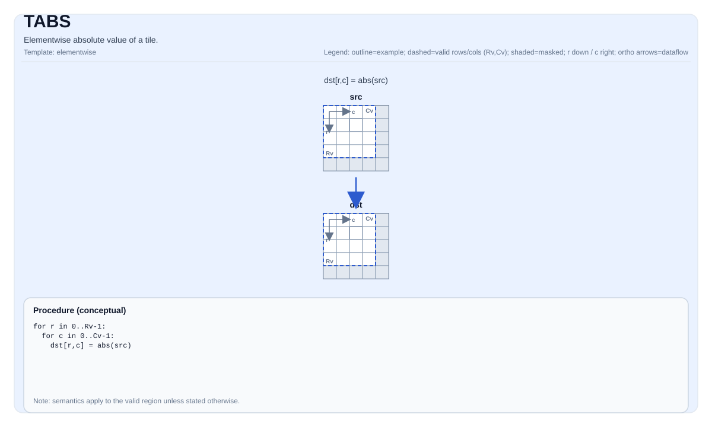

# TABS


## Tile Operation Diagram



## Introduction

Elementwise absolute value of a tile.

## Math Interpretation

For each element `(i, j)` in the valid region:

$$ \mathrm{dst}_{i,j} = \left|\mathrm{src}_{i,j}\right| $$

## Assembly Syntax

Synchronous form:

```text
%dst = tabs %src : !pto.tile<...> -> !pto.tile<...>
```

### AS Level 1 (SSA)

```text
%dst = pto.tabs %src : !pto.tile<...> -> !pto.tile<...>
```

### AS Level 2 (DPS)

```text
pto.tabs ins(%src : !pto.tile_buf<...>) outs(%dst : !pto.tile_buf<...>)
```
## C++ Intrinsic

Declared in `include/pto/common/pto_instr.hpp`:

```cpp
template <typename TileDataDst, typename TileDataSrc, typename... WaitEvents>
PTO_INST RecordEvent TABS(TileDataDst &dst, TileDataSrc &src, WaitEvents &... events);
```

## Constraints

- **Implementation checks (CPU sim)**:
    - The dtypes of `dst` and `src` must be identical and one of: `int32_t`, `int`, `int16_t`, `int8_t`, `half`,
      `bfloat16_t`, `float`.
    - Runtime: `src.GetValidRow() == dst.GetValidRow()` and `src.GetValidCol() == dst.GetValidCol()`; a mismatch
      triggers an assertion failure.
    - The implementation iterates over `dst.GetValidRow()` / `dst.GetValidCol()`.
- **Implementation checks (Costmodel)**:
    - `TileData::DType` must be one of: `int32_t`, `int16_t`, `int8_t`, `uint8_t`, `half`, `float`.
- **Implementation checks (NPU)**:
    - For A3, `TileData::DType` must be one of: `float` or `half`;
    - For A5, `TileData::DType` must be one of: `float`, `half`, `int32_t`, `int16_t`, `int8_t`, `int64_t`;
    - Tile location must be vector (`TileData::Loc == TileType::Vec`);
    - Static valid bounds: `TileData::ValidRow <= TileData::Rows` and `TileData::ValidCol <= TileData::Cols`;
    - Runtime: `src.GetValidRow() == dst.GetValidRow()` and `src.GetValidCol() == dst.GetValidCol()`;
    - Tile layout must be row-major (`TileData::isRowMajor`).
- **Valid region**:
    - The op uses `dst.GetValidRow()` / `dst.GetValidCol()` as the iteration domain.
    - `dst` and `src` may have distinct C++ Tile types, including different static or dynamic `ValidRow`/`ValidCol`
      template arguments, provided that their element types are identical. CPU_SIM computes each operand's address
      from that operand's own Tile layout and physical shape.

## Examples

### Auto

```cpp
#include <pto/pto-inst.hpp>

using namespace pto;

void example_auto() {
  using TileT = Tile<TileType::Vec, float, 16, 16>;
  TileT src, dst;
  TABS(dst, src);
}
```

### Auto (mixed static and dynamic valid shapes)

```cpp
#include <pto/pto-inst.hpp>

using namespace pto;

void example_mixed_valid_shape() {
  using DynamicTile = Tile<TileType::Vec, int32_t, 16, 16, BLayout::RowMajor, -1, -1>;
  using StaticTile = Tile<TileType::Vec, int32_t, 16, 16, BLayout::RowMajor, 16, 16>;
  DynamicTile dst(16, 16);
  StaticTile src;
  TABS(dst, src);
}
```

### Manual

```cpp
#include <pto/pto-inst.hpp>

using namespace pto;

void example_manual() {
  using TileT = Tile<TileType::Vec, float, 16, 16>;
  TileT src, dst;
  TASSIGN(src, 0x1000);
  TASSIGN(dst, 0x2000);
  TABS(dst, src);
}
```

## ASM Form Examples

### Auto Mode

```text
# Auto mode: compiler/runtime-managed placement and scheduling.
%dst = pto.tabs %src : !pto.tile<...> -> !pto.tile<...>
```

### Manual Mode

```text
# Manual mode: resources must be bound explicitly before issuing the instruction.
# Optional for tile operands:
# pto.tassign %arg0, @tile(0x1000)
# pto.tassign %arg1, @tile(0x2000)
%dst = pto.tabs %src : !pto.tile<...> -> !pto.tile<...>
```

### PTO Assembly Form

```text
%dst = tabs %src : !pto.tile<...> -> !pto.tile<...>
# AS Level 2 (DPS)
pto.tabs ins(%src : !pto.tile_buf<...>) outs(%dst : !pto.tile_buf<...>)
```
