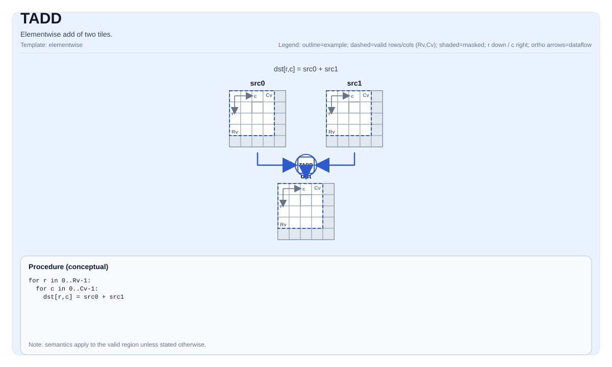

# TADD


## Tile Operation Diagram



## Introduction

Elementwise add of two tiles.

## Math Interpretation

For each element `(i, j)` in the valid region:

$$ \mathrm{dst}_{i,j} = \mathrm{src0}_{i,j} + \mathrm{src1}_{i,j} $$

## Assembly Syntax

Synchronous form:

```text
%dst = tadd %src0, %src1 : !pto.tile<...>
```

### IR Level 1 (SSA)

```text
%dst = pto.tadd %src0, %src1 : (!pto.tile<...>, !pto.tile<...>) -> !pto.tile<...>
```

### IR Level 2 (DPS)

```text
pto.tadd ins(%src0, %src1 : !pto.tile_buf<...>, !pto.tile_buf<...>) outs(%dst : !pto.tile_buf<...>)
```
## C++ Intrinsic

Declared in `include/pto/common/pto_instr.hpp`:

```cpp
template <typename TileDataDst, typename TileDataSrc0, typename TileDataSrc1, typename... WaitEvents>
PTO_INST RecordEvent TADD(TileDataDst &dst, TileDataSrc0 &src0, TileDataSrc1 &src1, WaitEvents &... events);
```

## Constraints

- **Implementation checks (A2A3)**:
    - The dtypes of `dst`, `src0`, and `src1` must be identical and one of: `int32_t`, `int16_t`, `half`, `float`.
    - The layouts of `dst`, `src0`, and `src1` must all be row-major (`TileData::isRowMajor`).
- **Implementation checks (A5)**:
    - The dtypes of `dst`, `src0`, and `src1` must be identical and one of: `int32_t`, `uint32_t`, `int64_t`, `uint64_t`, `float`, `int16_t`, `uint16_t`, `half`, `bfloat16_t`, `uint8_t`, `int8_t`.
    - The layouts of `dst`, `src0`, and `src1` must all be row-major (`TileData::isRowMajor`).
- **Implementation checks (CPU_SIM)**:
    - The three operand dtypes must be identical. CPU_SIM has no additional row-major-only restriction; row-major,
      column-major, and other supported Tile layouts use their corresponding per-operand offset calculation.
- **Valid region**:
    - The op uses `dst.GetValidRow()` / `dst.GetValidCol()` as the iteration domain.
    - `dst`, `src0`, and `src1` may have distinct C++ Tile types, including different static or dynamic
      `ValidRow`/`ValidCol` template arguments, provided that their element types are identical.
    - A2A3, A5, and CPU_SIM require `src0`, `src1`, and `dst` to have identical runtime valid row and column counts and
      trigger an assertion failure on mismatch. CPU_SIM computes each operand's address from that operand's own Tile
      layout and physical shape.

## Examples

### Auto

```cpp
#include <pto/pto-inst.hpp>

using namespace pto;

void example_auto() {
  using TileT = Tile<TileType::Vec, float, 16, 16>;
  TileT src0, src1, dst;
  TADD(dst, src0, src1);
}
```

### Auto (mixed static and dynamic valid shapes)

```cpp
#include <pto/pto-inst.hpp>

using namespace pto;

void example_mixed_valid_shape() {
  using DynamicTile = Tile<TileType::Vec, int32_t, 16, 16, BLayout::RowMajor, -1, -1>;
  using StaticTile = Tile<TileType::Vec, int32_t, 16, 16, BLayout::RowMajor, 16, 16>;
  DynamicTile dst(16, 16), src1(16, 16);
  StaticTile src0;
  TADD(dst, src0, src1);
}
```

### Manual

```cpp
#include <pto/pto-inst.hpp>

using namespace pto;

void example_manual() {
  using TileT = Tile<TileType::Vec, float, 16, 16>;
  TileT src0, src1, dst;
  TASSIGN(src0, 0x1000);
  TASSIGN(src1, 0x2000);
  TASSIGN(dst,  0x3000);
  TADD(dst, src0, src1);
}
```

## ASM Form Examples

### Auto Mode

```text
# Auto mode: compiler/runtime-managed placement and scheduling.
%dst = pto.tadd %src0, %src1 : (!pto.tile<...>, !pto.tile<...>) -> !pto.tile<...>
```

### Manual Mode

```text
# Manual mode: resources must be bound explicitly before issuing the instruction.
# Optional for tile operands:
# pto.tassign %arg0, @tile(0x1000)
# pto.tassign %arg1, @tile(0x2000)
%dst = pto.tadd %src0, %src1 : (!pto.tile<...>, !pto.tile<...>) -> !pto.tile<...>
```

### PTO Assembly Form

```text
%dst = tadd %src0, %src1 : !pto.tile<...>
# IR Level 2 (DPS)
pto.tadd ins(%src0, %src1 : !pto.tile_buf<...>, !pto.tile_buf<...>) outs(%dst : !pto.tile_buf<...>)
```
