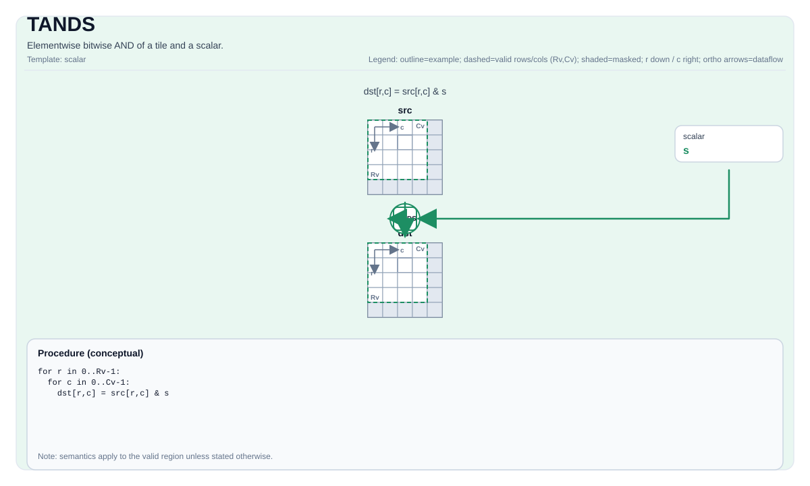

# TANDS

<!-- md-trans-meta sourceCommit=unknown translatedAt=2026-08-26T03:31:13.652Z pushedAt=2026-08-29T09:05:18.415Z -->

## Instruction Diagram



## Introduction

Element-wise bitwise AND between a tile and a scalar.

## Mathematical Semantics

For each element `(i, j)` within the valid region:

$$ \mathrm{dst}_{i,j} = \mathrm{src}_{i,j} \;\&\; \mathrm{scalar} $$

## Assembly Syntax

Synchronous form:

```text
%dst = tands %src, %scalar : !pto.tile<...>, i32
```

### AS Level 1 (SSA)

```text
%dst = pto.tands %src, %scalar : (!pto.tile<...>, dtype) -> !pto.tile<...>
```

### AS Level 2 (DPS)

```text
pto.tands ins(%src, %scalar : !pto.tile_buf<...>, dtype) outs(%dst : !pto.tile_buf<...>)
```

## C++ Built-in APIs

Declared in `include/pto/common/pto_instr.hpp`:
> The public include header is `<pto/pto-inst.hpp>`, and the internal declaration is located in `pto/common/pto_instr.hpp`.

```cpp
template <typename TileDataDst, typename TileDataSrc, typename... WaitEvents>
PTO_INST RecordEvent TANDS(TileDataDst &dst, TileDataSrc &src, typename TileDataDst::DType scalar, WaitEvents &... events);
```

## Constraints

- **Implementation check (Atlas A2/A3 training products/Atlas A2/A3 inference products)**:
    - Applicable to integer element types.
    - `dst` and `src` must use the same element type.
    - `dst` and `src` must be vector tiles.
    - Runtime: `src.GetValidRow() == dst.GetValidRow()` and `src.GetValidCol() == dst.GetValidCol()`.
    - In manual mode, setting the source tile and destination tile to the same memory is not supported.
- **Implementation check (Ascend 950PR/Ascend 950DT)**:
    - Applicable to the integer element types supported by `TANDS`.
    - `dst` and `src` must use the same element type.
    - `dst` and `src` must be vector tiles.
    - Runtime: `src0.GetValidRow() == dst.GetValidRow()` and `src0.GetValidCol() == dst.GetValidCol()`.
    - In manual mode, setting the source tile and destination tile to the same memory is not supported.
- **Valid region**:
    - This operation uses `dst.GetValidRow()`/`dst.GetValidCol()` as the iteration domain.

## Examples

```cpp
#include <pto/pto-inst.hpp>

using namespace pto;

void example() {
  using TileDst = Tile<TileType::Vec, uint16_t, 16, 16>;
  using TileSrc = Tile<TileType::Vec, uint16_t, 16, 16>;
  TileDst dst;
  TileSrc src;
  TANDS(dst, src, 0xffu);
}
```

## ASM Examples

### Automatic Mode

```text
# Automatic mode: the compiler/runtime is responsible for resource placement and scheduling.
%dst = pto.tands %src, %scalar : (!pto.tile<...>, dtype) -> !pto.tile<...>
```

### Manual Mode

```text
# Manual mode: explicitly bind resources first, then issue the instruction.
# Optional (when the instruction contains tile operands):
# pto.tassign %arg0, @tile(0x1000)
# pto.tassign %arg1, @tile(0x2000)
%dst = pto.tands %src, %scalar : (!pto.tile<...>, dtype) -> !pto.tile<...>
```

### PTO Assembly Form

```text
%dst = tands %src, %scalar : !pto.tile<...>, i32
# AS Level 2 (DPS)
pto.tands ins(%src, %scalar : !pto.tile_buf<...>, dtype) outs(%dst : !pto.tile_buf<...>)
```
