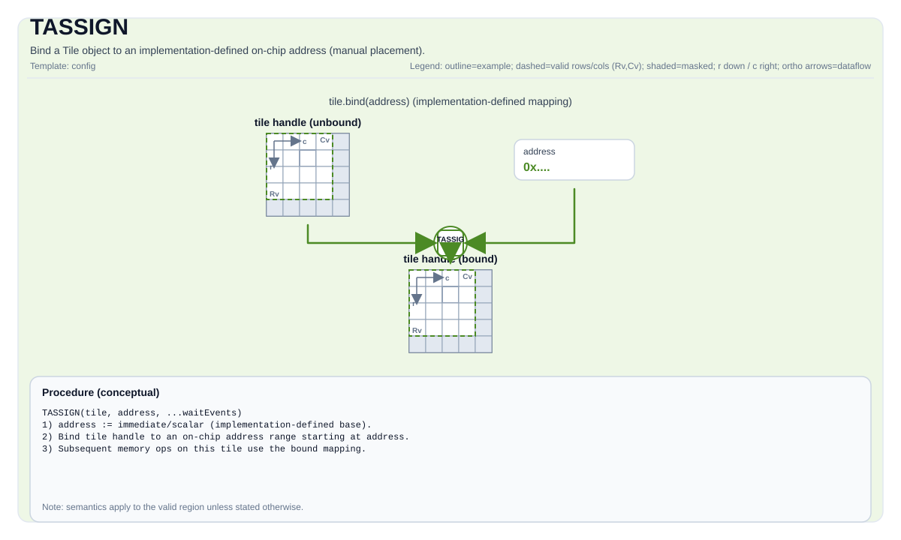

# TASSIGN

<!-- md-trans-meta sourceCommit=unknown translatedAt=2026-08-26T03:31:46.535Z pushedAt=2026-08-29T09:05:18.415Z -->

## Instruction Diagram



## Introduction

Binds a tile object to an implementation-defined on-chip address (manual placement).

## Mathematical Semantics

Not applicable.

## Assembly Syntax

`TASSIGN` is typically introduced by buffering/lowering when mapping an SSA tile to physical storage.

Synchronous form:

```text
tassign %tile, %addr : !pto.tile<...>, dtype
```

### AS Level 1 (SSA)

```text
pto.tassign %tile, %addr : !pto.tile<...>, dtype
```

### AS Level 2 (DPS)

```text
pto.tassign ins(%tile, %addr : !pto.tile_buf<...>, dtype)
```

## C++ Built-in APIs

Declared in `include/pto/common/pto_instr.hpp`.
> The public include header is `<pto/pto-inst.hpp>`, and the internal declaration is located in `pto/common/pto_instr.hpp`.

### Form 1: Runtime Address

```cpp
template <typename T, typename AddrType>
PTO_INST void TASSIGN(T& obj, AddrType addr);
```

Binds `obj` to the on-chip address `addr`. No compile-time bound check is performed (the address value is unknown at compile time).

### Form 2: Compile-Time Address (With Static Bound Check)

```cpp
template <std::size_t Addr, typename T>
PTO_INST void TASSIGN(T& obj);
```

Binds `obj` to the on-chip address `Addr`. Because `Addr` is a non-type template parameter, the compiler performs the following **compile-time** checks via `static_assert`:

| Check Item | Condition | Assertion ID | Error Message |
|--------|------|---------|----------|
| Memory space exists | `capacity > 0` | SA-0351 | The current architecture does not support this memory space. |
| Tile fits in memory | `tile_size <= capacity` | SA-0352 | The tile storage size exceeds the memory space capacity. |
| Address is not out of bounds | `Addr + tile_size <= capacity` | SA-0353 | addr + tile_size exceeds the memory space capacity (out of bounds). |
| Address alignment | `Addr % alignment == 0` | SA-0354 | addr is not aligned to the target memory space requirement. |

For fix suggestions, see `docs/coding/debug.md` (fix `FIX-A12`).

The memory space, capacity, and alignment are automatically determined by the tile's `TileType` (that is, the `Loc` template parameter):

| TileType | Memory Space | Capacity (Atlas A2/A3 Training Products/Atlas A2/A3 Inference Products) | Capacity (Ascend 950PR/Ascend 950DT) | Capacity (Kirin9030) | Capacity (KirinX90) | Alignment |
|----------|----------|-------------|-----------|------------------|-----------------|------|
| Vec | UB | 192 KB | 256 KB | 128 KB | 128 KB | 32 bytes |
| Mat | L1 | 512 KB | 512 KB | 512 KB | 1024 KB | 32 bytes |
| Left | L0A | 64 KB | 64 KB | 32 KB | 64 KB | 32 bytes |
| Right | L0B | 64 KB | 64 KB | 32 KB | 64 KB | 32 bytes |
| Acc | L0C | 128 KB | 256 KB | 64 KB | 128 KB | 32 bytes |
| Bias | Bias | 1 KB | 4 KB | 1 KB | 1 KB | 32 bytes |
| Scaling | FBuffer | 2 KB | 4 KB | 7 KB | 6 KB | 32 bytes |
| ScaleLeft | L0A | N/A | 4 KB | N/A | N/A | 32 bytes |
| ScaleRight | L0B | N/A | 4 KB | N/A | N/A | 32 bytes |

The capacity can be overridden via the `-D` compile flag (for example, `-DPTO_UBUF_SIZE_BYTES=262144`). See `include/pto/common/buffer_limits.hpp` for details.

**Note:** This overload applies only to `Tile` and `ConvTile` types. For `GlobalTensor`, use `TASSIGN(obj, pointer)` (form 1).

## Constraints

- **Implementation check**:
    - If `obj` is a tile (including ConvTile):
        - In manual mode (when `__PTO_AUTO__` is not defined), `addr` must be of an integer type and is reinterpreted as the storage address of the tile.
        - In automatic mode (when `__PTO_AUTO__` is defined), `TASSIGN(tile, addr)` is a null operation.
    - If `obj` is a `GlobalTensor`:
        - `addr` must be of a pointer type.
        - The pointed-to element type must match `GlobalTensor::DType`.

## Examples

### Runtime Address (Without Compile-Time Check)

```cpp
#include <pto/pto-inst.hpp>

using namespace pto;

void example_runtime() {
  using TileT = Tile<TileType::Vec, float, 16, 16>;
  TileT a, b, c;
  TASSIGN(a, 0x1000);
  TASSIGN(b, 0x2000);
  TASSIGN(c, 0x3000);
  TADD(c, a, b);
}
```

### Compile-Time Address (with Static Bound Check)

```cpp
#include <pto/pto-inst.hpp>

using namespace pto;

void example_checked() {
  using TileT = Tile<TileType::Vec, float, 16, 16>;
  TileT a, b, c;

  TASSIGN<0x0000>(a);   // OK: 0x0000 + 1024 <= 192KB
  TASSIGN<0x0400>(b);   // OK: 0x0400 + 1024 <= 192KB
  TASSIGN<0x0800>(c);   // OK: 0x0800 + 1024 <= 192KB
  TADD(c, a, b);
}
```

The following example triggers a compilation error:

```cpp
void example_oob() {
  // Tile<Vec, float, 256, 256> occupies 256*256*4 = 256KB
  using BigTile = Tile<TileType::Vec, float, 256, 256>;
  BigTile t;

  // Primarily triggers [SA-0352]: tile_size (256KB) > UB capacity (192KB on A2A3)
  // (The tile already exceeds the entire buffer, so the SA-0353 out-of-bounds assertion also holds.)
  TASSIGN<0x0>(t);
}
```

```cpp
void example_oob_addr() {
  using TileT = Tile<TileType::Vec, float, 128, 128>;  // 64KB
  TileT t;

  // static_assert triggers [SA-0353]: 0x20020 + 64KB > 192KB (the address is aligned, only out-of-bounds)
  TASSIGN<0x20020>(t);
}
```

### Ping-Pong L0 Buffer Allocation

```cpp
void example_pingpong() {
  using L0ATile = TileLeft<half, 64, 128>;   // L0A tile
  using L0BTile = TileRight<half, 128, 64>;  // L0B tile

  L0ATile a0, a1;
  L0BTile b0, b1;

  TASSIGN<0x0000>(a0);   // L0A ping
  TASSIGN<0x8000>(a1);   // L0A pong
  TASSIGN<0x0000>(b0);   // L0B ping (different physical memory from L0A).
  TASSIGN<0x8000>(b1);   // L0B pong
}
```

## ASM Examples

### Automatic Mode

```text
# Automatic mode: the compiler/runtime handles resource placement and scheduling.
pto.tassign %tile, %addr : !pto.tile<...>, dtype
```

### Manual Mode

```text
# Manual mode: explicitly bind resources first, then issue the instruction.
# Optional (when the instruction contains a tile operand):
# pto.tassign %arg0, @tile(0x1000)
# pto.tassign %arg1, @tile(0x2000)
pto.tassign %tile, %addr : !pto.tile<...>, dtype
```

### PTO Assembly Form

```text
tassign %tile, %addr : !pto.tile<...>, dtype
# AS Level 2 (DPS)
pto.tassign ins(%tile, %addr : !pto.tile_buf<...>, dtype)
```
