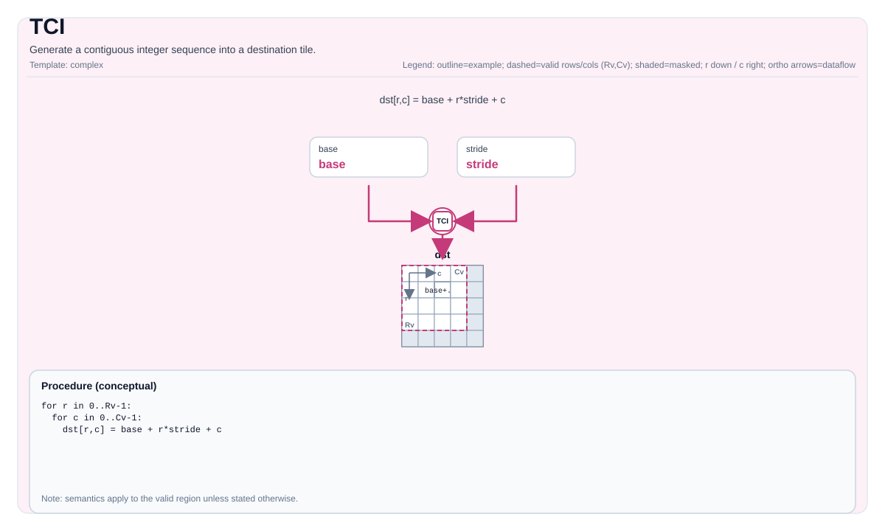

# TCI

<!-- md-trans-meta sourceCommit=unknown translatedAt=2026-08-26T03:33:58.305Z pushedAt=2026-08-29T09:05:18.417Z -->

## Instruction Diagram



## Introduction

Generates a sequence of consecutive integers into the destination tile.

## Mathematical Semantics

For the linearized index `k` on valid elements:

- Ascending:

  $$ \mathrm{dst}_{k} = S + k $$

- Descending:

  $$ \mathrm{dst}_{k} = S - k $$

The linearization order depends on the tile layout (implementation-defined).

## Assembly Syntax

Synchronous form:

```text
%dst = tci %S {descending = false} : !pto.tile<...>
```

### AS Level 1 (SSA)

```text
%dst = pto.tci %scalar {descending = false} : dtype -> !pto.tile<...>
```

### AS Level 2 (DPS)

```text
pto.tci ins(%scalar {descending = false} : dtype) outs(%dst : !pto.tile_buf<...>)
```

## C++ Built-in APIs

Declared in `include/pto/common/pto_instr.hpp`:
> The public include header is `<pto/pto-inst.hpp>`, and the internal declaration is located in `pto/common/pto_instr.hpp`.

```cpp
template <typename TileData, typename T, int descending, typename... WaitEvents>
PTO_INST RecordEvent TCI(TileData &dst, T start, WaitEvents &... events);

template <typename TileData, typename TileDataTmp, typename T, int descending, typename... WaitEvents>
PTO_INST RecordEvent TCI(TileData &dst, T start, TileDataTmp &tmp, WaitEvents &... events);
```

## Constraints

- **Implementation check (Atlas A2/A3 training products/Atlas A2/A3 inference products/Ascend 950PR/Ascend 950DT)**:
    - `TileData::DType` must be exactly the same as the type of the scalar template parameter `T`.
    - The `dst`/`scalar` element types must be the same; the supported types vary by architecture — **A2A3**: any 2/4-byte type (`int16_t`, `uint16_t`, `int32_t`, `uint32_t`, `half`, `bfloat16_t`, `float`); **A5**: only `int16_t`, `uint16_t`, `int32_t`, `uint32_t` (integer types only, no floating-point).
    - `TileData::Rows == 1` (this is a condition enforced by the implementation; the sequence is generated along the column direction).
- **Valid region**:
    - The implementation uses `dst.GetValidCol()` as the sequence length and does not reference `dst.GetValidRow()`.
- **Temporary tile**:
    - **Atlas A2/A3 training products/Atlas A2/A3 inference products**: The C++ API provides an overload with an explicit `tmp` tile for the vectorized implementation path. The overload without `tmp` uses a scalar loop. `TileDataTmp::DType` must be a 4-byte type (`float`, `int32_t`, or `uint32_t`). The implementation converts `tmp` to `float *` for use; the tmp tile size should be planned by byte count rather than interpreted according to the type of `TileDataTmp::DType`.
    - **b32 element type** (`int32_t`, `uint32_t`): minimum tmp size = 768 bytes (192 float elements).
      The vectorized path uses two float sub-buffers within `tmp`: `tmp0` located at offset 0, and `tmp1` located at offset +128 floats. `tmp0` holds at most 64 float elements (256 bytes) for the initial score sequence, and `tmp1` holds at most 64 float elements (256 bytes) for the accumulated result. The highest accessed byte offset is 128 × 4 + 64 × 4 = **768 bytes** (192 float elements).
    - **b16 element type** (`int16_t`, `uint16_t`): minimum tmp size = 1792 bytes (448 float elements).
      The vectorized path uses four sub-buffers within `tmp`: `tmp0/tmp1` (float) located at offsets 0 and +128, and `tmp2/tmp3` (half) located at offsets +256 and +384 (in float index units). `tmp0/tmp1` each holds at most 64 floats (256 bytes) for score sequence generation. `tmp2` holds at most 16 half elements (32 bytes) for float-to-half conversion. `tmp3` holds at most 128 half elements (256 bytes) for the final half-precision accumulation. The highest accessed byte offset is 384 × 4 + 128 × 2 = **1792 bytes** (448 float elements).
    - A convenient shape-independent allocation size is 2048 bytes (2 KiB), for example `Tile<TileType::Vec, float, 1, 512>`.
    - **Ascend 950PR/Ascend 950DT**: the `tmp` tile is accepted but not used. Ascend 950PR/Ascend 950DT hardware directly uses the `vci` vector instruction without a temporary buffer.

## Examples

### Automatic

```cpp
#include <pto/pto-inst.hpp>

using namespace pto;

void example_auto() {
  using TileT = Tile<TileType::Vec, int32_t, 1, 16>;
  TileT dst;
  TCI<TileT, int32_t, /*descending=*/0>(dst, /*S=*/0);
}
```

### Automatic (with tmp)

```cpp
#include <pto/pto-inst.hpp>

using namespace pto;

void example_auto_tmp() {
  using TileT = Tile<TileType::Vec, int32_t, 1, 16>;
  using TmpT = Tile<TileType::Vec, float, 1, 512>;
  TileT dst;
  TmpT tmp;
  TCI<TileT, TmpT, int32_t, /*descending=*/0>(dst, /*S=*/0, tmp);
}
```

### Manual

```cpp
#include <pto/pto-inst.hpp>

using namespace pto;

void example_manual() {
  using TileT = Tile<TileType::Vec, int32_t, 1, 16>;
  TileT dst;
  TASSIGN(dst, 0x1000);
  TCI<TileT, int32_t, /*descending=*/1>(dst, /*S=*/100);
}
```

### Manual (with tmp)

```cpp
#include <pto/pto-inst.hpp>

using namespace pto;

void example_manual_tmp() {
  using TileT = Tile<TileType::Vec, int32_t, 1, 16>;
  using TmpT = Tile<TileType::Vec, float, 1, 512>;
  TileT dst;
  TmpT tmp;
  TASSIGN(dst, 0x1000);
  TASSIGN(tmp, 0x2000);
  TCI<TileT, TmpT, int32_t, /*descending=*/1>(dst, /*S=*/100, tmp);
}
```

## ASM Examples

### Automatic Mode

```text
# Automatic mode: the compiler/runtime handles resource placement and scheduling.
%dst = pto.tci %scalar {descending = false} : dtype -> !pto.tile<...>
```

### Manual Mode

```text
# Manual mode: explicitly bind resources first, then issue the instruction.
# Optional (when the instruction contains tile operands):
# pto.tassign %arg0, @tile(0x1000)
# pto.tassign %arg1, @tile(0x2000)
%dst = pto.tci %scalar {descending = false} : dtype -> !pto.tile<...>
```

### PTO Assembly Form

```text
%dst = tci %S {descending = false} : !pto.tile<...>
# AS Level 2 (DPS)
pto.tci ins(%scalar {descending = false} : dtype) outs(%dst : !pto.tile_buf<...>)
```
