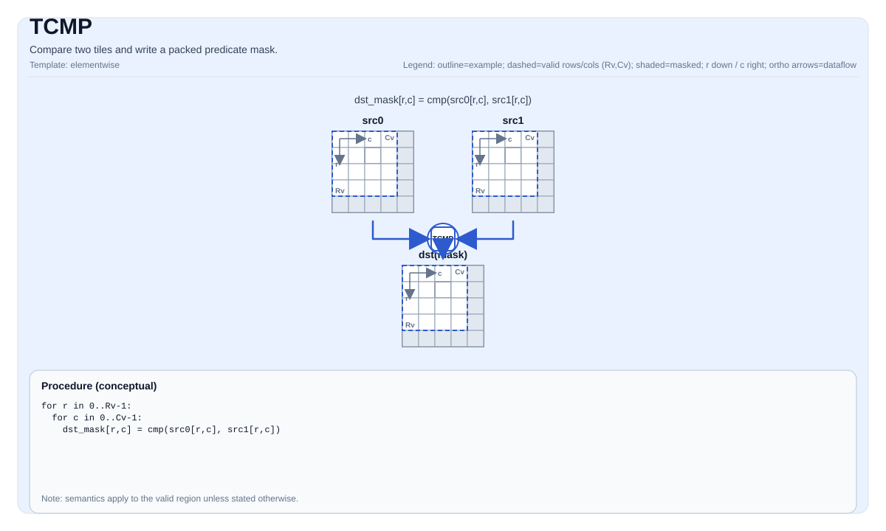

# TCMP

<!-- md-trans-meta sourceCommit=unknown translatedAt=2026-08-26T03:35:00.453Z pushedAt=2026-08-29T09:05:18.416Z -->

## Instruction Diagram



## Introduction

Compares two tiles and writes a packed predicate mask.

## Mathematical Semantics

Conceptually, for each element `(i, j)` in the valid region, a predicate is defined:

$$ p_{i,j} = \left(\mathrm{src0}_{i,j}\ \mathrm{cmpMode}\ \mathrm{src1}_{i,j}\right) $$

The predicate mask is stored in `dst` using an implementation-defined packed layout.

## Assembly Syntax

Synchronous form:

```text
%dst = tcmp %src0, %src1 {cmpMode = #pto.cmp<EQ>} : !pto.tile<...> -> !pto.tile<...>
```

### AS Level 1 (SSA)

```text
%dst = pto.tcmp %src0, %src1{cmpMode = #pto<cmp xx>}: (!pto.tile<...>, !pto.tile<...>) -> !pto.tile<...>
```

### AS Level 2 (DPS)

```text
pto.tcmp ins(%src0, %src1{cmpMode = #pto<cmp xx>}: !pto.tile_buf<...>, !pto.tile_buf<...>) outs(%dst : !pto.tile_buf<...>)
```

## C++ Built-in APIs

Declared in `include/pto/common/pto_instr.hpp` and `include/pto/common/type.hpp`:
> The public include header is `<pto/pto-inst.hpp>`, and the internal declaration is located in `pto/common/pto_instr.hpp`.

```cpp
template <typename TileDataDst, typename TileDataSrc, typename... WaitEvents>
PTO_INST RecordEvent TCMP(TileDataDst &dst, TileDataSrc &src0, TileDataSrc &src1, CmpMode cmpMode, WaitEvents &... events);
```

## Constraints

- **Implementation check (Atlas A2/A3 training products/Atlas A2/A3 inference products)**:
    - The input type must be one of the following: `int32_t`, `half`, `float`.
    - The output type must be `uint8_t`.
    - The `src0/src1/dst` tile position must be `TileType::Vec`.
    - Static valid bounds: `TileDataSrc::ValidRow <= TileDataSrc::Rows` and `TileDataSrc::ValidCol <= TileDataSrc::Cols`.
    - Runtime: `src0.GetValidRow() == dst.GetValidRow()` and `src0.GetValidCol() == dst.GetValidCol()`.
    - Note: The shape/validity of `src1` is not verified through explicit runtime assertions in this implementation.
    - For `TileDataSrc::DType == int32_t`, the implementation uses the `EQ` comparison path regardless of `cmpMode`.
- **Implementation check (Ascend 950PR/Ascend 950DT)**:
    - The input type must be one of the following: `uint32_t`, `int32_t`, `uint16_t`, `int16_t`, `uint8_t`, `int8_t`, `float`, `half`, `bfloat16_t`.
    - The output type must be `uint32_t`.
    - Implemented (see `include/pto/npu/a5/TCmp.hpp`).
    - The Ascend 950PR/Ascend 950DT implementation uses `dst.GetValidRow()` / `dst.GetValidCol()` as the iteration domain and writes the packed predicate mask to `dst` (the destination-defined packing scheme).
- **Mask encoding**:
    - The mask tile is interpreted as packed predicate bits in the destination-defined layout.

## Examples

### Automatic

```cpp
#include <pto/pto-inst.hpp>

using namespace pto;

void example_auto() {
  using SrcT = Tile<TileType::Vec, float, 16, 16>;
  using MaskT = Tile<TileType::Vec, uint8_t, 16, 32, BLayout::RowMajor, -1, -1>;
  SrcT src0, src1;
  MaskT mask(16, 2);
  TCMP(mask, src0, src1, CmpMode::GT);
}
```

### Manual

```cpp
#include <pto/pto-inst.hpp>

using namespace pto;

void example_manual() {
  using SrcT = Tile<TileType::Vec, float, 16, 16>;
  using MaskT = Tile<TileType::Vec, uint8_t, 16, 32, BLayout::RowMajor, -1, -1>;
  SrcT src0, src1;
  MaskT mask(16, 16);
  TASSIGN(src0, 0x1000);
  TASSIGN(src1, 0x2000);
  TASSIGN(mask, 0x3000);
  TCMP(mask, src0, src1, CmpMode::GT);
}
```

## ASM Examples

### Automatic Mode

```text
# Automatic mode: the compiler/runtime handles resource placement and scheduling.
%dst = pto.tcmp %src0, %src1{cmpMode = #pto<cmp xx>}: (!pto.tile<...>, !pto.tile<...>) -> !pto.tile<...>
```

### Manual Mode

```text
# Manual mode: explicitly bind resources first, then issue the instruction.
# Optional (when the instruction contains tile operands):
# pto.tassign %arg0, @tile(0x1000)
# pto.tassign %arg1, @tile(0x2000)
%dst = pto.tcmp %src0, %src1{cmpMode = #pto<cmp xx>}: (!pto.tile<...>, !pto.tile<...>) -> !pto.tile<...>
```

### PTO Assembly Form

```text
%dst = tcmp %src0, %src1 {cmpMode = #pto.cmp<EQ>} : !pto.tile<...> -> !pto.tile<...>
# AS Level 2 (DPS)
pto.tcmp ins(%src0, %src1{cmpMode = #pto<cmp xx>}: !pto.tile_buf<...>, !pto.tile_buf<...>) outs(%dst : !pto.tile_buf<...>)
```
