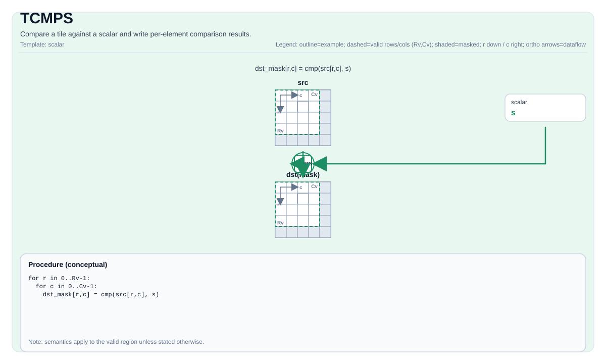

# TCMPS

<!-- md-trans-meta sourceCommit=unknown translatedAt=2026-08-26T03:35:49.574Z pushedAt=2026-08-29T09:05:18.418Z -->

## Instruction Diagram



## Introduction

Compares a tile with a **scalar** or the **first element of another tile**, and writes the element-wise comparison results.

Provides two overload forms:

- **Scalar form**: Compares each element of `src0` with a scalar value.
- **Tile form**: Compares each element of `src0` with the scalar from the first element of the `src1` tile.

## Mathematical Semantics

**Scalar form** — for each element `(i, j)` in the valid region:

$$ \mathrm{dst}_{i,j} = \left(\mathrm{src0}_{i,j}\ \mathrm{cmpMode}\ \mathrm{scalar}\right) $$

**Tile form** — for each element `(i, j)` in the valid region:

$$ \mathrm{dst}_{i,j} = \left(\mathrm{src0}_{i,j}\ \mathrm{cmpMode}\ \mathrm{src1}_{0,0}\right) $$

The encoding/type of `dst` is implementation-defined (a bit-packed mask tile, where each bit represents a comparison result).

## Assembly Syntax

Synchronous form:

```text
%dst = tcmps %src, %scalar {cmpMode = #pto<cmp xx>} : !pto.tile<...> -> !pto.tile<...>
```

### AS Level 1 (SSA)

```text
%dst = pto.tcmps %src, %scalar {cmpMode = #pto<cmp xx>} : (!pto.tile<...>, dtype) -> !pto.tile<...>
```

### AS Level 2 (DPS)

```text
pto.tcmps ins(%src, %scalar{cmpMode = #pto<cmp xx>}: !pto.tile_buf<...>, dtype) outs(%dst : !pto.tile_buf<...>)
```

## C++ Built-in APIs

Declared in `include/pto/common/pto_instr.hpp` and `include/pto/common/type.hpp`:
> The public include header is `<pto/pto-inst.hpp>`, and the internal declaration is located in `pto/common/pto_instr.hpp`.

**Scalar form** — compares a tile with a scalar:

```cpp
template <typename TileDataDst, typename TileDataSrc, typename... WaitEvents,
          std::enable_if_t<all_events_v<WaitEvents...>, int> = 0>
PTO_INST RecordEvent TCMPS(TileDataDst& dst, TileDataSrc& src0,
                           typename TileDataSrc::DType scalar, CmpMode mode,
                           WaitEvents&... events);
```

**Tile form** — compares a tile with another tile (broadcasting a scalar from `src1`):

```cpp
template <typename TileDataDst, typename TileDataSrc0, typename TileDataSrc1,
          typename... WaitEvents,
          std::enable_if_t<is_tile_data_v<TileDataSrc1> && all_events_v<WaitEvents...>, int> = 0>
PTO_INST RecordEvent TCMPS(TileDataDst& dst, TileDataSrc0& src0,
                           TileDataSrc1& src1, CmpMode mode,
                           WaitEvents&... events);
```

## Constraints

- **Implementation check (Atlas A2/A3 training products/Atlas A2/A3 inference products)**:
    - `TileData::DType` must be one of the following: `int32_t`, `float`, `half`, `uint16_t`, `int16_t`.
    - The tile layout must be row-major (`TileData::isRowMajor`).
    - When the input type is `int32_t`, only `CmpMode::EQ` is supported; other comparison modes fall back to `EQ`.
- **Implementation check (Ascend 950PR/Ascend 950DT)**:
    - `TileData::DType` must be one of the following: `int32_t`, `uint32_t`, `float`, `int16_t`, `uint16_t`, `half`, `uint8_t`, `int8_t`, `bfloat16_t`.
    - The tile layout must be row-major (`TileData::isRowMajor`).
- **General constraints**:
    - The tile positions of both `src` and `dst` must be vectors (`TileData::Loc == TileType::Vec`).
    - Static valid bounds: `TileData::ValidRow <= TileData::Rows` and `TileData::ValidCol <= TileData::Cols`.
    - Runtime: `src0` and `dst` must have the same number of valid rows and columns.
    - Data types: `src0` and `src1` must have the same data type.
- **Valid region**:
    - This operation uses `src0.GetValidRow()`/`src0.GetValidCol()` as the iteration domain.
- **Comparison mode**:
    - Supports `CmpMode::EQ`, `CmpMode::NE`, `CmpMode::LT`, `CmpMode::GT`, `CmpMode::LE`, and `CmpMode::GE` (note: on Atlas A2/A3 training products/Atlas A2/A3 inference products, when the input type is `int32_t`, only `CmpMode::EQ` is supported, and other modes fall back to `EQ`; Ascend 950PR/Ascend 950DT support all modes).

## Examples

### Automatic

```cpp
#include <pto/pto-inst.hpp>

using namespace pto;

void example_auto() {
  using SrcT = Tile<TileType::Vec, float, 16, 16>;
  using DstT = Tile<TileType::Vec, uint8_t, 16, 32, BLayout::RowMajor, -1, -1>;
  SrcT src;
  DstT dst(16, 2);
  TCMPS(dst, src, 0.0f, CmpMode::GT);
}
```

### Manual

```cpp
#include <pto/pto-inst.hpp>

using namespace pto;

void example_manual() {
  using SrcT = Tile<TileType::Vec, float, 16, 16>;
  using DstT = Tile<TileType::Vec, uint8_t, 16, 32, BLayout::RowMajor, -1, -1>;
  SrcT src;
  DstT dst(16, 2);
  TASSIGN(src, 0x1000);
  TASSIGN(dst, 0x2000);
  TCMPS(dst, src, 0.0f, CmpMode::GT);
}
```

### Tile Form (Compared with Another Tile)

```cpp
#include <pto/pto-inst.hpp>

using namespace pto;

void example_tile() {
  using SrcT = Tile<TileType::Vec, float, 16, 16>;
  using DstT = Tile<TileType::Vec, uint8_t, 16, 32, BLayout::RowMajor, -1, -1>;
  SrcT src0, src1;
  DstT dst(16, 2);
  // src1[0,0] serves as the comparison scalar.
  TCMPS(dst, src0, src1, CmpMode::GE);
}
```

## ASM Examples

### Automatic Mode

```text
# Automatic mode: the compiler/runtime handles resource placement and scheduling.
%dst = pto.tcmps %src, %scalar {cmpMode = #pto<cmp xx>} : (!pto.tile<...>, dtype) -> !pto.tile<...>
```

### Manual Mode

```text
# Manual mode: explicitly bind resources first, then issue the instruction.
# Optional (when the instruction contains tile operands):
# pto.tassign %arg0, @tile(0x1000)
# pto.tassign %arg1, @tile(0x2000)
%dst = pto.tcmps %src, %scalar {cmpMode = #pto<cmp xx>} : (!pto.tile<...>, dtype) -> !pto.tile<...>
```

### PTO Assembly Form

```text
%dst = tcmps %src, %scalar {cmpMode = #pto<cmp xx>} : !pto.tile<...> -> !pto.tile<...>
# AS Level 2 (DPS)
pto.tcmps ins(%src, %scalar{cmpMode = #pto<cmp xx>}: !pto.tile_buf<...>, dtype) outs(%dst : !pto.tile_buf<...>)
```
