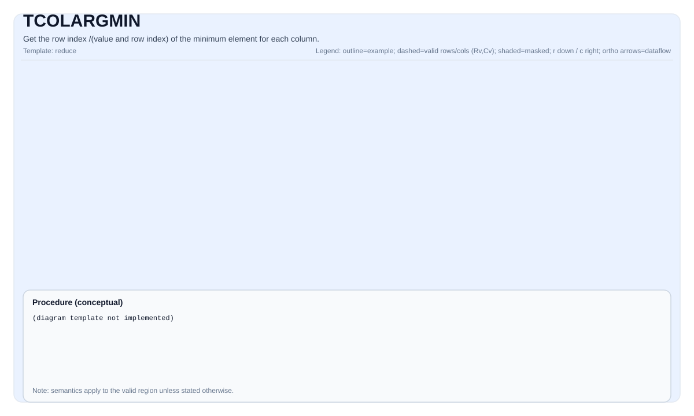

# TCOLARGMIN

<!-- md-trans-meta sourceCommit=unknown translatedAt=2026-08-26T03:37:54.169Z pushedAt=2026-08-29T09:05:18.418Z -->

## Instruction Diagram



## Introduction

Obtains the row index corresponding to the minimum value of each column. It also provides a value+index mode, which returns both the minimum value of each column and its row index.

## Mathematical Semantics

### Index-Only Mode

Assume `R = src.GetValidRow()` and `C = src.GetValidCol()`. For `0 <= j < C`:

$$ \mathrm{dstIdx}_{0,j} = \underset{0 \le i < R}{\operatorname{argmin}} \; \mathrm{src}_{i,j} $$

### Value + Index Mode

$$ \mathrm{dstVal}_{0,j} = \min_{0 \le i < R} \mathrm{src}_{i,j} $$

$$ \mathrm{dstIdx}_{0,j} = \underset{0 \le i < R}{\operatorname{argmin}} \; \mathrm{src}_{i,j} $$

## Assembly Syntax

### Index-Only Mode

Synchronous form:

```text
%dstIdx = tcolargmin %src : !pto.tile<...> -> !pto.tile<...>
```

IR level 1 (SSA):

```text
%dstIdx = pto.tcolargmin %src, %tmp : (!pto.tile<...>, !pto.tile<...>) -> !pto.tile<...>
```

IR level 2 (DPS):

```text
pto.tcolargmin ins(%src, %tmp : !pto.tile_buf<...>, !pto.tile_buf<...>) outs(%dstIdx : !pto.tile_buf<...>)
```

### Value + Index Mode

Synchronous form:

```text
%dstVal, %dstIdx = tcolargmin %src : !pto.tile<...> -> !pto.tile<...>, !pto.tile<...>
```

IR level 1 (SSA):

```text
%dstVal, %dstIdx = pto.tcolargmin %src, %tmp : (!pto.tile<...>, !pto.tile<...>) -> (!pto.tile<...>, !pto.tile<...>)
```

IR level 2 (DPS):

```text
pto.tcolargmin ins(%src, %tmp : !pto.tile_buf<...>, !pto.tile_buf<...>) outs(%dstVal, %dstIdx : !pto.tile_buf<...>, !pto.tile_buf<...>)
```

## C++ Built-in APIs

Declared in `include/pto/common/pto_instr.hpp`:
> The public include header is `<pto/pto-inst.hpp>`, and the internal declaration is located in `pto/common/pto_instr.hpp`.

### Index-Only Mode (3 Parameters)

```cpp
template <typename TileDataOut, typename TileDataIn, typename TileDataTmp, typename... WaitEvents>
PTO_INST RecordEvent TCOLARGMIN(TileDataOut &dst, TileDataIn &src, TileDataTmp &tmp, WaitEvents &...events)
```

### Value + Index Mode (4 Parameters)

```cpp
template <typename TileDataOutVal, typename TileDataOutIdx, typename TileDataIn, typename TileDataTmp,
          typename... WaitEvents>
PTO_INST RecordEvent TCOLARGMIN(TileDataOutVal& dstVal, TileDataOutIdx& dstIdx, TileDataIn& src, TileDataTmp& tmp,
                                WaitEvents&... events);
```

## Constraints

### General Constraints or Checks

- `dstIdx` and `src` must be `TileType::Vec`.
- `src` can use ND or DN non-fractal layout (`SLayout::NoneBox`).
- `dstIdx` must use the standard ND layout: row-major and non-fractal (`BLayout::RowMajor`, `SLayout::NoneBox`).
- Supported index destination element types: `uint32_t`, `int32_t`, `uint16_t`, `int16_t`.
- Runtime checks:
    - `src.GetValidRow() != 0`
    - `src.GetValidCol() != 0`
    - `dstIdx.GetValidRow() == 1`
    - `src.GetValidCol() == dstIdx.GetValidCol()`

### Index-Only Mode (3 Parameters)

#### Implementation Check for Atlas A2/A3 Training Products/Atlas A2/A3 Inference Products

- Supported source element types: `half`, `float`, `uint16_t`, `uint32_t`.
- The element type of `tmp` must match `src`.
- `tmp` is used as temporary storage for index tracking and the current comparison value.

#### Ascend 950PR/Ascend 950DT Implementation Check

- The supported source element width is 8-bit, 16-bit, or 32-bit, covering `int8_t`, `uint8_t`, `int16_t`, `uint16_t`, `int32_t`, `uint32_t`, `half`, and `float`.
- The API receives `tmp`, but the implementation does not actually use it.

### Value + Index Mode (4 Parameters)

In addition to the general constraints:

- `dstVal` must be `TileType::Vec`, using the standard ND layout (row-major, non-fractal).
- The `dstVal` element type must be consistent with the source element type `TileDataIn::DType`.
- 8-bit source types are **not supported**.
- Runtime checks:
    - `dstVal.GetValidRow() == 1`
    - `dstVal.GetValidCol() != 0`
    - `src.GetValidCol() == dstVal.GetValidCol()`
    - `dstVal.GetValidRow() == dstIdx.GetValidRow()`
    - `dstVal.GetValidCol() == dstIdx.GetValidCol()`

#### Implementation Check for Atlas A2/A3 Training Products/Atlas A2/A3 Inference Products

- Supported source element types: `half`, `float`, `uint16_t`, `uint32_t`.
- When the source element size is 2 bytes (`half`, `uint16_t`): the `dstIdx` element type must be `uint16_t` or `int16_t`.
- When the source element size is 4 bytes (`float`, `uint32_t`): the `dstIdx` element type must be `uint32_t` or `int32_t`.
- The element type of `tmp` must be consistent with `src`.
- `tmp` is used as temporary storage; for the half input type, the s16->f16->s32 conversion path is performed internally.

#### Ascend 950PR/Ascend 950DT Implementation Check

- The source element size must be 16-bit or 32-bit (`sizeof(T) != 1`).
- When the source element size is 2 bytes (`half`, `int16_t`, `uint16_t`): the `dstIdx` element type must be `uint16_t` or `int16_t`.
- When the source element size is 4 bytes (`float`, `int32_t`, `uint32_t`): the `dstIdx` element type must be `uint32_t` or `int32_t`.
- The API receives `tmp`, but the implementation does not actually use it.

### `tmp` Tile Description of Atlas A2/A3 Training Products/Atlas A2/A3 Inference Products

- In the implementation of Atlas A2/A3 training products/Atlas A2/A3 inference products, `tmp` **is always used**, but the extent of usage depends on the source element type and mode:

  | Source Type | Mode | Region 0 (Row Index) | Region 1 (Comparison Value) | Region 2 (argmin Index) |
  |---|---|---|---|---|
  | `half` | Index-only | `tmp` | `tmp` | `tmp` |
  | `half` | Value+index | `tmp` | `tmp` | `dstIdx` |
  | `float` | Index-only | `tmp` | `dstIdx` | `dstIdx` |
  | `float` | Value+index | `tmp` | `dstIdx` | `dstIdx` |

- The data type of the `tmp` tile must be consistent with that of `src`.
- The `tmp` tile is divided into up to three regions within a single row:
  - Region 0 (`[0, tmpGapEles)`): current row index counter (incremented per row). It is always stored in `tmp`.
  - Region 1 (`[tmpGapEles, 2 * tmpGapEles)`): current minimum element, used for comparison. For the `half` type, it is stored in `tmp`; for the `float` type, it is stored in `dstIdx`.
  - Region 2 (`[2 * tmpGapEles, 3 * tmpGapEles)`): argmin index result. It is stored in `tmp` only in the `half` + index-only mode; in other cases, it is stored in `dstIdx`.
- Determination of `tmpGapEles`:
  - When `srcValidCol >= elemPerRpt`: `tmpGapEles = elemPerRpt`.
  - When `srcValidCol < elemPerRpt`: `tmpGapEles = ceil(srcValidCol / elemPerBlock) * elemPerBlock`.
- For `half` + index-only mode (the case where `tmp` usage is the largest), when `src` is small, you can directly set the `tmp` tile size to be the same as `src`; you can also calculate the required stride of the `tmp` tile using the following formula:

  ```text
  repeats = ceil(validCol / elementPerRepeat)
  stride = ceil(repeats * 2 / elementPerBlock) * elementPerBlock + ceil(repeats / elementPerBlock) * elementPerBlock
  ```

  For other type/mode combinations, only region 0 is needed in `tmp`, so the `tmp` stride only needs to be `tmpGapEles`.

- In index-only mode, if the input is of type `half`, the data in region 2 of `tmp` is converted through s16->f16->s32 before being written to `dstIdx`.

### Ascend 950PR/Ascend 950DT `tmp` Tile Description

- In the Ascend 950PR/Ascend 950DT implementation, the `tmp` tile **is not used in either mode**. Ascend 950PR/Ascend 950DT uses a vector-register-based computation method (`__VEC_SCOPE__`) and does not require temporary tile storage.
- `tmp` is retained in the C++ built-in API signature only for API compatibility with Atlas A2/A3 training products/Atlas A2/A3 inference products.

## Examples

### Index-Only Mode

#### Automatic

```cpp
#include <pto/pto-inst.hpp>

using namespace pto;

void example_auto() {
  using SrcT = Tile<TileType::Vec, float, 16, 256, BLayout::RowMajor, -1, -1>;
  using DstT = Tile<TileType::Vec, uint32_t, 1, 256, BLayout::RowMajor, -1, -1>;
  using TmpT = Tile<TileType::Vec, float, 1, 32, BLayout::RowMajor, -1, -1>;
  SrcT src(16, 255);
  DstT dst(1, 255);
  TmpT tmp(1, 32);
  TCOLARGMIN(dst, src, tmp);
}
```

#### Manual

```cpp
#include <pto/pto-inst.hpp>

using namespace pto;

void example_manual() {
  using SrcT = Tile<TileType::Vec, float, 16, 256, BLayout::RowMajor, -1, -1>;
  using DstT = Tile<TileType::Vec, uint32_t, 1, 256, BLayout::RowMajor, -1, -1>;
  using TmpT = Tile<TileType::Vec, float, 1, 32, BLayout::RowMajor, -1, -1>;
  SrcT src(16, 255);
  DstT dst(1, 255);
  TmpT tmp(1, 32);
  TASSIGN(src, 0x0);
  TASSIGN(dst, 0x1000);
  TASSIGN(tmp, 0x2000);
  TCOLARGMIN(dst, src, tmp);
}
```

### Value + Index Mode

#### Automatic

```cpp
#include <pto/pto-inst.hpp>

using namespace pto;

void example_auto_val_idx() {
  using SrcT = Tile<TileType::Vec, float, 16, 256, BLayout::RowMajor, -1, -1>;
  using DstValT = Tile<TileType::Vec, float, 1, 256, BLayout::RowMajor, -1, -1>;
  using DstIdxT = Tile<TileType::Vec, int32_t, 1, 256, BLayout::RowMajor, -1, -1>;
  using TmpT = Tile<TileType::Vec, float, 1, 32, BLayout::RowMajor, -1, -1>;
  SrcT src(16, 255);
  DstValT dstVal(1, 255);
  DstIdxT dstIdx(1, 255);
  TmpT tmp(1, 32);
  TCOLARGMIN(dstVal, dstIdx, src, tmp);
}
```

#### Manual

```cpp
#include <pto/pto-inst.hpp>

using namespace pto;

void example_manual_val_idx() {
  using SrcT = Tile<TileType::Vec, float, 16, 256, BLayout::RowMajor, -1, -1>;
  using DstValT = Tile<TileType::Vec, float, 1, 256, BLayout::RowMajor, -1, -1>;
  using DstIdxT = Tile<TileType::Vec, int32_t, 1, 256, BLayout::RowMajor, -1, -1>;
  using TmpT = Tile<TileType::Vec, float, 1, 32, BLayout::RowMajor, -1, -1>;
  SrcT src(16, 255);
  DstValT dstVal(1, 255);
  DstIdxT dstIdx(1, 255);
  TmpT tmp(1, 32);
  TASSIGN(src, 0x0);
  TASSIGN(dstVal, 0x1000);
  TASSIGN(dstIdx, 0x2000);
  TASSIGN(tmp, 0x3000);
  TCOLARGMIN(dstVal, dstIdx, src, tmp);
}
```

## ASM Examples

### Index-Only Automatic Mode

```text
# Automatic mode: the compiler/runtime is responsible for resource placement and scheduling.
%dstIdx = pto.tcolargmin %src, %tmp : (!pto.tile<...>, !pto.tile<...>) -> !pto.tile<...>
```

### Index-Only Manual Mode

```text
# Manual mode: explicitly bind resources first, then issue the instruction.
# pto.tassign %arg0, @tile(0x1000)
# pto.tassign %arg1, @tile(0x2000)
%dstIdx = pto.tcolargmin %src, %tmp : (!pto.tile<...>, !pto.tile<...>) -> !pto.tile<...>
```

### Value + Index Automatic Mode

```text
# Automatic mode: the compiler/runtime handles resource placement and scheduling.
%dstVal, %dstIdx = pto.tcolargmin %src, %tmp : (!pto.tile<...>, !pto.tile<...>) -> (!pto.tile<...>, !pto.tile<...>)
```

### Value + Index Manual Mode

```text
# Manual mode: explicitly bind resources first, then emit the instruction.
# pto.tassign %arg0, @tile(0x1000)
# pto.tassign %arg1, @tile(0x2000)
# pto.tassign %arg2, @tile(0x3000)
%dstVal, %dstIdx = pto.tcolargmin %src, %tmp : (!pto.tile<...>, !pto.tile<...>) -> (!pto.tile<...>, !pto.tile<...>)
```

### PTO Assembly Form

```text
# Index only.
%dstIdx = tcolargmin %src : !pto.tile<...> -> !pto.tile<...>
# Value + index.
%dstVal, %dstIdx = tcolargmin %src : !pto.tile<...> -> !pto.tile<...>, !pto.tile<...>

# IR level 2 (DPS) - index only.
pto.tcolargmin ins(%src, %tmp : !pto.tile_buf<...>, !pto.tile_buf<...>) outs(%dstIdx : !pto.tile_buf<...>)

# IR level 2 (DPS) - value + index.
pto.tcolargmin ins(%src, %tmp : !pto.tile_buf<...>, !pto.tile_buf<...>) outs(%dstVal, %dstIdx : !pto.tile_buf<...>, !pto.tile_buf<...>)
```
