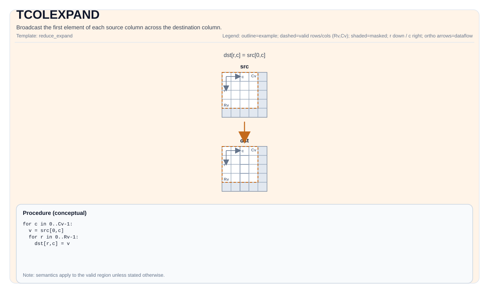

# TCOLEXPAND

<!-- md-trans-meta sourceCommit=unknown translatedAt=2026-08-26T03:39:19.906Z pushedAt=2026-08-29T09:05:18.419Z -->

## Instruction Diagram



## Introduction

Broadcasts the first element of each source column into the destination column.

## Mathematical Semantics

Assume `R = dst.GetValidRow()` and `C = dst.GetValidCol()`. For `0 <= i < R` and `0 <= j < C`:

$$ \mathrm{dst}_{i,j} = \mathrm{src}_{0,j} $$

## Assembly Syntax

Synchronous form:

```text
%dst = tcolexpand %src : !pto.tile<...> -> !pto.tile<...>
```

### AS Level 1 (SSA)

```text
%dst = pto.tcolexpand %src : !pto.tile<...> -> !pto.tile<...>
```

### AS Level 2 (DPS)

```text
pto.tcolexpand ins(%src : !pto.tile_buf<...>) outs(%dst : !pto.tile_buf<...>)
```

## C++ Built-in APIs

Declared in `include/pto/common/pto_instr.hpp`:
> The public include header is `<pto/pto-inst.hpp>`, and the internal declaration is located in `pto/common/pto_instr.hpp`.

```cpp
template <typename TileDataDst, typename TileDataSrc, typename... WaitEvents>
PTO_INST RecordEvent TCOLEXPAND(TileDataDst &dst, TileDataSrc &src, WaitEvents &... events);
```

## Constraints

- This operation iterates over `dst.GetValidRow()`/`dst.GetValidCol()`.
- **Implementation check (Atlas A2/A3 training products/Atlas A2/A3 inference products/Ascend 950PR/Ascend 950DT)**: `TileData::DType` must be a 1-, 2-, or 4-byte type (b8/b16/b32): `int8_t`, `uint8_t`, `int16_t`, `uint16_t`, `int32_t`, `uint32_t`, `half`, `bfloat16_t`, `float`.

## Examples

```cpp
#include <pto/pto-inst.hpp>

using namespace pto;

void example() {
  using TileT = Tile<TileType::Vec, float, 16, 16>;
  TileT src, dst;
  TCOLEXPAND(dst, src);
}
```

## ASM Examples

### Automatic Mode

```text
# Automatic mode: the compiler/runtime handles resource placement and scheduling.
%dst = pto.tcolexpand %src : !pto.tile<...> -> !pto.tile<...>
```

### Manual Mode

```text
# Manual mode: explicitly bind resources first, then issue the instruction.
# Optional (when the instruction contains tile operands):
# pto.tassign %arg0, @tile(0x1000)
# pto.tassign %arg1, @tile(0x2000)
%dst = pto.tcolexpand %src : !pto.tile<...> -> !pto.tile<...>
```

### PTO Assembly Form

```text
%dst = tcolexpand %src : !pto.tile<...> -> !pto.tile<...>
# AS Level 2 (DPS)
pto.tcolexpand ins(%src : !pto.tile_buf<...>) outs(%dst : !pto.tile_buf<...>)
```
