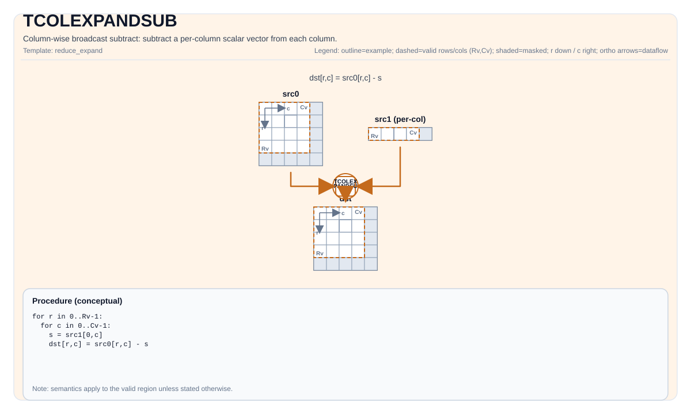

# TCOLEXPANDSUB

<!-- md-trans-meta sourceCommit=unknown translatedAt=2026-08-26T03:47:55.972Z pushedAt=2026-08-29T09:05:18.423Z -->

## Instruction Diagram



## Introduction

Column broadcast subtraction: subtracts a per-column scalar vector from each column.

## Mathematical Semantics

Assume `R = dst.GetValidRow()` and `C = dst.GetValidCol()`. Assume that `s_j` is the per-column scalar obtained from `src1` (one value per column).

For `0 <= i < R` and `0 <= j < C`:

$$
\mathrm{dst}_{i,j} = \mathrm{src0}_{i,j} - s_j
$$

## Assembly Syntax

Synchronous form:

```text
%dst = tcolexpandsub %src0, %src1 : !pto.tile<...>, !pto.tile<...> -> !pto.tile<...>
```

### AS Level 1 (SSA)

```text
%dst = pto.tcolexpandsub %src0, %src1 : !pto.tile<...>, !pto.tile<...> -> !pto.tile<...>
```

### AS Level 2 (DPS)

```text
pto.tcolexpandsub ins(%src0, %src1 : !pto.tile_buf<...>, !pto.tile_buf<...>) outs(%dst : !pto.tile_buf<...>)
```

## C++ Built-in APIs

Declared in `include/pto/common/pto_instr.hpp`:
> The public include header is `<pto/pto-inst.hpp>`, and the internal declaration is located in `pto/common/pto_instr.hpp`.

```cpp
template <typename TileDataDst, typename TileDataSrc0, typename TileDataSrc1, typename... WaitEvents>
PTO_INST RecordEvent TCOLEXPANDSUB(TileDataDst &dst, TileDataSrc0 &src0, TileDataSrc1 &src1, WaitEvents &... events);
```

## Constraints

- `TileDataDst::DType` and `TileDataSrc1::DType` must be one of the following: `half`, `float`, `int16`, `int32` (for Atlas A2 training products/Atlas A2 inference products, Atlas A3 training products/Atlas A3 inference products, and Ascend 950PR/Ascend 950DT), `uint16`, `uint32`, `bfloat16_t`, `int8`, `uint8` (for Ascend 950PR/Ascend 950DT).
- Tile shape/layout constraint (compile time): `TileDataDst::isRowMajor`.
- `src1` is expected to provide **one scalar per column** (that is, its effective shape must cover `C` values).
- The exact layout/fractal constraints are destination-specific; see the backend headers under `include/pto/npu/*/TColExpand*.hpp`.

## Examples

See the related examples in `docs/isa/` and `docs/coding/tutorials/`.

## ASM Examples

### Automatic Mode

```text
# Automatic mode: the compiler/runtime handles resource placement and scheduling.
%dst = pto.tcolexpandsub %src0, %src1 : !pto.tile<...>, !pto.tile<...> -> !pto.tile<...>
```

### Manual Mode

```text
# Manual mode: explicitly bind resources first, then issue the instruction.
# Optional (when the instruction contains tile operands):
# pto.tassign %arg0, @tile(0x1000)
# pto.tassign %arg1, @tile(0x2000)
%dst = pto.tcolexpandsub %src0, %src1 : !pto.tile<...>, !pto.tile<...> -> !pto.tile<...>
```

### PTO Assembly Form

```text
%dst = tcolexpandsub %src0, %src1 : !pto.tile<...>, !pto.tile<...> -> !pto.tile<...>
# AS Level 2 (DPS)
pto.tcolexpandsub ins(%src0, %src1 : !pto.tile_buf<...>, !pto.tile_buf<...>) outs(%dst : !pto.tile_buf<...>)
```
