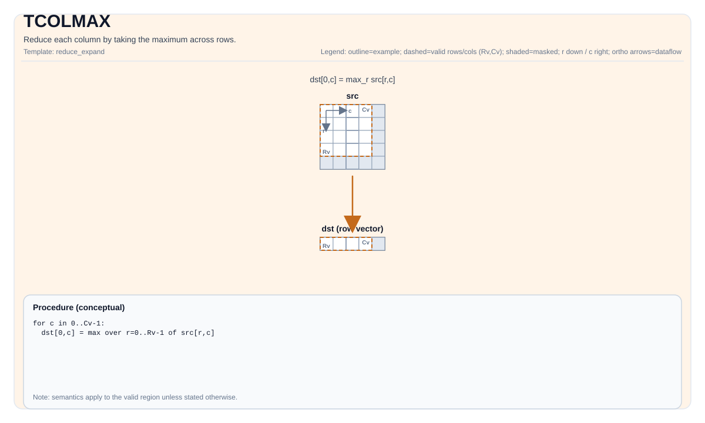

# TCOLMAX

<!-- md-trans-meta sourceCommit=unknown translatedAt=2026-08-26T03:48:05.147Z pushedAt=2026-08-29T09:05:18.424Z -->

## Instruction Diagram



## Introduction

Reduces each column by taking the maximum value across rows.

## Mathematical Semantics

Assume `R = src.GetValidRow()` and `C = src.GetValidCol()`. For `0 <= j < C`:

$$ \mathrm{dst}_{0,j} = \max_{0 \le i < R} \mathrm{src}_{i,j} $$

## Assembly Syntax

Synchronous form:

```text
%dst = tcolmax %src : !pto.tile<...> -> !pto.tile<...>
```

### AS Level 1 (SSA)

```text
%dst = pto.tcolmax %src : !pto.tile<...> -> !pto.tile<...>
```

### AS Level 2 (DPS)

```text
pto.tcolmax ins(%src : !pto.tile_buf<...>) outs(%dst : !pto.tile_buf<...>)
```

## C++ Built-in APIs

Declared in `include/pto/common/pto_instr.hpp`:
> The public include header is `<pto/pto-inst.hpp>`, and the internal declaration is located in `pto/common/pto_instr.hpp`.

```cpp
template <typename TileDataOut, typename TileDataIn, typename... WaitEvents>
PTO_INST RecordEvent TCOLMAX(TileDataOut &dst, TileDataIn &src, WaitEvents &... events);
```

## Constraints

### General Constraints or Checks

- `dst` and `src` must be `TileType::Vec`.
- `dst` and `src` must use the standard ND layout: row-major and non-fractal (`BLayout::RowMajor`, `SLayout::NoneBox`).
- `dst` and `src` must have the same element type.
- Runtime checks:
    - `src.GetValidCol() == dst.GetValidCol()`
- If `src.GetValidRow() == 0` or `src.GetValidCol() == 0`, the implementation returns directly.

### Implementation Check for Atlas A2/A3 Training Products/Atlas A2/A3 Inference Products

- Supported element types: `half`, `float`, `int16_t`, `int32_t`.

### Ascend 950PR/Ascend 950DT Implementation Check

- Supported element types: `half`, `float`, `int8_t`, `uint8_t`, `int16_t`, `uint16_t`, `int32_t`, `uint32_t`, `bfloat16_t`.

## Examples

### Automatic

```cpp
#include <pto/pto-inst.hpp>

using namespace pto;

void example_auto() {
  using SrcT = Tile<TileType::Vec, float, 16, 16>;
  using DstT = Tile<TileType::Vec, float, 1, 16>;
  SrcT src;
  DstT dst;
  TCOLMAX(dst, src);
}
```

### Manual

```cpp
#include <pto/pto-inst.hpp>

using namespace pto;

void example_manual() {
  using SrcT = Tile<TileType::Vec, float, 16, 16>;
  using DstT = Tile<TileType::Vec, float, 1, 16>;
  SrcT src;
  DstT dst;
  TASSIGN(src, 0x1000);
  TASSIGN(dst, 0x2000);
  TCOLMAX(dst, src);
}
```

## ASM Examples

### Automatic Mode

```text
# Automatic mode: the compiler/runtime is responsible for resource placement and scheduling.
%dst = pto.tcolmax %src : !pto.tile<...> -> !pto.tile<...>
```

### Manual Mode

```text
# Manual mode: explicitly bind resources first, then issue the instruction.
# Optional (when the instruction contains tile operands):
# pto.tassign %arg0, @tile(0x1000)
# pto.tassign %arg1, @tile(0x2000)
%dst = pto.tcolmax %src : !pto.tile<...> -> !pto.tile<...>
```

### PTO Assembly Form

```text
%dst = tcolmax %src : !pto.tile<...> -> !pto.tile<...>
# AS Level 2 (DPS)
pto.tcolmax ins(%src : !pto.tile_buf<...>) outs(%dst : !pto.tile_buf<...>)
```
