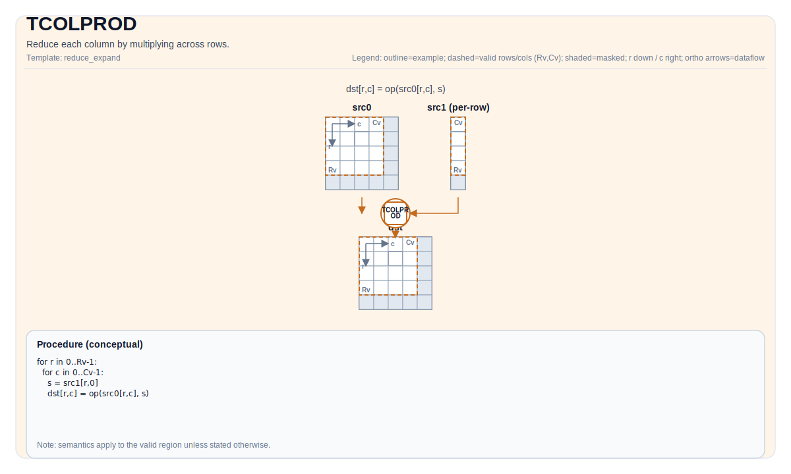

# TCOLPROD

## 指令示意图



## 简介

通过跨行乘积来归约每一列。

## 数学语义

Let `R = src.GetValidRow()` and `C = src.GetValidCol()`. For `0 <= j < C`:

$$ \mathrm{dst}_{0,j} = \prod_{i=0}^{R-1} \mathrm{src}_{i,j} $$

## 汇编语法

PTO-AS 形式：参见 [PTO-AS Specification](../assembly/PTO-AS.md).

同步形式：

```text
%dst = tcolprod %src : !pto.tile<...> -> !pto.tile<...>
```

### AS Level 1 (SSA)

```text
%dst = pto.tcolprod %src : !pto.tile<...> -> !pto.tile<...>
```

### AS Level 2 (DPS)

```text
pto.tcolprod ins(%src : !pto.tile_buf<...>) outs(%dst : !pto.tile_buf<...>)
```

### AS Level 1（SSA）

```text
%dst = pto.tcolprod %src : !pto.tile<...> -> !pto.tile<...>
```

### AS Level 2（DPS）

```text
pto.tcolprod ins(%src : !pto.tile_buf<...>) outs(%dst : !pto.tile_buf<...>)
```

## C++ 内建接口

声明于 `include/pto/common/pto_instr.hpp`:

```cpp
template <typename TileDataOut, typename TileDataIn, typename... WaitEvents>
PTO_INST RecordEvent TCOLPROD(TileDataOut &dst, TileDataIn &src, WaitEvents &... events);
```

## 约束

实现检查 (NPU):

- Tile location: `dst` and `src` must be `TileType::Vec`.
- Tile 布局: both tiles must be ND fractal (`isRowMajor` and `SLayout::NoneBox`).
- 数据类型一致性: `dst.DType == src.DType`.
- Supported `src.DType`:
    - A2A3: `half`, `float`, `int16_t`, `int32_t`.
    - A5: `half`, `float`, `bfloat16`, `int16_t`, `int32_t`, `uint16_t`, `uint32_t`.
- 运行期有效区域检查:
    - `src.GetValidCol() == dst.GetValidCol()`.
    - If `src.GetValidRow() == 0` or `src.GetValidCol() == 0`, the implementation returns early.

## 示例

### 自动（Auto）

```cpp
#include <pto/pto-inst.hpp>

using namespace pto;

void example_auto() {
  using SrcT = Tile<TileType::Vec, float, 16, 16>;
  using DstT = Tile<TileType::Vec, float, 1, 16>;
  SrcT src;
  DstT dst;
  TCOLPROD(dst, src);
}
```

### 手动（Manual）

```cpp
#include <pto/pto-inst.hpp>

using namespace pto;

void example_manual() {
  using SrcT = Tile<TileType::Vec, float, 16, 16>;
  using DstT = Tile<TileType::Vec, float, 1, 16>;
  SrcT src;
  DstT dst;
  TASSIGN(src, 0x1000);
  TASSIGN(dst, 0x2000);
  TCOLPROD(dst, src);
}
```
