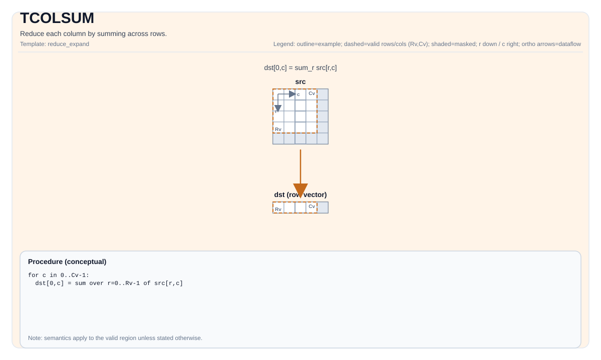

# TCOLSUM

<!-- md-trans-meta sourceCommit=unknown translatedAt=2026-08-26T03:50:57.346Z pushedAt=2026-08-29T09:05:18.426Z -->

## Instruction Diagram



## Introduction

Reduces each column by summing its rows.

## Mathematical Semantics

Assume `R = src.GetValidRow()` and `C = src.GetValidCol()`. For `0 <= j < C`:

$$ \mathrm{dst}_{0,j} = \sum_{i=0}^{R-1} \mathrm{src}_{i,j} $$

`isBinary` selects the implementation path (binary tree accumulation vs. sequential accumulation).

## Assembly Syntax

Synchronous form:

```text
%dst = tcolsum %src {isBinary = false} : !pto.tile<...> -> !pto.tile<...>
```

Rank reduction may introduce an internal temporary tile; the C++ built-in APIs require an explicit `tmp` operand.

### AS Level 1 (SSA)

```text
%dst = pto.tcolsum %src : !pto.tile<...> -> !pto.tile<...>
%dst = pto.tcolsum %src, %tmp {isBinary = false} : (!pto.tile<...>, !pto.tile<...>) -> !pto.tile<...>
```

### AS Level 2 (DPS)

```text
pto.tcolsum ins(%src : !pto.tile_buf<...>) outs(%dst : !pto.tile_buf<...>)
pto.tcolsum ins(%src, %tmp {isBinary = false} : !pto.tile_buf<...>, !pto.tile_buf<...>) outs(%dst : !pto.tile_buf<...>)
```

## C++ Built-in APIs

Declared in `include/pto/common/pto_instr.hpp`:
> The public include header is `<pto/pto-inst.hpp>`, and the internal declaration is located in `pto/common/pto_instr.hpp`.

```cpp
template <typename TileDataOut, typename TileDataIn, typename... WaitEvents>
PTO_INST RecordEvent TCOLSUM(TileDataOut &dst, TileDataIn &src, WaitEvents &... events);

template <typename TileDataOut, typename TileDataIn, typename TileDataTmp, typename... WaitEvents>
PTO_INST RecordEvent TCOLSUM(TileDataOut &dst, TileDataIn &src, TileDataTmp &tmp, bool isBinary, WaitEvents &... events);
```

## Constraints

### General Constraints or Checks

- `dst` and `src` must be `TileType::Vec`.
- `dst` and `src` must use the standard ND layout: row-major and non-fractal (`BLayout::RowMajor`, `SLayout::NoneBox`).
- `dst` and `src` must have the same element type.
- Runtime checks:
    - `src.GetValidCol() == dst.GetValidCol()`
    - `src.GetValidRow() != 0` (when it is zero, the implementation returns silently without performing computation)
    - `src.GetValidCol() != 0` (when it is zero, the implementation returns silently without performing computation)
    - `src.GetValidCol()` must not be greater than the `tmp` row stride in terms of `src` elements (that is, `tmp.RowStride * sizeof(TmpDType) / sizeof(DType) >= src.GetValidCol()`)
- `isBinary` selects the checked backend path:
    - `true`: uses `tmp` for binary tree accumulation
    - `false`: performs sequential accumulation directly on `dst`

### Implementation Check for Atlas A2/A3 Training Products/Atlas A2/A3 Inference Products

- Supported element types: `half`, `float`, `int16_t`, `int32_t`.
- `tmp` must be `TileType::Vec` and use the standard ND layout: row-major and non-fractal (`BLayout::RowMajor`, `SLayout::NoneBox`).
- The element type of `tmp` must be consistent with that of `src` and `dst`.
- If `src.GetValidRow() == 0` or `src.GetValidCol() == 0`, the implementation returns directly.

### Ascend 950PR/Ascend 950DT Implementation Check

- The element types allowed by the Ascend 950PR/Ascend 950DT shared column reduction check are: `half`, `float`, `int8_t`, `uint8_t`, `int16_t`, `uint16_t`, `int32_t`, `uint32_t`, `bfloat16_t`.
- In the checked Ascend 950PR/Ascend 950DT `TCOLSUM` path, `tmp` is still used only for the binary accumulation path; `TCOLSUM_IMPL` does not add any additional explicit compile-time type/layout assertion for `tmp`.

## Temporary Space

### Without `tmp` (2-Parameter Overload: `TCOLSUM(dst, src)`)

No `tmp` is required. Atlas A2/A3 training products/Atlas A2/A3 inference products and Ascend 950PR/Ascend 950DT all use sequential accumulation directly on `dst`.

### With `tmp` and `isBinary` (4-Parameter Overload: `TCOLSUM(dst, src, tmp, isBinary)`)

#### Atlas A2/A3 Training Products/Atlas A2/A3 Inference Products

- When `isBinary = true`: `tmp` **is used** for binary tree accumulation. Adjacent row pairs in `src` are summed into `tmp`, and then `tmp` is recursively halved until only a single row remains.
  - `tmp` must have the same element type as `src`/`dst`.
  - `tmp` must be `TileType::Vec`, row-major, and non-fractal.
  - `tmp.GetValidCol() >= src.GetValidCol()` (in elements, considering the `tmp` stride).
  - `tmp` requires at least `ceil(src.GetValidRow() / 2)` rows.
- When `isBinary = false`: `tmp` is accepted but the implementation uses sequential accumulation directly on `dst`; `tmp` is not actively used.

#### Ascend 950PR/Ascend 950DT

- When `isBinary = true`: `tmp` **is used** for binary tree accumulation based on vector registers (using UB storage).
  - `tmp` must have the same element type as `src`/`dst`.
  - `tmp.GetValidCol() >= src.GetValidCol()` (in terms of element count, considering the `tmp` stride).
  - `tmp` requires at least `ceil(src.GetValidRow() / 2)` rows.
- When `isBinary = false`: `tmp` is not actively used; the implementation uses sequential reduction through `TColReduceInstr`.

## Examples

### Automatic

```cpp
#include <pto/pto-inst.hpp>

using namespace pto;

void example_auto() {
  using SrcT = Tile<TileType::Vec, float, 16, 16>;
  using DstT = Tile<TileType::Vec, float, 1, 16>;
  using TmpT = Tile<TileType::Vec, float, 16, 16>;
  SrcT src;
  DstT dst;
  TmpT tmp;
  TCOLSUM(dst, src, tmp, /*isBinary=*/false);
}
```

### Manual

```cpp
#include <pto/pto-inst.hpp>

using namespace pto;

void example_manual() {
  using SrcT = Tile<TileType::Vec, float, 16, 16>;
  using DstT = Tile<TileType::Vec, float, 1, 16>;
  using TmpT = Tile<TileType::Vec, float, 16, 16>;
  SrcT src;
  DstT dst;
  TmpT tmp;
  TASSIGN(src, 0x1000);
  TASSIGN(dst, 0x2000);
  TASSIGN(tmp, 0x3000);
  TCOLSUM(dst, src, tmp, /*isBinary=*/false);
}
```

## ASM Examples

### Automatic Mode

```text
# Automatic mode: the compiler/runtime handles resource placement and scheduling.
%dst = pto.tcolsum %src : !pto.tile<...> -> !pto.tile<...>
```

### Manual Mode

```text
# Manual mode: explicitly bind resources first, then issue the instruction.
# Optional (when the instruction contains tile operands):
# pto.tassign %arg0, @tile(0x1000)
# pto.tassign %arg1, @tile(0x2000)
%dst = pto.tcolsum %src : !pto.tile<...> -> !pto.tile<...>
```

### PTO Assembly Form

```text
%dst = tcolsum %src {isBinary = false} : !pto.tile<...> -> !pto.tile<...>
# AS Level 2 (DPS)
pto.tcolsum ins(%src : !pto.tile_buf<...>) outs(%dst : !pto.tile_buf<...>)
```
