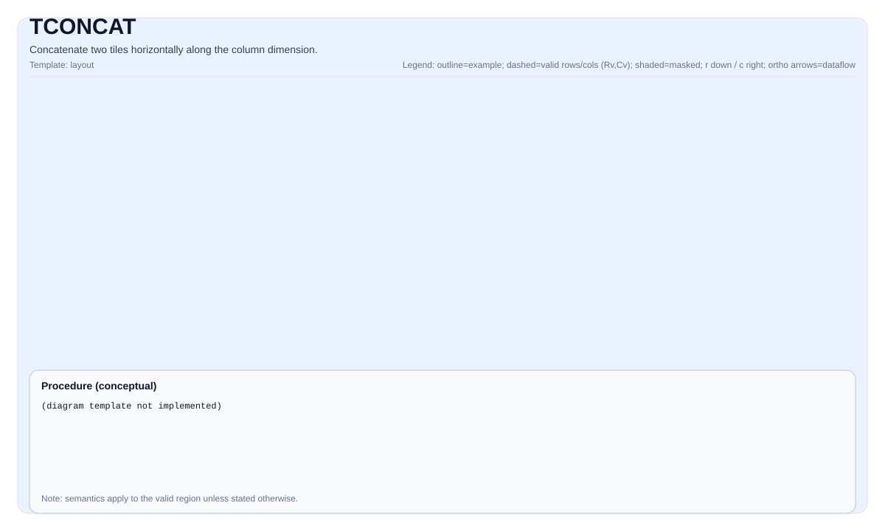

# TCONCAT

<!-- md-trans-meta sourceCommit=unknown translatedAt=2026-08-26T03:51:03.110Z pushedAt=2026-08-29T09:05:18.426Z -->

## Tile Operation Diagram

### Basic Form (3 Parameters)



### Indexed Form (5-6 Parameters)


## Introduction

Concatenates two source tiles (`src0` and `src1`) into the destination tile (`dst`) horizontally along the column dimension. Each row of `dst` contains the concatenated result of the corresponding rows from `src0` and `src1`.

`TCONCAT` is used to:

- Concatenate two tiles along the column axis (horizontal concatenation).
- Concatenate tiles in attention and transformer architectures (for example, concatenating KV cache entries).
- Merge partial results from split operations.

## Mathematical Semantics

For each row `i` in the valid region:

$$ \mathrm{dst}_{i, j} = \begin{cases} \mathrm{src0}_{i, j} & \text{if } 0 \le j < \mathrm{validCols0} \\ \mathrm{src1}_{i, j - \mathrm{validCols0}} & \text{if } \mathrm{validCols0} \le j < \mathrm{validCols0} + \mathrm{validCols1} \end{cases} $$

Where `validCols0 = src0.GetValidCol()` and `validCols1 = src1.GetValidCol()`.

## Assembly Syntax

### AS Level 1 (SSA)

```text
%dst = pto.tconcat %src0, %src1 : (!pto.tile<...>, !pto.tile<...>) -> !pto.tile<...>
```

### AS Level 2 (DPS)

```text
pto.tconcat ins(%src0, %src1 : !pto.tile_buf<...>, !pto.tile_buf<...>) outs(%dst : !pto.tile_buf<...>)
```

## C++ Built-in APIs

Declared in `include/pto/common/pto_instr.hpp`:
> The public include header is `<pto/pto-inst.hpp>`, and the internal declaration is located in `pto/common/pto_instr.hpp`.

```cpp
template <typename TileDst, typename TileSrc0, typename TileSrc1, typename... WaitEvents>
PTO_INST RecordEvent TCONCAT(TileDst &dst, TileSrc0 &src0, TileSrc1 &src1, WaitEvents &... events);

template <typename TileDst, typename TileSrc0, typename TileSrc1, typename TileSrc0Idx, typename TileSrc1Idx, typename... WaitEvents>
PTO_INST RecordEvent TCONCAT(TileDst &dst, TileSrc0 &src0, TileSrc1 &src1, TileSrc0Idx &src0Idx, TileSrc1Idx &src1Idx, WaitEvents &... events);

template <typename TileDst, typename TileSrc0, typename TileSrc1, typename TileDstIdx, typename TileSrc0Idx, typename TileSrc1Idx, typename... WaitEvents>
PTO_INST RecordEvent TCONCAT(TileDst &dst, TileSrc0 &src0, TileSrc1 &src1, TileDstIdx &dstIdx, TileSrc0Idx &src0Idx, TileSrc1Idx &src1Idx, WaitEvents &... events);
```

## Constraints

### General Constraints/Checks

- `TCONCAT` has three overload variants:
    - Basic form: `TCONCAT(dst, src0, src1)` - concatenates the complete valid regions
    - Indexed form (5 parameters): `TCONCAT(dst, src0, src1, src0Idx, src1Idx)` - uses per-row index tiles to specify dynamic column counts
    - Indexed form (6 parameters): `TCONCAT(dst, src0, src1, dstIdx, src0Idx, src1Idx)` - also outputs the concatenated column count of each row
- All tiles must be `TileType::Vec` (vector tiles).
- All tiles must use row-major layout (`isRowMajor == true`).

### Shape Constraints

- Basic form:
    - `dst.GetValidRow() == src0.GetValidRow() == src1.GetValidRow()`
    - Atlas A2/A3 training products/Atlas A2/A3 inference products: `src0.GetValidCol() + src1.GetValidCol() <= TileDataDst::Cols` (the total number of columns must not exceed the physical capacity of dst)
    - Ascend 950PR/Ascend 950DT: `dst.GetValidCol() == src0.GetValidCol() + src1.GetValidCol()` (the total number of columns must equal the valid column count of dst)
- Indexed form:
    - The row count constraint is the same as the basic form.
    - The column count is dynamically determined by the index tile.
    - The 6-parameter form requires `dstIdx.GetValidRow() == 1` (`dstIdx` is a single-row aggregate tile that summarizes the concatenated column count of each row)

### Data Type Constraints

- Supported element types: `int8_t`, `uint8_t`, `int16_t`, `uint16_t`, `int32_t`, `uint32_t`, `half`, `bfloat16_t`, `float`
- The source tile and destination tile must have the same element type.
- The index tile must use an integer type (`int8_t`, `uint8_t`, `int16_t`, `uint16_t`, `int32_t`, `uint32_t`).

### Ascend 950PR/Ascend 950DT Implementation Check

- All tiles must be `TileType::Vec`.
- All tiles must use row-major layout.
- `validRows` must not exceed the physical tile row count of any operand.
- The index tile (if provided) must satisfy the type compatibility check.

## Examples

### Automatic Mode

```cpp
#include <pto/pto-inst.hpp>

using namespace pto;

void example_auto() {
    using TileT = Tile<TileType::Vec, float, 16, 32>;
    TileT src0(16, 16);
    TileT src1(16, 16);
    TileT dst(16, 32);

    TCONCAT(dst, src0, src1);
}
```

### Manual Mode

```cpp
#include <pto/pto-inst.hpp>

using namespace pto;

void example_manual() {
    using TileT = Tile<TileType::Vec, half, 16, 64, BLayout::RowMajor, 16, 64>;
    TileT src0, src1, dst;

    TASSIGN(src0, 0x1000);
    TASSIGN(src1, 0x2000);
    TASSIGN(dst, 0x3000);

    src0.SetValidRegion(16, 32);
    src1.SetValidRegion(16, 32);

    TCONCAT(dst, src0, src1);
}
```

### Indexed Form Example

```cpp
#include <pto/pto-inst.hpp>

using namespace pto;

void example_indexed() {
    using TileT = Tile<TileType::Vec, float, 16, 64>;
    using IdxTileT = Tile<TileType::Vec, int32_t, 16, 1>;

    TileT src0(16, 32);
    TileT src1(16, 32);
    TileT dst(16, 64);
    IdxTileT src0Idx, src1Idx;

    TCONCAT(dst, src0, src1, src0Idx, src1Idx);
}
```

## ASM Form Examples

### Automatic Mode

```text
# Auto mode: the compiler/runtime manages placement and scheduling.
%dst = pto.tconcat %src0, %src1 : (!pto.tile<16x32xf32>, !pto.tile<16x32xf32>) -> !pto.tile<16x64xf32>
```

### Manual Mode

```text
# Manual mode: resources must be explicitly bound before issuing the instruction.
# Optional binding for tile operands.
# pto.tassign %src0, @tile(0x1000)
# pto.tassign %src1, @tile(0x2000)
# pto.tassign %dst, @tile(0x3000)
%dst = pto.tconcat %src0, %src1 : (!pto.tile<...>, !pto.tile<...>) -> !pto.tile<...>
```

## Related Instructions

- [TINSERT](TINSERT.md) - Inserts a sub-tile into the destination tile at the specified offset.
- [TEXTRACT](TEXTRACT.md) - Extracts a sub-tile from the source tile.
- [TRESHAPE](TRESHAPE.md) - Reinterprets a tile as another tile type/shape.
