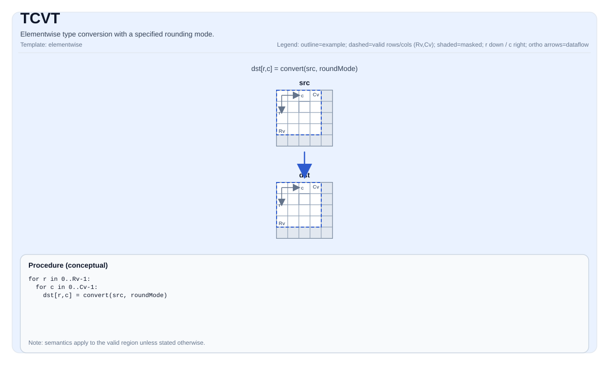

# TCVT

<!-- md-trans-meta sourceCommit=unknown translatedAt=2026-08-26T03:52:44.764Z pushedAt=2026-08-29T09:05:18.428Z -->

## Instruction Diagram



## Introduction

Performs element-wise type conversion with a specified rounding mode.

## Mathematical Semantics

For each element `(i, j)` in the valid region:

$$ \mathrm{dst}_{i,j} = \mathrm{cast}_{\mathrm{rmode}}\!\left(\mathrm{src}_{i,j}\right) $$

Where `rmode` is the rounding strategy (see `pto::RoundMode`).

## Assembly Syntax

Synchronous form:

```text
%dst = tcvt %src {rmode = #pto.round_mode<CAST_RINT>} : !pto.tile<...> -> !pto.tile<...>
```

### AS Level 1 (SSA)

```text
%dst = pto.tcvt %src{rmode = #pto<round_mode xx>}: !pto.tile<...> -> !pto.tile<...>
```

### AS Level 2 (DPS)

```text
pto.tcvt ins(%src{rmode = #pto<round_mode xx>}: !pto.tile_buf<...>) outs(%dst : !pto.tile_buf<...>)
```

## C++ Built-in APIs

Declared in `include/pto/common/pto_instr.hpp` and `include/pto/common/constants.hpp`:
> The public include header is `<pto/pto-inst.hpp>`, and the internal declarations are located in `pto/common/pto_instr.hpp`.

```cpp
template <typename TileDataD, typename TileDataS, typename... WaitEvents>
PTO_INST RecordEvent TCVT(TileDataD &dst, TileDataS &src, RoundMode mode, SaturationMode satMode, WaitEvents &... events);

template <typename TileDataD, typename TileDataS, typename... WaitEvents>
PTO_INST RecordEvent TCVT(TileDataD &dst, TileDataS &src, RoundMode mode, WaitEvents &... events);

template <typename TileDataD, typename TileDataS, typename TmpTileData, typename... WaitEvents>
PTO_INST RecordEvent TCVT(TileDataD &dst, TileDataS &src, TmpTileData &tmp, RoundMode mode,
                          SaturationMode satMode, WaitEvents &... events);

template <typename TileDataD, typename TileDataS, typename TmpTileData, typename... WaitEvents>
PTO_INST RecordEvent TCVT(TileDataD &dst, TileDataS &src, TmpTileData &tmp, RoundMode mode,
                          WaitEvents &... events);
```

## Constraints

- `dst` and `src` must be compatible in terms of shape/valid region, as required by the implementation.
- For a given `RoundMode`, the conversion `(src element type) -> (dst element type)` must be supported by the destination.
- **Implementation description (Atlas A2/A3 training products/Atlas A2/A3 inference products/Ascend 950PR/Ascend 950DT)**:
    - One form accepts an explicit `SaturationMode`, and the specified saturation behavior is passed directly to the implementation.
    - The other form does not explicitly provide a `SaturationMode`; in this case, the implementation selects the default saturation behavior defined by the destination for the specific type pair.
    - In the CPU implementation, only the form that does not explicitly pass `SaturationMode` is currently implemented.
- **Temporary tile**:
  - The C++ API provides an overload that explicitly passes a `tmp` tile. On Atlas A2/A3 training products/Atlas A2/A3 inference products, when `SaturationMode::OFF` is used for `float -> int16`, `half -> int16`, or `half -> int8`, the PyTorch-compatible non-saturating narrowing path uses this temporary tile. Other conversions do not require tmp space.
  - The implementation converts `tmp` to `int32_t *` for use; therefore, the tmp tile size should be planned in bytes rather than interpreted according to the type of `TmpTileData::DType`.
  - The following formulas give the minimum allocation size rounded up to the 32-byte vector block granularity used by the implementation. If `C = 0`, no conversion requiring tmp is initiated, and the required tmp size is `0`.
  - **Common parameters**:
    - `R = dst.GetValidRow()`.
    - `C = dst.GetValidCol()`.
    - `SS = TileDataS::RowStride`, in units of source elements.
    - `REPEAT_MAX = 255`, `REPEAT_BYTE = 256`, `BLOCK_BYTE_SIZE = 32`.
  - **`float -> int16`, non-saturating (`SaturationMode::OFF`)**:
    - The temporary result is the `int32_t` tile produced by the first-step `float -> int32` conversion.
    - Since the `float` source row is guaranteed to be 32-byte aligned by the tile constraint, `SS / 8` is the source repeat stride in units of 32-byte blocks.
    - In the aligned main region, one call processes one row, processing at most `REPEAT_MAX` repeats, with each repeat containing `64` elements:
    $$ \text{tmpHeadBytes} = 4 \times 64 \times \min\left(\left\lfloor\frac{C}{64}\right\rfloor, 255\right) $$
    - In the tail region, one call processes at most `REPEAT_MAX` rows and uses the source row stride. Because the vector repeat stride is in units of blocks, the spatial extent is computed in 32-byte blocks:
    $$ \text{tmpTailBytes} =
    \begin{cases}
    32 \times \left((\min(R, 255) - 1) \times \frac{SS}{8} + \left\lceil\frac{C \bmod 64}{8}\right\rceil\right), & C \bmod 64 > 0 \\
    0, & C \bmod 64 = 0
    \end{cases} $$
    - The minimum tmp size required by this path is:
    $$ \text{tmpFloatToInt16Bytes} = \max(\text{tmpHeadBytes}, \text{tmpTailBytes}) $$
    - For the main region, a compact upper bound for a complete repeat is `REPEAT_MAX * REPEAT_BYTE = 65280` bytes; however, when `SS` is large, the tail is written using the source row stride, and the required space may be larger.
  - **`half -> int16`, non-saturating (`SaturationMode::OFF`)**:
    - The implementation processes row by row, splitting each row into sub-blocks of no more than `64` elements, and reuses the same temporary buffer between sub-blocks. For `C > 0`, let:
    $$ H = \min(C, 64) $$
    - The minimum tmp size required by this path is:
    $$ \text{tmpHalfToInt16Bytes} = 32 \times \left\lceil\frac{H}{8}\right\rceil $$
    - For any non-empty tile, the shape-independent upper bound of this path is `256` bytes.
  - **`half -> int8`, non-saturating (`SaturationMode::OFF`)**:
    - The implementation similarly processes sub-blocks of no more than `64` elements and reuses the same 256-byte temporary region. In the first step, at most `64` `int32_t` values are written to bytes `[0, 255]`; after the `int32 -> int16` narrowing is complete, bytes `[0, 127]` hold `int16_t` values, and bytes `[128, 255]` are reused as scratch.
    - `tempMaskBuf = tempAndBuf + 64` advances by `64 * sizeof(int16_t) = 128` bytes, so it points to the upper half of the same 256-byte temporary region, and no additional 256 bytes need to be allocated.
    - The minimum tmp size required by this path is:
    $$ \text{tmpHalfToInt8Bytes} = \max\left(32 \times \left\lceil\frac{H}{8}\right\rceil,\ 128 + 32 \times \left\lceil\frac{H}{16}\right\rceil\right) $$
    - For any non-empty tile, the shape-independent upper bound of this path is `256` bytes.
  - **Overall minimum value covering all tmp-backed TCVT conversions**:
    - Since `tmpHalfToInt8Bytes >= tmpHalfToInt16Bytes`, for the same shape, the minimum tmp size that covers all TCVT conversion paths that use tmp is:
    $$ \text{tmpSizeAllBytes} = \max(\text{tmpFloatToInt16Bytes},\ \text{tmpHalfToInt8Bytes}) $$
    - If the tile is non-empty and the half path can use a shape-independent compact upper bound, it can also be written as:
    $$ \text{tmpSizeAllBytes} = \max(\text{tmpFloatToInt16Bytes},\ 256) $$
  - For conversions that do not require a PyTorch-compatible tmp-backed path, or when the native saturating behavior already meets the requirement, you can continue to use the overload without `tmp`.

## Supported Conversions (Atlas A2/A3 Training Products/Atlas A2/A3 Inference Products and Ascend 950PR/Ascend 950DT Side-by-Side Comparison)

| Source Type | Atlas A2/A3 Training Product/Atlas A2/A3 Inference Product Destination Type | Ascend 950PR/Ascend 950DT Destination Type | Difference |
|---|---|---|---|
| FP32 | FP16, FP32 (rounding only), BF16, I16, I32, I64 | FP32, FP16, BF16, I16, I32, I64, FP8_E4M3, FP8_E5M2, H8 | Adds FP8/H8 destinations for Ascend 950PR/Ascend 950DT. |
| FP16 | FP32, I32, I16, I8, U8, S4 (int4b_t) | FP32, I32, I16, I8, U8, H8 | S4 for Atlas A2/A3 training products/Atlas A2/A3 inference products; H8 for Ascend 950PR/Ascend 950DT |
| BF16 | FP32, I32 | FP32, I32, FP16, FP4_E1M2X2, FP4_E2M1X2 | Adds FP16/FP4 destinations for Ascend 950PR/Ascend 950DT. |
| I16 | FP16, FP32 | U8, FP16, FP32, U32, I32 | Adds U8/U32/I32 for Ascend 950PR/Ascend 950DT. |
| I32 | FP32, I16, I64, FP16 (deq path) | FP32, I16, U16, I64, U8 | Atlas A2/A3 training products/Atlas A2/A3 inference products support I32 -> FP16 (half, deq); Ascend 950PR/Ascend 950DT does not support this. |
| I64 | FP32, I32 | FP32, I32 | Same |
| U8 | FP16 | FP16, U16 | Adds U16 for Ascend 950PR/Ascend 950DT. |
| I8 | FP16 | FP16, I16, I32 | Adds I16/I32 for Ascend 950PR/Ascend 950DT. |
| S4 (int4b_t) | FP16 | N/A | Exclusive to Atlas A2/A3 training products/Atlas A2/A3 inference products |
| U32 | N/A | U8, U16, I16 | Exclusive source type of Ascend 950PR/Ascend 950DT |
| FP8_E4M3 | N/A | FP32 | Exclusive source type of Ascend 950PR/Ascend 950DT |
| FP8_E5M2 | N/A | FP32 | Exclusive source type of Ascend 950PR/Ascend 950DT |
| H8 | N/A | FP32 | Exclusive source type of Ascend 950PR/Ascend 950DT |
| FP4_E1M2X2 | N/A | BF16 | Exclusive source type of Ascend 950PR/Ascend 950DT |
| FP4_E2M1X2 | N/A | BF16 | Exclusive source type of Ascend 950PR/Ascend 950DT |

Note:

- Key difference: Atlas A2/A3 training products/Atlas A2/A3 inference products support I32 -> FP16 (half, deq path), while Ascend 950PR/Ascend 950DT does not support I32 -> FP16.
- FP16 -> FP8_E4M3 and FP16 -> FP8_E5M2 are not supported on Ascend 950PR/Ascend 950DT.

## Examples

### Automatic

```cpp
#include <pto/pto-inst.hpp>

using namespace pto;

void example_auto() {
  using SrcT = Tile<TileType::Vec, float, 16, 16>;
  using DstT = Tile<TileType::Vec, half, 16, 16>;
  SrcT src;
  DstT dst;
  TCVT(dst, src, RoundMode::CAST_RINT);
}
```

### Manual

```cpp
#include <pto/pto-inst.hpp>

using namespace pto;

void example_manual() {
  using SrcT = Tile<TileType::Vec, float, 16, 16>;
  using DstT = Tile<TileType::Vec, half, 16, 16>;
  SrcT src;
  DstT dst;
  TASSIGN(src, 0x1000);
  TASSIGN(dst, 0x2000);
  TCVT(dst, src, RoundMode::CAST_RINT);
}
```

## ASM Examples

### Automatic Mode

```text
# Automatic mode: the compiler/runtime handles resource placement and scheduling.
%dst = pto.tcvt %src{rmode = #pto<round_mode xx>}: !pto.tile<...> -> !pto.tile<...>
```

### Manual Mode

```text
# Manual mode: explicitly bind resources first, then issue the instruction.
# Optional (when the instruction contains tile operands):
# pto.tassign %arg0, @tile(0x1000)
# pto.tassign %arg1, @tile(0x2000)
%dst = pto.tcvt %src{rmode = #pto<round_mode xx>}: !pto.tile<...> -> !pto.tile<...>
```

### PTO Assembly Form

```text
%dst = tcvt %src {rmode = #pto.round_mode<CAST_RINT>} : !pto.tile<...> -> !pto.tile<...>
# AS Level 2 (DPS)
pto.tcvt ins(%src{rmode = #pto<round_mode xx>}: !pto.tile_buf<...>) outs(%dst : !pto.tile_buf<...>)
```
