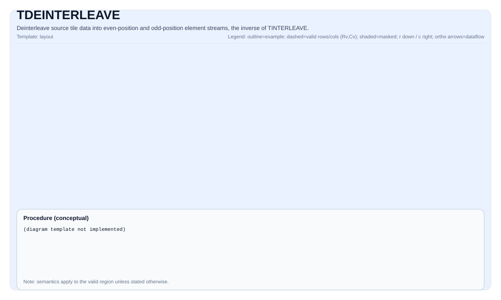

# TDEINTERLEAVE

<!-- md-trans-meta sourceCommit=unknown translatedAt=2026-08-26T03:52:35.090Z pushedAt=2026-08-29T09:05:18.427Z -->

## Instruction Diagram



## Introduction

Deinterleaves a source tile into two destination tiles (`dst0` and `dst1`). This operation reverses the interleaving process: `dst0` receives the even position elements of the interleaved stream, and `dst1` receives the odd position elements.

`TDeInterleave` has two overloaded forms:

- **Dual-source form** (`dst1, dst0, src1, src0`): Given two source tiles that hold the first half and the second half of the interleaved stream, deinterleaves them into the original even element stream and odd element stream.
- **Single-source form** (`dst1, dst0, src`): Given a single source tile that contains the complete interleaved data, deinterleaves it into even position and odd position element streams. Each destination row holds `src.GetValidCol() / 2` valid elements.

`TDeInterleave` is the inverse operation of `TInterleave`.

## Mathematical Semantics

### Dual-Source Form

Given two source tiles `src0` (first half) and `src1` (second half), reconstruct the complete interleaved stream and deinterleave it:

$$ \mathrm{combined}_{j} = \begin{cases} \mathrm{src0}_{i, j} & \text{if } 0 \le j < \mathrm{validCols} \\ \mathrm{src1}_{i, j - \mathrm{validCols}} & \text{if } \mathrm{validCols} \le j < 2 \times \mathrm{validCols} \end{cases} $$

$$ \mathrm{dst0}_{i, k} = \mathrm{combined}_{2k}, \quad 0 \le k < \mathrm{validCols} $$
$$ \mathrm{dst1}_{i, k} = \mathrm{combined}_{2k+1}, \quad 0 \le k < \mathrm{validCols} $$

Where `validRows = dst0.GetValidRow()` and `validCols = dst0.GetValidCol()`.

### Single-Source Form

Given a source tile `src` containing row-wise interleaved data:

$$ \mathrm{dst0}_{i, k} = \mathrm{src}_{i, 2k}, \quad 0 \le k < \mathrm{halfValidCols} $$
$$ \mathrm{dst1}_{i, k} = \mathrm{src}_{i, 2k+1}, \quad 0 \le k < \mathrm{halfValidCols} $$

Where `halfValidCols = src.GetValidCol() / 2`.

> **Note**: The single-source form requires the source tile to have a row width of at least `2 × ElementsPerRepeat` elements (where `ElementsPerRepeat = 256 / sizeof(T)`, that is, `2 × sregLower`), to ensure that the two adjacent register-sized data blocks loaded in each repeat do not cross a row boundary.

## Assembly Syntax

Synchronous form (dual-source):

```text
%dst0, %dst1 = tdeinterleave %src0, %src1 : !pto.tile<...>
```

Synchronous form (single-source):

```text
%dst0, %dst1 = tdeinterleave %src : !pto.tile<...>
```

### AS Level 1 (SSA)

Dual-source form:

```text
%dst0, %dst1 = pto.tdeinterleave %src0, %src1 : (!pto.tile<...>, !pto.tile<...>) -> (!pto.tile<...>, !pto.tile<...>)
```

Single-source form:

```text
%dst0, %dst1 = pto.tdeinterleave %src : (!pto.tile<...>) -> (!pto.tile<...>, !pto.tile<...>)
```

### AS Level 2 (DPS)

Dual-source form:

```text
pto.tdeinterleave ins(%src0, %src1 : !pto.tile_buf<...>, !pto.tile_buf<...>) outs(%dst0, %dst1 : !pto.tile_buf<...>, !pto.tile_buf<...>)
```

Single-source form:

```text
pto.tdeinterleave ins(%src : !pto.tile_buf<...>) outs(%dst0, %dst1 : !pto.tile_buf<...>, !pto.tile_buf<...>)
```

## C++ Built-in APIs

Declared in `include/pto/common/pto_instr.hpp`:
> The public include header is `<pto/pto-inst.hpp>`, and the internal declaration is located in `pto/common/pto_instr.hpp`.

```cpp
// dual-source form
template <typename TileDataDst, typename TileDataSrc, typename... WaitEvents>
PTO_INST RecordEvent TDeInterleave(TileDataDst &dst1, TileDataDst &dst0, TileDataSrc &src1, TileDataSrc &src0,
                                   WaitEvents &...events);

// single-source form
template <typename TileDataDst, typename TileDataSrc, typename... WaitEvents>
PTO_INST RecordEvent TDeInterleave(TileDataDst &dst1, TileDataDst &dst0, TileDataSrc &src,
                                   WaitEvents &...events);
```

> **Note**: The parameter order of the dual-source form is `(dst1, dst0, src1, src0)`. `dst0` receives the even-position elements of the interleaved stream, and `dst1` receives the odd-position elements.

## Constraints

- **Implementation check (Ascend 950PR/Ascend 950DT)**:
    - `TileData::DType` must be one of the following: `int32_t`, `uint32_t`, `float`, `int16_t`, `uint16_t`, `half`, `bfloat16_t`, `uint8_t`, `int8_t`.
    - The tile layout must be row-major (`TileData::isRowMajor`).
    - All tiles must have the same `DType`.
    - Dual-source form: `src0`, `src1`, `dst0`, and `dst1` must have the same valid shape, and their validCols must be even.
    - Single-source form: `src`, `dst0`, and `dst1` must have the same number of valid rows; the `validCols` of `dst0` and `dst1` must be half of the `validCols` of `src`.
- **Valid region**:
    - Dual-source form: this operation uses `dst0.GetValidRow()`/`dst0.GetValidCol()` as the iteration domain. Each row of `dst0/dst1` holds `validCols` elements.
    - Single-source form: each row of `dst0/dst1` holds `src.GetValidCol() / 2` valid elements. Elements beyond `halfValidCols` in each row are **unspecified**.

## Examples

### Automatic — Dual-Source Form

```cpp
#include <pto/pto-inst.hpp>

using namespace pto;

void example_auto_two_src() {
    using TileT = Tile<TileType::Vec, float, 16, 128>;
    TileT src0(16, 128), src1(16, 128);
    TileT dst0(16, 128), dst1(16, 128);

    TDeInterleave(dst1, dst0, src1, src0);
}
```

### Automatic — Single-Source Form

```cpp
#include <pto/pto-inst.hpp>

using namespace pto;

void example_auto_single_src() {
    using TileT = Tile<TileType::Vec, float, 16, 128>;
    TileT src(16, 128);
    TileT dst0(16, 128), dst1(16, 128);

    TDeInterleave(dst1, dst0, src);
}
```

### Manual — Dual-Source Form

```cpp
#include <pto/pto-inst.hpp>

using namespace pto;

void example_manual_two_src() {
    using TileT = Tile<TileType::Vec, half, 16, 256, BLayout::RowMajor, 16, 256>;
    TileT src0, src1, dst0, dst1;

    TASSIGN(src0, 0x1000);
    TASSIGN(src1, 0x2000);
    TASSIGN(dst0, 0x3000);
    TASSIGN(dst1, 0x4000);

    TDeInterleave(dst1, dst0, src1, src0);
}
```

### Manual — Single-Source Form

```cpp
#include <pto/pto-inst.hpp>

using namespace pto;

void example_manual_single_src() {
    using TileT = Tile<TileType::Vec, half, 16, 256, BLayout::RowMajor, 16, 256>;
    TileT src, dst0, dst1;

    TASSIGN(src,  0x1000);
    TASSIGN(dst0, 0x2000);
    TASSIGN(dst1, 0x3000);

    TDeInterleave(dst1, dst0, src);
}
```

## ASM Examples

### Automatic Mode

```text
# Automatic mode: the compiler/runtime handles resource placement and scheduling.
# Dual-source form:
%dst0, %dst1 = pto.tdeinterleave %src0, %src1 : (!pto.tile<...>, !pto.tile<...>) -> (!pto.tile<...>, !pto.tile<...>)
# Single-source form:
%dst0, %dst1 = pto.tdeinterleave %src : (!pto.tile<...>) -> (!pto.tile<...>, !pto.tile<...>)
```

### Manual Mode

```text
# Manual mode: explicitly bind resources first, then issue the instruction.
# Dual-source form:
# pto.tassign %src0, @tile(0x1000)
# pto.tassign %src1, @tile(0x2000)
# pto.tassign %dst0, @tile(0x3000)
# pto.tassign %dst1, @tile(0x4000)
%dst0, %dst1 = pto.tdeinterleave %src0, %src1 : (!pto.tile<...>, !pto.tile<...>) -> (!pto.tile<...>, !pto.tile<...>)
# Single-source form:
# pto.tassign %src,  @tile(0x1000)
# pto.tassign %dst0, @tile(0x2000)
# pto.tassign %dst1, @tile(0x3000)
%dst0, %dst1 = pto.tdeinterleave %src : (!pto.tile<...>) -> (!pto.tile<...>, !pto.tile<...>)
```

### PTO Assembly Form

```text
# Dual-source form:
%dst0, %dst1 = tdeinterleave %src0, %src1 : !pto.tile<...>
# AS Level 2 (DPS)
pto.tdeinterleave ins(%src0, %src1 : !pto.tile_buf<...>, !pto.tile_buf<...>) outs(%dst0, %dst1 : !pto.tile_buf<...>, !pto.tile_buf<...>)

# Single-source form:
%dst0, %dst1 = tdeinterleave %src : !pto.tile<...>
# AS Level 2 (DPS)
pto.tdeinterleave ins(%src : !pto.tile_buf<...>) outs(%dst0, %dst1 : !pto.tile_buf<...>, !pto.tile_buf<...>)
```

## Related Instructions

- [TInterleave](TINTERLEAVE.md) - Interleaves two tiles into alternating even/odd streams (the inverse operation of TDeInterleave).
