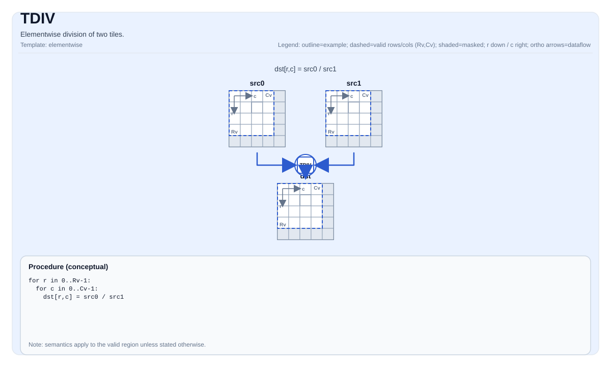

# TDIV

<!-- md-trans-meta sourceCommit=unknown translatedAt=2026-08-26T03:55:38.168Z pushedAt=2026-08-29T09:05:18.429Z -->

## Instruction Diagram



## Introduction

Element-wise division of two tiles.

## Mathematical Semantics

For each element `(i, j)` in the valid region:

$$ \mathrm{dst}_{i,j} = \frac{\mathrm{src0}_{i,j}}{\mathrm{src1}_{i,j}} $$

## Assembly Syntax

Synchronous form:

```text
%dst = tdiv %src0, %src1 : !pto.tile<...>
```

### AS Level 1 (SSA)

```text
%dst = pto.tdiv %src0, %src1 : (!pto.tile<...>, !pto.tile<...>) -> !pto.tile<...>
```

### AS Level 2 (DPS)

```text
pto.tdiv ins(%src0, %src1 : !pto.tile_buf<...>, !pto.tile_buf<...>) outs(%dst : !pto.tile_buf<...>)
```

## C++ Built-in APIs

Declared in `include/pto/common/pto_instr.hpp`:
> The public include header is `<pto/pto-inst.hpp>`, and the internal declaration is located in `pto/common/pto_instr.hpp`.

```cpp
template <auto PrecisionType = DivAlgorithm::DEFAULT, typename TileDataDst, typename TileDataSrc0,
          typename TileDataSrc1, typename... WaitEvents>
PTO_INST RecordEvent TDIV(TileDataDst &dst, TileDataSrc0 &src0, TileDataSrc1 &src1, WaitEvents &... events);
```

`PrecisionType` can specify the following values:

* `DivAlgorithm::DEFAULT`: normal algorithm, fast but with lower precision.

* `DivAlgorithm::HIGH_PRECISION`: high-precision algorithm, slower.

## Constraints

- **Implementation check (Atlas A2/A3 training products/Atlas A2/A3 inference products)**:

    - `TileData::DType` must be one of the following: `half`, `float`.

    - The tile layout must be row-major (`TileData::isRowMajor`).

    - The tile position must be a vector (`TileData::Loc == TileType::Vec`).

    - Static valid bounds: `TileData::ValidRow <= TileData::Rows` and `TileData::ValidCol <= TileData::Cols`.

    - Runtime: the `src0`, `src1`, and `dst` tiles should have the same `validRow/validCol`.

- **Implementation check (Ascend 950PR/Ascend 950DT)**:

    - `TileData::DType` must be one of the following: `int32_t`, `uint32_t`, `float`, `int16_t`, `uint16_t`, `half`.

    - The tile layout must be row-major (`TileData::isRowMajor`).


    - The tile position must be a vector (`TileData::Loc == TileType::Vec`).

    - Static valid bounds: `TileData::ValidRow <= TileData::Rows` and `TileData::ValidCol <= TileData::Cols`.

    - Runtime: `src0`, `src1`, and `dst` tiles must have the same `validRow/validCol`.

- **Valid region**:

    - This operation uses `dst.GetValidRow()`/`dst.GetValidCol()` as the iteration domain.

- **Division by zero**:

    - The behavior is defined by the target.

- **High-precision algorithm**:

    - Valid only on Ascend 950PR/Ascend 950DT. The `PrecisionType` option will be ignored on Atlas A3 training products/Atlas A3 inference products.

## Examples

### Automatic

```cpp
#include <pto/pto-inst.hpp>

using namespace pto;

void example_auto() {
  using TileT = Tile<TileType::Vec, float, 16, 16>;
  TileT src0, src1, dst;
  TDIV(dst, src0, src1);
  TDIV<DivAlgorithm::HIGH_PRECISION>(dst, src0, src1);  // A5 Only
}
```

### Manual

```cpp
#include <pto/pto-inst.hpp>

using namespace pto;

void example_manual() {
  using TileT = Tile<TileType::Vec, float, 16, 16>;
  TileT src0, src1, dst;
  TASSIGN(src0, 0x1000);
  TASSIGN(src1, 0x2000);
  TASSIGN(dst,  0x3000);
  TDIV(dst, src0, src1);
  TDIV<DivAlgorithm::HIGH_PRECISION>(dst, src0, src1);  // A5 Only
}
```

## ASM Examples

### Automatic Mode

```text
# Automatic mode: the compiler/runtime handles resource placement and scheduling.
%dst = pto.tdiv %src0, %src1 : (!pto.tile<...>, !pto.tile<...>) -> !pto.tile<...>
```

### Manual Mode

```text
# Manual mode: explicitly bind resources first, then issue the instruction.
# Optional (when the instruction contains tile operands):
# pto.tassign %arg0, @tile(0x1000)
# pto.tassign %arg1, @tile(0x2000)
%dst = pto.tdiv %src0, %src1 : (!pto.tile<...>, !pto.tile<...>) -> !pto.tile<...>
```

### PTO Assembly Form

```text
%dst = tdiv %src0, %src1 : !pto.tile<...>
# AS Level 2 (DPS)
pto.tdiv ins(%src0, %src1 : !pto.tile_buf<...>, !pto.tile_buf<...>) outs(%dst : !pto.tile_buf<...>)
```
