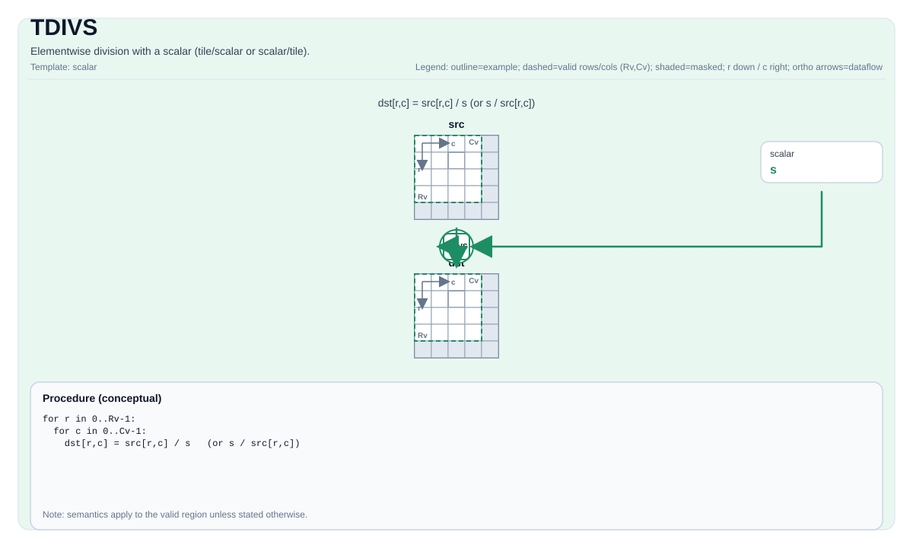

# TDIVS

<!-- md-trans-meta sourceCommit=unknown translatedAt=2026-08-26T03:57:09.758Z pushedAt=2026-08-29T09:05:18.428Z -->

## Instruction Diagram



## Introduction

Performs element-wise division with a scalar (tile/scalar or scalar/tile).

## Mathematical Semantics

For each element `(i, j)` in the valid region:

- Tile/scalar form:

  $$ \mathrm{dst}_{i,j} = \frac{\mathrm{src}_{i,j}}{\mathrm{scalar}} $$

- Scalar/tile form:

  $$ \mathrm{dst}_{i,j} = \frac{\mathrm{scalar}}{\mathrm{src}_{i,j}} $$

## Assembly Syntax

Tile/scalar form:

```text
%dst = tdivs %src, %scalar : !pto.tile<...>, f32
```

Scalar/tile form:

```text
%dst = tdivs %scalar, %src : f32, !pto.tile<...>
```

### AS Level 1 (SSA)

```text
%dst = pto.tdivs %src, %scalar : (!pto.tile<...>, dtype) -> !pto.tile<...>
%dst = pto.tdivs %scalar, %src : (dtype, !pto.tile<...>) -> !pto.tile<...>
```

### AS Level 2 (DPS)

```text
pto.tdivs ins(%src, %scalar : !pto.tile_buf<...>, dtype) outs(%dst : !pto.tile_buf<...>)
pto.tdivs ins(%scalar, %src : dtype, !pto.tile_buf<...>) outs(%dst : !pto.tile_buf<...>)
```

## C++ Built-in APIs

Declared in `include/pto/common/pto_instr.hpp`:
> The public include header is `<pto/pto-inst.hpp>`, and the internal declaration is located in `pto/common/pto_instr.hpp`.

```cpp
template <auto PrecisionType = DivAlgorithm::DEFAULT, typename TileDataDst, typename TileDataSrc,
          typename... WaitEvents>
PTO_INST RecordEvent TDIVS(TileDataDst &dst, TileDataSrc &src0, typename TileDataSrc::DType scalar,
                           WaitEvents &... events);

template <auto PrecisionType = DivAlgorithm::DEFAULT, typename TileDataDst, typename TileDataSrc,
          typename... WaitEvents>
PTO_INST RecordEvent TDIVS(TileDataDst &dst, typename TileDataDst::DType scalar, TileDataSrc &src0,
                           WaitEvents &... events)
```

`PrecisionType` can specify the following values:

* `DivAlgorithm::DEFAULT`: normal algorithm with high speed but low precision.
* `DivAlgorithm::HIGH_PRECISION`: high-precision algorithm with lower speed.

## Constraints

- **Implementation check (Atlas A2/A3 training products/Atlas A2/A3 inference products)** (two overloads):
    - `TileData::DType` must be one of the following: `int32_t`, `int`, `int16_t`, `half`, `float16_t`, `float`, `float32_t`.
    - The Tile position must be a vector (`TileData::Loc == TileType::Vec`).
    - Static valid bounds: `TileData::ValidRow <= TileData::Rows` and `TileData::ValidCol <= TileData::Cols`.
    - Runtime: `src0.GetValidRow() == dst.GetValidRow()` and `src0.GetValidCol() == dst.GetValidCol()`.
    - The tile layout must be row-major (`TileData::isRowMajor`).
- **Implementation check (Ascend 950PR/Ascend 950DT)** (two overloads):
    - `TileData::DType` must be one of the following: `uint8_t`, `int8_t`, `uint16_t`, `int16_t`, `uint32_t`, `int32_t`, `half`, `float`.
    - The tile position must be a vector (`TileData::Loc == TileType::Vec`).
    - Static valid bounds: `TileData::ValidRow <= TileData::Rows` and `TileData::ValidCol <= TileData::Cols`.
    - Runtime: `src0.GetValidRow() == dst.GetValidRow()` and `src0.GetValidCol() == dst.GetValidCol()`.
    - The tile layout must be row-major (`TileData::isRowMajor`).
- **Valid region**:
    - The operation uses `dst.GetValidRow()`/`dst.GetValidCol()` as the iteration domain.
- **Division by zero**:
    - The behavior is target-defined; on Ascend 950PR/Ascend 950DT, the tile/scalar form maps to multiplication by the reciprocal, and uses `1/0 -> +inf` for `scalar == 0`.
- **High-precision algorithm**
    - Valid only on Ascend 950PR/Ascend 950DT; the `PrecisionType` option is ignored on Atlas A3 training products/Atlas A3 inference products.

## Examples

### Automatic

```cpp
#include <pto/pto-inst.hpp>

using namespace pto;

void example_auto() {
  using TileT = Tile<TileType::Vec, float, 16, 16>;
  TileT src, dst;
  TDIVS(dst, src, 2.0f);
  TDIVS<DivAlgorithm::HIGH_PRECISION>(dst, src, 2.0f);
}
```

### Manual

```cpp
#include <pto/pto-inst.hpp>

using namespace pto;

void example_manual() {
  using TileT = Tile<TileType::Vec, float, 16, 16>;
  TileT src, dst;
  TASSIGN(src, 0x1000);
  TASSIGN(dst, 0x2000);
  TDIVS(dst, 2.0f, src);
  TDIVS<DivAlgorithm::HIGH_PRECISION>(dst, 2.0f, src);
}
```

## ASM Examples

### Automatic Mode

```text
# Automatic mode: the compiler/runtime handles resource placement and scheduling.
%dst = pto.tdivs %src, %scalar : (!pto.tile<...>, dtype) -> !pto.tile<...>
```

### Manual Mode

```text
# Manual mode: bind resources explicitly first, then issue the instruction.
# Optional (when the instruction contains a tile operand):
# pto.tassign %arg0, @tile(0x1000)
# pto.tassign %arg1, @tile(0x2000)
%dst = pto.tdivs %src, %scalar : (!pto.tile<...>, dtype) -> !pto.tile<...>
```

### PTO Assembly Form

```text
%dst = pto.tdivs %src, %scalar : (!pto.tile<...>, dtype) -> !pto.tile<...>
# AS Level 2 (DPS)
pto.tdivs ins(%src, %scalar : !pto.tile_buf<...>, dtype) outs(%dst : !pto.tile_buf<...>)
```
