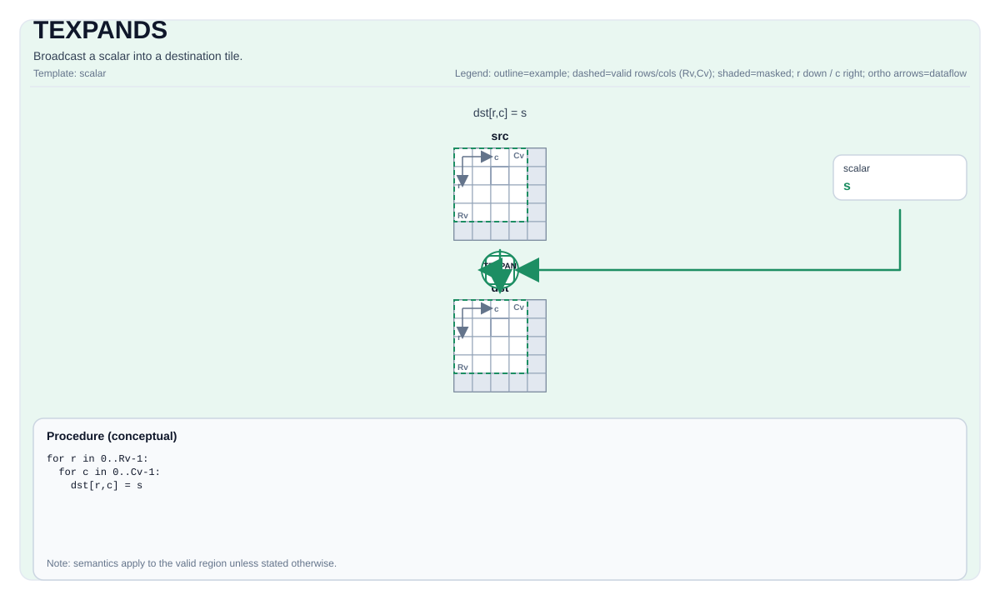

# TEXPANDS

<!-- md-trans-meta sourceCommit=unknown translatedAt=2026-08-26T03:59:51.864Z pushedAt=2026-08-29T09:05:18.430Z -->

## Instruction Diagram



## Introduction

Broadcasts the scalar to the destination tile.

## Mathematical Semantics

For each element `(i, j)` in the valid region:

$$ \mathrm{dst}_{i,j} = \mathrm{scalar} $$

## Assembly Syntax

Synchronous form:

```text
%dst = texpands %scalar : f32, !pto.tile<...>
```

### AS Level 1 (SSA)

```text
%dst = pto.texpands %scalar : dtype -> !pto.tile<...>
```

### AS Level 2 (DPS)

```text
pto.texpands ins(%scalar : dtype) outs(%dst : !pto.tile_buf<...>)
```

## C++ Built-in APIs

Declared in `include/pto/common/pto_instr.hpp`:
> The public include header is `<pto/pto-inst.hpp>`, and the internal declaration is located in `pto/common/pto_instr.hpp`.

```cpp
template <typename TileData, typename... WaitEvents>
PTO_INST RecordEvent TEXPANDS(TileData &dst, typename TileData::DType scalar, WaitEvents &... events);
```

## Constraints

- **Implementation check (Atlas A2/A3 training products/Atlas A2/A3 inference products)**:
    - For a tile whose location is a vector (`TileData::Loc == TileType::Vec`):
    - `TileData::DType` must be one of the following: `int8_t`, `uint8_t`, `int16_t`, `uint16_t`, `int32_t`, `uint32_t`, `half`, `bfloat16_t`, `float`.
    - Static valid bounds: `TileData::ValidRow <= TileData::Rows` and `TileData::ValidCol <= TileData::Cols`.
    - For a tile whose location is a Mat (`TileData::Loc == TileType::Mat`):
    - `TileData::DType` must be one of the following: `int8_t`, `uint8_t`, `int16_t`, `uint16_t`, `int32_t`, `uint32_t`, `half`, `bfloat16_t`, `float`.
    - Valid bounds: `TileData::Rows * TileData::Cols * sizeof(TileData::DType) / 32` must be within the range `[1, 32767]`.
- **Implementation check (Ascend 950PR/Ascend 950DT)**:
    - For a tile whose location is a vector (`TileData::Loc == TileType::Vec`):
    - Static valid bounds: `TileData::ValidRow <= TileData::Rows` and `TileData::ValidCol <= TileData::Cols`.
    - `TileData::DType` must be one of the following: `uint8_t`, `int8_t`, `uint16_t`, `int16_t`, `uint32_t`, `int32_t`, `half`, `bfloat16_t`, `float`.
    - For a tile whose location is Mat (`TileData::Loc == TileType::Mat`):
    - `TileData::DType` must be one of the following: `uint8_t`, `int8_t`, `uint16_t`, `int16_t`, `uint32_t`, `int32_t`, `half`, `bfloat16_t`, `float`.
    - For `TileData::layout == pto::Layout::NC1HWC0 || TileData::layout == pto::Layout::FRACTAL_Z`:
      - `TileData::shape0 * TileData::shape1 * TileData::shape2 * TileData::shape3` must be within the range `[1, 32767]`.
    - For `TileData::layout == pto::Layout::NDC1HWC0 || TileData::layout == pto::Layout::FRACTAL_Z_3D`:
      - `TileData::shape0 * TileData::shape1 * TileData::shape2 * TileData::shape3 * TileData::shape4` must be within the range `[1, 32767]`.
- **Valid region**:
    - For a tile whose location is a vector (`TileData::Loc == TileType::Vec`):
    - The operation fills `dst` on `dst.GetValidRow()`/`dst.GetValidCol()`.
    - For a tile whose location is Mat (`TileData::Loc == TileType::Mat`):
    - For a tile, the operation fills `dst` on `TileData::Rows`/`TileData::Cols`.
    - For a convTile, the operation fills `dst` within the `shape` of `ConvTileData`.

## Examples

### Automatic

```cpp
#include <pto/pto-inst.hpp>

using namespace pto;

void example_auto() {
  using TileT = Tile<TileType::Vec, float, 16, 16>;
  TileT dst;
  TEXPANDS(dst, 0.0f);
}
```

### Manual

```cpp
#include <pto/pto-inst.hpp>

using namespace pto;

void example_manual() {
  using TileT = Tile<TileType::Vec, float, 16, 16>;
  TileT dst;
  TASSIGN(dst, 0x1000);
  TEXPANDS(dst, 0.0f);
}
```

## ASM Examples

### Automatic Mode

```text
# Automatic mode: the compiler/runtime handles resource placement and scheduling.
%dst = pto.texpands %scalar : dtype -> !pto.tile<...>
```

### Manual Mode

```text
# Manual mode: explicitly bind resources first, then issue the instruction.
%dst = pto.texpands %scalar : dtype -> !pto.tile<...>
```

### PTO Assembly Form

```text
%dst = texpands %scalar : f32, !pto.tile<...>
# AS Level 2 (DPS)
pto.texpands ins(%scalar : dtype) outs(%dst : !pto.tile_buf<...>)
```
