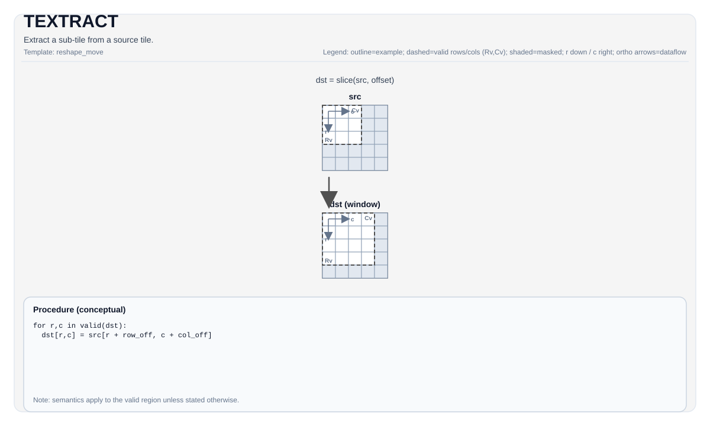

# TEXTRACT

<!-- md-trans-meta sourceCommit=unknown translatedAt=2026-08-26T04:00:10.660Z pushedAt=2026-08-29T09:05:18.431Z -->

## Instruction Diagram



## Introduction

Extracts a smaller sub-tile from a larger source tile.

## Mathematical Semantics

Conceptually, copies a smaller window from the larger `src` tile into `dst`, starting at `(indexRow, indexCol)`. The exact mapping depends on the tile layout.

Assume `R = dst.GetValidRow()` and `C = dst.GetValidCol()`. For `0 <= i < R` and `0 <= j < C`:

$$ \mathrm{dst}_{i,j} = \mathrm{src}_{\mathrm{indexRow}+i,\; \mathrm{indexCol}+j} $$

## Assembly Syntax

Synchronous form:

```text
%dst = textract %src[%r0, %r1] : !pto.tile<...> -> !pto.tile<...>
```

### AS Level 1 (SSA)

```text
%dst = pto.textract %src, %idxrow, %idxcol : (!pto.tile<...>, dtype, dtype) -> !pto.tile<...>
```

### AS Level 2 (DPS)

```text
pto.textract ins(%src, %idxrow, %idxcol : !pto.tile_buf<...>, dtype, dtype) outs(%dst : !pto.tile_buf<...>)
```

## C++ Built-in APIs

Declared in `include/pto/common/pto_instr.hpp`:
> The public include header is `<pto/pto-inst.hpp>`, and the internal declaration is located in `pto/common/pto_instr.hpp`.

```cpp
template <typename DstTileData, typename SrcTileData, typename... WaitEvents>
PTO_INST RecordEvent TEXTRACT(DstTileData &dst, SrcTileData &src, uint16_t indexRow = 0, uint16_t indexCol = 0, WaitEvents &... events);

template <typename DstTileData, typename SrcTileData, ReluPreMode reluMode, typename... WaitEvents>
PTO_INST RecordEvent TEXTRACT(DstTileData &dst, SrcTileData &src, uint16_t indexRow, uint16_t indexCol, WaitEvents &... events);

template <typename DstTileData, typename SrcTileData, ReluPreMode reluMode = ReluPreMode::NoRelu,
          typename... WaitEvents>
PTO_INST RecordEvent TEXTRACT(DstTileData &dst, SrcTileData &src, uint64_t preQuantScalar, uint16_t indexRow, uint16_t indexCol, WaitEvents &... events);

template <typename DstTileData, typename SrcTileData, typename FpTileData, ReluPreMode reluMode = ReluPreMode::NoRelu,
          typename... WaitEvents>
PTO_INST RecordEvent TEXTRACT_FP(DstTileData &dst, SrcTileData &src, FpTileData &fp, uint16_t indexRow, uint16_t indexCol, WaitEvents &... events);
```

## Constraints

### General Constraints or Checks

- `DstTileData::DType` must be equal to `SrcTileData::DType`.
- Runtime boundary check:
    - `indexRow + DstTileData::Rows <= SrcTileData::Rows`
    - `indexCol + DstTileData::Cols <= SrcTileData::Cols`

### Implementation Check for Atlas A2/A3 Training Products/Atlas A2/A3 Inference Products

- Supported element type: `int8_t`, `half`, `bfloat16_t`, `float`.
- The source layout must satisfy one of the following checked extraction layouts of Atlas A2/A3 training products/Atlas A2/A3 inference products:
    - `(SFractal == ColMajor && isRowMajor)`, or
    - `(SFractal == RowMajor && !isRowMajor)`.
- In the GEMV scenario targeting `TileType::Left`, the checked source layout also allows `(SrcTileData::Rows == 1 && SrcTileData::isRowMajor)`.
- The destination must be `TileType::Left` or `TileType::Right`, with a layout configuration supported by the destination.

### Ascend 950PR/Ascend 950DT Implementation Check

- Supported element types: `int8_t`, `hifloat8_t`, `float8_e5m2_t`, `float8_e4m3_t`, `half`, `bfloat16_t`, `float`, `float4_e2m1x2_t`, `float4_e1m2x2_t`, `float8_e8m0_t`.
- The source layout must satisfy one of the following checked Ascend 950PR/Ascend 950DT extraction layouts:
    - For `Left` / `Right`: `(SFractal == ColMajor && isRowMajor)` or `(SFractal == RowMajor && !isRowMajor)`
    - For `ScaleLeft`: `(SFractal == RowMajor && isRowMajor)`
    - For `ScaleRight`: `(SFractal == ColMajor && !isRowMajor)`
- In the GEMV scenario targeting `Left`, the checked source layout also allows `(SrcTileData::Rows == 1 && SrcTileData::isRowMajor)`.
- The destination supports `TileType::Mat -> TileType::Left/Right/Scale`, `TileType::Acc -> TileType::Mat` (including relu, scalar quantization, and vector quantization forms), `TileType::Acc -> TileType::Vec`, and specific `TileType::Vec -> TileType::Mat` extraction paths.
- The vector quantization form additionally requires providing the `FpTileData` scaling operand, corresponding to the `TEXTRACT_FP(...)` API.
- For `TileType::Acc -> TileType::Vec`, when the destination is a 32-bit type (`float`/`int32_t`) and `DualModeSplitN` is used, the `ValidCol` before splitting must be an integer multiple of `32`.

### Vec → Vec Extraction Path

In addition to the `Mat/Acc -> ...` paths described above, `TEXTRACT` also supports the `TileType::Vec -> TileType::Vec` extraction path (ND and NZ layouts), which is enforced by `CheckTExtractVecToVecCommon`:

- `DstTileData::DType` must be equal to `SrcTileData::DType`.
- Supported element types (same for A2A3 and A5): `int8_t`, `uint8_t`, `int16_t`, `uint16_t`, `int32_t`, `uint32_t`, `half`, `bfloat16_t`, `float` (any 1/2/4-byte standard type). This set differs from the main tile path: it adds `uint8_t`/`int16_t`/`uint16_t`/`int32_t`/`uint32_t`, and on A5 it does **not** include fp8/fp4 types.
- ND path: the source/destination row stride must be 32-byte aligned; the `Dst` rows/columns must not exceed `Src`.

## Examples

### Automatic

```cpp
#include <pto/pto-inst.hpp>

using namespace pto;

void example_auto() {
  using SrcT = Tile<TileType::Mat, float, 16, 16, BLayout::RowMajor, 16, 16, SLayout::ColMajor>;
  using DstT = TileLeft<float, 16, 16>;
  SrcT src;
  DstT dst;
  TEXTRACT(dst, src, /*indexRow=*/0, /*indexCol=*/0);
}
```

### Manual

```cpp
#include <pto/pto-inst.hpp>

using namespace pto;

void example_manual() {
  using SrcT = Tile<TileType::Mat, float, 16, 16, BLayout::RowMajor, 16, 16, SLayout::ColMajor>;
  using DstT = TileLeft<float, 16, 16>;
  SrcT src;
  DstT dst;
  TASSIGN(src, 0x1000);
  TASSIGN(dst, 0x2000);
  TEXTRACT(dst, src, /*indexRow=*/0, /*indexCol=*/0);
}
```

## ASM Examples

### Automatic Mode

```text
# Automatic mode: the compiler/runtime is responsible for resource placement and scheduling.
%dst = pto.textract %src, %idxrow, %idxcol : (!pto.tile<...>, dtype, dtype) -> !pto.tile<...>
```

### Manual Mode

```text
# Manual mode: explicitly bind resources first, then issue the instruction.
# Optional (when the instruction contains tile operands):
# pto.tassign %arg0, @tile(0x1000)
# pto.tassign %arg1, @tile(0x2000)
%dst = pto.textract %src, %idxrow, %idxcol : (!pto.tile<...>, dtype, dtype) -> !pto.tile<...>
```

### PTO Assembly Form

```text
%dst = textract %src[%r0, %r1] : !pto.tile<...> -> !pto.tile<...>
# AS Level 2 (DPS)
pto.textract ins(%src, %idxrow, %idxcol : !pto.tile_buf<...>, dtype, dtype) outs(%dst : !pto.tile_buf<...>)
```
