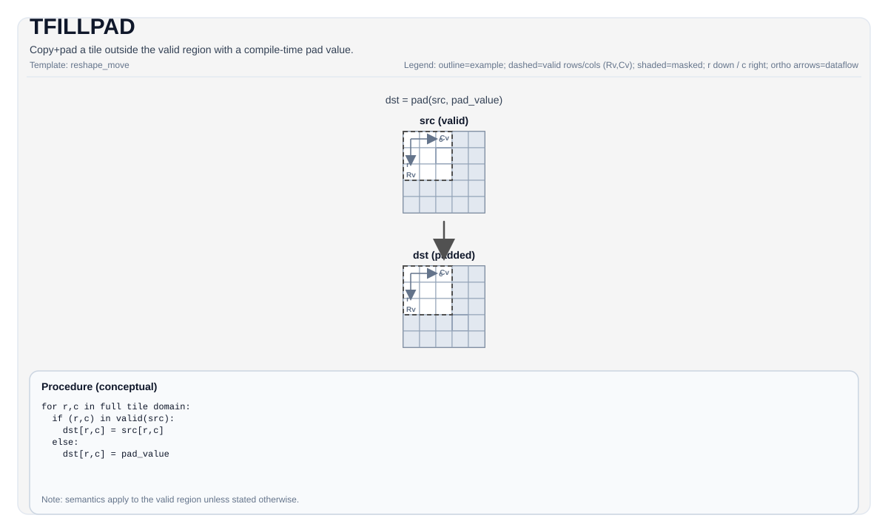

# TFILLPAD


## Tile Operation Diagram



## Introduction

Copy a source tile into a destination tile and fill the remaining (padded) elements with a compile-time pad value
selected by `TileDataDst::PadVal` (e.g., `PadValue::Min`/`PadValue::Max`).

This is commonly used to materialize deterministic values outside the runtime valid region so that subsequent ops can
operate on a full static tile shape.

## Math Interpretation

Let `VR = src.GetValidRow()` and `VC = src.GetValidCol()`. For each destination element `(i, j)`:

$$
\mathrm{dst}_{i,j} =
\begin{cases}
\mathrm{src}_{i,j} & \text{if } i < VR \text{ and } j < VC \\
\mathrm{pad}       & \text{otherwise}
\end{cases}
$$

`pad` is determined by `TileDataDst::PadVal` and the element type. Built-in `Zero`/`Min`/`Max` maps live in
`PadValueMap<DType, PadVal>`; custom bit patterns use `PadValueCustom`.

## Assembly Syntax

Synchronous form (conceptual):

```text
%dst = tfillpad %src : !pto.tile<...> -> !pto.tile<...>
```

### AS Level 1 (SSA)

```text
%dst = pto.tfillpad %src : !pto.tile<...> -> !pto.tile<...>
```

### AS Level 2 (DPS)

```text
pto.tfillpad ins(%src : !pto.tile_buf<...>) outs(%dst : !pto.tile_buf<...>)
```
## C++ Intrinsic

Implemented in the backend headers pulled in by `include/pto/common/pto_instr_impl.hpp`:

```cpp
template <typename TileData, PadValue PadVal = PadValue::Zero, typename... WaitEvents>
PTO_INST RecordEvent TFILLPAD(TileData &dst, TileData &src, WaitEvents &... events);

template <
    TFillPadMode mode = TFillPadMode::Normal,
    typename DstTileData,
    typename SrcTileData,
    typename... WaitEvents>
PTO_INST RecordEvent TFILLPAD(DstTileData &dst, SrcTileData &src, WaitEvents &... events);
```

For vector tiles, `mode` selects the operation variant:

- `TFillPadMode::Normal`: destination and source static shapes must match.
- `TFillPadMode::InPlace`: destination and source must alias the same storage.
- `TFillPadMode::Expand`: destination may have a larger static shape than source.

`TFILLPAD_INPLACE` and `TFILLPAD_EXPAND` remain available as compatibility aliases.

## Constraints

- `TileDataDst::PadVal != PadValue::Null` (Vec-type overload).
- `sizeof(TileDataDst::DType) == sizeof(TileDataSrc::DType)` and element size must be `1`, `2`, or `4` bytes.
  Packed `fp4x2` counts as a 1-byte DType (two nibbles per element), same as `s8`/`u8`.
  On A5, `ValidCol`/`Cols` for `fp4x2` are nibble-counted (same as TLOAD/TSTORE/TCVT); pad length is `ceil(Cols/2)` packed bytes.
- `TFILLPAD`: `TileDataDst::Rows/Cols` must match `TileDataSrc::Rows/Cols`.
- `TFILLPAD_EXPAND`: `TileDataDst::Rows >= TileDataSrc::Rows` and `TileDataDst::Cols >= TileDataSrc::Cols`.
- `TFILLPAD(TileData &dst, TileData &src)` (Mat-type overload): when `TileData::TileType` is `Mat`, the layout must satisfy `!TileData::isRowMajor && TileData::SLayout::RowMajor`, and `PadVal` must be `PadValue::Zero` or `PadValue::Null`. This Mat overload and the first Vec overload (`PadVal != PadValue::Null`) are separate SFINAE overloads, so the two are not contradictory.


## PadValue maps (Vec)

`PadValue::Zero` / `Min` / `Max` are type-dependent bit patterns from `PadValueMap`.
`PadValue::Null` is 0. Custom values (`PadValueCustom(...)`) pass through the raw bits.

| DType | Zero | Min | Max | Notes |
| --- | --- | --- | --- | --- |
| `float` / `half` / `bfloat16_t` | `0` | `-inf` | `+inf` | IEEE inf |
| integer types | `0` | type min | type max | |
| `float8_e4m3_t` | `0x00` | `0xFE` | `0x7E` | no inf; finite max/min |
| `float8_e5m2_t` | `0x00` | `0xFC` | `0x7C` | `±inf` |
| `hifloat8_t` | `0x00` | `0xEF` | `0x6F` | HiF8 `±inf` (`S1101111`) |
| `float4_e2m1x2_t` | `0x00` | `0xFF` | `0x77` | both nibbles `-6` / `+6` |
| `float4_e1m2x2_t` | `0x00` | `0xFF` | `0x77` | both nibbles min/max finite |

`float8_e8m0_t` has no Zero/Min/Max sugar; use `PadValueCustom`. Low-precision maps are A5 (and CPU sim for fp8/fp4). `hifloat8_t` is A5-only.

## Examples

```cpp
#include <pto/pto-inst.hpp>

using namespace pto;

void example1() {
  using SrcT = Tile<TileType::Vec, float, 16, 16>;
  using DstT = Tile<TileType::Vec, float, 16, 16, BLayout::RowMajor, 16, 16, SLayout::NoneBox, TileConfig::fractalABSize, PadValue::Min>;

  SrcT src;
  DstT dst;
  TFILLPAD(dst, src);
}

void example2() {
  using TileMatData = Tile<TileType::Mat, float, 16, 256, BLayout::ColMajor, 1, 224, SLayout::RowMajor, 512>;

  TileMatData matTile;
  TFILLPAD(matTile, matTile);
}
```

## ASM Form Examples

### Auto Mode

```text
# Auto mode: compiler/runtime-managed placement and scheduling.
%dst = pto.tfillpad %src : !pto.tile<...> -> !pto.tile<...>
```

### Manual Mode

```text
# Manual mode: resources must be bound explicitly before issuing the instruction.
# Optional for tile operands:
# pto.tassign %arg0, @tile(0x1000)
# pto.tassign %arg1, @tile(0x2000)
%dst = pto.tfillpad %src : !pto.tile<...> -> !pto.tile<...>
```

### PTO Assembly Form

```text
%dst = pto.tfillpad %src : !pto.tile<...> -> !pto.tile<...>
# AS Level 2 (DPS)
pto.tfillpad ins(%src : !pto.tile_buf<...>) outs(%dst : !pto.tile_buf<...>)
```
