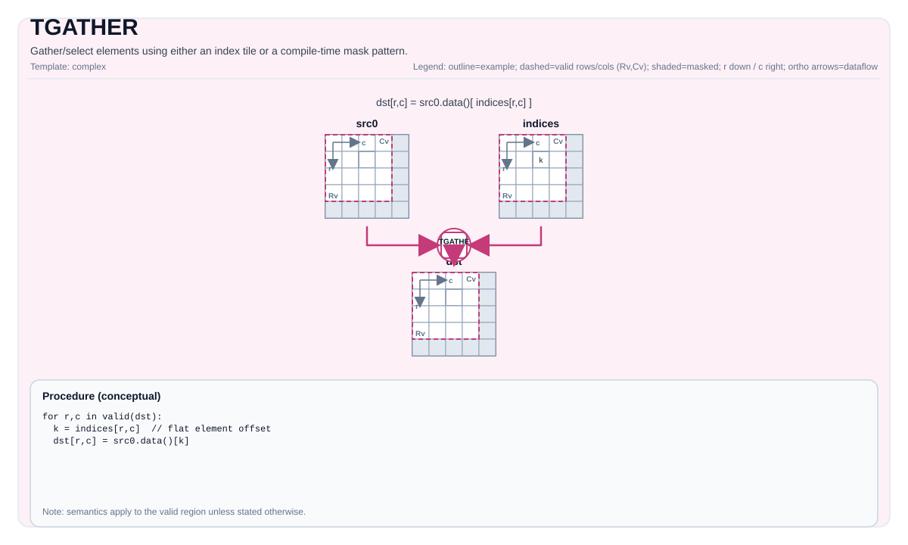

# TGATHER

<!-- md-trans-meta sourceCommit=unknown translatedAt=2026-08-26T04:04:49.743Z pushedAt=2026-08-29T09:05:18.433Z -->

## Instruction Diagram



## Introduction

Gathers/Selects elements using an index tile or a compile-time mask pattern.

## Mathematical Semantics

Index-based gather (conceptual definition):

Assume `R = dst.GetValidRow()` and `C = dst.GetValidCol()`. For `0 <= i < R` and `0 <= j < C`:

$$ \mathrm{dst}_{i,j} = \mathrm{src0}\!\left[\mathrm{indices}_{i,j}\right] $$

The exact index interpretation and boundary behavior are implementation-defined.

Mask-based gather is an implementation-defined selection/reduction operation controlled by `pto::MaskPattern`.

## Assembly Syntax

Index-based gather:

```text
%dst = tgather %src0, %indices : !pto.tile<...> -> !pto.tile<...>
```

Mask-based gather:

```text
%dst = tgather %src {maskPattern = #pto.mask_pattern<P0101>} : !pto.tile<...> -> !pto.tile<...>
```

### AS Level 1 (SSA)

```text
%dst = pto.tgather %src, %indices : (!pto.tile<...>, !pto.tile<...>) -> !pto.tile<...>
%dst = pto.tgather %src {maskPattern = #pto.mask_pattern<P0101>}: !pto.tile<...> -> !pto.tile<...>
```

### AS Level 2 (DPS)

```text
pto.tgather ins(%src, %indices : !pto.tile_buf<...>, !pto.tile_buf<...>) outs(%dst : !pto.tile_buf<...>)
pto.tgather ins(%src, {maskPattern = #pto.mask_pattern<P0101>} : !pto.tile_buf<...>) outs(%dst : !pto.tile_buf<...>)
```

## C++ Built-in APIs

Declared in `include/pto/common/pto_instr.hpp`:
> The public include header is `<pto/pto-inst.hpp>`, and the internal declaration is located in `pto/common/pto_instr.hpp`.

### Index-Based Gather

```cpp
template <typename TileDataD, typename TileDataS0, typename TileDataS1, typename TileDataTmp, typename... WaitEvents>
PTO_INST RecordEvent TGATHER(TileDataD &dst, TileDataS0 &src0, TileDataS1 &src1, TileDataTmp &tmp, WaitEvents &... events);
```

### Mask-Based Gather

```cpp
template <typename DstTileData, typename SrcTileData, MaskPattern maskPattern, typename... WaitEvents>
PTO_INST RecordEvent TGATHER(DstTileData &dst, SrcTileData &src, WaitEvents &... events);
```

### Comparison-Based Gather (TGather_cmp)

Gathers the indices of elements that satisfy the comparison condition with the per-row threshold scalar.

```cpp
template <typename TileDataD, typename TileDataS, typename TileDataS1, typename TileDataC, typename TileDataTmp, CmpMode cmpMode, typename... WaitEvents>
PTO_INST RecordEvent TGATHER(TileDataD &dst, TileDataS &src0, TileDataS1 &k_value, TileDataC &cdst, TileDataTmp &tmp, uint32_t offset, WaitEvents &... events);
```

For each row `i` of `src0`, compares each element `src0[i, j]` with the threshold `k_value[i]` using `cmpMode` (GT or EQ). The indices of matching elements are gathered into `dst[i]`. The number of matches per row is stored in `cdst[i]`. The `offset` parameter specifies the starting index value.

#### Comparison-Based Gather Constraints

- **Atlas A2/A3 training products/Atlas A2/A3 inference products**:
    - `TileDataD::DType` must be `int32_t` or `uint32_t`.
    - `TileDataS::DType` must be `float`, `half`, or `int32_t` (EQ mode only).
    - `TileDataS1::DType` must be `int32_t` or `uint32_t`.
    - `cmpMode` must be `CmpMode::GT` or `CmpMode::EQ`.
- **Ascend 950PR/Ascend 950DT**:
    - `TileDataD::DType` must be `int32_t` or `uint32_t`.
    - `TileDataS::DType` must be `int16_t`, `uint16_t`, `int32_t`, `uint32_t`, `half`, or `float`.
    - `TileDataS1::DType` must be `uint16_t` or `uint32_t`.
    - `cmpMode` must be `CmpMode::GT` or `CmpMode::EQ`.

## Constraints

- **Index-based gather: implementation check (Atlas A2/A3 training products/Atlas A2/A3 inference products)**:
    - `sizeof(DstTileData::DType)` must be 2 or 4 bytes (b16/b32).
    - `sizeof(Src1TileData::DType)` must be 4 bytes (b32: `int32_t`, `uint32_t`).
    - `DstTileData::DType` must be the same type as `Src0TileData::DType`.
    - `TmpTileData::DType` must be the same type as `Src1TileData::DType`.
    - `src1.GetValidCol() == TmpTileData::Cols` and `src1.GetValidRow() == TmpTileData::Rows`.
    - `dst.GetValidCol() == DstTileData::Cols` (contiguous destination storage).
- **Index-based gather: implementation check (Ascend 950PR/Ascend 950DT)**:
    - `DstTileData::DType` must be a 1-, 2-, or 4-byte type and be one of the following: `int8_t`, `uint8_t`, `int16_t`, `uint16_t`, `int32_t`, `uint32_t`, `half`, `bfloat16_t`, `float`.
    - The type corresponding to `sizeof(Src1TileData::DType)` must be one of `int16_t`, `uint16_t`, `int32_t`, and `uint32_t`.
    - `DstTileData::DType` must be the same type as `Src0TileData::DType`.
    - `src1.GetValidCol() == Src1TileData::Cols` and `dst.GetValidCol() == DstTileData::Cols`.
- **Mask-based gather: implementation check (Atlas A2/A3 training products/Atlas A2/A3 inference products)**:
    - The source element size must be `2` or `4` bytes.
    - `SrcTileData::DType`/`DstTileData::DType` must be one of `int16_t`, `uint16_t`, `int32_t`, `uint32_t`, `half`, `bfloat16_t`, and `float`.
    - `dst` and `src` must both be `TileType::Vec` and row-major.
    - `sizeof(dst element) == sizeof(src element)` and `dst.GetValidCol() == DstTileData::Cols` (contiguous destination storage).
- **Mask-based gather: implementation check (Ascend 950PR/Ascend 950DT)**:
    - The source element size must be `1`, `2`, or `4` bytes.
    - `dst` and `src` must both be `TileType::Vec` and row-major.
    - `SrcTileData::DType`/`DstTileData::DType` must be one of `int8_t`, `uint8_t`, `int16_t`, `uint16_t`, `int32_t`, `uint32_t`, `half`, `bfloat16_t`, `float`, `float8_e4m3_t`, `float8_e5m2_t`, and `hifloat8_t`.
    - The supported data types are restricted to the set defined by the destination (enforced through `static_assert` in the implementation), and `sizeof(dst element) == sizeof(src element)`, `dst.GetValidCol() == DstTileData::Cols` (contiguous destination storage).
- **Comparison-based gather: implementation check**: For the type and `cmpMode` constraints, see [C++ Built-in APIs → Comparison-Based Gather Constraints](#comparison-based-gather-constraints).
- **Boundary/Validity**:
    - Index boundaries are not verified through explicit runtime assertions; the behavior of out-of-range indices is defined by the target.
- **Temporary tile**:
    - **Index-based gather (Atlas A2/A3 training products/Atlas A2/A3 inference products)**: The C++ API requires an explicit `tmp` tile. `TileDataTmp::DType` must be the same type as `TileDataS1::DType` (`int32_t` or `uint32_t`). `src1.GetValidRow() == TileDataTmp::Rows` and `src1.GetValidCol() == TileDataTmp::Cols`. The tmp tile is used to hold the `vmuls` intermediate results of the b16 source type for `vgather`; for the b32 source type, the results are written directly to `dst`, but the API still requires `tmp`.
    - **Index-based gather (Ascend 950PR/Ascend 950DT)**: The `tmp` tile is accepted but not used. The Ascend 950PR/Ascend 950DT hardware handles index-based gather without a temporary buffer.
    - **Comparison-based gather (Atlas A2/A3 training products/Atlas A2/A3 inference products)**: The C++ API requires an explicit `tmp` tile, which serves as a merged scratch buffer for three internal regions:
        1. **cmpsTmp** (comparison result bitmap): offset 0, stored as `uint8_t`, size = `TileDataTmp::Rows × TileDataTmp::Cols` bytes.
        2. **indexTmp** (index array): offset = `TileDataTmp::Rows × TileDataTmp::Cols × sizeof(uint8_t)`, stored as `TileDataD::DType`, size = `TileDataS::Rows × TileDataS::Cols × sizeof(TileDataD::DType)` bytes.
        3. **cvtTmp** (converted k-value array): offset = `TileDataTmp::Rows × TileDataTmp::Cols × sizeof(uint8_t)` + `TileDataS::Rows × TileDataS::Cols × sizeof(TileDataD::DType)`, stored as `TileDataS::DType`, size = `TileDataS::Rows × sizeof(TileDataS::DType)` bytes.
        The minimum tmp size must satisfy:
        $$ \text{tmpSize} \ge \text{Rows}_\text{tmp} \times \text{Cols}_\text{tmp} + \text{Rows}_\text{src} \times \text{Cols}_\text{src} \times \text{sizeof(DType}_\text{dst}\text{)} + \text{Rows}_\text{src} \times \text{sizeof(DType}_\text{src}\text{)} $$
    - **Comparison-based gather (Ascend 950PR/Ascend 950DT)**: The `tmp` tile is accepted but not used. Ascend 950PR/Ascend 950DT hardware handles comparison-based gather without a temporary buffer.

## Examples

### Automatic

```cpp
#include <pto/pto-inst.hpp>

using namespace pto;

void example_auto() {
  using SrcT = Tile<TileType::Vec, float, 16, 16>;
  using IdxT = Tile<TileType::Vec, int32_t, 16, 16>;
  using DstT = Tile<TileType::Vec, float, 16, 16>;
  using TmpT = Tile<TileType::Vec, int32_t, 16, 16>;
  SrcT src0;
  IdxT idx;
  DstT dst;
  TmpT tmp;
  TGATHER(dst, src0, idx, tmp);
}
```

### Manual

```cpp
#include <pto/pto-inst.hpp>

using namespace pto;

void example_manual() {
  using SrcT = Tile<TileType::Vec, float, 16, 16>;
  using DstT = Tile<TileType::Vec, float, 1, 16>;
  SrcT src;
  DstT dst;
  TASSIGN(src, 0x1000);
  TASSIGN(dst, 0x2000);
  TGATHER<DstT, SrcT, MaskPattern::P0101>(dst, src);
}
```

## ASM Examples

### Automatic Mode

```text
# Automatic mode: the compiler/runtime is responsible for resource placement and scheduling.
%dst = pto.tgather %src, %indices : (!pto.tile<...>, !pto.tile<...>) -> !pto.tile<...>
```

### Manual Mode

```text
# Manual mode: explicitly bind resources first, then issue the instruction.
# Optional (when the instruction contains tile operands):
# pto.tassign %arg0, @tile(0x1000)
# pto.tassign %arg1, @tile(0x2000)
%dst = pto.tgather %src, %indices : (!pto.tile<...>, !pto.tile<...>) -> !pto.tile<...>
```

### PTO Assembly Form

```text
%dst = pto.tgather %src, %indices : (!pto.tile<...>, !pto.tile<...>) -> !pto.tile<...>
# AS Level 2 (DPS)
pto.tgather ins(%src, %indices : !pto.tile_buf<...>, !pto.tile_buf<...>) outs(%dst : !pto.tile_buf<...>)
```
