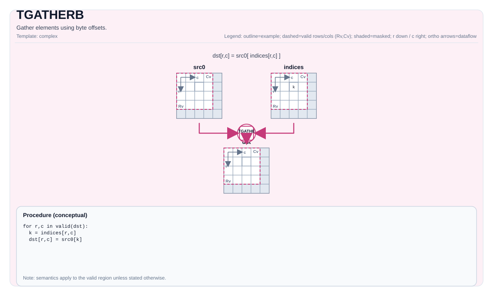

# TGATHERB

<!-- md-trans-meta sourceCommit=unknown translatedAt=2026-08-26T04:05:38.868Z pushedAt=2026-08-29T09:05:18.432Z -->

## Instruction Diagram



## Introduction

Gathers elements using byte offsets.

## Mathematical Semantics

For each element in the valid region:

$$ \mathrm{dst}_{i,j} = *\left(\mathrm{srcBase} + \mathrm{offset}_{i,j}\right) $$

The exact boundary behavior is implementation-defined.

## Assembly Syntax

Synchronous form:

```text
%dst = tgatherb %src, %offsets : !pto.tile<...> -> !pto.tile<...>
```

### AS Level 1 (SSA)

```text
%dst = pto.tgatherb %src, %offsets : (!pto.tile<...>, !pto.tile<...>) -> !pto.tile<...>
```

### AS Level 2 (DPS)

```text
pto.tgatherb ins(%src, %offsets : !pto.tile_buf<...>, !pto.tile_buf<...>) outs(%dst : !pto.tile_buf<...>)
```

## C++ Built-in APIs

Declared in `include/pto/common/pto_instr.hpp`:
> The public include header is `<pto/pto-inst.hpp>`, and the internal declaration is located in `pto/common/pto_instr.hpp`.

```cpp
template <typename TileDataDst, typename TileDataSrc, typename TileDataOffset, typename... WaitEvents>
PTO_INST RecordEvent TGATHERB(TileDataDst &dst, TileDataSrc &src, TileDataOffset &offset, WaitEvents &... events);
```

## Constraints

- **Implementation check (Atlas A2/A3 training products/Atlas A2/A3 inference products)**:
    - The destination layout must be row-major (`TileDataDst::isRowMajor`).
    - The destination element size must be `1`, `2`, or `4` bytes (enforced by `static_assert` in the helper function).
    - `TileDataSrc::DType`/`TileDataDst::DType` must be `int8_t`, `uint8_t`, `int16_t`, `uint16_t`, `int32_t`, `uint32_t`, `half`, `bfloat16_t`, or `float`.
- **Implementation check (Ascend 950PR/Ascend 950DT)**:
    - The destination element size must be `1`, `2`, or `4` bytes.
    - `TileDataSrc::DType`/`TileDataDst::DType` must be `int8_t`, `uint8_t`, `int16_t`, `uint16_t`, `int32_t`, `uint32_t`, `half`, `bfloat16_t`, or `float`.
- **Offset interpretation**:
    - Offsets are interpreted by the implementation as `uint32_t` values (byte offsets).
    - Offset bounds are not validated through explicit runtime assertions; out-of-range offsets are destination-defined.

## Examples

### Automatic

```cpp
#include <pto/pto-inst.hpp>

using namespace pto;

void example_auto() {
  using SrcT = Tile<TileType::Vec, uint8_t, 1, 256>;
  using OffT = Tile<TileType::Vec, uint32_t, 1, 256>;
  using DstT = Tile<TileType::Vec, uint8_t, 1, 256>;
  SrcT src;
  OffT off;
  DstT dst;
  TGATHERB(dst, src, off);
}
```

### Manual

```cpp
#include <pto/pto-inst.hpp>

using namespace pto;

void example_manual() {
  using SrcT = Tile<TileType::Vec, uint8_t, 1, 256>;
  using OffT = Tile<TileType::Vec, uint32_t, 1, 256>;
  using DstT = Tile<TileType::Vec, uint8_t, 1, 256>;
  SrcT src;
  OffT off;
  DstT dst;
  TASSIGN(src, 0x1000);
  TASSIGN(off, 0x2000);
  TASSIGN(dst, 0x3000);
  TGATHERB(dst, src, off);
}
```

## ASM Examples

### Automatic Mode

```text
# Automatic mode: the compiler/runtime handles resource placement and scheduling.
%dst = pto.tgatherb %src, %offsets : (!pto.tile<...>, !pto.tile<...>) -> !pto.tile<...>
```

### Manual Mode

```text
# Manual mode: explicitly bind resources first, then issue the instruction.
# Optional (when the instruction contains tile operands):
# pto.tassign %arg0, @tile(0x1000)
# pto.tassign %arg1, @tile(0x2000)
%dst = pto.tgatherb %src, %offsets : (!pto.tile<...>, !pto.tile<...>) -> !pto.tile<...>
```

### PTO Assembly Form

```text
%dst = tgatherb %src, %offsets : !pto.tile<...> -> !pto.tile<...>
# AS Level 2 (DPS)
pto.tgatherb ins(%src, %offsets : !pto.tile_buf<...>, !pto.tile_buf<...>) outs(%dst : !pto.tile_buf<...>)
```
