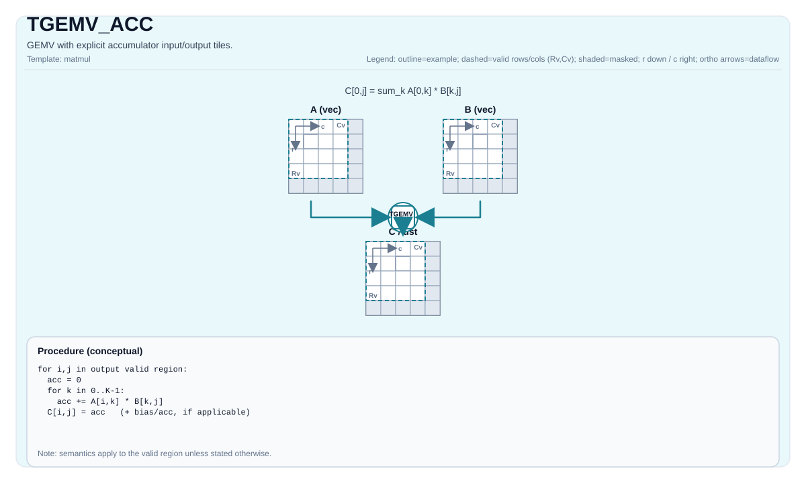

# TGEMV_ACC

<!-- md-trans-meta sourceCommit=unknown translatedAt=2026-08-26T04:07:34.862Z pushedAt=2026-08-29T09:05:18.434Z -->

## Instruction Diagram



## Introduction

GEMV with an explicit accumulator input tile (`cInMatrix`) and output tile (`cOutMatrix`).

## See Also

- Basic GEMV instruction: `docs/isa/TGEMV.md`.

- Bias variant: `docs/isa/TGEMV_BIAS.md`.

## C++ Built-in APIs

Declared in `include/pto/common/pto_instr.hpp`:
> The public include header is `<pto/pto-inst.hpp>`, and the internal declaration is located in `pto/common/pto_instr.hpp`.

```cpp
template <typename TileRes, typename TileLeft, typename TileRight, typename... WaitEvents>
PTO_INST RecordEvent TGEMV_ACC(TileRes &cOutMatrix, TileRes &cInMatrix, TileLeft &aMatrix, TileRight &bMatrix, WaitEvents &... events);

template <AccPhase Phase, typename TileRes, typename TileLeft, typename TileRight, typename... WaitEvents>
PTO_INST RecordEvent TGEMV_ACC(TileRes &cOutMatrix, TileRes &cInMatrix, TileLeft &aMatrix, TileRight &bMatrix, WaitEvents &... events);
```

## Mathematical Semantics

Assume:

- `M = 1`

- `K = bMatrix.GetValidRow()`

- `N = bMatrix.GetValidCol()`

For `0 <= j < N` (accumulate into the existing output tile):

$$ \mathrm{C}_{0,j} \gets \mathrm{C}_{0,j} + \sum_{k=0}^{K-1} \mathrm{A}_{0,k} \cdot \mathrm{B}_{k,j} $$

**Note:** The exact accumulator behavior and data type promotion are target/implementation-defined.

## Assembly Syntax

Synchronous form:

```text
%acc1 = tgemv.acc %acc0, %a, %b : (!pto.tile<...>, !pto.tile<...>, !pto.tile<...>) -> !pto.tile<...>
```

### AS Level 1 (SSA)

```text
%c_out = pto.tgemv.acc %c_in, %a, %b : (!pto.tile<...>, !pto.tile<...>, !pto.tile<...>) -> !pto.tile<...>
```

### AS Level 2 (DPS)

```text
pto.tgemv.acc ins(%c_in, %a, %b : !pto.tile_buf<...>, !pto.tile_buf<...>, !pto.tile_buf<...>) outs(%c_out : !pto.tile_buf<...>)
```

## Constraints

### General Shape and Position Constraints

- Static shape constraints:

    - `TileLeft::Rows == TileRes::Rows`

    - `TileLeft::Cols == TileRight::Rows`

    - `TileRight::Cols == TileRes::Cols`

- Tile position constraints:

    - `TileLeft::Loc == Left`

    - `TileRight::Loc == Right`

    - `TileRes::Loc == Acc`

- Runtime valid size constraints:

    - `m` must be `1`

    - `k` and `n` (taken from `bMatrix.GetValidRow()` and `bMatrix.GetValidCol()`) must be within `[1, 4095]`

### Data Type Constraints

- **Implementation check (Atlas A2/A3 training products/Atlas A2/A3 inference products)**:

    - Supported `(CType, AType, BType)` triplets:

        - `(int32_t, int8_t, int8_t)`

        - `(float, half, half)`

        - `(float, float, float)`

        - `(float, bfloat16_t, bfloat16_t)`

- **Implementation check (Ascend 950PR/Ascend 950DT)**:

    - The accumulator type must be `int32_t` or `float`.

    - If it is `int32_t`: `AType == int8_t` and `BType == int8_t`.

    - If it is `float`: supports `half`, `bfloat16_t`, `float`, selected fp8 combinations, and `hifloat8_t/hifloat8_t` (destination-defined).

    - The following fractal/layout constraints are enforced:

        - Left: `Loc == Left`, `!isRowMajor`, `SFractal == RowMajor`

        - Right: `Loc == Right`, `isRowMajor`, `SFractal == ColMajor`

        - Acc: `Loc == Acc`, `!isRowMajor`, `SFractal == RowMajor`

    - In addition to the GEMV conventions above, the underlying Ascend 950PR/Ascend 950DT matmul implementation does not add a separate set of explicit `m/k/n` runtime assertions.

## Examples

### Automatic

```cpp
#include <pto/pto-inst.hpp>

using namespace pto;

void example_auto() {
  using A = TileLeft<half, 1, 16>;
  using B = TileRight<half, 16, 16>;
  using C = TileAcc<float, 1, 16>;
  A a;
  B b;
  C c0, c1;
  TGEMV_ACC(c1, c0, a, b);
}
```

### Manual

```cpp
#include <pto/pto-inst.hpp>

using namespace pto;

void example_manual() {
  using A = TileLeft<half, 1, 16>;
  using B = TileRight<half, 16, 16>;
  using C = TileAcc<float, 1, 16>;
  A a;
  B b;
  C c0, c1;
  TASSIGN(a, 0x1000);
  TASSIGN(b, 0x2000);
  TASSIGN(c0, 0x3000);
  TASSIGN(c1, 0x4000);
  TGEMV_ACC(c1, c0, a, b);
}
```

## ASM Examples

### Automatic Mode

```text
# Automatic mode: the compiler/runtime handles resource placement and scheduling.
%c_out = pto.tgemv.acc %c_in, %a, %b : (!pto.tile<...>, !pto.tile<...>, !pto.tile<...>) -> !pto.tile<...>
```

### Manual Mode

```text
# Manual mode: explicitly bind resources first, then issue the instruction.
# Optional (when the instruction contains tile operands):
# pto.tassign %arg0, @tile(0x1000)
# pto.tassign %arg1, @tile(0x2000)
%c_out = pto.tgemv.acc %c_in, %a, %b : (!pto.tile<...>, !pto.tile<...>, !pto.tile<...>) -> !pto.tile<...>
```

### PTO Assembly Form

```text
%acc1 = tgemv.acc %acc0, %a, %b : (!pto.tile<...>, !pto.tile<...>, !pto.tile<...>) -> !pto.tile<...>
# AS Level 2 (DPS)
pto.tgemv.acc ins(%c_in, %a, %b : !pto.tile_buf<...>, !pto.tile_buf<...>, !pto.tile_buf<...>) outs(%c_out : !pto.tile_buf<...>)
```
