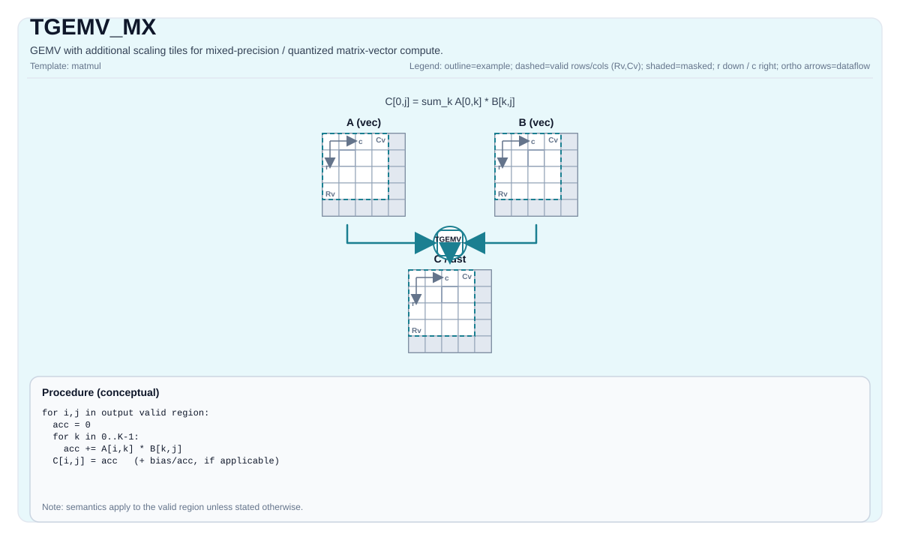

# TGEMV_MX

<!-- md-trans-meta sourceCommit=unknown translatedAt=2026-08-26T04:09:06.688Z pushedAt=2026-08-29T09:05:18.435Z -->

## Instruction Diagram



## Introduction

A GEMV variant with scaled tiles that supports mixed-precision/quantized matrix-vector computation.

This instruction is currently implemented only on A5 (see `include/pto/npu/a5/TMatmul.hpp`).

## Mathematical Semantics

Conceptually (base GEMV path):

$$
\mathrm{C}_{0,j} = \sum_{k=0}^{K-1} \mathrm{A}_{0,k} \cdot \mathrm{B}_{k,j}
$$

For `TGEMV_MX`, the scaled tiles participate in implementation-defined mixed-precision reconstruction/scaling. The architectural convention is that the output corresponds to the target-defined mx GEMV semantics.

## Assembly Syntax

Schematic form:

```text
%acc = tgemv.mx %a, %a_scale, %b, %b_scale : (!pto.tile<...>, !pto.tile<...>, !pto.tile<...>, !pto.tile<...>) -> !pto.tile<...>
```

### AS Level 1 (SSA)

```text
%acc = pto.tgemv.mx %a, %a_scale, %b, %b_scale : (!pto.tile<...>, !pto.tile<...>, !pto.tile<...>, !pto.tile<...>) -> !pto.tile<...>
```

### AS Level 2 (DPS)

```text
pto.tgemv.mx ins(%a, %a_scale, %b, %b_scale : (!pto.tile_buf<...>, !pto.tile_buf<...>, !pto.tile_buf<...>, !pto.tile_buf<...>)) outs(%acc : !pto.tile_buf<...>)
```

## C++ Built-in APIs

Declared in `include/pto/common/pto_instr.hpp`:
> The public include header is `<pto/pto-inst.hpp>`, and the internal declaration is located in `pto/common/pto_instr.hpp`.

```cpp
template <typename TileRes, typename TileLeft, typename TileLeftScale, typename TileRight, typename TileRightScale,
          typename... WaitEvents>
PTO_INST RecordEvent TGEMV_MX(TileRes &cMatrix, TileLeft &aMatrix, TileLeftScale &aScaleMatrix, TileRight &bMatrix, TileRightScale &bScaleMatrix, WaitEvents &... events);

template <AccPhase Phase, typename TileRes, typename TileLeft, typename TileLeftScale, typename TileRight,
          typename TileRightScale, typename... WaitEvents>
PTO_INST RecordEvent TGEMV_MX(TileRes &cMatrix, TileLeft &aMatrix, TileLeftScale &aScaleMatrix, TileRight &bMatrix, TileRightScale &bScaleMatrix, WaitEvents &... events);

template <typename TileRes, typename TileLeft, typename TileLeftScale, typename TileRight, typename TileRightScale,
          typename... WaitEvents>
PTO_INST RecordEvent TGEMV_MX(TileRes &cOutMatrix, TileRes &cInMatrix, TileLeft &aMatrix, TileLeftScale &aScaleMatrix, TileRight &bMatrix, TileRightScale &bScaleMatrix, WaitEvents &... events);

template <AccPhase Phase, typename TileRes, typename TileLeft, typename TileLeftScale, typename TileRight,
          typename TileRightScale, typename... WaitEvents>
PTO_INST RecordEvent TGEMV_MX(TileRes &cOutMatrix, TileRes &cInMatrix, TileLeft &aMatrix, TileLeftScale &aScaleMatrix, TileRight &bMatrix, TileRightScale &bScaleMatrix, WaitEvents &... events);

template <typename TileRes, typename TileLeft, typename TileLeftScale, typename TileRight, typename TileRightScale,
          typename TileBias, typename... WaitEvents>
PTO_INST RecordEvent TGEMV_MX(TileRes &cMatrix, TileLeft &aMatrix, TileLeftScale &aScaleMatrix, TileRight &bMatrix, TileRightScale &bScaleMatrix, TileBias &biasData, WaitEvents &... events);

template <AccPhase Phase, typename TileRes, typename TileLeft, typename TileLeftScale, typename TileRight,
          typename TileRightScale, typename TileBias, typename... WaitEvents>
PTO_INST RecordEvent TGEMV_MX(TileRes &cMatrix, TileLeft &aMatrix, TileLeftScale &aScaleMatrix, TileRight &bMatrix, TileRightScale &bScaleMatrix, TileBias &biasData, WaitEvents &... events);
```

Additional overloads support accumulate/bias variants and `AccPhase` selection.

## Constraints

- Uses backend-specific mx legality checks for data types, tile positions, fractal/layout combinations, and scaling formats.
- Scaled tile compatibility and accumulator promotion are implementation-defined by the target backend.
- For portability, verify the exact `(A, B, scaleA, scaleB, C)` type tuple and tile layout against the target implementation constraints.
- On Ascend 950PR/Ascend 950DT, the supported `(C, A, B)` triples (`C` is always `float`; the scaled tile is `float8_e8m0_t`): FP8 `(float, float8_e4m3_t, float8_e4m3_t)`, `(float, float8_e4m3_t, float8_e5m2_t)`, `(float, float8_e5m2_t, float8_e4m3_t)`, `(float, float8_e5m2_t, float8_e5m2_t)`; FP4 `(float, float4_e1m2x2_t, float4_e1m2x2_t)`, `(float, float4_e1m2x2_t, float4_e2m1x2_t)`, `(float, float4_e2m1x2_t, float4_e2m1x2_t)`, `(float, float4_e2m1x2_t, float4_e1m2x2_t)`.

## Examples

For actual usage patterns, see:

- `docs/isa/TMATMUL_MX.md`
- `docs/isa/TGEMV.md`

## ASM Examples

### Automatic Mode

```text
# Automatic mode: the compiler/runtime handles resource placement and scheduling.
%acc = pto.tgemv.mx %a, %a_scale, %b, %b_scale : (!pto.tile<...>, !pto.tile<...>, !pto.tile<...>, !pto.tile<...>) -> !pto.tile<...>
```

### Manual Mode

```text
# Manual mode: explicitly bind resources first, then issue the instruction.
# Optional (when the instruction contains tile operands):
# pto.tassign %arg0, @tile(0x1000)
# pto.tassign %arg1, @tile(0x2000)
%acc = pto.tgemv.mx %a, %a_scale, %b, %b_scale : (!pto.tile<...>, !pto.tile<...>, !pto.tile<...>, !pto.tile<...>) -> !pto.tile<...>
```

### PTO Assembly Form

```text
%acc = pto.tgemv.mx %a, %a_scale, %b, %b_scale : (!pto.tile<...>, !pto.tile<...>, !pto.tile<...>, !pto.tile<...>) -> !pto.tile<...>
# AS Level 2 (DPS)
pto.tgemv.mx ins(%a, %a_scale, %b, %b_scale : (!pto.tile_buf<...>, !pto.tile_buf<...>, !pto.tile_buf<...>, !pto.tile_buf<...>)) outs(%acc : !pto.tile_buf<...>)
```
