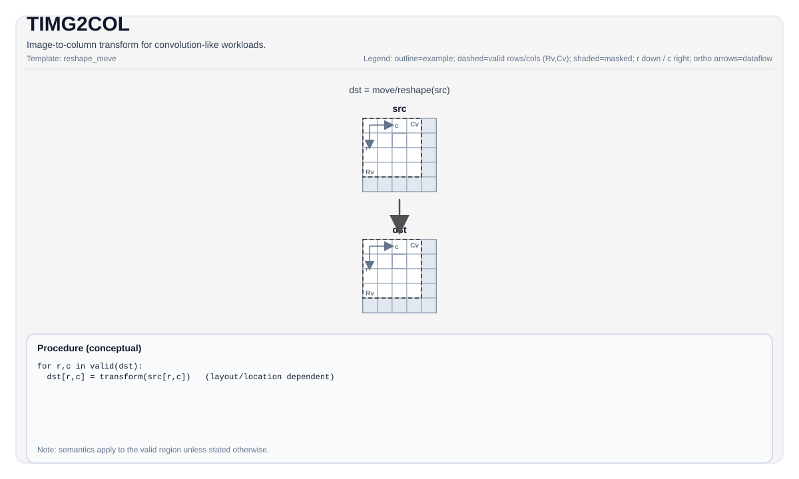

# TIMG2COL

<!-- md-trans-meta sourceCommit=unknown translatedAt=2026-08-26T04:13:05.689Z pushedAt=2026-08-29T09:05:18.437Z -->

## Instruction Diagram



## Introduction

Performs an image-to-column transformation for convolution-like workloads.

## Mathematical Semantics

Unless otherwise specified, the semantics are defined over the valid region, and target-dependent behavior is marked as implementation-defined.

## Assembly Syntax

### AS Level 1 (SSA)

```text
%dst = pto.timg2col %src : !pto.tile<...> -> !pto.tile<...>
```

### AS Level 2 (DPS)

```text
pto.timg2col ins(%src : !pto.tile_buf<...>) outs(%dst : !pto.tile_buf<...>)
```

## C++ Built-in APIs

Declared in `include/pto/common/pto_instr.hpp`:
> The public include header is `<pto/pto-inst.hpp>`, and the internal declaration is located in `pto/common/pto_instr.hpp`.

```cpp
template <typename TileData, typename ConvTileData, SetFmatrixMode FmatrixMode = SetFmatrixMode::FMATRIX_A_MANUAL, typename... WaitEvents>
PTO_INST RecordEvent TIMG2COL(TileData &dst, ConvTileData &src, uint16_t posM = 0, uint16_t posK = 0, WaitEvents &... events);
```

## Constraints

- This instruction is target/implementation-specific. For supported tile types/layouts and configuration fields, see `include/pto/npu/*/TImg2col.hpp`.
- **Implementation check (Atlas A2/A3 training products/Atlas A2/A3 inference products)**: `TileData::DType` must be one of the following: `int8_t`, `half`, `bfloat16_t`, `float`.
- **Implementation check (Ascend 950PR/Ascend 950DT)**: `TileData::DType` must be one of the following: `int8_t`, `uint8_t`, `int16_t`, `uint16_t`, `int32_t`, `uint32_t`, `half`, `bfloat16_t`, `float`.

## Examples

See the related examples in `docs/isa/` and `docs/coding/tutorials/`.

## ASM Examples

### Automatic Mode

```text
# Automatic mode: the compiler/runtime handles resource placement and scheduling.
%dst = pto.timg2col %src : !pto.tile<...> -> !pto.tile<...>
```

### Manual Mode

```text
# Manual mode: explicitly bind resources first, then issue the instruction.
# Optional (when this instruction contains tile operands):
# pto.tassign %arg0, @tile(0x1000)
# pto.tassign %arg1, @tile(0x2000)
%dst = pto.timg2col %src : !pto.tile<...> -> !pto.tile<...>
```

### PTO Assembly Form

```text
%dst = pto.timg2col %src : !pto.tile<...> -> !pto.tile<...>
# AS Level 2 (DPS)
pto.timg2col ins(%src : !pto.tile_buf<...>) outs(%dst : !pto.tile_buf<...>)
```
