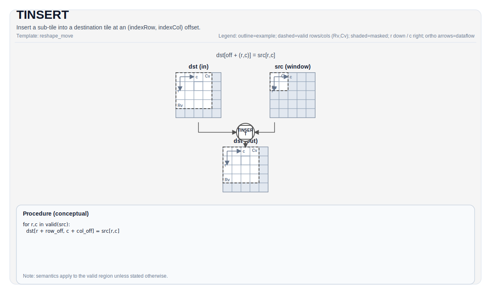

# TINSERT


## Tile Operation Diagram



## Introduction

Insert a source sub-tile into a destination tile at `(indexRow, indexCol)`. This is conceptually the inverse of `TEXTRACT` for many layouts.

## Math Interpretation

Let `R = src.GetValidRow()` and `C = src.GetValidCol()`. Conceptually, for `0 <= i < R` and `0 <= j < C`:

$$
\mathrm{dst}_{\mathrm{indexRow}+i,\;\mathrm{indexCol}+j} = \mathrm{src}_{i,j}
$$

## Assembly Syntax

PTO-AS form: see [PTO-AS Specification](../assembly/PTO-AS.md).

Synchronous form:

```text
%dst = tinsert %src[%r0, %r1] : !pto.tile<...> -> !pto.tile<...>
```

### AS Level 1 (SSA)

```text
%dst = pto.tinsert %src[%r0, %r1] : !pto.tile<...> -> !pto.tile<...>
```

### AS Level 2 (DPS)

```text
pto.tinsert ins(%src[%r0, %r1] : !pto.tile_buf<...>) outs(%dst : !pto.tile_buf<...>)
```
## C++ Intrinsic

Declared in `include/pto/common/pto_instr.hpp`:

```cpp
template <typename DstTileData, typename SrcTileData, typename... WaitEvents>
PTO_INST RecordEvent TINSERT(DstTileData &dst, SrcTileData &src, uint16_t indexRow, uint16_t indexCol, WaitEvents &... events);

template <typename DstTileData, typename SrcTileData, ReluPreMode reluMode, typename... WaitEvents>
PTO_INST RecordEvent TINSERT(DstTileData &dst, SrcTileData &src, uint16_t indexRow, uint16_t indexCol, WaitEvents &... events);

template <typename DstTileData, typename SrcTileData, ReluPreMode reluMode = ReluPreMode::NoRelu,
          typename... WaitEvents>
PTO_INST RecordEvent TINSERT(DstTileData &dst, SrcTileData &src, uint64_t preQuantScalar, uint16_t indexRow, uint16_t indexCol, WaitEvents &... events);

template <typename DstTileData, typename SrcTileData, typename FpTileData, ReluPreMode reluMode = ReluPreMode::NoRelu,
          typename... WaitEvents>
PTO_INST RecordEvent TINSERT_FP(DstTileData &dst, SrcTileData &src, FpTileData &fp, uint16_t indexRow, uint16_t indexCol, WaitEvents &... events);

#ifdef PTO_NPU_ARCH_A5
template <TInsertMode mode, typename DstTileData, typename SrcTileData, typename... WaitEvents>
PTO_INST RecordEvent TINSERT(DstTileData &dst, SrcTileData &src, uint32_t indexRow = 0, uint32_t indexCol = 0, WaitEvents &... events);
#endif
```

## Constraints

- **A2/A3**:
    - The documented overloads map to `Acc -> Mat` insertion paths, including plain, `reluMode`, scalar pre-quant, and vector pre-quant (`TINSERT_FP`) forms.
    - Runtime bounds must satisfy `indexRow + src.Rows <= dst.Rows` and `indexCol + src.Cols <= dst.Cols`.
- **A5**:
    - In addition to the `Acc -> Mat` insertion paths above, A5 also exposes `template <TInsertMode mode, ...> TINSERT(...)` for `Vec -> Mat` and `Vec -> Vec` insertion variants.
    - `mode == TInsertMode::ND` requires a row-major source vector tile and inserts into a matrix tile in ND layout.
    - `mode == TInsertMode::ND_VEC` requires both source and destination to be row-major vector tiles.
    - NZ-family modes (`NZ`, `NZ_PLUS_1`, `SPLIT2_NZ_PLUS_1`, `SPLIT4_NZ_PLUS_1`) require an NZ-format source vector tile and a matrix destination tile.

## Examples

See related examples in `docs/isa/` and `docs/coding/tutorials/`.

## ASM Form Examples

### Auto Mode

```text
# Auto mode: compiler/runtime-managed placement and scheduling.
%dst = pto.tinsert %src[%r0, %r1] : !pto.tile<...> -> !pto.tile<...>
```

### Manual Mode

```text
# Manual mode: bind resources explicitly before issuing the instruction.
# Optional for tile operands:
# pto.tassign %arg0, @tile(0x1000)
# pto.tassign %arg1, @tile(0x2000)
%dst = pto.tinsert %src[%r0, %r1] : !pto.tile<...> -> !pto.tile<...>
```

### PTO Assembly Form

```text
%dst = tinsert %src[%r0, %r1] : !pto.tile<...> -> !pto.tile<...>
# AS Level 2 (DPS)
pto.tinsert ins(%src[%r0, %r1] : !pto.tile_buf<...>) outs(%dst : !pto.tile_buf<...>)
```

