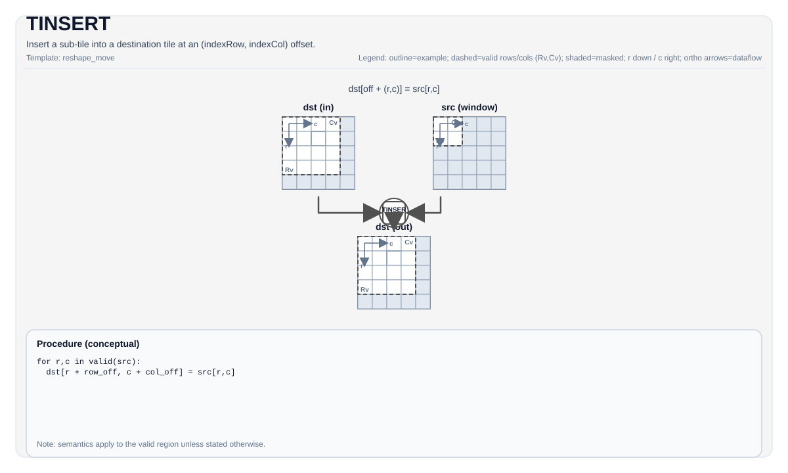

# TINSERT

<!-- md-trans-meta sourceCommit=unknown translatedAt=2026-08-26T04:14:28.076Z pushedAt=2026-08-29T09:05:18.438Z -->

## Instruction Diagram



## Introduction

Inserts a source sub-tile into a destination tile at the `(indexRow, indexCol)` offset. Conceptually, it is the inverse operation of `TEXTRACT`.

`TINSERT` is used for:

- Acc → Mat insertion (with optional relu, scalar quantization, or vector quantization)
- Acc → Vec insertion (with optional `AccToVecMode`, relu, scalar quantization, or vector quantization) *(Ascend 950PR/Ascend 950DT)*
- Vec → Mat insertion (ND and NZ layouts) *(Ascend 950PR/Ascend 950DT)*
- Vec → Vec insertion (ND and NZ layouts) *(Ascend 950PR/Ascend 950DT)*
- NZ split insertion (`SPLIT2`, `SPLIT4`) *(Ascend 950PR/Ascend 950DT)*

## Mathematical Semantics

Assume `R = src.GetValidRow()` and `C = src.GetValidCol()`. For `0 <= i < R` and `0 <= j < C`:

$$
\mathrm{dst}_{\mathrm{indexRow}+i,\;\mathrm{indexCol}+j} = \mathrm{src}_{i,j}
$$

## Assembly Syntax

Synchronous form:

```text
%dst = tinsert %src[%r0, %r1] : !pto.tile<...> -> !pto.tile<...>
```

### AS Level 1 (SSA)

```text
%dst = pto.tinsert %src, %idxrow, %idxcol : (!pto.tile<...>, dtype, dtype) -> !pto.tile<...>
```

### AS Level 2 (DPS)

```text
pto.tinsert ins(%src, %idxrow, %idxcol : !pto.tile_buf<...>, dtype, dtype) outs(%dst : !pto.tile_buf<...>)
```

## C++ Built-in APIs

Declared in `include/pto/common/pto_instr.hpp`:
> The public include header is `<pto/pto-inst.hpp>`, and the internal declaration is located in `pto/common/pto_instr.hpp`.

```cpp
template <typename DstTileData, typename SrcTileData, typename... WaitEvents>
PTO_INST RecordEvent TINSERT(DstTileData &dst, SrcTileData &src,
                             uint16_t indexRow, uint16_t indexCol,
                             WaitEvents &... events);

template <typename DstTileData, typename SrcTileData, ReluPreMode reluMode,
          typename... WaitEvents>
PTO_INST RecordEvent TINSERT(DstTileData &dst, SrcTileData &src,
                             uint16_t indexRow, uint16_t indexCol,
                             WaitEvents &... events);

template <typename DstTileData, typename SrcTileData, AccToVecMode mode,
          ReluPreMode reluMode = ReluPreMode::NoRelu, typename... WaitEvents>
PTO_INST RecordEvent TINSERT(DstTileData &dst, SrcTileData &src,
                             uint16_t indexRow, uint16_t indexCol,
                             WaitEvents &... events);

template <typename DstTileData, typename SrcTileData,
          ReluPreMode reluMode = ReluPreMode::NoRelu, typename... WaitEvents>
PTO_INST RecordEvent TINSERT(DstTileData &dst, SrcTileData &src,
                             uint64_t preQuantScalar,
                             uint16_t indexRow, uint16_t indexCol,
                             WaitEvents &... events);

template <typename DstTileData, typename SrcTileData, AccToVecMode mode,
          ReluPreMode reluMode = ReluPreMode::NoRelu, typename... WaitEvents>
PTO_INST RecordEvent TINSERT(DstTileData &dst, SrcTileData &src,
                             uint64_t preQuantScalar,
                             uint16_t indexRow, uint16_t indexCol,
                             WaitEvents &... events);

template <typename DstTileData, typename SrcTileData, typename FpTileData,
          ReluPreMode reluMode = ReluPreMode::NoRelu, typename... WaitEvents>
PTO_INST RecordEvent TINSERT_FP(DstTileData &dst, SrcTileData &src,
                                FpTileData &fp,
                                uint16_t indexRow, uint16_t indexCol,
                                WaitEvents &... events);

template <typename DstTileData, typename SrcTileData, typename FpTileData,
          AccToVecMode mode, ReluPreMode reluMode = ReluPreMode::NoRelu,
          typename... WaitEvents>
PTO_INST RecordEvent TINSERT(DstTileData &dst, SrcTileData &src,
                             FpTileData &fp,
                             uint16_t indexRow, uint16_t indexCol,
                             WaitEvents &... events);

#if defined(PTO_NPU_ARCH_A5) || defined(PTO_NPU_ARCH_KIRIN9030) || defined(PTO_NPU_ARCH_KIRINX90)
template <TInsertMode mode, typename DstTileData, typename SrcTileData,
          typename... WaitEvents>
PTO_INST RecordEvent TINSERT(DstTileData &dst, SrcTileData &src,
                             uint16_t indexRow = 0, uint16_t indexCol = 0,
                             WaitEvents &... events);
#endif
```

## Constraints

### General Constraints/Checks

- `TINSERT` has the following overload families:
    - Normal insertion: `TINSERT(dst, src, indexRow, indexCol)`
    - relu form: `TINSERT<..., reluMode>(dst, src, indexRow, indexCol)`
    - Accumulator-to-vector form: `TINSERT<..., mode, reluMode>(dst, src, indexRow, indexCol)`
    - Scalar quantization form: `TINSERT<..., reluMode>(dst, src, preQuantScalar, indexRow, indexCol)` and `TINSERT<..., mode, reluMode>(dst, src, preQuantScalar, indexRow, indexCol)`
    - Vector quantization form: `TINSERT_FP<..., reluMode>(dst, src, fp, indexRow, indexCol)` and `TINSERT<..., FpTileData, mode, reluMode>(dst, src, fp, indexRow, indexCol)`
    - NZ split form *(Ascend 950PR/Ascend 950DT/Kirin9030/KirinX90 only)*: `TINSERT<TInsertMode::SPLIT2>(dst, src, indexRow, indexCol)` or `TINSERT<TInsertMode::SPLIT4>(...)`
- `reluMode` takes the value of `ReluPreMode::{NoRelu, NormalRelu}`.
- `mode` takes the value of `AccToVecMode::{SingleModeVec0, SingleModeVec1, DualModeSplitM, DualModeSplitN}`.
- Runtime boundary: `indexRow + src.ValidRow <= dst.Rows` and `indexCol + src.ValidCol <= dst.Cols`.

### Implementation Check for Atlas A2/A3 Training Products/Atlas A2/A3 Inference Products

- Supported tile type pairs: only `TileType::Acc → TileType::Mat`.
- The source layout must be `(BFractal: ColMajor, SFractal: RowMajor)`.
- The target layout must be `(BFractal: ColMajor, SFractal: RowMajor)`, and `SFractalSize == 512`.
- `Dst.Cols * sizeof(DstDType)` must be a non-zero multiple of `32` bytes.
- Supported dtype pairs for **normal/relu** (non-quantized):
    - `float` Acc → `half`, `bfloat16_t`
- Supported dtype pairs for **scalar quantization**:
    - `float` Acc → `int8_t`
    - `int32_t` Acc → `int8_t`, `uint8_t`, `half`, `int16_t`
- Supported dtype pairs for **vector quantization** (`TINSERT_FP`):
    - `float` Acc → `int8_t`
    - `int32_t` Acc → `int8_t`, `uint8_t`, `half`, `int16_t`
- Vector quantization requires providing the `FpTileData` scaling operand (`TileType::Scaling`).

### Ascend 950PR/Ascend 950DT Implementation Check

In addition to the Acc → Mat path, Ascend 950PR/Ascend 950DT also supports the Acc → Vec, Vec → Vec, Vec → Mat, and NZ split paths.

- **Acc → Mat** (`TileType::Acc → TileType::Mat`):
    - The source Acc type must be `float` or `int32_t`; the source layout must be `(BFractal: ColMajor, SFractal: RowMajor)`.
    - The target layout must be `(!isRowMajor, SFractal: RowMajor)` (NZ format).
    - **Non-quantized** (normal/relu) target types:
        - `float` Acc → `half`, `bfloat16_t`, `float`
        - `int32_t` Acc → `int32_t`
    - **Scalar quantization** target types:
        - `float` Acc → `int8_t`, `uint8_t`, `hifloat8_t`, `half`, `bfloat16_t`, `float8_e4m3_t`
        - `int32_t` Acc → `int8_t`, `uint8_t`, `half`, `bfloat16_t`
    - **Vector quantization** (`TINSERT_FP`) target type: same as scalar quantization.

- **Acc → Vec** (`TileType::Acc → TileType::Vec`):
    - The source Acc type must be `float` or `int32_t`; the source layout must be `(BFractal: ColMajor, SFractal: RowMajor)`.
    - **Non-quantized** (normal/relu) target type:
        - `float` Acc → `half`, `bfloat16_t`, `float`
        - `int32_t` Acc → `int32_t`
    - **Scalar quantization** target type:
        - `float` Acc → `int8_t`, `uint8_t`, `hifloat8_t`, `half`, `bfloat16_t`, `float8_e4m3_t`
        - `int32_t` Acc → `int8_t`, `uint8_t`, `half`, `bfloat16_t`
    - **Vector quantization** (`TINSERT_FP`/`TINSERT` with `FpTileData`) target type: same as scalar quantization.
    - The target layout must be one of the following: NZ-to-NZ (`!isRowMajor, SFractal: RowMajor`), NZ-to-ND (`isRowMajor, SFractal: NoneBox`), or NZ-to-DN (`!isRowMajor, SFractal: NoneBox`).
    - `AccToVecMode` selects `SingleModeVec0`, `SingleModeVec1`, `DualModeSplitM`, or `DualModeSplitN`.
    - Dual-target modes (`DualModeSplitM`, `DualModeSplitN`) require `QuantMode_t::NoQuant` and do not support the NZ-to-DN path.
    - For 32-bit target types (`float`/`int32_t`), when using `DualModeSplitN`, the `ValidCol` before splitting must be an integer multiple of `32`.
    - The target stride must be non-zero, and `dstStride * sizeof(dstType)` must be a multiple of `32` bytes.

- **Vec → Vec** (`TileType::Vec → TileType::Vec`):
    - `DstTileData::DType` must equal `SrcTileData::DType`.
    - Supported element types: `half`, `bfloat16_t`, `float`, `int32_t`, `int8_t`, `hifloat8_t`, `float8_e4m3_t`, `float8_e5m2_t`, `float8_e8m0_t`, `float4_e2m1x2_t`, `float4_e1m2x2_t`.
    - The source and target layouts must match (both ND or both NZ).
    - ND path: The source valid region must be within the target boundary. The dispatch selects `copy_ubuf_to_ubuf` (aligned), `vlds`/`vsts` (stride-aligned, unaligned validCol), `vlds`/`vstus` (unaligned stride or indexCol), or scalar copy (1×1 element).
    - NZ path: The number of source columns must not exceed the number of target columns. Use `ComputeNZBlockParams` for fractal block `copy_ubuf_to_ubuf`.

- **Vec → Mat** (`TileType::Vec → TileType::Mat`, UB → L1):
    - `DstTileData::DType` must equal `SrcTileData::DType`.
    - Supported element types: `half`, `bfloat16_t`, `float`, `int32_t`, `int8_t`, `hifloat8_t`, `float8_e4m3_t`, `float8_e5m2_t`, `float8_e8m0_t`, `float4_e2m1x2_t`, `float4_e1m2x2_t`.
    - ND path: The source must be `isRowMajor`; use `copy_ubuf_to_cbuf`. The number of bytes per row must be aligned with `BLOCK_BYTE_SIZE` (32 bytes).
    - NZ path: The source must be `(!isRowMajor, SFractal: RowMajor)`; use `ComputeNZBlockParams` for fractal block `copy_ubuf_to_cbuf`.

- **NZ Split** (`TInsertMode::SPLIT2` / `TInsertMode::SPLIT4`, only Ascend 950PR/Ascend 950DT/Kirin9030/KirinX90):
    - The target must be `TileType::Mat`; the source must be `TileType::Vec`.
    - `DstTileData::DType` must equal `SrcTileData::DType`.
    - The source must be in NZ format: `(!isRowMajor, SFractal: RowMajor)`.
    - Supported element types: `half`, `bfloat16_t`, `float`, `int32_t`, `int8_t`, `hifloat8_t`, `float8_e4m3_t`, `float8_e5m2_t`, `float8_e8m0_t`, `float4_e2m1x2_t`, `float4_e1m2x2_t`.
    - `validRow` is aligned to `FRACTAL_NZ_ROW` (16) for burst calculation.
    - Split the total burst of `copy_ubuf_to_cbuf` into 2 or 4 sub-transfers, each handling `totalBurstNum / SplitCount` column blocks.

## Examples

### Automatic

```cpp
#include <pto/pto-inst.hpp>

using namespace pto;

// Vec -> Mat insertion (NZ layout)
void example_auto() {
  using SrcT = Tile<TileType::Vec, half, 16, 32, BLayout::ColMajor, 16, 32, SLayout::RowMajor>;
  using DstT = Tile<TileType::Mat, half, 16, 32, BLayout::ColMajor, -1, -1, SLayout::RowMajor>;
  SrcT src;
  DstT dst(16, 32);
  TINSERT(dst, src, /*indexRow=*/0, /*indexCol=*/0);
}
```

### Manual

```cpp
#include <pto/pto-inst.hpp>

using namespace pto;

// Vec -> Mat insertion (NZ layout, manual buffer allocation)
void example_manual() {
  using SrcT = Tile<TileType::Vec, half, 16, 32, BLayout::ColMajor, 16, 32, SLayout::RowMajor>;
  using DstT = Tile<TileType::Mat, half, 16, 32, BLayout::ColMajor, -1, -1, SLayout::RowMajor>;
  SrcT src;
  DstT dst(16, 32);
  TASSIGN(src, 0x0);
  TASSIGN(dst, 0x0);
  TINSERT(dst, src, /*indexRow=*/0, /*indexCol=*/0);
}
```

## ASM Examples

### Automatic Mode

```text
# Automatic mode: the compiler/runtime handles resource placement and scheduling.
%dst = pto.tinsert %src, %idxrow, %idxcol : (!pto.tile<...>, dtype, dtype) -> !pto.tile<...>
```

### Manual Mode

```text
# Manual mode: explicitly bind resources first, then issue the instruction.
# pto.tassign %arg0, @tile(0x1000)
# pto.tassign %arg1, @tile(0x2000)
%dst = pto.tinsert %src, %idxrow, %idxcol : (!pto.tile<...>, dtype, dtype) -> !pto.tile<...>
```

### PTO Assembly Form

```text
%dst = tinsert %src[%r0, %r1] : !pto.tile<...> -> !pto.tile<...>
# AS Level 2 (DPS)
pto.tinsert ins(%src, %idxrow, %idxcol : !pto.tile_buf<...>, dtype, dtype) outs(%dst : !pto.tile_buf<...>)
```
