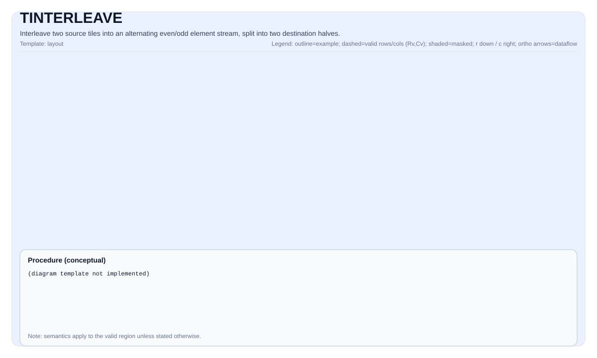

# TINTERLEAVE

<!-- md-trans-meta sourceCommit=unknown translatedAt=2026-08-26T04:14:31.265Z pushedAt=2026-08-29T09:05:18.437Z -->

## Instruction Diagram



## Introduction

Interleaves two source tiles (`src0` and `src1`) into two destination tiles (`dst0` and `dst1`). This operation combines the elements of `src0` and `src1` in an alternating pattern to produce an interleaved stream, then splits the interleaved stream at its midpoint into two halves, placing the first half into `dst0` and the second half into `dst1`. Each destination tile holds one half of the interleaved stream.

`TInterleave` is the inverse operation of `TDeInterleave`.

## Mathematical Semantics

### Dual-Source Form

Given two source tiles `src0` and `src1` with the same valid shape `(validRows, validCols)`, an interleaved stream of length `2 × validCols` is constructed for each row:

$$ \mathrm{interleaved}_{2k} = \mathrm{src0}_{i, k}, \quad \mathrm{interleaved}_{2k+1} = \mathrm{src1}_{i, k}, \quad 0 \le k < \mathrm{validCols} $$

The interleaved stream is then split into two halves:

$$ \mathrm{dst0}_{i, j} = \mathrm{interleaved}_{j}, \quad 0 \le j < \mathrm{validCols} $$
$$ \mathrm{dst1}_{i, j} = \mathrm{interleaved}_{\mathrm{validCols} + j}, \quad 0 \le j < \mathrm{validCols} $$

Where `validRows = dst0.GetValidRow()` and `validCols = dst0.GetValidCol()`.

## Assembly Syntax

Synchronous form:

```text
%dst0, %dst1 = tinterleave %src0, %src1 : !pto.tile<...>
```

### AS Level 1 (SSA)

```text
%dst0, %dst1 = pto.tinterleave %src0, %src1 : (!pto.tile<...>, !pto.tile<...>) -> (!pto.tile<...>, !pto.tile<...>)
```

### AS Level 2 (DPS)

```text
pto.tinterleave ins(%src0, %src1 : !pto.tile_buf<...>, !pto.tile_buf<...>) outs(%dst0, %dst1 : !pto.tile_buf<...>, !pto.tile_buf<...>)
```

## C++ Built-in APIs

Declared in `include/pto/common/pto_instr.hpp`:
> The public include header is `<pto/pto-inst.hpp>`, and the internal declaration is located in `pto/common/pto_instr.hpp`.

```cpp
template <typename TileDataDst, typename TileDataSrc, typename... WaitEvents>
PTO_INST RecordEvent TINTERLEAVE(TileDataDst &dst1, TileDataDst &dst0, TileDataSrc &src1, TileDataSrc &src0,
                                 WaitEvents &...events);
```

> **Note**: The parameter order is `(dst1, dst0, src1, src0)`. `dst0` receives the first half of the interleaved stream (positions `0 … validCols-1`), and `dst1` receives the second half (positions `validCols … 2×validCols-1`).

## Constraints

- **Implementation check (Ascend 950PR/Ascend 950DT)**:
    - `TileData::DType` must be one of the following: `int32_t`, `uint32_t`, `float`, `int16_t`, `uint16_t`, `half`, `bfloat16_t`, `uint8_t`, `int8_t`.
    - The tile layout must be row-major (`TileData::isRowMajor`).
    - All tiles (`dst0`, `dst1`, `src0`, `src1`) must have the same `DType` and the same valid shape.
    - The `validCol` of all tiles must be even (`dst0.GetValidCol() % 2 == 0`). Since all tiles share the same valid shape, this is equivalent to requiring `dst0.GetValidCol() % 2 == 0`.
- **Valid region**:
    - This operation uses `dst0.GetValidRow()`/`dst0.GetValidCol()` as the iteration domain; `src0/src1/dst1` are assumed to be compatible.

## Examples

### Automatic

```cpp
#include <pto/pto-inst.hpp>

using namespace pto;

void example_auto() {
    using TileT = Tile<TileType::Vec, float, 16, 64>;
    TileT src0(16, 64), src1(16, 64);
    TileT dst0(16, 64), dst1(16, 64);

    TINTERLEAVE(dst1, dst0, src1, src0);
}
```

### Manual

```cpp
#include <pto/pto-inst.hpp>

using namespace pto;

void example_manual() {
    using TileT = Tile<TileType::Vec, half, 16, 256, BLayout::RowMajor, 16, 256>;
    TileT src0, src1, dst0, dst1;

    TASSIGN(src0, 0x1000);
    TASSIGN(src1, 0x2000);
    TASSIGN(dst0, 0x3000);
    TASSIGN(dst1, 0x4000);

    TINTERLEAVE(dst1, dst0, src1, src0);
}
```

## ASM Examples

### Automatic Mode

```text
# Automatic mode: the compiler/runtime is responsible for resource placement and scheduling.
%dst0, %dst1 = pto.tinterleave %src0, %src1 : (!pto.tile<...>, !pto.tile<...>) -> (!pto.tile<...>, !pto.tile<...>)
```

### Manual Mode

```text
# Manual mode: explicitly bind resources first, then issue the instruction.
# Optional (when the instruction contains tile operands):
# pto.tassign %src0, @tile(0x1000)
# pto.tassign %src1, @tile(0x2000)
# pto.tassign %dst0, @tile(0x3000)
# pto.tassign %dst1, @tile(0x4000)
%dst0, %dst1 = pto.tinterleave %src0, %src1 : (!pto.tile<...>, !pto.tile<...>) -> (!pto.tile<...>, !pto.tile<...>)
```

### PTO Assembly Form

```text
%dst0, %dst1 = tinterleave %src0, %src1 : !pto.tile<...>
# AS Level 2 (DPS)
pto.tinterleave ins(%src0, %src1 : !pto.tile_buf<...>, !pto.tile_buf<...>) outs(%dst0, %dst1 : !pto.tile_buf<...>, !pto.tile_buf<...>)
```

## Related Instructions

- [TDeInterleave](TDEINTERLEAVE.md) - Deinterleaves two tiles back into the original even/odd streams (the inverse operation of TInterleave).
