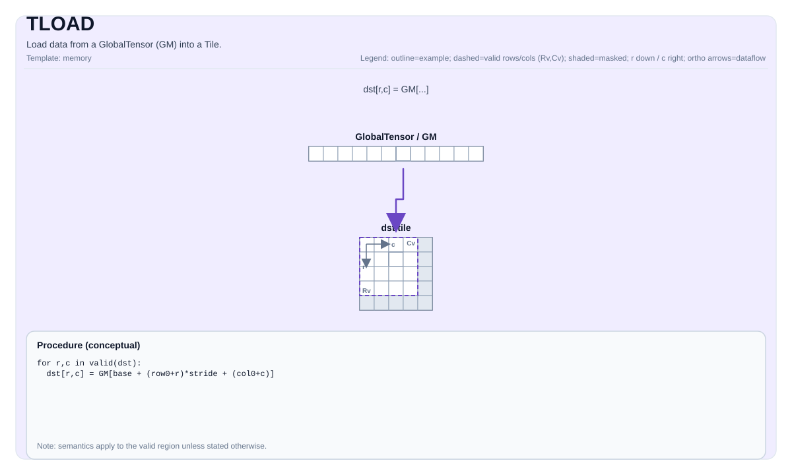

# TLOAD


## Tile Operation Diagram



## Introduction

Load data from a GlobalTensor (GM) into a Tile.

## Math Interpretation

Notation depends on the `GlobalTensor` shape/stride and the `Tile` layout. Conceptually (2D view, with a base offset):

$$ \mathrm{dst}_{i,j} = \mathrm{src}_{r_0 + i,\; c_0 + j} $$

## Assembly Syntax

Synchronous form:

```text
%t0 = tload %sv[%c0, %c0] : (!pto.memref<...>, index, index) -> !pto.tile<...>
```

### AS Level 1 (SSA)

```text
%dst = pto.tload %mem : !pto.partition_tensor_view<MxNxdtype> ->
!pto.tile<loc, dtype, rows, cols, blayout, slayout, fractal, pad>
```

### AS Level 2 (DPS)

```text
pto.tload ins(%mem : !pto.partition_tensor_view<MxNxdtype>) outs(%dst : !pto.tile_buf<...>)
```
## C++ Intrinsic

Declared in `include/pto/common/pto_instr.hpp`:

```cpp
template <typename TileData, typename GlobalData, typename... WaitEvents>
PTO_INST RecordEvent TLOAD(TileData &dst, GlobalData &src, WaitEvents &... events);

template <TLoadL2Hint l2Control, typename TileData, typename GlobalData, typename... WaitEvents>
PTO_INST RecordEvent TLOAD(TileData &dst, GlobalData &src, WaitEvents &... events);
```

Existing `TLOAD(dst, src)` and `TLOAD<TileT, GTensor>(dst, src)` still work. The `TLoadL2Hint`-first form is an extra overload (no default on `l2Control`).

## L2 cache hint

Optional first-template overload (existing `TLOAD(dst, src)` unchanged):

```cpp
TLOAD<TLoadL2Hint::NotAllocKeep>(dst, src);
```

Supported `TLoadL2Hint` values:

| Enumerator | Value | A2/A3 | A5 |
| --- | --- | --- | --- |
| NormalFirstVictim | 0 | default allocate (no-op) | yes |
| NormalLastVictim | 1 | default allocate (no-op) | yes |
| NormalPersistent | 2 | default allocate (no-op) | yes |
| NotAllocKeep | 4 | non-allocate (GM addr += runtime `l2Cacheoffset`) | yes |
| NotAllocClean | 5 | non-allocate (same as Keep) | yes |
| NotAllocDrop | 6 | non-allocate (same as Keep) | yes |

On A2/A3 there are effectively **two options only**:

1. **Default allocate** — `NormalFirstVictim` (0), `NormalLastVictim` (1), `NormalPersistent` (2): no-ops on A2/A3 (no effect on VLU / different last/first/persist hints). They are not meaningful distinct modes; all follow the default allocate path.
2. **Non-allocate** — `NotAllocKeep` (4), `NotAllocClean` (5), `NotAllocDrop` (6): yes, via GM addr += runtime `l2Cacheoffset` (same behavior for Keep/Clean/Drop on A2/A3).

On A5 all listed values are passed through to DMA. CPU / costmodel accept the template and ignore it.

## Constraints

- **Implementation checks (A2A3)**:
    - `TileData::DType` must be one of: `int8_t`, `uint8_t`, `int16_t`, `uint16_t`, `int32_t`, `uint32_t`, `int64_t`, `uint64_t`, `half`, `bfloat16_t`, `float`.
    - Destination tile location must be `TileType::Vec` or `TileType::Mat`.
    - `sizeof(TileData::DType) == sizeof(GlobalData::DType)`.
    - Runtime: all `src.GetShape(dim)` values and `dst.GetValidRow()/GetValidCol()` must be `> 0`.
    - `TileType::Vec` loads only support matching layouts: ND->ND, DN->DN, NZ->NZ.
    - `TileType::Mat` loads support: ND->ND, DN->DN, NZ->NZ, plus ND->NZ and DN->ZN.
    - For ND->NZ: `GlobalData::staticShape[0..1] == 1` and `TileData::SFractalSize == 512`.
    - For DN->ZN: `GlobalData::staticShape[0..2] == 1` and `TileData::SFractalSize == 512`.
    - ND->NZ also accepts `GlobalData::staticShape[2] != 1`. `Shape2` is then the number of ND matrices
      a single instruction moves (the instruction's own `ndNum` operand), each matrix being
      `[Shape3, Shape4]`, and the matrices are stacked along the tile rows, so
      `dst.GetValidRow() == Shape2 * Shape3`. Because `srcNdMatrixStride` and `dstNzMatrixStride` are
      16-bit element counts on this platform, it also requires `Stride2 <= 65535` and
      `Shape3 * (32 / sizeof(DType)) <= 65535`, on top of `Shape2 * Shape3 <= TileData::Rows` and
      `1 <= Shape2 <= 65535`.
    - For `int64_t/uint64_t`, only ND->ND or DN->DN are supported.
    - Vec tile (UB path): `1 <= TileData::Rows <= 4095`.
    - Mat tile (L1 path): `1 <= TileData::Rows <= 16384`.
- **Implementation checks (A5)**:
    - `sizeof(TileData::DType)` must be `1`, `2`, `4`, or `8` bytes, and must match `sizeof(GlobalData::DType)`.
    - For `int64_t/uint64_t`, `TileData::PadVal` must be `PadValue::Null` or `PadValue::Zero`.
    - `TileType::Vec` loads require one of the following layout pairs:
    - ND with row-major + `SLayout::NoneBox` (ND->ND),
    - DN with col-major + `SLayout::NoneBox` (DN->DN),
    - NZ with `SLayout::RowMajor` (NZ->NZ).
    - For row-major ND->ND with compile-time-known shapes, `TileData::ValidCol` must equal `GlobalData::staticShape[4]`, and `TileData::ValidRow` must equal the product of `GlobalData::staticShape[0..3]`.
    - `TileType::Mat` loads are additionally constrained by `TLoadCubeCheck` (e.g., only specific ND/DN/NZ conversions and L1-size limits).
    - For `TileType::Mat` ND->NZ and DN->NZ: `TileData::SFractalSize == 512`, `sizeof(TileData::DType) != 8`, and `GlobalData::staticShape[0] == 1 && GlobalData::staticShape[1] == 1`.
    - ND->NZ additionally accepts `GlobalData::staticShape[2] != 1` (including dynamic Shape2).
      `Shape2` is the available number of ND matrices of shape `[Shape3, Shape4]`, stacked along the tile rows.
      Runtime: `1 <= Shape2 <= 65535`, `1 <= Shape3 <= 16384`, and
      `1 <= dst.GetValidRow() <= min(TileData::Rows, Shape2 * Shape3)`. The data type must not be fp4.
    - DN->NZ requires `GlobalData::staticShape[2] == 1`.
    - For `TileType::Mat` DN->ZN, the ZN tile uses `BLayout::RowMajor` and `SLayout::ColMajor`.
      `GlobalData::staticShape[2] != 1` (including dynamic Shape2) selects the multi-matrix path.
      `Shape2` is the available number of DN matrices of shape `[Shape3, Shape4]`, merged along the tile columns;
      `Stride2` is the distance between consecutive matrices in elements. Rows within each matrix must be
      contiguous (`Stride3 == 1`); `Stride4` is the distance between consecutive columns in elements.
    - The multi-matrix DN->ZN path requires `GlobalData::staticShape[0..1] == 1`,
      `TileData::SFractalSize == 512`, `sizeof(TileData::DType)` of `1`, `2`, or `4` bytes (excluding fp4/hif4),
      and `TileData::Cols <= 65535`. Runtime: `1 <= Shape2 <= 65535`, `1 <= Shape4 <= 16384`,
      `1 <= dst.GetValidCol() <= min(TileData::Cols, Shape2 * Shape4)`, and
      `1 <= dst.GetValidRow() <= min(TileData::Rows, Shape3)`.
    - A5 `TileType::Mat` multi-matrix ND->NZ and DN->ZN preserve 64-bit source strides for both static and dynamic
      `Stride` values.
      `Stride2` and the within-matrix stride (`Stride3` for ND, `Stride4` for DN) are `int64_t` element counts.
      For the supported b8/b16/b32 types, their byte distances are `stride * sizeof(DType)`, computed in 64 bits;
      element strides above `INT32_MAX` and byte distances of 4 GiB or more are not truncated to 32 bits.
      Form large stride expressions with 64-bit operands before passing them to `Stride`, and provide GM storage
      covering all accessed addresses.
    - `TileType::Mat` loads also handle loads for mx format, which include `MX_A_ZZ/MX_A_ND/MX_A_DN` to ZZ for scalarA and `MX_B_NN/MX_B_ND/MX_B_DN` to NN for scalarB.
    - for `MX_A_ZZ/MX_B_NN`: `(GlobalData::staticShape[3] == 16 || GlobalData::staticShape[3] == -1)` and `(GlobalData::staticShape[4] == 2 || GlobalData::staticShape[4] == -1)`.
    - for `MX_A_ND/MX_A_DN/MX_B_ND/MX_B_DN`: `(GlobalData::staticShape[0] == 1 || GlobalData::staticShape[0] == -1)` and `(GlobalData::staticShape[1] == 1 || GlobalData::staticShape[1] == -1)` and `(GlobalData::staticShape[4] == 2 || GlobalData::staticShape[4] == -1)`.
    - for scaleA, `dst.GetValidCol() % 2 == 0`.
    - for scaleB, `dst.GetValidRow() % 2 == 0`

- **Valid region**:
    - The implementation uses `dst.GetValidRow()` / `dst.GetValidCol()` as the transfer size.
    - On A2/A3, same-layout, block-aligned `TileType::Mat` loads write only this valid region. ND-to-NZ/DN-to-ZN loads (and the single-row/single-column Mat special paths) additionally zero-fill the final partial C0 block. Other data remains unchanged, including data owned by tile views that share the same backing storage.
    - On A5, same-layout `TileType::Mat` ND/DN loads fill only the final partial 32-byte block according to `PadVal`; ND/DN-to-fractal loads zero-fill the final partial C0 block. Full 32-byte gaps and inactive rows or columns remain unchanged.
    - On A5, ND->NZ with `GlobalData::staticShape[2] != 1` loads the first `dst.GetValidRow()` merged rows.
      It transfers `dst.GetValidRow() / Shape3` complete matrices in one instruction, then transfers
      `dst.GetValidRow() % Shape3` tail rows separately if needed. With no complete matrices, only the tail
      transfer is issued. Both transfers retain the full tile's NZ column-block stride. This also applies
      when Shape2 is dynamic and its runtime value is 1. For example, `Shape3 = 3` and `dst.GetValidRow() = 17`
      load five complete matrices and the first two rows of the sixth matrix, requiring `Shape2 >= 6`.
    - On A5, DN->ZN with `GlobalData::staticShape[2] != 1` loads the first `dst.GetValidCol()` merged columns.
      It transfers `dst.GetValidCol() / Shape4` complete matrices in one instruction, then transfers
      `dst.GetValidCol() % Shape4` columns from the next matrix if needed. With no complete matrices, only
      the tail transfer is issued. This also applies when Shape2 is dynamic and its runtime value is 1.
      When a tail is present, with `n = dst.GetValidCol() / Shape4`, it starts at
      `src.data() + n * Stride2` (element offset). The source offset retains 64-bit precision even when
      the byte distance is 4 GiB or more.
      Both transfers retain `TileData::Cols` as the C0-block stride (in 32-byte units).
      Only the final partial C0 block along the valid rows is zero-filled; inactive columns and full
      C0 blocks beyond the valid rows retain their previous contents.
      A compile-time Shape2 of 1 uses the single-matrix path: the transfer covers `Shape4` columns and
      `dst.GetValidRow()` rows, so the source shape must describe the columns to load.
    - On A2/A3 and A5, a `TileType::Vec` ND/DN load with a non-null `PadVal` fills only the sub-32-byte tail after each transferred burst. Full 32-byte gaps and inactive rows or columns remain unchanged; NZ loads and `PadValue::Null` do not add padding.

## Examples

### Auto

```cpp
#include <pto/pto-inst.hpp>

using namespace pto;

template <typename T>
void example_auto(__gm__ T* in) {
  using TileT = Tile<TileType::Vec, T, 16, 16>;
  using GShape = Shape<1, 1, 1, 16, 16>;
  using GStride = BaseShape2D<T, 16, 16, Layout::ND>;
  using GTensor = GlobalTensor<T, GShape, GStride, Layout::ND>;

  GTensor gin(in);
  TileT t;
  TLOAD(t, gin);
}
```

### Manual

```cpp
#include <pto/pto-inst.hpp>

using namespace pto;

template <typename T>
void example_manual(__gm__ T* in) {
  using TileT = Tile<TileType::Vec, T, 16, 16>;
  using GShape = Shape<1, 1, 1, 16, 16>;
  using GStride = BaseShape2D<T, 16, 16, Layout::ND>;
  using GTensor = GlobalTensor<T, GShape, GStride, Layout::ND>;

  GTensor gin(in);
  TileT t;
  TASSIGN(t, 0x1000);
  TLOAD(t, gin);
}
```

### A5 multi-matrix DN-to-ZN load (Manual)

The following Cube function loads 17 merged columns: five complete 3-column matrices and two columns
from the sixth. Physical GM storage is `[8, 9, 64]` (matrix, column, row); the DN view selects 3 columns
and 35 rows per matrix. Strides are in elements.

```cpp
#include <pto/pto-inst.hpp>

using namespace pto;

AICORE void example_dn_to_zn(__gm__ int16_t* in) {
  using SrcShape = Shape<1, 1, 8, 35, 3>;
  using SrcStride = pto::Stride<4608, 4608, 576, 1, 64>;
  using SrcGlobal = GlobalTensor<int16_t, SrcShape, SrcStride, Layout::DN>;
  using MatTile = Tile<TileType::Mat, int16_t, 64, 32, BLayout::RowMajor,
                       35, 17, SLayout::ColMajor, 512>;

  SrcGlobal src(in);
  MatTile dst;
  TASSIGN(dst, 0x1000);
  TLOAD(dst, src);
}
```

For `0 <= r < 35` and `0 <= c < 17`, the result is
`dst[r, c] = in[(c / 3) * 576 + (c % 3) * 64 + r]`.

### A5 DN-to-ZN load with a large dynamic stride (Manual)

This Cube function loads three merged columns: both columns of the first matrix and the first column
of the second. `matrixStride` is the distance between matrix starts in `uint16_t` elements, supplied at runtime.
For example, `(int64_t{1} << 31) + 128` elements correspond to `4294967552` bytes (4 GiB + 256 bytes).
The GM allocation must cover all accessed elements, including the 32 rows at the second matrix's start.
With this example stride, the required span from `in` is `(matrixStride + 32) * sizeof(uint16_t)` bytes.
The `-1` in `SrcStride` makes only `Stride2` dynamic; `Shape2` remains the compile-time matrix count of 2.

```cpp
#include <cstdint>
#include <pto/pto-inst.hpp>

using namespace pto;

AICORE void example_dn_to_zn_large_stride(__gm__ uint16_t* in, int64_t matrixStride) {
  using SrcShape = Shape<1, 1, 2, 32, 2>;
  using SrcStride = pto::Stride<1, 1, -1, 1, 64>;
  using SrcGlobal = GlobalTensor<uint16_t, SrcShape, SrcStride, Layout::DN>;
  using MatTile = Tile<TileType::Mat, uint16_t, 64, 64, BLayout::RowMajor,
                       32, 3, SLayout::ColMajor, 512>;

  SrcGlobal src(in, SrcShape{}, SrcStride(1, 1, matrixStride, 1, 64));
  MatTile dst;
  TASSIGN(dst, 0x1000);
  TLOAD(dst, src);
}
```

For `0 <= r < 32` and `0 <= c < 3`, the result is
`dst[r, c] = in[(c / 2) * matrixStride + (c % 2) * 64 + r]`.
The last loaded column therefore comes from `in[matrixStride + r]`.

## ASM Form Examples

### Auto Mode

```text
# Auto mode: compiler/runtime-managed placement and scheduling.
%dst = pto.tload %mem : !pto.partition_tensor_view<MxNxdtype> ->
```

### Manual Mode

```text
# Manual mode: resources must be bound explicitly before issuing the instruction.
# Optional for tile operands:
# pto.tassign %arg0, @tile(0x1000)
# pto.tassign %arg1, @tile(0x2000)
%dst = pto.tload %mem : !pto.partition_tensor_view<MxNxdtype> ->
```

### PTO Assembly Form

```text
%t0 = tload %sv[%c0, %c0] : (!pto.memref<...>, index, index) -> !pto.tile<...>
# AS Level 2 (DPS)
pto.tload ins(%mem : !pto.partition_tensor_view<MxNxdtype>) outs(%dst : !pto.tile_buf<...>)
```
