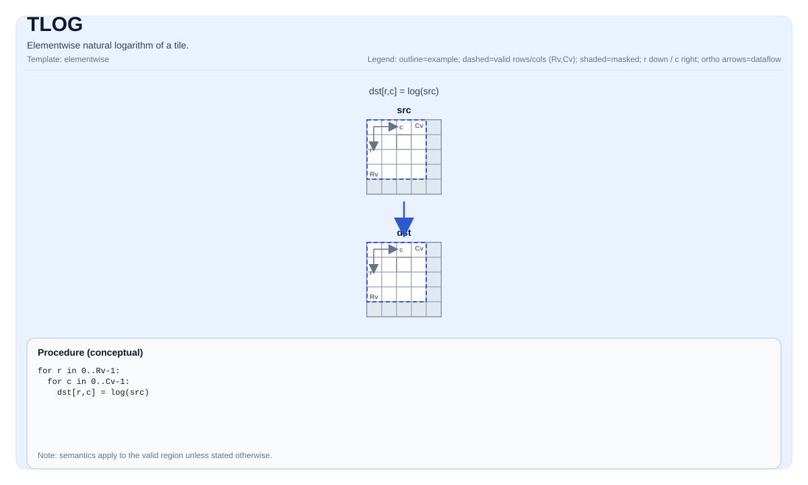

# TLOG

<!-- md-trans-meta sourceCommit=unknown translatedAt=2026-08-26T04:16:37.323Z pushedAt=2026-08-29T09:05:18.439Z -->

## Instruction Diagram



## Introduction

Computes the natural logarithm of each element in a tile.

## Mathematical Semantics

For each element `(i, j)` in the valid region:

$$ \mathrm{dst}_{i,j} = \log(\mathrm{src}_{i,j}) $$

## Assembly Syntax

Synchronous form:

```text
%dst = tlog %src : !pto.tile<...>
```

### AS Level 1 (SSA)

```text
%dst = pto.tlog %src : !pto.tile<...> -> !pto.tile<...>
```

### AS Level 2 (DPS)

```text
pto.tlog ins(%src : !pto.tile_buf<...>) outs(%dst : !pto.tile_buf<...>)
```

## C++ Built-in APIs

Declared in `include/pto/common/pto_instr.hpp`:
> The public include header is `<pto/pto-inst.hpp>`, and the internal declaration is located in `pto/common/pto_instr.hpp`.

```cpp
template <auto PrecisionType = LogAlgorithm::DEFAULT, typename TileDataDst, typename TileDataSrc,
          typename... WaitEvents>
PTO_INST RecordEvent TLOG(TileDataDst &dst, TileDataSrc &src, WaitEvents &... events);
```

`PrecisionType` can specify the following values:

* `LogAlgorithm::DEFAULT`: Normal algorithm, fast but with lower precision.
* `LogAlgorithm::HIGH_PRECISION`: High-precision algorithm, slower.

## Constraints

- **Implementation check (NPU)**:
    - `TileData::DType` must be one of the following: `float` or `half`.
    - The tile position must be a vector (`TileData::Loc == TileType::Vec`);
    - Static valid boundary: `TileData::ValidRow <= TileData::Rows` and `TileData::ValidCol <= TileData::Cols`.
    - Runtime: `src.GetValidRow() == dst.GetValidRow()` and `src.GetValidCol() == dst.GetValidCol()`.
    - The tile layout must be row-major (`TileData::isRowMajor`).
- **Valid region**:
    - The operation uses `dst.GetValidRow()`/`dst.GetValidCol()` as the iteration domain.
- **Domain/NaN**:
    - Domain behavior (for example, `log(<=0)`) is target-defined.
- **High-precision algorithm**:
    - Valid only on Ascend 950PR/Ascend 950DT. The `PrecisionType` option is ignored on Atlas A3 training products/Atlas A3 inference products.

## Examples

```cpp
#include <pto/pto-inst.hpp>

using namespace pto;

void example() {
  using TileT = Tile<TileType::Vec, float, 16, 16>;
  TileT x, out;
  TLOG(out, x);
  TLOG<LogAlgorithm::HIGH_PRECISION>(out, x);  // A5 Only
}
```

## ASM Examples

### Automatic Mode

```text
# Automatic mode: the compiler/runtime handles resource placement and scheduling.
%dst = pto.tlog %src : !pto.tile<...> -> !pto.tile<...>
```

### Manual Mode

```text
# Manual mode: explicitly bind resources first, then issue the instruction.
# Optional (when the instruction contains tile operands):
# pto.tassign %arg0, @tile(0x1000)
# pto.tassign %arg1, @tile(0x2000)
%dst = pto.tlog %src : !pto.tile<...> -> !pto.tile<...>
```

### PTO Assembly Form

```text
%dst = tlog %src : !pto.tile<...>
# AS Level 2 (DPS)
pto.tlog ins(%src : !pto.tile_buf<...>) outs(%dst : !pto.tile_buf<...>)
```
