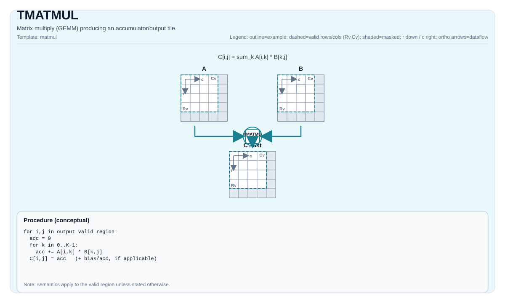

# TMATMUL

<!-- md-trans-meta sourceCommit=unknown translatedAt=2026-08-26T04:21:41.350Z pushedAt=2026-08-29T09:05:18.441Z -->

## Instruction Diagram



## Introduction

Matrix multiplication (GEMM), which generates an accumulator/output tile.

## Mathematical Semantics

Assume:

- `M = aMatrix.GetValidRow()`
- `K = aMatrix.GetValidCol()`
- `N = bMatrix.GetValidCol()`

For `0 <= i < M` and `0 <= j < N` (output elements in the valid matrix multiplication domain):

$$ \mathrm{C}_{i,j} = \sum_{k=0}^{K-1} \mathrm{A}_{i,k} \cdot \mathrm{B}_{k,j} $$

The exact accumulator behavior and data type promotion are defined by the target/implementation.

## Assembly Syntax

Synchronous form:

```text
%acc = tmatmul %a, %b : (!pto.tile<...>, !pto.tile<...>) -> !pto.tile<...>
```

### AS Level 1 (SSA)

```text
%c = pto.tmatmul %a, %b : (!pto.tile<...>, !pto.tile<...>) -> !pto.tile<...>
```

### AS Level 2 (DPS)

```text
pto.tmatmul ins(%a, %b : !pto.tile_buf<...>, !pto.tile_buf<...>) outs(%c : !pto.tile_buf<...>)
```

## C++ Built-in APIs

Declared in `include/pto/common/pto_instr.hpp`:
> The public include header is `<pto/pto-inst.hpp>`, and the internal declaration is located in `pto/common/pto_instr.hpp`.

```cpp
template <typename TileRes, typename TileLeft, typename TileRight, typename... WaitEvents>
PTO_INST RecordEvent TMATMUL(TileRes &cMatrix, TileLeft &aMatrix, TileRight &bMatrix, WaitEvents &... events);

template <AccPhase Phase, typename TileRes, typename TileLeft, typename TileRight, typename... WaitEvents>
PTO_INST RecordEvent TMATMUL(TileRes &cMatrix, TileLeft &aMatrix, TileRight &bMatrix, WaitEvents &... events);
```

## Constraints

- **Implementation check (Atlas A2/A3 training products/Atlas A2/A3 inference products)**:
    - Supported `(CType, AType, BType)` triples:
    - `(int32_t, int8_t, int8_t)`
    - `(float, half, half)`
    - `(float, float, float)`
    - `(float, bfloat16_t, bfloat16_t)`
    - Static shape constraints: `TileLeft::Rows == TileRes::Rows`, `TileLeft::Cols == TileRight::Rows`, `TileRight::Cols == TileRes::Cols`.
    - Tile positions: `TileLeft::Loc == Left`, `TileRight::Loc == Right`, `TileRes::Loc == Acc`.
    - Runtime: `m/k/n` (obtained from `aMatrix.GetValidRow()`, `aMatrix.GetValidCol()`, `bMatrix.GetValidCol()`) must be within the range `[1, 4095]`.
- **Implementation check (Ascend 950PR/Ascend 950DT)**:
    - The accumulator type must be `int32_t` or `float`.
    - If it is `int32_t`: `AType == int8_t` and `BType == int8_t`.
    - If it is `float`: supports `half/bfloat16_t/float`, selected fp8 pairs, and `hifloat8_t/hifloat8_t` (target-defined).
    - Static shape constraints: `TileLeft::Rows == TileRes::Rows`, `TileLeft::Cols == TileRight::Rows`, `TileRight::Cols == TileRes::Cols`.
    - Enforce fractal/layout constraints:
    - Left: `Loc == Left`, `!isRowMajor`, `SFractal == RowMajor`
    - Right: `Loc == Right`, `isRowMajor`, `SFractal == ColMajor`
    - Acc: `Loc == Acc`, `!isRowMajor`, `SFractal == RowMajor`
    - Runtime: `m/k/n` (obtained from `aMatrix.GetValidRow()`, `aMatrix.GetValidCol()`, `bMatrix.GetValidCol()`) must be within the range `[1, 4095]`.

## Examples

### Automatic

```cpp
#include <pto/pto-inst.hpp>

using namespace pto;

void example_auto() {
  using A = TileLeft<half, 16, 16>;
  using B = TileRight<half, 16, 16>;
  using C = TileAcc<float, 16, 16>;
  A a;
  B b;
  C c;
  TMATMUL(c, a, b);
}
```

### Manual

```cpp
#include <pto/pto-inst.hpp>

using namespace pto;

void example_manual() {
  using A = TileLeft<half, 16, 16>;
  using B = TileRight<half, 16, 16>;
  using C = TileAcc<float, 16, 16>;
  A a;
  B b;
  C c;
  TASSIGN(a, 0x1000);
  TASSIGN(b, 0x2000);
  TASSIGN(c, 0x3000);
  TMATMUL(c, a, b);
}
```

## ASM Examples

### Automatic Mode

```text
# Automatic mode: the compiler/runtime handles resource placement and scheduling.
%c = pto.tmatmul %a, %b : (!pto.tile<...>, !pto.tile<...>) -> !pto.tile<...>
```

### Manual Mode

```text
# Manual mode: explicitly bind resources first, then issue the instruction.
# Optional (when the instruction contains tile operands):
# pto.tassign %arg0, @tile(0x1000)
# pto.tassign %arg1, @tile(0x2000)
%c = pto.tmatmul %a, %b : (!pto.tile<...>, !pto.tile<...>) -> !pto.tile<...>
```

### PTO Assembly Form

```text
%acc = tmatmul %a, %b : (!pto.tile<...>, !pto.tile<...>) -> !pto.tile<...>
# AS Level 2 (DPS)
pto.tmatmul ins(%a, %b : !pto.tile_buf<...>, !pto.tile_buf<...>) outs(%c : !pto.tile_buf<...>)
```
