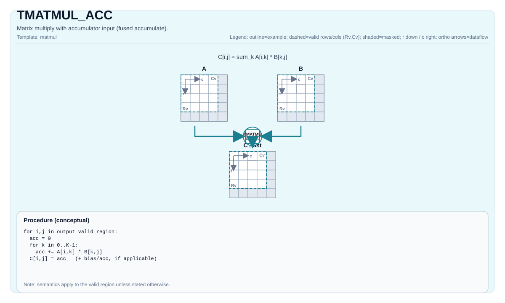

# TMATMUL_ACC

<!-- md-trans-meta sourceCommit=unknown translatedAt=2026-08-26T04:17:40.371Z pushedAt=2026-08-29T09:05:18.439Z -->

## Instruction Diagram



## Introduction

Matrix multiplication with accumulator input (fused accumulation).

## Mathematical Semantics

Assume:

- `M = aMatrix.GetValidRow()`
- `K = aMatrix.GetValidCol()`
- `N = bMatrix.GetValidCol()`

For `0 <= i < M` and `0 <= j < N`:

$$ \mathrm{C1}_{i,j} = \mathrm{C0}_{i,j} + \sum_{k=0}^{K-1} \mathrm{A}_{i,k} \cdot \mathrm{B}_{k,j} $$

## Assembly Syntax

### AS Level 1 (SSA)

```text
%c_out = pto.tmatmul.acc %c_in, %a, %b : (!pto.tile<...>, !pto.tile<...>, !pto.tile<...>) -> !pto.tile<...>
```

### AS Level 2 (DPS)

```text
pto.tmatmul.acc ins(%c_in, %a, %b : !pto.tile_buf<...>, !pto.tile_buf<...>, !pto.tile_buf<...>) outs(%c_out : !pto.tile_buf<...>)
```

## C++ Built-in APIs

Declared in `include/pto/common/pto_instr.hpp`:
> The public include header is `<pto/pto-inst.hpp>`, and the internal declaration is located in `pto/common/pto_instr.hpp`.

```cpp
template <typename TileRes, typename TileLeft, typename TileRight, typename... WaitEvents>
PTO_INST RecordEvent TMATMUL_ACC(TileRes &cOutMatrix, TileRes &cInMatrix, TileLeft &aMatrix, TileRight &bMatrix, WaitEvents &... events);

template <AccPhase Phase, typename TileRes, typename TileLeft, typename TileRight, typename... WaitEvents>
PTO_INST RecordEvent TMATMUL_ACC(TileRes &cOutMatrix, TileRes &cInMatrix, TileLeft &aMatrix, TileRight &bMatrix, WaitEvents &... events);

template <AccPhase Phase = AccPhase::Unspecified, typename TileRes, typename TileLeft, typename TileRight,
          typename... WaitEvents>
PTO_INST RecordEvent TMATMUL_ACC(TileRes &cMatrix, TileLeft &aMatrix, TileRight &bMatrix, WaitEvents &... events); // Note: This overload uses cMatrix as both the accumulator input and output (in-place), reads its existing value as C0, and writes back C1 = C0 + A·B; it neither clears nor overwrites it.
```

## Constraints

- All constraints from `TMATMUL` apply to the `(cOutMatrix, aMatrix, bMatrix)` triple.
- **Implementation notes (Atlas A2/A3 training products/Atlas A2/A3 inference products/Ascend 950PR/Ascend 950DT)**:
    - `TMATMUL_ACC_IMPL` uses `aMatrix.GetValidRow()`, `aMatrix.GetValidCol()`, and `bMatrix.GetValidCol()` as `m/k/n`.
    - `cInMatrix` is not validated through explicit assertions in the current implementation (target-defined behavior).

## Examples

### Automatic

```cpp
#include <pto/pto-inst.hpp>

using namespace pto;

void example_auto() {
  using A = TileLeft<half, 16, 16>;
  using B = TileRight<half, 16, 16>;
  using C = TileAcc<float, 16, 16>;
  A a;
  B b;
  C c0, c1;
  TMATMUL_ACC(c1, c0, a, b);
}
```

### Manual

```cpp
#include <pto/pto-inst.hpp>

using namespace pto;

void example_manual() {
  using A = TileLeft<half, 16, 16>;
  using B = TileRight<half, 16, 16>;
  using C = TileAcc<float, 16, 16>;
  A a;
  B b;
  C c0, c1;
  TASSIGN(a, 0x1000);
  TASSIGN(b, 0x2000);
  TASSIGN(c0, 0x3000);
  TASSIGN(c1, 0x4000);
  TMATMUL_ACC(c1, c0, a, b);
}
```

## ASM Examples

### Automatic Mode

```text
# Automatic mode: the compiler/runtime is responsible for resource placement and scheduling.
%c_out = pto.tmatmul.acc %c_in, %a, %b : (!pto.tile<...>, !pto.tile<...>, !pto.tile<...>) -> !pto.tile<...>
```

### Manual Mode

```text
# Manual mode: explicitly bind resources first, then issue the instruction.
# Optional (when the instruction contains tile operands):
# pto.tassign %arg0, @tile(0x1000)
# pto.tassign %arg1, @tile(0x2000)
%c_out = pto.tmatmul.acc %c_in, %a, %b : (!pto.tile<...>, !pto.tile<...>, !pto.tile<...>) -> !pto.tile<...>
```

### PTO Assembly Form

```text
%acc1 = tmatmul.acc %acc0, %a, %b : (!pto.tile<...>, !pto.tile<...>, !pto.tile<...>) -> !pto.tile<...>
# AS Level 2 (DPS)
pto.tmatmul.acc ins(%c_in, %a, %b : !pto.tile_buf<...>, !pto.tile_buf<...>, !pto.tile_buf<...>) outs(%c_out : !pto.tile_buf<...>)
```
