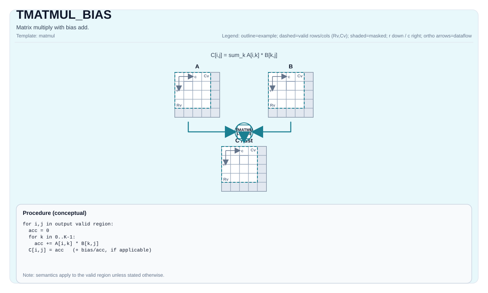

# TMATMUL_BIAS

<!-- md-trans-meta sourceCommit=unknown translatedAt=2026-08-26T04:19:24.918Z pushedAt=2026-08-29T09:05:18.440Z -->

## Instruction Diagram



## Introduction

Performs matrix multiplication with bias addition.

## Mathematical Semantics

Assume:

- `M = aMatrix.GetValidRow()`
- `K = aMatrix.GetValidCol()`
- `N = bMatrix.GetValidCol()`

For `0 <= i < M` and `0 <= j < N`:

$$ \mathrm{C}_{i,j} = \sum_{k=0}^{K-1} \mathrm{A}_{i,k} \cdot \mathrm{B}_{k,j} + \mathrm{Bias}_{0,j} $$

The bias broadcast behavior is implementation-defined.

## Assembly Syntax

Synchronous form:

```text
%acc = tmatmul.bias %a, %b, %bias : (!pto.tile<...>, !pto.tile<...>, !pto.tile<...>) -> !pto.tile<...>
```

### AS Level 1 (SSA)

```text
%c = pto.tmatmul.bias %a, %b, %bias : (!pto.tile<...>, !pto.tile<...>, !pto.tile<...>) -> !pto.tile<...>
```

### AS Level 2 (DPS)

```text
pto.tmatmul.bias ins(%a, %b, %bias : !pto.tile_buf<...>, !pto.tile_buf<...>, !pto.tile_buf<...>) outs(%c : !pto.tile_buf<...>)
```

## C++ Built-in APIs

Declared in `include/pto/common/pto_instr.hpp`:
> The public include header is `<pto/pto-inst.hpp>`, and the internal declaration is located in `pto/common/pto_instr.hpp`.

```cpp
template <typename TileRes, typename TileLeft, typename TileRight, typename TileBias, typename... WaitEvents>
PTO_INST RecordEvent TMATMUL_BIAS(TileRes &cMatrix, TileLeft &aMatrix, TileRight &bMatrix, TileBias &biasData, WaitEvents &... events);

template <AccPhase Phase, typename TileRes, typename TileLeft, typename TileRight, typename TileBias,
          typename... WaitEvents>
PTO_INST RecordEvent TMATMUL_BIAS(TileRes &cMatrix, TileLeft &aMatrix, TileRight &bMatrix, TileBias &biasData, WaitEvents &... events);
```

## Constraints

- All constraints from `TMATMUL` apply to the `(cMatrix, aMatrix, bMatrix)` triple.
- **Bias constraints (Atlas A2/A3 training products/Atlas A2/A3 inference products)**:
    - `TileBias::DType` must match `TileRes::DType`.
    - `TileBias::Loc == TileType::Bias` and `TileBias::Rows == 1`.
- **Bias constraints (Ascend 950PR/Ascend 950DT)**:
    - `TileBias::DType` must match `TileRes::DType`.
    - `TileBias::Loc == TileType::Bias`, `TileBias::Rows == 1`, and `TileBias::isRowMajor`.

## Examples

### Automatic

```cpp
#include <pto/pto-inst.hpp>

using namespace pto;

void example_auto() {
  using A = TileLeft<half, 16, 16>;
  using B = TileRight<half, 16, 16>;
  using Bias = Tile<TileType::Bias, float, 1, 16>;
  using C = TileAcc<float, 16, 16>;
  A a;
  B b;
  Bias bias;
  C c;
  TMATMUL_BIAS(c, a, b, bias);
}
```

### Manual

```cpp
#include <pto/pto-inst.hpp>

using namespace pto;

void example_manual() {
  using A = TileLeft<half, 16, 16>;
  using B = TileRight<half, 16, 16>;
  using Bias = Tile<TileType::Bias, float, 1, 16>;
  using C = TileAcc<float, 16, 16>;
  A a;
  B b;
  Bias bias;
  C c;
  TASSIGN(a, 0x1000);
  TASSIGN(b, 0x2000);
  TASSIGN(bias, 0x3000);
  TASSIGN(c, 0x4000);
  TMATMUL_BIAS(c, a, b, bias);
}
```

## ASM Examples

### Automatic Mode

```text
# Automatic mode: the compiler/runtime handles resource placement and scheduling.
%c = pto.tmatmul.bias %a, %b, %bias : (!pto.tile<...>, !pto.tile<...>, !pto.tile<...>) -> !pto.tile<...>
```

### Manual Mode

```text
# Manual mode: explicitly bind resources first, then issue the instruction.
# Optional (when the instruction contains tile operands):
# pto.tassign %arg0, @tile(0x1000)
# pto.tassign %arg1, @tile(0x2000)
%c = pto.tmatmul.bias %a, %b, %bias : (!pto.tile<...>, !pto.tile<...>, !pto.tile<...>) -> !pto.tile<...>
```

### PTO Assembly Form

```text
%acc = tmatmul.bias %a, %b, %bias : (!pto.tile<...>, !pto.tile<...>, !pto.tile<...>) -> !pto.tile<...>
# AS Level 2 (DPS)
pto.tmatmul.bias ins(%a, %b, %bias : !pto.tile_buf<...>, !pto.tile_buf<...>, !pto.tile_buf<...>) outs(%c : !pto.tile_buf<...>)
```
