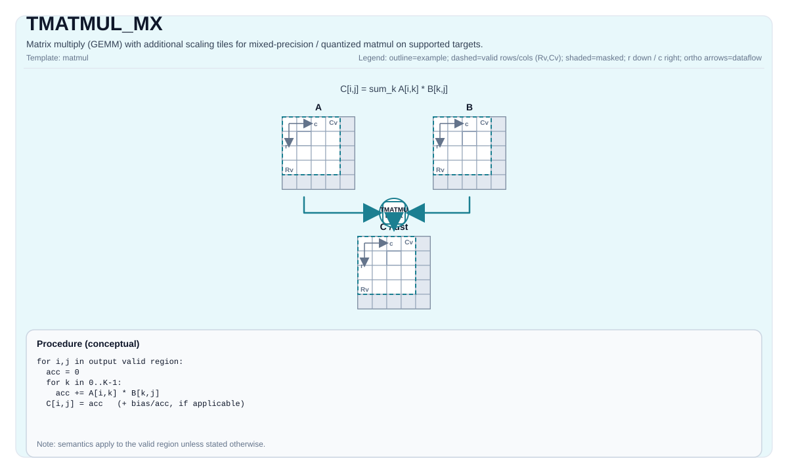

# TMATMUL_MX

<!-- md-trans-meta sourceCommit=unknown translatedAt=2026-08-26T04:20:56.086Z pushedAt=2026-08-29T09:05:18.440Z -->

## Instruction Diagram



## Introduction

Matrix multiplication (GEMM) with additional scale tiles, used to support mixed-precision/quantized matrix multiplication on the target.

This instruction is currently implemented only on Ascend 950PR/Ascend 950DT (see `include/pto/npu/a5/TMatmul.hpp`).

## Mathematical Semantics

Assume:

- `M = aMatrix.GetValidRow()`
- `K = aMatrix.GetValidCol()`
- `N = bMatrix.GetValidCol()`

Conceptually, the result corresponds to matrix multiplication over the valid matrix multiplication domain (`0 <= i < M`, `0 <= j < N`), where the scale tiles `aScaleMatrix` / `bScaleMatrix` configure implementation-defined mixed-precision behavior:

$$ \mathrm{C}_{i,j} = \sum_{k=0}^{K-1} \mathrm{A}_{i,k} \cdot \mathrm{B}_{k,j} $$

The exact role of `aScaleMatrix` / `bScaleMatrix` (as well as any dequantization/quantization semantics) is defined by the target.

## Assembly Syntax

Synchronization form (conceptual):

```text
%c = tmatmul.mx %a, %a_scale, %b, %b_scale : (!pto.tile<...>, !pto.tile<...>, !pto.tile<...>, !pto.tile<...>) -> !pto.tile<...>
%c_out = tmatmul.mx.acc %c_in, %a, %a_scale, %b, %b_scale : (!pto.tile<...>, !pto.tile<...>, !pto.tile<...>, !pto.tile<...>, !pto.tile<...>) -> !pto.tile<...>
%c = tmatmul.mx.bias %a, %a_scale, %b, %b_scale, %bias : (!pto.tile<...>, !pto.tile<...>, !pto.tile<...>, !pto.tile<...>, !pto.tile<...>) -> !pto.tile<...>
```

### AS Level 1 (SSA)

```text
%c = pto.tmatmul.mx %a, %a_scale, %b, %b_scale : (!pto.tile<...>, !pto.tile<...>, !pto.tile<...>, !pto.tile<...>)
-> !pto.tile<...>
%c_out = pto.tmatmul.mx.acc %c_in, %a, %a_scale, %b, %b_scale : (!pto.tile<...>, !pto.tile<...>,
!pto.tile<...>, !pto.tile<...>, !pto.tile<...>)  -> !pto.tile<...>
%c = pto.tmatmul.mx.bias %a, %a_scale, %b, %b_scale, %bias : (!pto.tile<...>, !pto.tile<...>,
!pto.tile<...>, !pto.tile<...>, !pto.tile<...>)  -> !pto.tile<...>
```

### AS Level 2 (DPS)

```text
pto.tmatmul.mx ins(%a, %a_scale, %b, %b_scale : !pto.tile_buf<...>, !pto.tile_buf<...>, !pto.tile_buf<...>, !pto.tile_buf<...>)
outs(%c :  !pto.tile_buf<...>)
pto.tmatmul.mx.acc ins(%c_in, %a, %a_scale, %b, %b_scale : !pto.tile_buf<...>, !pto.tile_buf<...>, !pto.tile_buf<...>,
!pto.tile_buf<...>, !pto.tile_buf<...>) outs(%c_out : !pto.tile_buf<...>)
pto.tmatmul.mx.bias ins(%a, %a_scale, %b, %b_scale, %bias : !pto.tile_buf<...>, !pto.tile_buf<...>, !pto.tile_buf<...>,
!pto.tile_buf<...>, !pto.tile_buf<...>) outs(%c : !pto.tile_buf<...>)
```

## C++ Built-in APIs

Declared in `include/pto/common/pto_instr.hpp`:
> The public include header is `<pto/pto-inst.hpp>`, and the internal declaration is located in `pto/common/pto_instr.hpp`.

```cpp
template <typename TileRes, typename TileLeft, typename TileLeftScale, typename TileRight, typename TileRightScale,
          typename... WaitEvents>
PTO_INST RecordEvent TMATMUL_MX(TileRes &cMatrix, TileLeft &aMatrix, TileLeftScale &aScaleMatrix, TileRight &bMatrix, TileRightScale &bScaleMatrix, WaitEvents &... events);

template <AccPhase Phase, typename TileRes, typename TileLeft, typename TileLeftScale, typename TileRight,
          typename TileRightScale, typename... WaitEvents>
PTO_INST RecordEvent TMATMUL_MX(TileRes &cMatrix, TileLeft &aMatrix, TileLeftScale &aScaleMatrix, TileRight &bMatrix, TileRightScale &bScaleMatrix, WaitEvents &... events);

template <typename TileRes, typename TileLeft, typename TileLeftScale, typename TileRight, typename TileRightScale,
          typename... WaitEvents>
PTO_INST RecordEvent TMATMUL_MX(TileRes &cOutMatrix, TileRes &cInMatrix, TileLeft &aMatrix, TileLeftScale &aScaleMatrix, TileRight &bMatrix, TileRightScale &bScaleMatrix, WaitEvents &... events);

template <AccPhase Phase, typename TileRes, typename TileLeft, typename TileLeftScale, typename TileRight,
          typename TileRightScale, typename... WaitEvents>
PTO_INST RecordEvent TMATMUL_MX(TileRes &cOutMatrix, TileRes &cInMatrix, TileLeft &aMatrix, TileLeftScale &aScaleMatrix, TileRight &bMatrix, TileRightScale &bScaleMatrix, WaitEvents &... events);

template <typename TileRes, typename TileLeft, typename TileLeftScale, typename TileRight, typename TileRightScale,
          typename TileBias, typename... WaitEvents>
PTO_INST RecordEvent TMATMUL_MX(TileRes &cMatrix, TileLeft &aMatrix, TileLeftScale &aScaleMatrix, TileRight &bMatrix, TileRightScale &bScaleMatrix, TileBias &biasData, WaitEvents &... events);

template <AccPhase Phase, typename TileRes, typename TileLeft, typename TileLeftScale, typename TileRight,
          typename TileRightScale, typename TileBias, typename... WaitEvents>
PTO_INST RecordEvent TMATMUL_MX(TileRes &cMatrix, TileLeft &aMatrix, TileLeftScale &aScaleMatrix, TileRight &bMatrix, TileRightScale &bScaleMatrix, TileBias &biasData, WaitEvents &... events);
```

## Constraints

- **Implementation check (Ascend 950PR/Ascend 950DT)**:
    - `m/k/n` are taken from `aMatrix.GetValidRow()`, `aMatrix.GetValidCol()`, and `bMatrix.GetValidCol()`.
    - Static validity check is performed through `CheckMadMxValid<...>()` (type, shape, fractal, and scale tile validity).
    - Supported `(C, A, B)` triplets (`C` is always `float`; the scale tile is `float8_e8m0_t`):
        - FP8: `(float, float8_e4m3_t, float8_e4m3_t)`, `(float, float8_e4m3_t, float8_e5m2_t)`, `(float, float8_e5m2_t, float8_e4m3_t)`, `(float, float8_e5m2_t, float8_e5m2_t)`.
        - FP4: `(float, float4_e1m2x2_t, float4_e1m2x2_t)`, `(float, float4_e1m2x2_t, float4_e2m1x2_t)`, `(float, float4_e2m1x2_t, float4_e2m1x2_t)`, `(float, float4_e2m1x2_t, float4_e1m2x2_t)`.
- **Bias form**:
    - `TileBias::DType` must be `float` and `TileBias::Loc == TileType::Bias`, `TileBias::Rows == 1` (checked via `static_assert` on Ascend 950PR/Ascend 950DT).

## Examples

### Automatic

```cpp
#include <pto/pto-inst.hpp>

using namespace pto;

void example_auto() {
  using A = TileLeft<float8_e5m2_t, 16, 64>;
  using B = TileRight<float8_e5m2_t, 64, 32>;
  using ScaleA = TileLeftScale<float8_e8m0_t, 16, 2>;
  using ScaleB = TileRightScale<float8_e8m0_t, 2, 32>;
  using Bias = Tile<TileType::Bias, float, 1, 32>;
  using C = TileAcc<float, 16, 32>;
  A a;
  B b;
  ScaleA scaleA;
  ScaleB scaleB;
  Bias bias;
  C c;
  TMATMUL_MX(c, a, scaleA, b, scaleB, bias);
}
```

### Manual

```cpp
#include <pto/pto-inst.hpp>

using namespace pto;

void example_manual() {
  using A = TileLeft<float8_e5m2_t, 16, 64>;
  using B = TileRight<float8_e5m2_t, 64, 32>;
  using ScaleA = TileLeftScale<float8_e8m0_t, 16, 2>;
  using ScaleB = TileRightScale<float8_e8m0_t, 2, 32>;
  using Bias = Tile<TileType::Bias, float, 1, 32>;
  using C = TileAcc<float, 16, 32>;
  A a;
  B b;
  ScaleA scaleA;
  ScaleB scaleB;
  Bias bias;
  C c;
  TASSIGN(a, 0x1000);
  TASSIGN(b, 0x2000);
  TASSIGN(scaleA, GetScaleAddr(a.data()));
  TASSIGN(scaleB, GetScaleAddr(b.data()));
  TASSIGN(bias, 0x3000);
  TASSIGN(c, 0x4000);
  TMATMUL_MX(c, a, scaleA, b, scaleB, bias);
}
```

## ASM Examples

### Automatic Mode

```text
# Automatic mode: the compiler/runtime handles resource placement and scheduling.
%c = pto.tmatmul.mx %a, %a_scale, %b, %b_scale : (!pto.tile<...>, !pto.tile<...>, !pto.tile<...>, !pto.tile<...>)
```

### Manual Mode

```text
# Manual mode: explicitly bind resources first, then issue the instruction.
# Optional (when the instruction contains tile operands):
# pto.tassign %arg0, @tile(0x1000)
# pto.tassign %arg1, @tile(0x2000)
%c = pto.tmatmul.mx %a, %a_scale, %b, %b_scale : (!pto.tile<...>, !pto.tile<...>, !pto.tile<...>, !pto.tile<...>)
```

### PTO Assembly Form

```text
%c = pto.tmatmul.mx %a, %a_scale, %b, %b_scale : (!pto.tile<...>, !pto.tile<...>, !pto.tile<...>, !pto.tile<...>)
# AS Level 2 (DPS)
pto.tmatmul.mx ins(%a, %a_scale, %b, %b_scale : !pto.tile_buf<...>, !pto.tile_buf<...>, !pto.tile_buf<...>, !pto.tile_buf<...>)
```
