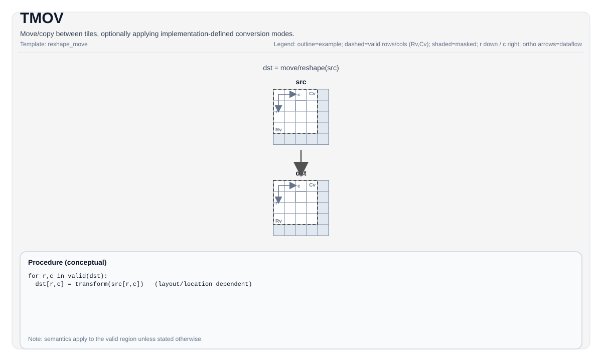

# TMOV

<!-- md-trans-meta sourceCommit=unknown translatedAt=2026-08-26T04:26:20.454Z pushedAt=2026-08-29T09:05:18.444Z -->

## Instruction Diagram



## Introduction

Moves/Copies between tiles, optionally selecting an implementation-defined conversion mode through template parameters and overloads.

`TMOV` is used for:

- Vec -> Vec move
- Mat -> Left/Right/Bias/Scaling/Scale(Microscaling) move (target-dependent)
- Acc -> Mat/Vec move (target-dependent)

## Mathematical Semantics

Copies or converts elements from `src` to `dst` within the valid region. The specific conversion depends on the selected mode and target.

For the copy-only case:

$$ \mathrm{dst}_{i,j} = \mathrm{src}_{i,j} $$

### ND → NZ (Repacking Data for Cube Unit)

The Cube Unit consumes operands in the **NZ** (Normal-ZigZag) fractal format: a tile is divided into `C0 × C0` fractals, and each fractal is stored with `BLayout = ColMajor` ("N"—column-major outer block) and `SLayout = RowMajor` ("Z"—row-major within the fractal). `TMOV(dstNZ, src)` repacks a RowMajor `Vec`/`Mat` tile (`NoneBox`) into the NZ layout. No `tmp` is required.

| Operand (GM/L1 Side) | `BLayout` | `SLayout` | Meaning |
|----------------------|-----------|-----------|---------|
| Left (A, NT)         | `ColMajor` | `RowMajor` | Standard NZ |
| Right (B, NT)        | `RowMajor` | `ColMajor` | Transposed NZ |

The `CompactMode::RowPlusOne` destination (`Rows = Vec_S0 + 1`) is the standard practice for avoiding UB bank conflicts on `vsstb` scatter.

### X → ZZ (Microscaling Exponent Repacking)

For MXFP8/MXFP4 matrix multiplication, each group of E8M0 exponents must be delivered to the Cube scale operand in **ZZ** format: a `[16,2]` block (32 bytes = 16 columns × 2 row groups), linearized as one block per Cube fractal column. Two variants:

**ND → ZZ** (`grp_axis = 1`, default): the source exponents are ND-grouped (axis-1).

$$D_{ZZ}[r_b, c, q, \delta] = D_{ND}[16r_b + \delta][2c + q]$$

Where $r_b \in [0, R/16)$, $c \in [0, C/2)$, $q \in [0,2)$, and $\delta \in [0,16)$.

**DN → ZZ** (`grp_axis = 0`): the source exponents are DN-grouped (axis-0). Equivalent to ND→ZZ after transposition:

$$E_{ZZ}[c_b, p, q, \delta] = E_{DN}^{T}[16c_b + q][2p + \delta] = E_{DN}[2p + \delta][16c_b + q]$$

Where $c_b \in [0, N/16)$, $p \in [0, \hat M/2)$, $q \in [0,16)$, $\delta \in \{0,1\}$, and $\hat M = M/32$.

For a fixed $(c_b, p)$, the 32 bytes of the ZZ block come from two contiguous 16-byte source segments ($E_{DN}[2p]$ and $E_{DN}[2p+1]$); therefore DN→ZZ uses contiguous loads + `vintlv` (more efficient than the `vgather2` of ND→ZZ).

### Role of the `tmp` Tile

Only the **X→ZZ** conversion accepts the `tmp` operand (3-parameter overload). ND→ZZ uses it as the `vgather2` index buffer; DN→ZZ accepts it for API consistency but **does not access** it (`vsstb` scatter requires no scratch). ND→NZ has no `tmp`.

## Assembly Syntax

The PTO AS design recommends splitting `TMOV` into a set of operations:

```text
%left  = tmov.m2l %mat  : !pto.tile<...> -> !pto.tile<...>
%right = tmov.m2r %mat  : !pto.tile<...> -> !pto.tile<...>
%bias  = tmov.m2b %mat  : !pto.tile<...> -> !pto.tile<...>
%scale = tmov.m2s %mat  : !pto.tile<...> -> !pto.tile<...>
%vec   = tmov.a2v %acc  : !pto.tile<...> -> !pto.tile<...>
%v1    = tmov.v2v %v0   : !pto.tile<...> -> !pto.tile<...>
```

### AS Level 1 (SSA)

```text
%dst = pto.tmov.s2d %src  : !pto.tile<...> -> !pto.tile<...>
```

### AS Level 2 (DPS)

```text
pto.tmov ins(%src : !pto.tile_buf<...>) outs(%dst : !pto.tile_buf<...>)
```

## C++ Built-in APIs

Declared in `include/pto/common/pto_instr.hpp` and `include/pto/common/constants.hpp`:
> The public include header is `<pto/pto-inst.hpp>`, and the internal declarations are located in `pto/common/pto_instr.hpp`.

```cpp
template <typename DstTileData, typename SrcTileData, typename... WaitEvents>
PTO_INST RecordEvent TMOV(DstTileData &dst, SrcTileData &src, WaitEvents &... events);

template <typename DstTileData, typename SrcTileData, ReluPreMode reluMode, typename... WaitEvents>
PTO_INST RecordEvent TMOV(DstTileData &dst, SrcTileData &src, WaitEvents &... events);

template <typename DstTileData, typename SrcTileData, AccToVecMode mode, ReluPreMode reluMode = ReluPreMode::NoRelu,
          typename... WaitEvents>
PTO_INST RecordEvent TMOV(DstTileData &dst, SrcTileData &src, WaitEvents &... events);

template <typename DstTileData, typename SrcTileData, typename FpTileData, AccToVecMode mode,
          ReluPreMode reluMode = ReluPreMode::NoRelu, typename... WaitEvents>
PTO_INST RecordEvent TMOV(DstTileData &dst, SrcTileData &src, FpTileData &fp, WaitEvents &... events);

template <typename DstTileData, typename SrcTileData, ReluPreMode reluMode = ReluPreMode::NoRelu,
          typename... WaitEvents>
PTO_INST RecordEvent TMOV(DstTileData &dst, SrcTileData &src, uint64_t preQuantScalar, WaitEvents &... events);

template <typename DstTileData, typename SrcTileData, AccToVecMode mode, ReluPreMode reluMode = ReluPreMode::NoRelu,
          typename... WaitEvents>
PTO_INST RecordEvent TMOV(DstTileData &dst, SrcTileData &src, uint64_t preQuantScalar, WaitEvents &... events);
```

### ND → NZ / X → ZZ Overload

```cpp
// ND -> NZ (2 parameters, no tmp).
template <typename DstTileData, typename SrcTileData, typename... WaitEvents>
PTO_INST RecordEvent TMOV(DstTileData &dst, SrcTileData &src, WaitEvents &...events);

// X -> ZZ (3 parameters, with tmp). grp_axis=1 (default) = ND->ZZ; grp_axis=0 = DN->ZZ.
template <typename DstTileData, typename SrcTileData, typename TmpTileData, typename... WaitEvents,
          std::enable_if_t<is_tile_data_v<TmpTileData>, int> = 0>
PTO_INST RecordEvent TMOV(DstTileData &dst, SrcTileData &src, TmpTileData &tmp, WaitEvents &...events);

template <int grp_axis, typename DstTileData, typename SrcTileData, typename TmpTileData, typename... WaitEvents,
          std::enable_if_t<is_tile_data_v<TmpTileData>, int> = 0>
PTO_INST RecordEvent TMOV(DstTileData &dst, SrcTileData &src, TmpTileData &tmp, WaitEvents &...events);
```

| Overload | `grp_axis` | Conversion | `tmp` Used |
|------|-----------|------|----------------|
| `TMOV(dst, src)` | — | ND → NZ | No |
| `TMOV(dst, src, tmp)` | 1 (default) | ND → ZZ | Yes (vgather2 index buffer) |
| `TMOV<0>(dst, src, tmp)` | 0 | DN → ZZ | No (accepted only for API consistency) |

## Constraints

### General Constraints/Checks

- `TMOV` has the following overload families:
    - Pure move: `TMOV(dst, src)`
    - relu form: `TMOV<..., reluMode>(dst, src)`
    - Accumulator-to-vector form: `TMOV<..., mode, reluMode>(dst, src)`
    - Vector quantization form: `TMOV<..., FpTileData, mode, reluMode>(dst, src, fp)`
    - Scalar quantization form: `TMOV<..., reluMode>(dst, src, preQuantScalar)` and `TMOV<..., mode, reluMode>(dst, src, preQuantScalar)`
- `reluMode` takes the value of `ReluPreMode::{NoRelu, NormalRelu}`.
- `mode` takes the value of `AccToVecMode::{SingleModeVec0, SingleModeVec1, DualModeSplitM, DualModeSplitN}`.

### Implementation Check for Atlas A2/A3 Training Products/Atlas A2/A3 Inference Products

- Shapes must match: `SrcTileData::Rows == DstTileData::Rows` and `SrcTileData::Cols == DstTileData::Cols`.
- The supported tile type pairs are restricted at compile time to:
    - `TileType::Mat -> TileType::Left/Right/Bias/Scaling`
    - `TileType::Vec -> TileType::Vec`
    - `TileType::Acc -> TileType::Mat`
- For `TileType::Mat -> TileType::Bias`:
    - The supported source/destination dtype pairs are `int32_t -> int32_t`, `float -> float`, and `half -> float`.
    - The source row count must be `1`.
    - `SrcTileData::Cols * sizeof(SrcType)` must be 64-byte aligned.
- For `TileType::Mat -> TileType::Scaling`:
    - The destination dtype must be equal to the source dtype and be `uint64_t` or `int64_t`
    - The source row count must be `1`.
    - `SrcTileData::Cols * sizeof(SrcType)` must be 128-byte aligned.
- For `TileType::Acc -> TileType::Mat`:
    - Additionally performs the `CheckTMovAccToMat<...>` compile-time check
    - The pure/relu form uses the pre-quantization mode for type conversion derived by `GetCastPreQuantMode<SrcDType, DstDType>()`.
    - The scalar quantization form uses `GetScalarPreQuantMode<SrcDType, DstDType>()`.
    - The vector quantization form requires the `FpTileData` operand `FpTileData::Loc == TileType::Scaling`, and uses `GetVectorPreQuantMode<SrcDType, DstDType>()`.

### Ascend 950PR/Ascend 950DT Implementation Check

- `CommonCheck()` requires:
    - The destination/source dtype must be the same.
    - The supported element types are `int8_t`, `hifloat8_t`, `float8_e5m2_t`, `float8_e4m3_t`, `half`, `bfloat16_t`, `float`, `float4_e2m1x2_t`, and `float4_e1m2x2_t`.
    - The source layout must satisfy one of the following:
        - `(SrcTileData::SFractal == SLayout::ColMajor && SrcTileData::isRowMajor)`
        - `(SrcTileData::SFractal == SLayout::RowMajor && !SrcTileData::isRowMajor)`
        - `SrcTileData::isRowMajor`
- `CommonCheckMX()` is used for the MX path and requires the source/destination dtype to be consistent and to support `float8_e8m0_t`.
- The supported paths include:
    - `TileType::Mat -> TileType::Left/Right/Bias/Scaling/ScaleLeft/ScaleRight`
    - `TileType::Vec -> TileType::Vec/TileType::Mat`
    - `TileType::Acc -> TileType::Vec/TileType::Mat`
    - Specific internal path variants such as `ND -> ZZ` are handled by the Ascend 950PR/Ascend 950DT implementation
- For `TileType::Mat -> TileType::Bias`:
    - The supported dtype pairs are `int32_t -> int32_t`, `float -> float`, `half -> float`, and `bfloat16_t -> float`.
    - The source row count must be `1`.
    - `DstTileData::Cols * sizeof(DstType)` must be 64-byte aligned.
    - The bias table occupies `DstTileData::Cols * sizeof(DstType)` and must not exceed `4096` bytes.
- For `TileType::Mat -> TileType::Scaling`:
    - The source row count must be `1`.
    - `DstTileData::Cols * sizeof(DstType)` must be 128-byte aligned.
    - The fixpipe buffer occupancy `DstTileData::Cols * sizeof(DstType)` must not exceed `4096` bytes.
- For `TileType::Acc -> TileType::Vec`:
    - Set `mode` to `SingleModeVec0`, `SingleModeVec1`, `DualModeSplitM`, or `DualModeSplitN`.
    - The dual-destination mode requires `QuantMode_t::NoQuant`.
    - The dual-destination mode does not support the `nz2dn` path.
    - For 32-bit destination types (`float`/`int32_t`), when using `DualModeSplitN`, `ValidCol` (before splitting) must be a multiple of 32.
    - The destination stride must be non-zero and `dstStride * sizeof(dstType)` must be a multiple of 32 bytes.
- For `TileType::Acc -> TileType::Mat`:
    - The destination stride must be non-zero, and `dstStride * sizeof(dstType)` must be a multiple of 32 bytes.
    - The relu/scalar quantization/vector quantization forms are supported through the corresponding overloads.

## Examples

### ND → NZ (Data) — (128, 256) BF16

```cpp
// Source: 128 rows × 256 columns BF16 RowMajor Vec Tile (ND).
// Destination: NZ fractal Mat Tile of the Cube Unit (Left operand).
constexpr uint32_t R = 128, C = 256;
using SrcT = Tile<TileType::Vec, bfloat16_t, R, C, BLayout::RowMajor, R, C, SLayout::NoneBox>;
using DstT = Tile<TileType::Mat, bfloat16_t, R, C, BLayout::ColMajor, R, C, SLayout::RowMajor>;
SrcT src; DstT dst;
TMOV(dst, src);   // ND -> NZ, no tmp.
```

**`tmp` for ND→NZ:** None — the 2-parameter overload is repacked in place via `vsstb`.

### ND → ZZ (Exponent) — `tmp` Size Derivation

Given a quantized input shape $M \times N$ (group size $G = 32$), the ND-grouped E8M0 exponent tile shape is:

| Quantity | Value |
|----------|------|
| Exponent row count | $\mathrm{validRow} = M$ (one exponent row per input row) |
| Exponent column count | $\mathrm{validCol} = N/G = N/32$ (one exponent per 32-element column group) |
| Row block count | $r_b = \lceil M/16 \rceil$ |
| Block pair count | $P = \mathrm{validCol}/2 = N/64$ |

The `tmp` buffer holds the `vgather2` B16 index buffer used by `GenerateB8IndicesZZToUB`:

$$\boxed{\mathrm{tmpBytes} = \bigl(16 + r_b \cdot P + 16\bigr) \times 2 = \left(32 + \left\lceil\tfrac{M}{16}\right\rceil \cdot \tfrac{N}{64}\right) \times 2}$$

- 16 B16 lanes of head space + $r_b \times P$ gather indices + 16 B16 lanes of tail space.
- `tmp` dtype = `uint8_t` (E8M0), shape `1 × ⌈tmpBytes⌉`.

**Example:** $M = 128$, $N = 256$ → exponent tile $128 \times 8$, $r_b = 8$, $P = 4$:

$$\mathrm{tmpBytes} = (32 + 8 \times 4) \times 2 = 128\ \mathrm{B}$$

### DN → ZZ (Exponent) — `tmp`

The DN grouping exponent shape is $\hat M \times N$, where $\hat M = M/32$. `TMOV<0>` accepts the `tmp` operand for API consistency but **does not access it** (the `vsstb` scatter requires no scratch). Any tile with a non-zero size satisfies the signature.

```cpp
// DN grouping e8 exponent (M̂×N) -> ZZ fractal scale Tile.
TMOV<0>(e8ZzTile, e8DnTile, tmpTile);   // grp_axis=0 = DN->ZZ; tmp unused.
```

### Usage in MX Quantization (Reference)

After `TQUANT` generates the quantized data + E8M0 exponents, two `TMOV` instructions repack them for use by the Cube Unit. See `TQUANT.md` / `TQUANT_DN.md` for the complete pipeline.

```cpp
// MXFP8 DN pipeline: quantize a 128×256 BF16 tile, then repack for Cube.
constexpr uint32_t M = 128, N = 256, G = 32, Mhat = M / G;   // Mhat = 4
// Tiles
using SrcT   = Tile<TileType::Vec, bfloat16_t, M, N, BLayout::RowMajor>;
using Fp8T   = Tile<TileType::Vec, int8_t, M, N, BLayout::RowMajor>;
using E8DnT  = Tile<TileType::Vec, uint8_t, Mhat, N, BLayout::RowMajor>;        // 4×256
using E8ZzT  = Tile<TileType::Mat, uint8_t, N, Mhat, BLayout::ColMajor, N, Mhat, SLayout::RowMajor>;
using Fp8NzT = Tile<TileType::Mat, int8_t, M, N, BLayout::ColMajor, M, N, SLayout::RowMajor>;
// 1. Quantize (DN grouping).
TQUANT<0, MxQuantAlg::OcpMxFp8E4M3>(fp8Tile, srcTile, &e8DnTile, &maxTile, &scalingTile);
// 2. Repack data ND->NZ (2 parameters, no tmp).
TMOV(fp8NzTile, fp8Tile);
// 3. Repack exponents DN->ZZ (3 parameters, tmp accepted but unused).
TMOV<0>(e8ZzTile, e8DnTile, tmpTile);
```

### Automatic

```cpp
#include <pto/pto-inst.hpp>

using namespace pto;

void example_auto() {
  using TileT = Tile<TileType::Vec, float, 16, 16>;
  TileT src, dst;
  TMOV(dst, src);
}
```

### Manual

```cpp
#include <pto/pto-inst.hpp>

using namespace pto;

void example_manual() {
  using SrcT = Tile<TileType::Mat, float, 16, 16, BLayout::RowMajor, 16, 16, SLayout::ColMajor>;
  using DstT = TileLeft<float, 16, 16>;
  SrcT mat;
  DstT left;
  TASSIGN(mat, 0x1000);
  TASSIGN(left, 0x2000);
  TMOV(left, mat);
}
```

## ASM Examples

### Automatic Mode

```text
# Automatic mode: resource placement and scheduling are managed by the compiler/runtime.
%dst = pto.tmov.s2d %src  : !pto.tile<...> -> !pto.tile<...>
```

### Manual Mode

```text
# Manual mode: bind resources explicitly before issuing the instruction.
# pto.tassign %arg0, @tile(0x1000)
# pto.tassign %arg1, @tile(0x2000)
%dst = pto.tmov.s2d %src  : !pto.tile<...> -> !pto.tile<...>
```

### PTO Assembly Form

```text
%dst = pto.tmov.s2d %src  : !pto.tile<...> -> !pto.tile<...>
# AS Level 2 (DPS)
pto.tmov ins(%src : !pto.tile_buf<...>) outs(%dst : !pto.tile_buf<...>)
```
