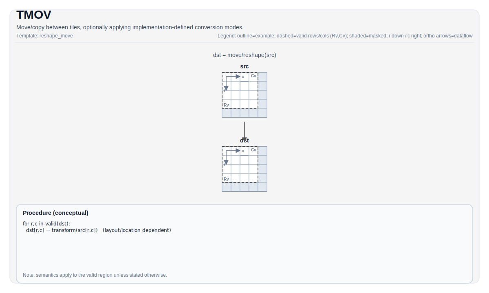

# TMOV

## 指令示意图



## 简介

在 Tile 之间移动/复制，可选通过模板参数和重载选择实现定义的转换模式。

`TMOV` 用于：

- Vec -> Vec 移动
- Mat -> Left/Right/Bias/Scaling/Scale（微缩放）移动（取决于目标）
- Acc -> Vec 移动（取决于目标）

## 数学语义

概念上在有效区域上将元素从 `src` 复制或转换到 `dst`。确切的转换取决于所选模式和目标。

对于纯复制情况：

$$ \mathrm{dst}_{i,j} = \mathrm{src}_{i,j} $$

## 汇编语法

PTO-AS 形式：参见 [PTO-AS 规范](../assembly/PTO-AS_zh.md)。

PTO AS 设计建议将 `TMOV` 拆分为一系列操作：

```text
%left  = tmov.m2l %mat  : !pto.tile<...> -> !pto.tile<...>
%right = tmov.m2r %mat  : !pto.tile<...> -> !pto.tile<...>
%bias  = tmov.m2b %mat  : !pto.tile<...> -> !pto.tile<...>
%scale = tmov.m2s %mat  : !pto.tile<...> -> !pto.tile<...>
%vec   = tmov.a2v %acc  : !pto.tile<...> -> !pto.tile<...>
%v1    = tmov.v2v %v0   : !pto.tile<...> -> !pto.tile<...>
```

### AS Level 1（SSA）

```text
%dst = pto.tmov.s2d %src  : !pto.tile<...> -> !pto.tile<...>
```

### AS Level 2（DPS）

```text
pto.tmov ins(%src : !pto.tile_buf<...>) outs(%dst : !pto.tile_buf<...>)
```

## C++ 内建接口

声明于 `include/pto/common/pto_instr.hpp` 和 `include/pto/common/constants.hpp`：

```cpp
template <typename DstTileData, typename SrcTileData, typename... WaitEvents>
PTO_INST RecordEvent TMOV(DstTileData &dst, SrcTileData &src, WaitEvents &... events);

template <typename DstTileData, typename SrcTileData, ReluPreMode reluMode, typename... WaitEvents>
PTO_INST RecordEvent TMOV(DstTileData &dst, SrcTileData &src, WaitEvents &... events);

template <typename DstTileData, typename SrcTileData, AccToVecMode mode, ReluPreMode reluMode = ReluPreMode::NoRelu,
          typename... WaitEvents>
PTO_INST RecordEvent TMOV(DstTileData &dst, SrcTileData &src, WaitEvents &... events);

template <typename DstTileData, typename SrcTileData, typename FpTileData, AccToVecMode mode,
          ReluPreMode reluMode = ReluPreMode::NoRelu, typename... WaitEvents>
PTO_INST RecordEvent TMOV(DstTileData &dst, SrcTileData &src, FpTileData &fp, WaitEvents &... events);

template <typename DstTileData, typename SrcTileData, ReluPreMode reluMode = ReluPreMode::NoRelu,
          typename... WaitEvents>
PTO_INST RecordEvent TMOV(DstTileData &dst, SrcTileData &src, uint64_t preQuantScalar, WaitEvents &... events);

template <typename DstTileData, typename SrcTileData, AccToVecMode mode, ReluPreMode reluMode = ReluPreMode::NoRelu,
          typename... WaitEvents>
PTO_INST RecordEvent TMOV(DstTileData &dst, SrcTileData &src, uint64_t preQuantScalar, WaitEvents &... events);
```

## 约束

- **实现检查 (A2A3)**:
    - 形状规则：
        - 形状必须匹配：`SrcTileData::Rows == DstTileData::Rows` 且 `SrcTileData::Cols == DstTileData::Cols`。
    - 支持的位置对（编译时检查）：
        - `Mat -> Left/Right/Bias/Scaling`
        - `Vec -> Vec`
        - `Acc -> Mat`
    - 按路径附加检查如下：
        - `Acc -> Mat`：会额外检查分形与数据类型约束（例如 `Acc` 使用类 NZ 分形，`Mat` 使用 512B 分形，且仅允许特定的数据类型转换）。
- **实现检查 (A5)**:
    - 形状规则：
        - 对于 `Mat -> Left/Right/Bias/Scaling/Scale`，形状必须匹配。
        - 对于 `Vec -> Vec` 和 `Vec -> Mat`，实际复制区域可能由源和目的的有效行/列共同决定。
    - 支持的位置对包括（取决于目标）：
        - `Mat -> Left/Right/Bias/Scaling/Scale`
        - `Vec -> Vec/Mat`
        - `Acc -> Vec/Mat`
    - `Acc -> Vec` 还支持额外的 `AccToVecMode` 形式；其中部分形式还会结合 `FpTileData` 或 `preQuantScalar` 使用。

## 示例

### 自动（Auto）

```cpp
#include <pto/pto-inst.hpp>

using namespace pto;

void example_auto() {
  using TileT = Tile<TileType::Vec, float, 16, 16>;
  TileT src, dst;
  TMOV(dst, src);
}
```

### 手动（Manual）

```cpp
#include <pto/pto-inst.hpp>

using namespace pto;

void example_manual() {
  using SrcT = Tile<TileType::Mat, float, 16, 16, BLayout::RowMajor, 16, 16, SLayout::ColMajor>;
  using DstT = TileLeft<float, 16, 16>;
  SrcT mat;
  DstT left;
  TASSIGN(mat, 0x1000);
  TASSIGN(left, 0x2000);
  TMOV(left, mat);
}
```

## 汇编示例（ASM）

### 自动模式

```text
# 自动模式：由编译器/运行时负责资源放置与调度。
%dst = pto.tmov.s2d %src  : !pto.tile<...> -> !pto.tile<...>
```

### 手动模式

```text
# 手动模式：先显式绑定资源，再发射指令。
# 可选（当该指令包含 tile 操作数时）：
# pto.tassign %arg0, @tile(0x1000)
# pto.tassign %arg1, @tile(0x2000)
%dst = pto.tmov.s2d %src  : !pto.tile<...> -> !pto.tile<...>
```

### PTO 汇编形式

```text
%dst = pto.tmov.s2d %src  : !pto.tile<...> -> !pto.tile<...>
# AS Level 2 (DPS)
pto.tmov ins(%src : !pto.tile_buf<...>) outs(%dst : !pto.tile_buf<...>)
```

