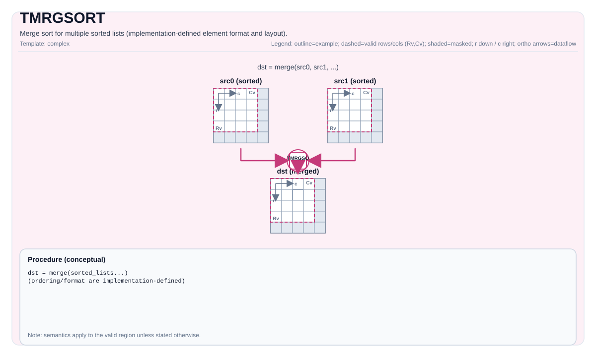

# TMRGSORT

<!-- md-trans-meta sourceCommit=unknown translatedAt=2026-08-26T04:27:02.722Z pushedAt=2026-08-29T09:05:18.444Z -->

## Instruction Diagram



## Introduction

Hardware-accelerated multi-way merge sort (`vmrgsort4`). Merges up to 4 pre-sorted lists into a single output in **descending order**. Each element is a fixed 8-byte **value-index pair** structure.

## Data Format: Value-Index Pair

TMRGSORT operates on 8-byte structures. Each element in the Tile constitutes part of a value-index pair:

| Data Type | Value Field | Padding | Index Field | Structure Size | Tile Elements per Structure |
|-----------|-------------|---------|-------------|----------------|-----------------------------|
| `float`   | 4 bytes     | 0       | 4 bytes (`uint32_t`) | 8 bytes | **2 elements** |
| `half`    | 2 bytes     | 2 bytes | 4 bytes (`uint32_t`) | 8 bytes | **4 elements** |

Therefore, the number of sort pairs in the tile is:

- `float`: `numPairs = ValidCol / 2`
- `half`: `numPairs = ValidCol / 4`

The implementation converts `ValidCol` to the number of pairs through `ELE_NUM_SHIFT`:

```cpp
// float: ELE_NUM_SHIFT = 1  →  numPairs = ValidCol >> 1
// half:  ELE_NUM_SHIFT = 2  →  numPairs = ValidCol >> 2
```

## Mathematical Semantics

Merges the pre-sorted input lists into `dst` in descending order:

$$ \mathrm{dst} = \mathrm{merge\_desc}(\mathrm{src}_0, \mathrm{src}_1, \ldots) $$

## Two Variants

### Variant A: Single-List Sorting — `TMRGSORT(dst, src, blockLen)`

Treats `src` as **4 consecutive equal-length sorted blocks** and performs a 4-way merge within a single tile.

```text
src Tile (1 row):
┌── blockLen ──┬── blockLen ──┬── blockLen ──┬── blockLen ──┐
│    Block 0      │    Block 1      │    Block 2      │    Block 3      │
│ (pre-sorted)  │ (pre-sorted)  │ (pre-sorted)  │ (pre-sorted)  │
└──────────────┴──────────────┴──────────────┴──────────────┘
                        ↓ vmrgsort4
dst Tile (1 row):
┌──────────── merging result (descending)────────────┐
└─────────────────────────────────────────┘
```

**Constraints:**

- `blockLen` must be a multiple of **64**.
- `src.GetValidCol()` must be an integer multiple of `blockLen * 4`.
- `repeatTimes = src.GetValidCol() / (blockLen * 4)` must be within the range `[1, 255]`.
- **`tmp` is not required** — the result is written directly to `dst`.
- There is no `exhausted` parameter (fixed to non-pending mode).

**Number of sort pairs corresponding to `blockLen`:**

| blockLen | Pairs per Block (float) | Pairs per Block (half) |
|----------|-------------------------|------------------------|
| 64       | 32                      | 16                     |
| 128      | 64                      | 32                     |
| 256      | 128                     | 64                     |

### Variant B: Multi-List Merging — `TMRGSORT<..., exhausted>(dst, executedNumList, tmp, src0, src1, [src2], [src3])`

Merges 2 to 4 **independent pre-sorted lists** into a single ordered output.

```text
src0 Tile ──┐
src1 Tile ──┤
src2 Tile ──┼──→ vmrgsort4 ──→ tmp ──→ dst
src3 Tile ──┘
```

**Template parameter `exhausted`:**

- `exhausted = false`: normal merge — processes all input data.
- `exhausted = true`: when any input list is exhausted, the hardware enters pending mode and returns, via `executedNumList`, the number of elements actually processed for each list.

**`MrgSortExecutedNumList` structure:**

```cpp
struct MrgSortExecutedNumList {
    uint16_t mrgSortList0;  // Number of processed elements in list 0.
    uint16_t mrgSortList1;  // Number of processed elements in list 1.
    uint16_t mrgSortList2;  // Number of processed elements in list 2.
    uint16_t mrgSortList3;  // Number of processed elements in list 3.
};
```

Only meaningful when `exhausted = true`. The data comes from the hardware register `VMS4_SR`.

**Mask configuration for different numbers of lists:**

| Number of Lists | Xt[11:8] mask | Unused List |
|-----------------|---------------|-------------|
| 2-list | `0b0011` | src2, src3 (size=0) |
| 3-list | `0b0111` | src3 (size=0) |
| 4-list | `0b1111` | None |

## Assembly Syntax

Synchronization form (conceptual):

```text
%dst, %executed = tmrgsort %src0, %src1 {exhausted = false}
    : !pto.tile<...>, !pto.tile<...> -> (!pto.tile<...>, vector<4xi16>)
```

### AS Level 1 (SSA)

```text
%dst = pto.tmrgsort %src, %blockLen : (!pto.tile<...>, dtype) -> !pto.tile<...>
%dst, %executed = pto.tmrgsort %src0, %src1, %src2, %src3 {exhausted = false}
 : (!pto.tile<...>, !pto.tile<...>, !pto.tile<...>, !pto.tile<...>) -> (!pto.tile<...>, vector<4xi16>)
```

### AS Level 2 (DPS)

```text
pto.tmrgsort ins(%src, %blockLen : !pto.tile_buf<...>, dtype)  outs(%dst : !pto.tile_buf<...>)
pto.tmrgsort ins(%src0, %src1, %src2, %src3 {exhausted = false} : !pto.tile_buf<...>, !pto.tile_buf<...>, !pto.tile_buf<...>, !pto.tile_buf<...>)
outs(%dst, %executed : !pto.tile_buf<...>, vector<4xi16>)
```

## C++ Built-in APIs

Declared in `include/pto/common/pto_instr.hpp`:
> The public include header is `<pto/pto-inst.hpp>`, and the internal declaration is located in `pto/common/pto_instr.hpp`.

### Single-List Variant

```cpp
template <typename DstTileData, typename SrcTileData, typename... WaitEvents>
PTO_INST RecordEvent TMRGSORT(DstTileData &dst, SrcTileData &src, uint32_t blockLen, WaitEvents &... events);
```

### Multi-List Variant (2/3/4-List)

```cpp
// 4 lists.
template <typename DstTileData, typename TmpTileData, typename Src0TileData, typename Src1TileData,
          typename Src2TileData, typename Src3TileData, bool exhausted, typename... WaitEvents>
PTO_INST RecordEvent TMRGSORT(DstTileData &dst, MrgSortExecutedNumList &executedNumList, TmpTileData &tmp,
                              Src0TileData &src0, Src1TileData &src1, Src2TileData &src2, Src3TileData &src3,
                              WaitEvents &... events);

// 3 lists.
template <typename DstTileData, typename TmpTileData, typename Src0TileData, typename Src1TileData,
          typename Src2TileData, bool exhausted, typename... WaitEvents>
PTO_INST RecordEvent TMRGSORT(DstTileData &dst, MrgSortExecutedNumList &executedNumList, TmpTileData &tmp,
                              Src0TileData &src0, Src1TileData &src1, Src2TileData &src2,
                              WaitEvents &... events);

// 2 lists.
template <typename DstTileData, typename TmpTileData, typename Src0TileData, typename Src1TileData,
          bool exhausted, typename... WaitEvents>
PTO_INST RecordEvent TMRGSORT(DstTileData &dst, MrgSortExecutedNumList &executedNumList, TmpTileData &tmp,
                              Src0TileData &src0, Src1TileData &src1, WaitEvents &... events);
```

## Constraints

### General Constraints (Atlas A2/A3 Training Products/Atlas A2/A3 Inference Products and Ascend 950PR/Ascend 950DT)

| Constraint Item | Requirement |
|--------|------|
| Tile type | All tiles must be `TileType::Vec`. |
| Number of rows | All tiles must have `Rows == 1`. |
| Layout | All tiles must be row-major (`BLayout::RowMajor`). |
| Data type | `half` or `float`, and all tiles must be the same. |
| UB memory | The total size must not exceed 192KiB (`UB_SIZE`). |

### UB Memory Constraints by Variant

| Variant | Constraint |
|------|------|
| Single list | `(src.Cols + dst.Cols) * sizeof(T) < UB_SIZE` |
| 2-list | `(src0.Cols + src1.Cols + tmp.Cols) * sizeof(T) < UB_SIZE`, and `tmp.Cols + src0.Cols <= UB_SIZE / sizeof(T)` |
| 3-list | `(src0.Cols + src1.Cols + src2.Cols + tmp.Cols) * sizeof(T) < UB_SIZE` |
| 4-list | `(src0.Cols + src1.Cols + src2.Cols + src3.Cols + tmp.Cols) * sizeof(T) < UB_SIZE` |

### Single-List Constraints

- `blockLen` must be a multiple of 64.
- `src.GetValidCol()` must be an integer multiple of `blockLen * 4`.
- `repeatTimes = src.GetValidCol() / (blockLen * 4)` must be within the range `[1, 255]`.

## Temporary Space

### Multi-List Variant (2/3/4-List)

`tmp` **is used** as the intermediate output buffer for the `vmrgsort4` hardware instruction. The merge sort result is first written to `tmp`, and then copied to `dst` via `MovUb2Ub` (a UB-to-UB memcpy).

- `tmp` must have the same element type (`half` or `float`) as `dst` and all `src` tiles.
- `tmp` must have `Rows == 1` and be row-major.
- The Cols of `tmp` must be at least the sum of all input source Cols:
    - 2-list: `tmp.Cols >= src0.Cols + src1.Cols`
    - 3-list: `tmp.Cols >= src0.Cols + src1.Cols + src2.Cols`
    - 4-list: `tmp.Cols >= src0.Cols + src1.Cols + src2.Cols + src3.Cols`
- The helper function `GETMRGSORTTMPSIZE<...>()` returns the required `tmp` Cols:

```cpp
// 2-list
GETMRGSORTTMPSIZE<Src0Tile, Src1Tile>() = Src0Tile::Cols + Src1Tile::Cols

// 3-list
GETMRGSORTTMPSIZE<Src0Tile, Src1Tile, Src2Tile>() = Src0Tile::Cols + Src1Tile::Cols + Src2Tile::Cols

// 4-list
GETMRGSORTTMPSIZE<Src0Tile, Src1Tile, Src2Tile, Src3Tile>() = Src0Tile::Cols + Src1Tile::Cols + Src2Tile::Cols + Src3Tile::Cols
```

### Single-List Variant

**Does not require** `tmp`. The single-list variant writes directly to `dst`.

## Typical Usage: TopK

TMRGSORT is commonly used to implement TopK selection through iterative merge sorting:

```text
Phase 1: single-list sorting (with blockLen increasing gradually)
  blockLen=64: Every 256 elements → 4 path merging → 256 sorted elements
  blockLen=256: Every 1024 elements → 4 path merging → 1024 sorted elements
  ... until blockLen * 4 > totalCols

Phase 2: tail merging (SortTailBlock)
  Use the 2-list variant to merge remaining blocks, and retain the first K elements.
```

## Differences Between Atlas A2/A3 Training Products/Atlas A2/A3 Inference Products and Ascend 950PR/Ascend 950DT

The two implementations are almost identical, both calling the `vmrgsort4` hardware instruction. Minor differences:

| Item | Atlas A2/A3 Training Products/Atlas A2/A3 Inference Products | Ascend 950PR/Ascend 950DT |
|------|------|-----|
| `UB_SIZE` constant | Hardcoded `196608` (192×1024) | Uses `PTO_UBUF_SIZE_BYTES` |
| `TMRGSORT_BLOCK_LEN` | Defined the constant `64` | Not defined (uses the literal directly) |
| Core logic | Same | Same |

## Examples

### Single-List Sorting (Automatic Mode)

```cpp
#include <pto/pto-inst.hpp>

using namespace pto;

void example_single() {
  using SrcT = Tile<TileType::Vec, float, 1, 256>;
  using DstT = Tile<TileType::Vec, float, 1, 256>;
  SrcT src;
  DstT dst;
  TMRGSORT(dst, src, /*blockLen=*/64);
}
```

### Multi-List Merging (4-List, Non-Pending Mode)

```cpp
#include <pto/pto-inst.hpp>

using namespace pto;

void example_multi4() {
  using SrcT = Tile<TileType::Vec, float, 1, 128>;
  using DstT = Tile<TileType::Vec, float, 1, 512>;
  using TmpT = Tile<TileType::Vec, float, 1, 512>;
  SrcT src0, src1, src2, src3;
  DstT dst;
  TmpT tmp;
  MrgSortExecutedNumList executedNumList;
  TMRGSORT<DstT, TmpT, SrcT, SrcT, SrcT, SrcT, /*exhausted=*/false>(
      dst, executedNumList, tmp, src0, src1, src2, src3);
}
```

### Multi-List Merging (2-List, Pending Mode)

```cpp
#include <pto/pto-inst.hpp>

using namespace pto;

void example_exhausted() {
  using SrcT = Tile<TileType::Vec, float, 1, 64>;
  using DstT = Tile<TileType::Vec, float, 1, 128>;
  using TmpT = Tile<TileType::Vec, float, 1, 128>;
  SrcT src0, src1;
  DstT dst;
  TmpT tmp;
  MrgSortExecutedNumList executedNumList;
  TMRGSORT<DstT, TmpT, SrcT, SrcT, /*exhausted=*/true>(
      dst, executedNumList, tmp, src0, src1);
  // After execution:
  // executedNumList.mrgSortList0 = number of elements processed from src0.
  // executedNumList.mrgSortList1 = number of elements processed from src1.
}
```

### Manual Mode (Single List)

```cpp
#include <pto/pto-inst.hpp>

using namespace pto;

void example_manual() {
  using SrcT = Tile<TileType::Vec, float, 1, 256>;
  using DstT = Tile<TileType::Vec, float, 1, 256>;
  SrcT src;
  DstT dst;
  TASSIGN(src, 0x1000);  // Bind src to UB address 0x1000.
  TASSIGN(dst, 0x2000);  // Bind dst to UB address 0x2000.
  TMRGSORT(dst, src, /*blockLen=*/64);
}
```

## ASM Examples

### Automatic Mode

```text
# Automatic mode: the compiler/runtime handles resource placement and scheduling.
%dst = pto.tmrgsort %src, %blockLen : (!pto.tile<...>, dtype) -> !pto.tile<...>
```

### Manual Mode

```text
# Manual mode: explicitly bind resources first, then issue the instruction.
# Optional (when the instruction contains tile operands):
# pto.tassign %arg0, @tile(0x1000)
# pto.tassign %arg1, @tile(0x2000)
%dst = pto.tmrgsort %src, %blockLen : (!pto.tile<...>, dtype) -> !pto.tile<...>
```

### PTO Assembly Form

```text
%dst = pto.tmrgsort %src, %blockLen : (!pto.tile<...>, dtype) -> !pto.tile<...>
# AS Level 2 (DPS)
pto.tmrgsort ins(%src, %blockLen : !pto.tile_buf<...>, dtype)  outs(%dst : !pto.tile_buf<...>)
```
