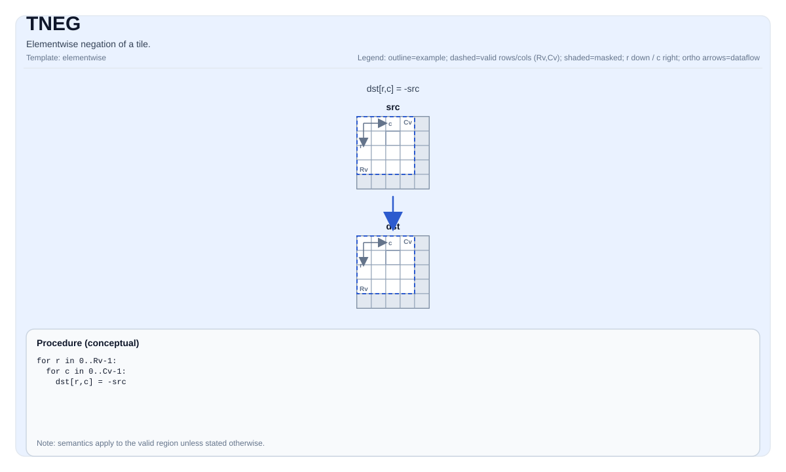

# TNEG

<!-- md-trans-meta sourceCommit=unknown translatedAt=2026-08-26T04:29:16.988Z pushedAt=2026-08-29T09:05:18.446Z -->

## Instruction Diagram



## Introduction

Element-wise negation of a tile.

## Mathematical Semantics

For each element `(i, j)` in the valid region:

$$ \mathrm{dst}_{i,j} = -\mathrm{src}_{i,j} $$

## Assembly Syntax

Synchronous form:

```text
%dst = tneg %src : !pto.tile<...>
```

### AS Level 1 (SSA)

```text
%dst = pto.tneg %src : !pto.tile<...> -> !pto.tile<...>
```

### AS Level 2 (DPS)

```text
pto.tneg ins(%src : !pto.tile_buf<...>) outs(%dst : !pto.tile_buf<...>)
```

## C++ Built-in APIs

Declared in `include/pto/common/pto_instr.hpp`:
> The public include header is `<pto/pto-inst.hpp>`, and the internal declaration is located in `pto/common/pto_instr.hpp`.

```cpp
template <typename TileDataDst, typename TileDataSrc, typename... WaitEvents>
PTO_INST RecordEvent TNEG(TileDataDst &dst, TileDataSrc &src, WaitEvents &... events);
```

## Constraints

- The operation iterates over `dst.GetValidRow()`/`dst.GetValidCol()`.
- **Implementation check (Atlas A2/A3 training products/Atlas A2/A3 inference products)**: `TileData::DType` must be one of the following: `int32_t`, `int16_t`, `half`, `float`.
- **Implementation check (Ascend 950PR/Ascend 950DT)**: `TileData::DType` must be one of the following: `int32_t`, `int16_t`, `uint32_t`, `uint16_t`, `half`, `float`, `bfloat16_t`.

## Examples

```cpp
#include <pto/pto-inst.hpp>

using namespace pto;

void example() {
  using TileT = Tile<TileType::Vec, float, 16, 16>;
  TileT x, out;
  TNEG(out, x);
}
```

## ASM Examples

### Automatic Mode

```text
# Automatic mode: the compiler/runtime handles resource placement and scheduling.
%dst = pto.tneg %src : !pto.tile<...> -> !pto.tile<...>
```

### Manual Mode

```text
# Manual mode: explicitly bind resources before issuing the instruction.
# Optional (when the instruction contains tile operands):
# pto.tassign %arg0, @tile(0x1000)
# pto.tassign %arg1, @tile(0x2000)
%dst = pto.tneg %src : !pto.tile<...> -> !pto.tile<...>
```

### PTO Assembly Form

```text
%dst = tneg %src : !pto.tile<...>
# AS Level 2 (DPS)
pto.tneg ins(%src : !pto.tile_buf<...>) outs(%dst : !pto.tile_buf<...>)
```
