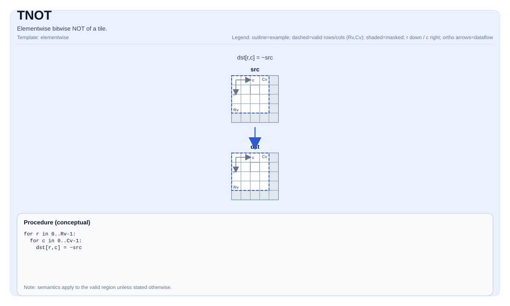

# TNOT

<!-- md-trans-meta sourceCommit=unknown translatedAt=2026-08-26T04:33:30.925Z pushedAt=2026-08-29T09:05:18.447Z -->

## Instruction Diagram



## Introduction

Performs element-wise bitwise NOT on a tile.

## Mathematical Semantics

For each element `(i, j)` within the valid region:

$$ \mathrm{dst}_{i,j} = \sim\mathrm{src}_{i,j} $$

## Assembly Syntax

Synchronous form:

```text
%dst = tnot %src : !pto.tile<...>
```

### AS Level 1 (SSA)

```text
%dst = pto.tnot %src : !pto.tile<...> -> !pto.tile<...>
```

### AS Level 2 (DPS)

```text
pto.tnot ins(%src : !pto.tile_buf<...>) outs(%dst : !pto.tile_buf<...>)
```

## C++ Built-in APIs

Declared in `include/pto/common/pto_instr.hpp`:
> The public include header is `<pto/pto-inst.hpp>`, and the internal declaration is located in `pto/common/pto_instr.hpp`.

```cpp
template <typename TileDataDst, typename TileDataSrc, typename... WaitEvents>
PTO_INST RecordEvent TNOT(TileDataDst &dst, TileDataSrc &src, WaitEvents &... events);
```

## Constraints

- **Implementation check (Atlas A2/A3 training products/Atlas A2/A3 inference products)**:
    - `TileData::DType` must be one of the following: `int16_t`, `uint16_t`, `uint32_t`, `int32_t`, `int8_t`, `uint8_t`.
    - The tile layout must be row-major (`TileData::isRowMajor`).
    - The tile position must be a vector (`TileData::Loc == TileType::Vec`).
    - Static valid boundary: `TileData::ValidRow <= TileData::Rows` and `TileData::ValidCol <= TileData::Cols`.
    - Runtime: the `src` and `dst` tiles should have the same `validRow/validCol`.
- **Implementation check (Ascend 950PR/Ascend 950DT)**:
    - `TileData::DType` must be one of the following: `uint32_t`, `int32_t`, `uint16_t`, `int16_t`, `uint8_t`, `int8_t`.
    - The tile layout must be row-major (`TileData::isRowMajor`).
    - The tile position must be a vector (`TileData::Loc == TileType::Vec`).
    - Static valid boundary: `TileData::ValidRow <= TileData::Rows` and `TileData::ValidCol <= TileData::Cols`.
    - Runtime: the `src` and `dst` tiles should have the same `validRow/validCol`.
- **Valid region**:
    - This operation uses `dst.GetValidRow()`/`dst.GetValidCol()` as the iteration domain; `src/dst` are assumed to be compatible (not verified through an explicit runtime check in this operation).

## Examples

```cpp
#include <pto/pto-inst.hpp>

using namespace pto;

void example() {
  using TileT = Tile<TileType::Vec, uint16_t, 16, 16>;
  TileT x, out;
  TNOT(out, x);
}
```

## ASM Examples

### Automatic Mode

```text
# Automatic mode: the compiler/runtime handles resource placement and scheduling.
%dst = pto.tnot %src : !pto.tile<...> -> !pto.tile<...>
```

### Manual Mode

```text
# Manual mode: explicitly bind resources first, then issue the instruction.
# Optional (when the instruction contains tile operands):
# pto.tassign %arg0, @tile(0x1000)
# pto.tassign %arg1, @tile(0x2000)
%dst = pto.tnot %src : !pto.tile<...> -> !pto.tile<...>
```

### PTO Assembly Form

```text
%dst = tnot %src : !pto.tile<...>
# AS Level 2 (DPS)
pto.tnot ins(%src : !pto.tile_buf<...>) outs(%dst : !pto.tile_buf<...>)
```
