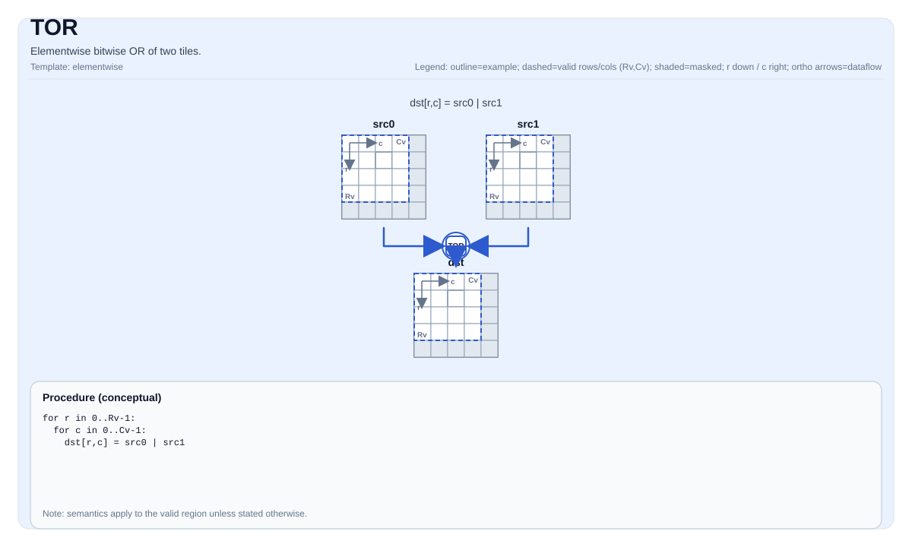

# TOR

<!-- md-trans-meta sourceCommit=unknown translatedAt=2026-08-26T04:33:33.903Z pushedAt=2026-08-29T09:05:18.447Z -->

## Instruction Diagram



## Introduction

Performs element-wise bitwise OR on two tiles.

## Mathematical Semantics

For each element `(i, j)` in the valid region:

$$ \mathrm{dst}_{i,j} = \mathrm{src0}_{i,j} \;|\; \mathrm{src1}_{i,j} $$

## Assembly Syntax

Synchronous form:

```text
%dst = tor %src0, %src1 : !pto.tile<...>
```

### AS Level 1 (SSA)

```text
%dst = pto.tor %src0, %src1 : (!pto.tile<...>, !pto.tile<...>) -> !pto.tile<...>
```

### AS Level 2 (DPS)

```text
pto.tor ins(%src0, %src1 : !pto.tile_buf<...>, !pto.tile_buf<...>) outs(%dst : !pto.tile_buf<...>)
```

## C++ Built-in APIs

Declared in `include/pto/common/pto_instr.hpp`:
> The public include header is `<pto/pto-inst.hpp>`, and the internal declaration is located in `pto/common/pto_instr.hpp`.

```cpp
template <typename TileData, typename... WaitEvents>
PTO_INST RecordEvent TOR(TileData &dst, TileData &src0, TileData &src1, WaitEvents &... events);
```

## Constraints

- **Implementation check (Atlas A2/A3 training products/Atlas A2/A3 inference products)**:
    - The supported element types are `uint8_t`, `int8_t`, `uint16_t`, `int16_t`, `uint32_t`, and `int32_t`.
    - `dst`, `src0`, and `src1` must use the same element type.
    - `dst`, `src0`, and `src1` must be Row-Major.
    - Runtime: `src0.GetValidRow()/GetValidCol()` and `src1.GetValidRow()/GetValidCol()` must be consistent with `dst`.
- **Implementation check (Ascend 950PR/Ascend 950DT)**:
    - The supported element types are `uint8_t`, `int8_t`, `uint16_t`, `int16_t`, `uint32_t`, and `int32_t` (consistent with Atlas A2/A3 training products/Atlas A2/A3 inference products).
    - `dst`, `src0`, and `src1` must use the same element type.
    - `dst`, `src0`, and `src1` must be row-major.
    - Runtime: `src0.GetValidRow()/GetValidCol()` and `src1.GetValidRow()/GetValidCol()` must be consistent with `dst`.
- **Valid region**:
    - This operation uses `dst.GetValidRow()`/`dst.GetValidCol()` as the iteration domain.

## Examples

```cpp
#include <pto/pto-inst.hpp>

using namespace pto;

void example() {
  using TileT = Tile<TileType::Vec, int32_t, 16, 16>;
  TileT a, b, out;
  TOR(out, a, b);
}
```

## ASM Examples

### Automatic Mode

```text
# Automatic mode: the compiler/runtime is responsible for resource placement and scheduling.
%dst = pto.tor %src0, %src1 : (!pto.tile<...>, !pto.tile<...>) -> !pto.tile<...>
```

### Manual Mode

```text
# Manual mode: Explicitly bind resources first, then issue the instruction.
# Optional (when the instruction contains tile operands):
# pto.tassign %arg0, @tile(0x1000)
# pto.tassign %arg1, @tile(0x2000)
%dst = pto.tor %src0, %src1 : (!pto.tile<...>, !pto.tile<...>) -> !pto.tile<...>
```

### PTO Assembly Form

```text
%dst = tor %src0, %src1 : !pto.tile<...>
# AS Level 2 (DPS)
pto.tor ins(%src0, %src1 : !pto.tile_buf<...>, !pto.tile_buf<...>) outs(%dst : !pto.tile_buf<...>)
```
