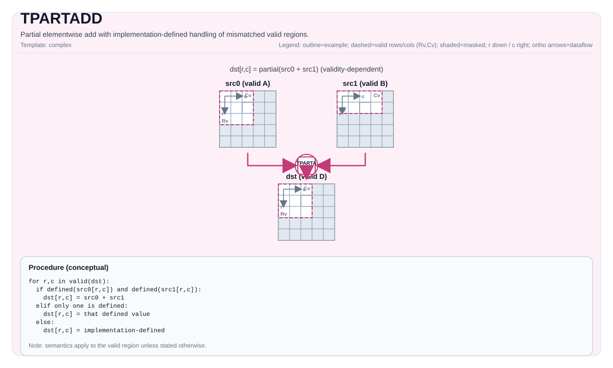

# TPARTADD

<!-- md-trans-meta sourceCommit=unknown translatedAt=2026-08-26T04:35:25.996Z pushedAt=2026-08-29T09:05:18.449Z -->

## Instruction Diagram



## Introduction

Performs element-wise addition within the destination valid region. If both `src0` and `src1` are valid at a position, the result is the sum of the two; if only one input is valid at that position, the result directly takes the value of that input. Other cases where the valid regions do not match are implementation-defined.

## Mathematical Semantics

For each element `(i, j)` in the destination valid region:

$$
\mathrm{dst}_{i,j} =
\begin{cases}
\mathrm{src0}_{i,j} + \mathrm{src1}_{i,j} & \text{if both inputs are defined at } (i,j) \\
\mathrm{src0}_{i,j} & \text{if only src0 is defined at } (i,j) \\
\mathrm{src1}_{i,j} & \text{if only src1 is defined at } (i,j)
\end{cases}
$$

## Assembly Syntax

Synchronous form:

```text
%dst = tpartadd %src0, %src1 : !pto.tile<...> -> !pto.tile<...>
```

### AS Level 1 (SSA)

```text
%dst = pto.tpartadd %src0, %src1 : (!pto.tile<...>, !pto.tile<...>) -> !pto.tile<...>
```

### AS Level 2 (DPS)

```text
pto.tpartadd ins(%src0, %src1 : !pto.tile_buf<...>, !pto.tile_buf<...>) outs(%dst : !pto.tile_buf<...>)
```

## C++ Built-in APIs

Declared in `include/pto/common/pto_instr.hpp`:
> The public include header is `<pto/pto-inst.hpp>`, and the internal declaration is located in `pto/common/pto_instr.hpp`.

```cpp
template <typename TileDataDst, typename TileDataSrc0, typename TileDataSrc1, typename... WaitEvents>
PTO_INST RecordEvent TPARTADD(TileDataDst &dst, TileDataSrc0 &src0, TileDataSrc1 &src1, WaitEvents &... events);
```

## Constraints

### General Constraints or Checks

- The element types of `dst`, `src0`, and `src1` must be identical.
- The destination valid region defines the computation range of the result.
- For each element within the destination valid region:
    - If both inputs are valid, the element-wise operation corresponding to this instruction is performed;
    - If only one input is valid, the result directly takes the value of that input.
- If the valid region of `dst` is zero, the instruction returns directly.
- The supported partial valid region mode requires that the valid region of at least one source tile is exactly identical to `dst`, and the valid region of the other source tile cannot exceed `dst` in either dimension.
- For valid region combinations outside the above range, the behavior is defined by the specific implementation.

### Implementation Check for Atlas A2/A3 Training Products/Atlas A2/A3 Inference Products

- Supported element types: `int32_t`, `int16_t`, `half`, `float`.
- `dst`, `src0`, and `src1` must all be row-major (`isRowMajor`).

### Ascend 950PR/Ascend 950DT Implementation Check

- Supported element types: `uint8_t`, `int8_t`, `uint16_t`, `int16_t`, `uint32_t`, `int32_t`, `half`, `float`, `bfloat16_t`.

## Examples

### Automatic

```cpp
#include <pto/pto-inst.hpp>

using namespace pto;

void example_auto() {
  using TileT = Tile<TileType::Vec, float, 16, 16>;
  TileT src0, src1, dst;
  TPARTADD(dst, src0, src1);
}
```

### Manual

```cpp
#include <pto/pto-inst.hpp>

using namespace pto;

void example_manual() {
  using TileT = Tile<TileType::Vec, float, 16, 16>;
  TileT src0, src1, dst;
  TASSIGN(src0, 0x1000);
  TASSIGN(src1, 0x2000);
  TASSIGN(dst,  0x3000);
  TPARTADD(dst, src0, src1);
}
```

## ASM Examples

### Automatic Mode

```text
# Automatic mode: the compiler/runtime handles resource placement and scheduling.
%dst = pto.tpartadd %src0, %src1 : (!pto.tile<...>, !pto.tile<...>) -> !pto.tile<...>
```

### Manual Mode

```text
# Manual mode: explicitly bind resources first, then issue the instruction.
# Optional (when the instruction contains tile operands):
# pto.tassign %arg0, @tile(0x1000)
# pto.tassign %arg1, @tile(0x2000)
%dst = pto.tpartadd %src0, %src1 : (!pto.tile<...>, !pto.tile<...>) -> !pto.tile<...>
```

### PTO Assembly Form

```text
%dst = tpartadd %src0, %src1 : !pto.tile<...> -> !pto.tile<...>
# AS Level 2 (DPS)
pto.tpartadd ins(%src0, %src1 : !pto.tile_buf<...>, !pto.tile_buf<...>) outs(%dst : !pto.tile_buf<...>)
```
