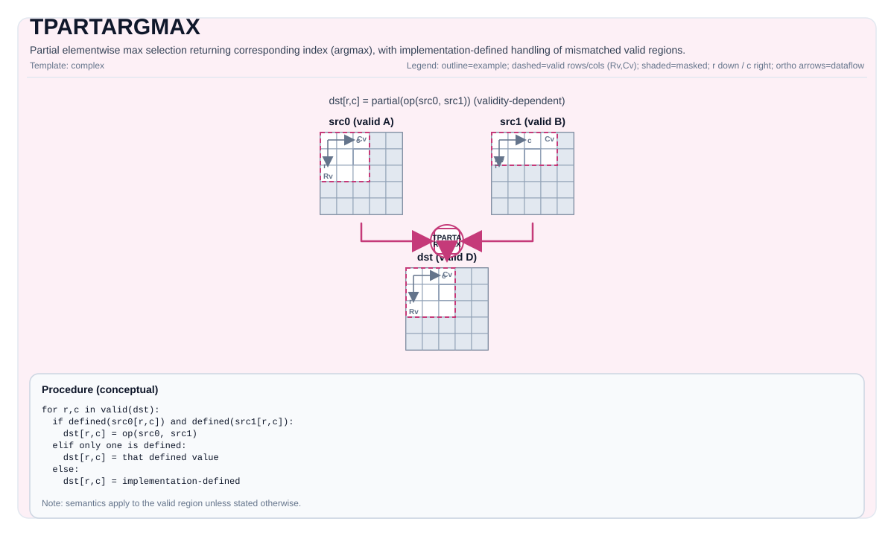

# TPARTARGMAX

<!-- md-trans-meta sourceCommit=unknown translatedAt=2026-08-26T04:36:35.065Z pushedAt=2026-08-29T09:05:18.449Z -->

## Instruction Diagram



## Introduction

Performs element-wise maximum value selection within the destination valid region and simultaneously returns the corresponding index value. If both `src0Val` and `src1Val` are valid at a position, the result value is `max(src0Val, src1Val)`, and the result index is the source index corresponding to the maximum value; if only one input is valid at that position, the result directly takes that input's value and index. Other cases where the valid regions do not match are implementation-defined.

## Mathematical Semantics

For each element `(i, j)` in the destination valid region:

$$
\begin{aligned}
(\mathrm{dstVal}_{i,j}, \mathrm{dstIdx}_{i,j}) =
\begin{cases}
(\mathrm{src0Val}_{i,j}, \mathrm{src0Idx}_{i,j}) & \text{if } \mathrm{src0Val}_{i,j} > \mathrm{src1Val}_{i,j} \text{ and both inputs are defined at } (i,j) \text{ }  \\
(\mathrm{src1Val}_{i,j}, \mathrm{src1Idx}_{i,j}) & \text{if } \mathrm{src1Val}_{i,j} \ge \mathrm{src0Val}_{i,j} \text{ and both inputs are defined at } (i,j) \text{ }  \\
(\mathrm{src0Val}_{i,j}, \mathrm{src0Idx}_{i,j}) & \text{if only src0 is defined at } (i,j) \text{ } \\
(\mathrm{src1Val}_{i,j}, \mathrm{src1Idx}_{i,j}) & \text{if only src1 is defined at } (i,j) \text{ }
\end{cases}
\end{aligned}
$$

## Assembly Syntax

Synchronous form:

```text
%dstVal, %dstIdx = tpartargmax %src0Val, %src1Val, %src0Idx, %src1Idx : !pto.tile<...> -> (!pto.tile<...>, !pto.tile<...>)
```

### AS Level 1 (SSA)

```text
%dstVal, %dstIdx = pto.tpartargmax %src0Val, %src1Val, %src0Idx, %src1Idx : (!pto.tile<...>, !pto.tile<...>, !pto.tile<...>, !pto.tile<...>) -> (!pto.tile<...>, !pto.tile<...>)
```

### AS Level 2 (DPS)

```text
pto.tpartargmax ins(%src0Val, %src1Val, %src0Idx, %src1Idx : !pto.tile_buf<...>, !pto.tile_buf<...>, !pto.tile_buf<...>, !pto.tile_buf<...>) outs(%dstVal, %dstIdx : !pto.tile_buf<...>, !pto.tile_buf<...>)
```

## C++ Built-in APIs

Declared in `include/pto/common/pto_instr.hpp`:
> The public include header is `<pto/pto-inst.hpp>`, and the internal declaration is located in `pto/common/pto_instr.hpp`.

```cpp
template <typename TileDataDst, typename TileDataSrc0, typename TileDataSrc1,
          typename TileDataDstIdx, typename TileDataSrc0Idx, typename TileDataSrc1Idx,
          typename... WaitEvents>
PTO_INST RecordEvent TPARTARGMAX(TileDataDst &dstVal, TileDataSrc0 &src0Val, TileDataSrc1 &src1Val,
                                 TileDataDstIdx &dstIdx, TileDataSrc0Idx &src0Idx, TileDataSrc1Idx &src1Idx,
                                 WaitEvents &... events);
```

## Constraints

### General Constraints or Checks

- The element types of `dstVal`, `src0Val`, and `src1Val` must be consistent.
- The element types of `dstIdx`, `src0Idx`, and `src1Idx` must be consistent.
- Combination constraints between value types and index types (enforced by `static_assert` on Atlas A2/A3 training products/Atlas A2/A3 inference products):
    - If the value type is `half`, the index type must be `int16_t`, `uint16_t`, `int32_t`, or `uint32_t`.
    - If the value type is `float`, the index type must be `int32_t` or `uint32_t`.
- The valid regions of each pair of value tile and index tile must be consistent:
    - The valid regions of `src0Val` and `src0Idx` must be consistent.
    - The valid regions of `src1Val` and `src1Idx` must be consistent.
    - The valid regions of `dstVal` and `dstIdx` must be consistent.
- The destination valid region must be exactly the same as the valid region of either `src0Val` or `src1Val`.
- If the valid region of `dstVal` is zero, the instruction returns directly.
- For each element in the destination valid region:
    - If both inputs are valid, an element-wise maximum operation is performed, and the index corresponding to the larger value is returned;
    - If only one input is valid, the result directly takes the value and index of that input.
- For valid region combinations outside the above range, the behavior is implementation-defined.

### Ascend 950PR/Ascend 950DT Implementation Check

- Supported value types: `half`, `float`.
- Supported index types: `int16_t`, `uint16_t`, `int32_t`, `uint32_t`.

## Examples

### Automatic

```cpp
#include <pto/pto-inst.hpp>

using namespace pto;

void example_auto() {
  using ValTileT = Tile<TileType::Vec, float, 16, 16>;
  using IdxTileT = Tile<TileType::Vec, int32_t, 16, 16>;
  ValTileT src0Val, src1Val, dstVal;
  IdxTileT src0Idx, src1Idx, dstIdx;
  TPARTARGMAX(dstVal, src0Val, src1Val, dstIdx, src0Idx, src1Idx);
}
```

### Manual

```cpp
#include <pto/pto-inst.hpp>

using namespace pto;

void example_manual() {
  using ValTileT = Tile<TileType::Vec, float, 16, 16>;
  using IdxTileT = Tile<TileType::Vec, int32_t, 16, 16>;
  ValTileT src0Val, src1Val, dstVal;
  IdxTileT src0Idx, src1Idx, dstIdx;
  TASSIGN(src0Val, 0x1000);
  TASSIGN(src1Val, 0x2000);
  TASSIGN(dstVal,  0x3000);
  TASSIGN(src0Idx, 0x4000);
  TASSIGN(src1Idx, 0x5000);
  TASSIGN(dstIdx,  0x6000);
  TPARTARGMAX(dstVal, src0Val, src1Val, dstIdx, src0Idx, src1Idx);
}
```

## ASM Examples

### Automatic Mode

```text
# Automatic mode: the compiler/runtime handles resource placement and scheduling.
%dstVal, %dstIdx = pto.tpartargmax %src0Val, %src1Val, %src0Idx, %src1Idx : (!pto.tile<...>, !pto.tile<...>, !pto.tile<...>, !pto.tile<...>) -> (!pto.tile<...>, !pto.tile<...>)
```

### Manual Mode

```text
# Manual mode: explicitly bind resources first, then issue the instruction.
# Optional (when the instruction contains tile operands):
# pto.tassign %arg0, @tile(0x1000)
# pto.tassign %arg1, @tile(0x2000)
%dstVal, %dstIdx = pto.tpartargmax %src0Val, %src1Val, %src0Idx, %src1Idx : (!pto.tile<...>, !pto.tile<...>, !pto.tile<...>, !pto.tile<...>) -> (!pto.tile<...>, !pto.tile<...>)
```

### PTO Assembly Form

```text
%dstVal, %dstIdx = tpartargmax %src0Val, %src1Val, %src0Idx, %src1Idx : !pto.tile<...> -> (!pto.tile<...>, !pto.tile<...>)
# AS Level 2 (DPS)
pto.tpartargmax ins(%src0Val, %src1Val, %src0Idx, %src1Idx : !pto.tile_buf<...>, !pto.tile_buf<...>, !pto.tile_buf<...>, !pto.tile_buf<...>) outs(%dstVal, %dstIdx : !pto.tile_buf<...>, !pto.tile_buf<...>)
```
