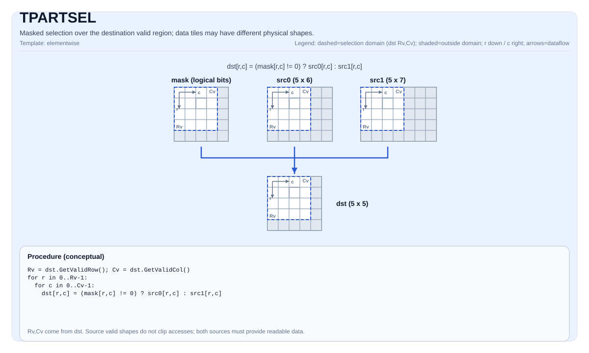

# TPARTSEL

## Tile Operation Diagram



## Introduction

Select elementwise between two source tiles using a mask tile, writing to the destination valid region. `dst`, `src0`, and `src1` may use different tile types and physical shapes, but must have the same element type. The interface reuses the `TSEL` implementation.

## Math Interpretation

For each element `(i, j)` in the destination valid region:

$$
\mathrm{dst}_{i,j} =
\begin{cases}
\mathrm{src0}_{i,j} & \text{if } \mathrm{mask}_{i,j}\ \text{is true} \\
\mathrm{src1}_{i,j} & \text{otherwise}
\end{cases}
$$

## Assembly Syntax

Synchronous form:

```text
%dst = tpartsel %mask, %src0, %src1 : !pto.tile<...>
```

### AS Level 1 (SSA)

```text
%dst = pto.tpartsel %mask, %src0, %src1 : (!pto.tile<...>, !pto.tile<...>, !pto.tile<...>) -> !pto.tile<...>
```

### AS Level 2 (DPS)

```text
pto.tpartsel ins(%mask, %src0, %src1 : !pto.tile_buf<...>, !pto.tile_buf<...>, !pto.tile_buf<...>) outs(%dst : !pto.tile_buf<...>)
```

## C++ Intrinsic

Declared in `include/pto/common/pto_instr.hpp`:

```cpp
template <typename TileDataDst, typename MaskTile, typename TileDataSrc0,
          typename TileDataSrc1, typename TmpTile, typename... WaitEvents>
PTO_INST RecordEvent TPARTSEL(TileDataDst &dst, MaskTile &selMask, TileDataSrc0 &src0,
                            TileDataSrc1 &src1, TmpTile &tmp, WaitEvents &... events);
```

## Constraints

### General constraints / checks

- `dst`, `src0`, and `src1` must have the same element type and use row-major layout.
- The selection domain is `dst.GetValidRow()` / `dst.GetValidCol()`.
- Source valid shapes do not determine the selection domain and are not checked for equality. The destination valid shape determines the accessed domain.
- Both inputs must provide readable data at the accessed locations, with backing storage sufficient for vector loads.
- The mask tile is interpreted as packed predicate bits in a target-defined layout. Its storage must cover the actual accesses; its valid shape is not read.

### A2A3 implementation checks

- `sizeof(TileDataDst::DType)` must be `2` or `4` bytes.
- Each data tile uses its own `RowStride` to compute row addresses.

### A5 implementation checks

- `sizeof(TileDataDst::DType)` must be `1`, `2`, `4`, or `8` bytes.
- The 1-, 2-, and 4-byte branches use each data tile's `RowStride`; the 8-byte branch uses each tile's `Cols` to compute row addresses.

## Temporary Space

### A2A3

`tmp` **is used** as a scratch buffer for setting the comparison mask (`cmpmask`). Its storage is accessed as `uint32_t` and reused across rows.

- 16-bit data requires at least 4 `uint32_t` elements; 32-bit data requires at least 2 `uint32_t` elements.
- A typical declaration is `Tile<TileType::Vec, uint32_t, 1, 16>`.

### A5

`tmp` is accepted by the interface but **not used** by the implementation. The parameter is retained for interface compatibility.

## Examples

### Auto

```cpp
#include <pto/pto-inst.hpp>

using namespace pto;

void example_auto() {
  using DstT = Tile<TileType::Vec, float, 16, 32, BLayout::RowMajor, 16, 16>;
  using Src0T = Tile<TileType::Vec, float, 16, 64, BLayout::RowMajor, 16, 16>;
  using Src1T = Tile<TileType::Vec, float, 16, 96, BLayout::RowMajor, 16, 16>;
  using MaskT = Tile<TileType::Vec, uint8_t, 16, 32, BLayout::RowMajor, -1, -1>;
  using TmpT = Tile<TileType::Vec, uint32_t, 1, 16>;
  Src0T src0;
  Src1T src1;
  DstT dst;
  MaskT mask(16, 2);
  TmpT tmp;
  TPARTSEL(dst, mask, src0, src1, tmp);
}
```

### Manual

```cpp
#include <pto/pto-inst.hpp>

using namespace pto;

void example_manual() {
  using DstT = Tile<TileType::Vec, float, 16, 32, BLayout::RowMajor, 16, 16>;
  using Src0T = Tile<TileType::Vec, float, 16, 64, BLayout::RowMajor, 16, 16>;
  using Src1T = Tile<TileType::Vec, float, 16, 96, BLayout::RowMajor, 16, 16>;
  using MaskT = Tile<TileType::Vec, uint8_t, 16, 32, BLayout::RowMajor, -1, -1>;
  using TmpT = Tile<TileType::Vec, uint32_t, 1, 16>;
  Src0T src0;
  Src1T src1;
  DstT dst;
  MaskT mask(16, 2);
  TmpT tmp;
  TASSIGN(src0, 0x1000);
  TASSIGN(src1, 0x3000);
  TASSIGN(dst,  0x5000);
  TASSIGN(mask, 0x6000);
  TASSIGN(tmp,  0x7000);
  TPARTSEL(dst, mask, src0, src1, tmp);
}
```

## ASM Form Examples

### Auto Mode

```text
# Auto mode: compiler/runtime-managed placement and scheduling.
%dst = pto.tpartsel %mask, %src0, %src1 : (!pto.tile<...>, !pto.tile<...>, !pto.tile<...>) -> !pto.tile<...>
```

### Manual Mode

```text
# Manual mode: resources must be bound explicitly before issuing the instruction.
# Optional for tile operands:
# pto.tassign %arg0, @tile(0x1000)
# pto.tassign %arg1, @tile(0x2000)
%dst = pto.tpartsel %mask, %src0, %src1 : (!pto.tile<...>, !pto.tile<...>, !pto.tile<...>) -> !pto.tile<...>
```

### PTO Assembly Form

```text
%dst = tpartsel %mask, %src0, %src1 : !pto.tile<...>
# AS Level 2 (DPS)
pto.tpartsel ins(%mask, %src0, %src1 : !pto.tile_buf<...>, !pto.tile_buf<...>, !pto.tile_buf<...>) outs(%dst : !pto.tile_buf<...>)
```
