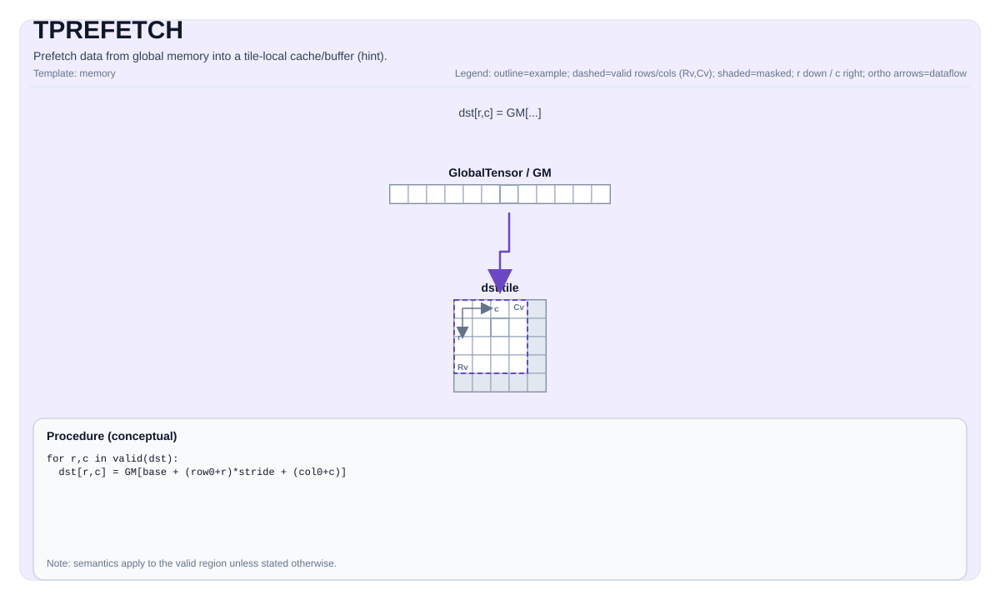

# TPREFETCH

<!-- md-trans-meta sourceCommit=unknown translatedAt=2026-08-26T04:41:44.987Z pushedAt=2026-08-29T09:05:18.452Z -->

## Instruction Diagram



## Introduction

Prefetches data from global memory into the tile local cache/buffer (implementation-defined). This is typically used to reduce latency before a subsequent `TLOAD`.

Note: Unlike most PTO instructions, `TPREFETCH` does **not** implicitly call `TSYNC(events...)` in the C++ wrapper.

## Mathematical Semantics

Unless otherwise specified, the semantics are defined over the valid region, and target-specific behavior is marked as implementation-defined.

## Assembly Syntax

Synchronous form:

```text
%dst = tprefetch %src : !pto.global<...> -> !pto.tile<...>
```

### AS Level 1 (SSA)

```text
%dst = pto.tprefetch %src : !pto.global<...> -> !pto.tile<...>
```

### AS Level 2 (DPS)

```text
pto.tprefetch ins(%src : !pto.global<...>) outs(%dst : !pto.tile_buf<...>)
```

## C++ Built-in APIs

Declared in `include/pto/common/pto_instr.hpp`:
> The public include header is `<pto/pto-inst.hpp>`, and the internal declaration is located in `pto/common/pto_instr.hpp`.

```cpp
template <typename TileData, typename GlobalData>
PTO_INST RecordEvent TPREFETCH(TileData &dst, GlobalData &src);
```

## Constraints

- The semantics and cache behavior are target/implementation-defined.
- Some targets may ignore the prefetch and treat it as a hint.

## Examples

See the relevant examples in `docs/isa/` and `docs/coding/tutorials/`.

## ASM Examples

### Automatic Mode

```text
# Automatic mode: the compiler/runtime handles resource placement and scheduling.
%dst = pto.tprefetch %src : !pto.global<...> -> !pto.tile<...>
```

### Manual Mode

```text
# Manual mode: explicitly bind resources first, then issue the instruction.
# Optional (when the instruction contains tile operands):
# pto.tassign %arg0, @tile(0x1000)
# pto.tassign %arg1, @tile(0x2000)
%dst = pto.tprefetch %src : !pto.global<...> -> !pto.tile<...>
```

### PTO Assembly Form

```text
%dst = tprefetch %src : !pto.global<...> -> !pto.tile<...>
# AS Level 2 (DPS)
pto.tprefetch ins(%src : !pto.global<...>) outs(%dst : !pto.tile_buf<...>)
```
