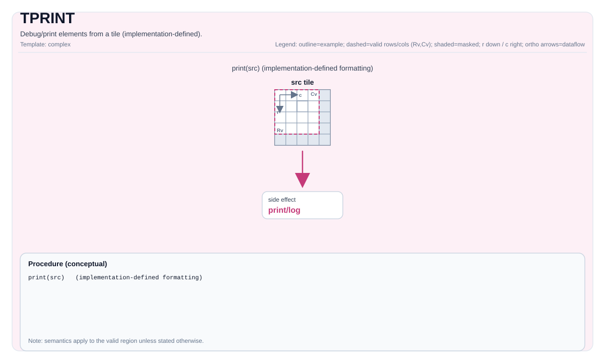

# TPRINT

<!-- md-trans-meta sourceCommit=unknown translatedAt=2026-08-26T04:42:38.963Z pushedAt=2026-08-29T09:05:18.453Z -->

## Instruction Diagram



## Introduction

Debugs/Prints elements in a tile (implementation-defined).

Prints the contents of a tile or GlobalTensor directly from device code for debugging purposes.

The `TPRINT` instruction outputs a logical view of the data stored in a tile or GlobalTensor. It supports common data types (for example, `float`, `half`, `int8`, `uint32`) and multiple memory layouts (`ND`, `DN`, `NZ` for GlobalTensor; vector tiles for on-chip buffers).

> **Important**:
>
> - This instruction is **for development and debugging only**.
> - It incurs **significant runtime overhead** and **must not be used in production kernels**.
> - The output may be **truncated** if it exceeds the internal print buffer. You can modify the print buffer by adding `-DCCEBlockMaxSize=16384` to the compilation options; the default is 16 KB.
> - **The CCE compilation options `-D_DEBUG --cce-enable-print` are required** (see [Behavior](#behavior)).

## Mathematical Semantics

Unless otherwise specified, the semantics are defined over the valid region, and target-dependent behavior is marked as implementation-defined.

## Assembly Syntax

```text
tprint %src : !pto.tile<...> | !pto.global<...>
```

### AS Level 1 (SSA)

```text
pto.tprint %src : !pto.tile<...> | !pto.partition_tensor_view<MxNxdtype> -> ()
```

### AS Level 2 (DPS)

```text
pto.tprint ins(%src : !pto.tile_buf<...> | !pto.partition_tensor_view<MxNxdtype>)
```

## C++ Built-in APIs

Declared in `include/pto/common/pto_instr.hpp`:
> The public include header is `<pto/pto-inst.hpp>`, and the internal declaration is located in `pto/common/pto_instr.hpp`.

```cpp
// Applicable to printing GlobalTensor or Vec type tile.
template <PrintFormat Format = PrintFormat::Width8_Precision4, typename TileData>
PTO_INST void TPRINT(TileData &src);

// Applicable to printing Acc type tile and Mat type tile (Mat printing is supported only on A3, not yet on A5).
template <PrintFormat Format = PrintFormat::Width8_Precision4, typename TileData, typename GlobalData>
PTO_INTERNAL void TPRINT(TileData &src, GlobalData &tmp);
```

### PrintFormat Enum

Declared in `include/pto/common/type.hpp`:

```cpp
enum class PrintFormat : uint8_t
{
    Width8_Precision4 = 0,  // Print width 8, precision 4.
    Width8_Precision2 = 1,  // Print width 8, precision 2.
    Width10_Precision6 = 2, // Print width 10, precision 6.
};
```

### Supported T Types

- **Tile**: The TileType must be `Vec`, `Acc`, or `Mat (A3 only)`, and must have a supported element type.
- **GlobalTensor**: Must use the `ND`, `DN`, or `NZ` layout and have a supported element type.

## Constraints

- **Supported element types**:
    - Floating-point: `float`, `half`
    - Signed integers: `int8_t`, `int16_t`, `int32_t`
    - Unsigned integers: `uint8_t`, `uint16_t`, `uint32_t`
- **For GlobalTensor**: The layout must be one of `Layout::ND`, `Layout::DN`, or `Layout::NZ`.
- **For temporary space**: When printing a tile whose `TileType` is `Mat` or `Acc`, a temporary space on GM must be passed in, and the temporary space must not be smaller than `TileData::Numel * sizeof(TileData::DType)`.
- Ascend 950PR/Ascend 950DT do not support printing a tile whose `TileType` is `Mat`.
- **Echo information**: When `TileType` is `Mat`, the layout is printed according to `Layout::ND`; other layouts may cause information misalignment.

## Behavior

- **Mandatory compilation flags**:

  On Atlas A2/A3 training products/Atlas A2/A3 inference products/Ascend 950PR/Ascend 950DT devices, `TPRINT` uses `cce::printf` to output through the device-to-host debug channel. **The CCE option `-D_DEBUG --cce-enable-print` must be enabled**.

- **Buffer limitations**:

  The internal print buffer of `cce::printf` has a limited size. If the output exceeds this buffer, a warning message similar to `"Warning: out of bound! try best to print"` may appear, and **only part of the data will be printed**.

- **Synchronization**:

  `pipe_barrier(PIPE_ALL)` is automatically inserted to ensure that all previous operations are complete and the data is consistent.

- **Formatting**:

    - Floating-point values: The print format is determined by the `PrintFormat` template parameter:
      - `PrintFormat::Width8_Precision4`: `%8.4f` (default)
      - `PrintFormat::Width8_Precision2`: `%8.2f`
      - `PrintFormat::Width10_Precision6`: `%10.6f`
    - Integer values: the print format is determined by the `PrintFormat` template parameter:
      - `PrintFormat::Width8_Precision4` or `PrintFormat::Width8_Precision2`: `%8d`
      - `PrintFormat::Width10_Precision6`: `%10d`
    - For `GlobalTensor`, due to data size and buffer limitations, only the elements within its logical shape (defined by `Shape`) are printed.
    - For `Tile`, the invalid region (beyond `validRows`/`validCols`) is still printed, but is marked with the `|` separator when partial validity is specified.

## Examples

### Printing a Tile

```cpp
#include <pto/pto-inst.hpp>

PTO_INTERNAL void DebugTile(__gm__ float *src) {
  using ValidSrcShape = TileShape2D<float, 16, 16>;
  using NDSrcShape = BaseShape2D<float, 32, 32>;
  using GlobalDataSrc = GlobalTensor<float, ValidSrcShape, NDSrcShape>;
  GlobalDataSrc srcGlobal(src);

  using srcTileData = Tile<TileType::Vec, float, 16, 16>;
  srcTileData srcTile;
  TASSIGN(srcTile, 0x0);

  TLOAD(srcTile, srcGlobal);
  TPRINT(srcTile);
}
```

### Printing a GlobalTensor

```cpp
#include <pto/pto-inst.hpp>

PTO_INTERNAL void DebugGlobalTensor(__gm__ float *src) {
  using ValidSrcShape = TileShape2D<float, 16, 16>;
  using NDSrcShape = BaseShape2D<float, 32, 32>;
  using GlobalDataSrc = GlobalTensor<float, ValidSrcShape, NDSrcShape>;
  GlobalDataSrc srcGlobal(src);

  TPRINT(srcGlobal);
}
```

## ASM Examples

### Automatic Mode

```text
# Automatic mode: the compiler/runtime handles resource placement and scheduling.
pto.tprint %src : !pto.tile<...> | !pto.partition_tensor_view<MxNxdtype> -> ()
```

### Manual Mode

```text
# Manual mode: explicitly bind resources first, then issue the instruction.
# Optional (when the instruction contains a tile operand):
# pto.tassign %arg0, @tile(0x1000)
# pto.tassign %arg1, @tile(0x2000)
pto.tprint %src : !pto.tile<...> | !pto.partition_tensor_view<MxNxdtype> -> ()
```

### PTO Assembly Form

```text
pto.tprint %src : !pto.tile<...> | !pto.partition_tensor_view<MxNxdtype> -> ()
# AS Level 2 (DPS)
pto.tprint ins(%src : !pto.tile_buf<...> | !pto.partition_tensor_view<MxNxdtype>)
```
