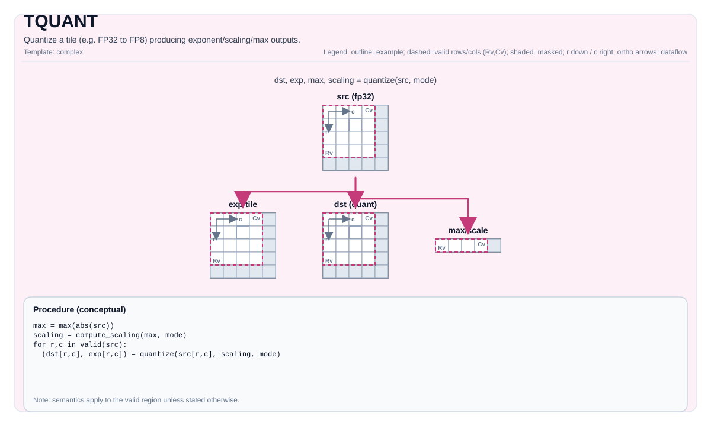

# TQUANT

<!-- md-trans-meta sourceCommit=unknown translatedAt=2026-08-26T04:44:31.190Z pushedAt=2026-08-29T09:05:18.455Z -->

## Instruction Diagram



## Introduction

Quantizes a high-precision tile (`FP32`/`BF16`/`FP16`) into a low-precision format, and generates the quantized data tile together with the auxiliary per-group exponent/maximum/scaling tile. The target format, scaling algorithm, and grouping axis are all compile-time template parameters.

| Target Format Family | Format | Grouping Method | Scaling Algorithm |
|-----------|------|---------|---------|
| **Microscaling (MX)** | MXFP8 (e4m3), MXFP4 (e2m1) | Every 32 elements share one exponent | OCP, NV |
| **Integer** | INT8 (symmetric/asymmetric) | One scale per tile (+ optional offset) | Affine |

## Quantization Flow

### MX Format (3 Stages, Group Size G = 32)

For a tile $x \in \mathbb{R}^{M \times N}$, group along `grp_axis` (ND: axis-1/columns; DN: axis-0/rows):

| Stage | Operation | Output |
|------|------|------|
| **1. Intra-group maximum value** | $m_g = \max_{i \in g} \|x_i\|$ | `max` (scratch, FP) |
| **2. Exponent + scaling** | $s_g = \mathrm{biasedExp}(m_g) - e_{\max}$; $\alpha_g = 2^{254 - s_g}$ | `exp` (E8M0, 1 byte per group), `scaling` (scratch, FP) |
| **3. Scaling + type conversion** | $q_i = \mathrm{clip}_{[-V_{\max},V_{\max}]}(x_i \cdot \alpha_g) \to$ target format | `dst` (FP8/packed FP4) |

- $e_{\max}$ = maximum exponent of the target format (8 for e4m3, 1 for e2m1).
- $V_{\max}$ = MAX_NORM of the target format (448 for e4m3, 6 for e2m1).
- Stages 1–2 use exact IEEE-754 bit operations (no FP `log`/`floor`); stage 3 uses hardware type conversion + stochastic rounding (`SPR.CTRL[50]=1`).
- **ND** ("normal direction", `grp_axis=1`): every 32 consecutive **columns** form a group — the default/standard grouping method. **DN** (`grp_axis=0`): every 32 consecutive **rows** form a group — transposed axis-0 grouping; the exponent tile shape is `M̂×N`, with `M̂ = M/32`.

### Integer INT8 (Affine, 5-Stage Type Conversion)

$$q_i = \mathrm{round}\!\left(\frac{x_i}{\mathrm{scale}}\right) + \mathrm{offset}, \qquad q_i \in [-128, 127]$$

No grouping structure; `scale` (and the asymmetric `offset`) is an FP32 scalar/vector per tile. To avoid double rounding, the type conversion chain on Atlas A2/A3 training products/Atlas A2/A3 inference products is `FP32 → S32 → FP32 → FP16 → INT8` (5 stages, via the `tmp` tile); Ascend 950PR/Ascend 950DT uses native broadcast + type conversion (no `tmp` required). The input must be **FP32**.

## C++ Built-in APIs

Declared in `include/pto/common/pto_instr.hpp`.
> The public include header is `<pto/pto-inst.hpp>`, and the internal declaration is located in `pto/common/pto_instr.hpp`.

### MX — Grouped (`grp_axis` + `MxQuantAlg`) — Recommended

```cpp
template <int grp_axis, auto mx_alg, typename TileDataOut, typename TileDataSrc,
          typename TileDataExp, typename TileDataMax, typename TileDataScaling, typename... WaitEvents>
PTO_INST RecordEvent TQUANT(TileDataOut &dst, TileDataSrc &src, TileDataExp *exp, TileDataMax *max,
                            TileDataScaling *scaling, WaitEvents &...events);
```

| Template Parameter | Value | Meaning |
|---------|------|------|
| `grp_axis` | `0` = DN (axis-0 grouping), `1` = ND (axis-1 grouping) | Quantization grouping axis |
| `mx_alg` | `MxQuantAlg::OcpMxFp8E4M3`, `NvMxFp8E4M3`, `OcpMxFp4E2M1`, `NvMxFp4E2M1` | Format + scaling algorithm |

### MX — ND Legacy (`QuantType` + `QuantScaleAlg`)

```cpp
template <auto quant_type, typename ...Tiles, auto scale_alg = QuantScaleAlg::OCP, typename... WaitEvents>
PTO_INST RecordEvent TQUANT(TileDataOut &dst, TileDataSrc &src, TileDataExp *exp, TileDataMax *max,
                            TileDataScaling *scaling, WaitEvents &...events);

// With explicit ZZ exponent storage mode.
template <auto quant_type, auto store_mode, typename ...Tiles, typename... WaitEvents>
PTO_INST RecordEvent TQUANT(TileDataOut &dst, TileDataSrc &src, TileDataExp *exp, TileDataMax *max,
                            TileDataScaling *scaling, TileDataExp *exp_zz, WaitEvents &...events);
```

| `quant_type` | Format | `scale_alg` |
|--------------|------|-------------|
| `QuantType::MXFP8` | e4m3 + E8M0 | OCP / NV |
| `QuantType::MXFP4_E2M1` | e2m1 + E8M0 | OCP / NV |

### Integer INT8

```cpp
// Symmetric.
template <auto quant_type, typename TileDataOut, typename TileDataSrc, typename TileDataPara, typename... WaitEvents>
PTO_INST RecordEvent TQUANT(TileDataOut &dst, TileDataSrc &src, TileDataPara &scale,
                            TileDataPara *offset = nullptr, WaitEvents &...events);
// With scratch (A2/A3).
template <auto quant_type, typename ...Tiles, typename TileDataTmp, typename... WaitEvents>
PTO_INST RecordEvent TQUANT(TileDataOut &dst, TileDataSrc &src, TileDataPara &scale, TileDataTmp &tmp,
                            TileDataPara *offset = nullptr, WaitEvents &...events);
```

| `quant_type` | `offset` | `dst` dtype | Mode |
|--------------|----------|-----------|------|
| `QuantType::INT8_SYM` | `nullptr` | `int8_t` | Symmetric ($q = \mathrm{round}(x/\mathrm{scale})$) |
| `QuantType::INT8_ASYM` | Provided | `uint8_t` | Asymmetric ($q = \mathrm{round}(x/\mathrm{scale}) + \mathrm{offset}$) |

> The overload with `tmp` (`dst, src, scale, tmp, offset`) is used for API alignment with Atlas A2/A3 training products/Atlas A2/A3 inference products. Ascend 950PR/Ascend 950DT does not use `tmp`; on Atlas A2/A3 training products/Atlas A2/A3 inference products, `tmp` must be an $M \times N$ FP32 (S32 type conversion intermediate result).

## Tile Size and Data Types

For an input tile shape $M \times N$ (dtype $T \in \{\mathrm{FP32}, \mathrm{BF16}, \mathrm{FP16}\}$), the group size $G = 32$:

### MXFP8 (e4m3)

| Tile | dtype | Shape (ND) | Shape (DN) | Byte Count |
|------|-------|-----------|-----------|--------|
| `src` | $T$ | $M \times N$ | $M \times N$ | $M \cdot N \cdot \mathrm{sizeof}(T)$ |
| `dst` | `int8_t` (e4m3 alias) | $M \times N$ | $M \times N$ | $M \cdot N$ |
| `exp` | `uint8_t` (E8M0) | $M \times N/32$ | $M/32 \times N$ | $M \cdot N / 32$ |
| `max` (scratch) | $T$ | $M \times N/32$ | $M/32 \times N$ | $M \cdot N / 32 \cdot \mathrm{sizeof}(T)$ |
| `scaling` (scratch) | $T$ | $M \times N/32$ | $M/32 \times N$ | $M \cdot N / 32 \cdot \mathrm{sizeof}(T)$ |

### MXFP4 (e2m1)

Same as MXFP8, but:

| Tile | dtype | Byte Count |
|------|-------|--------|
| `dst` | `float4_e2m1x2_t` (packs 2 e2m1 per byte) | $M \cdot N / 2$ |

> **Input restriction:** MXFP4 accepts only **FP16/BF16** (does not support FP32).

### INT8

| Tile | dtype | Shape | Byte Count |
|------|-------|-------|------------|
| `src` | `float32_t` | $M \times N$ | $M \cdot N \cdot 4$ |
| `dst` (SYM) | `int8_t` | $M \times N$ | $M \cdot N$ |
| `dst` (ASYM) | `uint8_t` | $M \times N$ | $M \cdot N$ |
| `scale` | FP32 scalar/vector | Per tile | - |
| `offset` (ASYM) | FP32 scalar/vector | Per tile | - |
| `tmp` (Atlas A2/A3 training products/Atlas A2/A3 inference products only) | FP32 | $M \times N$ | $M \cdot N \cdot 4$ |

> **`tmp` tile (Atlas A2/A3 training products/Atlas A2/A3 inference products only):** Must be the **same size** as `src` ($M \times N$ FP32 = $4MN$ bytes), and stores the FP32→S32 type conversion intermediate result (Atlas A3 training products/Atlas A3 inference products have no in-place `tcvt`). Ascend 950PR/Ascend 950DT accept the same-named `tmp` parameter to keep the API consistent, but **do not use it** (Ascend 950PR/Ascend 950DT use native `vlds BRC_B32` broadcast).

## Constraints

| Constraint | Applicable Scope | Reason |
|------------|------------------|--------|
| $M \bmod 16 = 0$ | ND MX (ZZ layout) | 16-row ZZ block |
| $M \bmod 32 = 0$ | DN MX | axis-0 group divisibility |
| $M \bmod 64 = 0$ | DN MX + ZZ conversion | δ pairing ($\hat M / 2$ is an integer) |
| $N \bmod 32 = 0$ | All MX | group size $G = 32$ |
| $N \bmod 64 = 0$ | ND MX + ZZ conversion | even number of exponent groups |
| $M \cdot N \le 59461$ | MX (UB 256KB) | buffer budget after reuse |
| BF16/FP16: `validCols % 32 != 0` → zero-padded to `StaticCols` | MX B16 path | group alignment |

## Output Layout and Layout Conversion

TQUANT outputs **ND** (row-major) by default. The Cube Unit consumes two fractal layouts, which are generated by separate `TMOV` instructions:

| Output | Native (TQUANT) | Cube Layout | Conversion |
|------|---------------|-----------|------|
| FP8/FP4 data | ND | NZ (ColMajor+RowMajor fractal) | `TMOV(dstNZ, dst)` (2 parameters) |
| E8M0 exponent (ND grouping) | ND | ZZ (zigzag, `[16,2]` block) | `TMOV(e8Zz, e8, tmp)` (3 parameters) |
| E8M0 exponent (DN grouping) | DN | ZZ | `TMOV<0>(e8Zz, e8Dn, tmp)` (3 parameters, `grp_axis=0`) |

The FP8 mantissa of DN data shares the same physical address as ND (the `(r,c)` elements are identical), so the 2-parameter `TMOV` ND→NZ also applies to DN data. Only the **exponent** path differs (DN→ZZ via `TMOV<0>`). See `TQUANT_DN.md` for details.

## Supported Input Dtypes

| Format | Acceptable Input Dtypes | Description |
|------|-----------------|------|
| MXFP8 (A5 only) | FP32, BF16, FP16 | FP32: in-place FP8 output (4:1). BF16/FP16: source zero-padded to `StaticCols`; upcast to FP32 before type conversion (no direct b16→e4m3). |
| MXFP4 (e2m1) (A5 only) | **FP16, BF16 only** (FP32 not supported) | Outputs `float4_e2m1x2_t` (packed). |
| INT8 (sym/asym) | **FP32 only** | SYM→`int8_t`, ASYM→`uint8_t`. Atlas A2/A3 training products/Atlas A2/A3 inference products require `tmp` = src size. |

> Micro-scaling (MXFP8/MXFP4) is **supported only on A5**; A2/A3 supports only the **INT8** path (FP32 input).

## Mathematical Semantics

Unless otherwise specified, semantics are defined within the valid region, and destination-related behavior is marked as implementation-defined.

## Assembly Syntax

### AS Level 1 (SSA)

```text
%dst = pto.tquant %src, %qp : (!pto.tile<...>, !pto.tile<...>) -> !pto.tile<...>
```

### AS Level 2 (DPS)

```text
pto.tquant ins(%src, %qp : !pto.tile_buf<...>, !pto.tile_buf<...>) outs(%dst : !pto.tile_buf<...>)
```

## ASM Examples

### Automatic Mode

```text
# Automatic mode: the compiler/runtime manages resource placement and scheduling.
%dst = pto.tquant %src, %qp : (!pto.tile<...>, !pto.tile<...>) -> !pto.tile<...>
```

### Manual Mode

```text
# Manual mode: explicitly bind resources before issuing the instruction.
# pto.tassign %arg0, @tile(0x1000)
# pto.tassign %arg1, @tile(0x2000)
%dst = pto.tquant %src, %qp : (!pto.tile<...>, !pto.tile<...>) -> !pto.tile<...>
```

### PTO Assembly Form

```text
%dst = pto.tquant %src, %qp : (!pto.tile<...>, !pto.tile<...>) -> !pto.tile<...>
# AS Level 2 (DPS)
pto.tquant ins(%src, %qp : !pto.tile_buf<...>, !pto.tile_buf<...>) outs(%dst : !pto.tile_buf<...>)
```

## Examples

```cpp
// MXFP8, DN grouping (axis-0), OCP scaling
TQUANT<0, MxQuantAlg::OcpMxFp8E4M3>(fp8Tile, srcTile, &e8DnTile, &maxTile, &scalingTile);

// MXFP8, ND grouping (legacy)
TQUANT<QuantType::MXFP8>(fp8Tile, srcTile, &e8NdTile, &maxTile, &scalingTile);

// MXFP4 E2M1, DN, NV scaling
TQUANT<0, MxQuantAlg::NvMxFp4E2M1>(fp4Tile, srcTile, &e8DnTile, &maxTile, &scalingTile);

// INT8 symmetric
TQUANT<QuantType::INT8_SYM>(int8Tile, srcTile, scale);

// Complete MXFP8 DN pipeline: quantization + layout conversion for Cube
TQUANT<0, MxQuantAlg::OcpMxFp8E4M3>(fp8Tile, srcTile, &e8DnTile, &maxTile, &scalingTile);
TMOV(fp8NZTile, fp8Tile);                  // Data ND→NZ
TMOV<0>(e8ZzTile, e8DnTile, tmpTile);      // Exponent DN→ZZ
```

For details, see `TQUANT_DN.md` (DN→ZZ conversion) and `tests/npu/a5/src/st/testcase/tquant_dn/` (complete ST examples).
